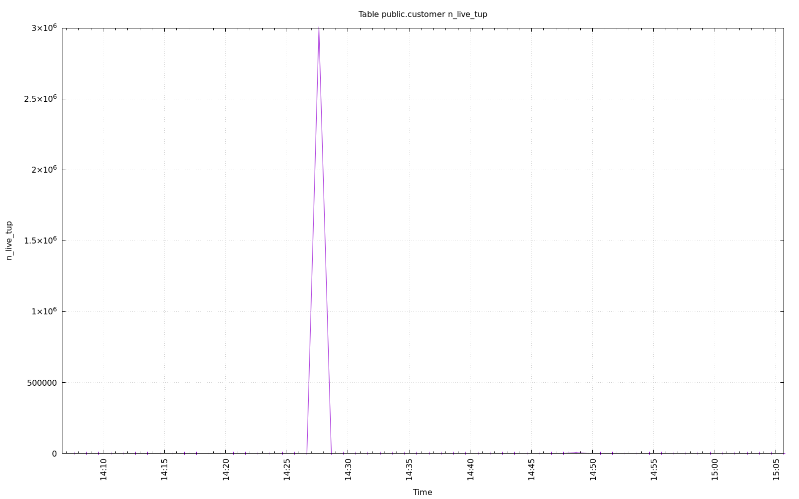
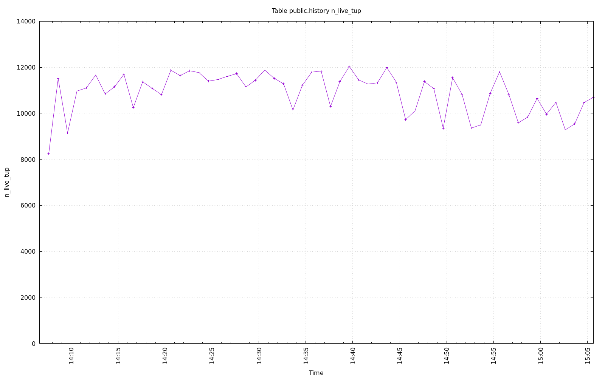
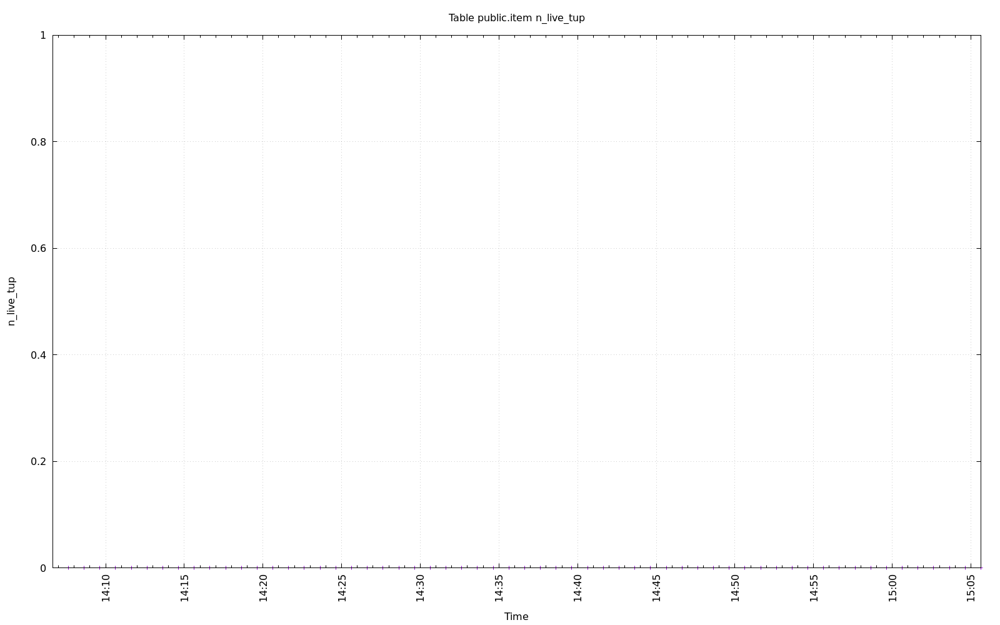
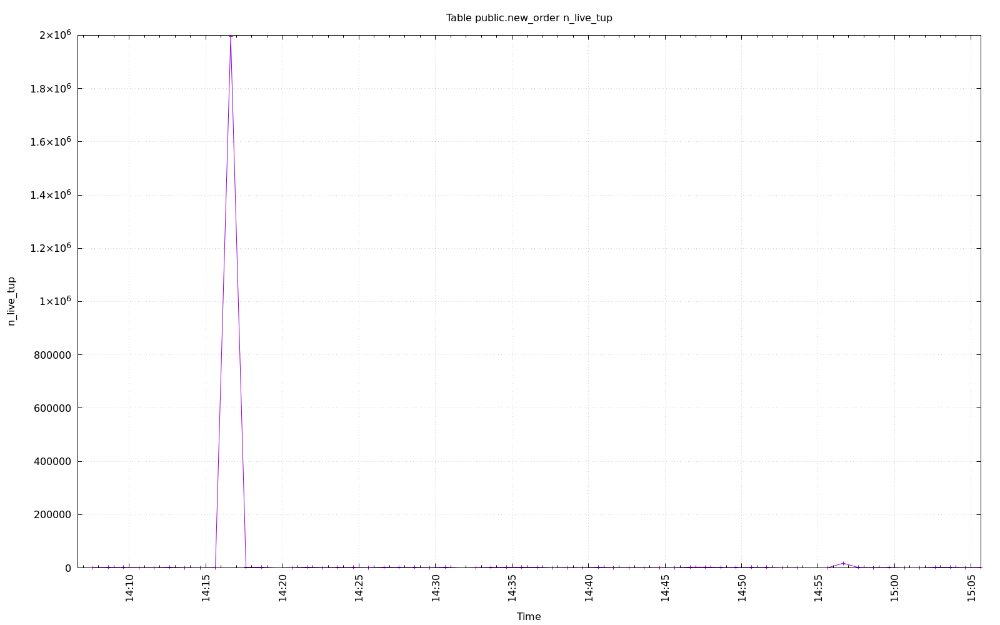
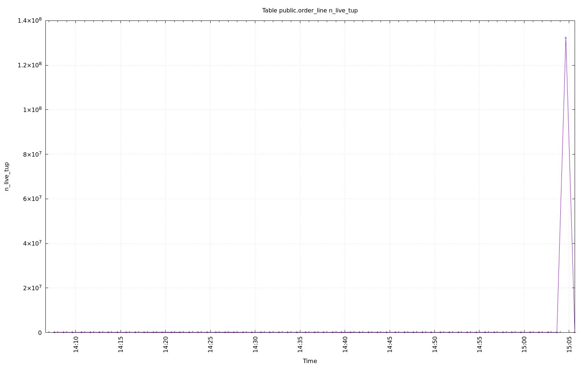
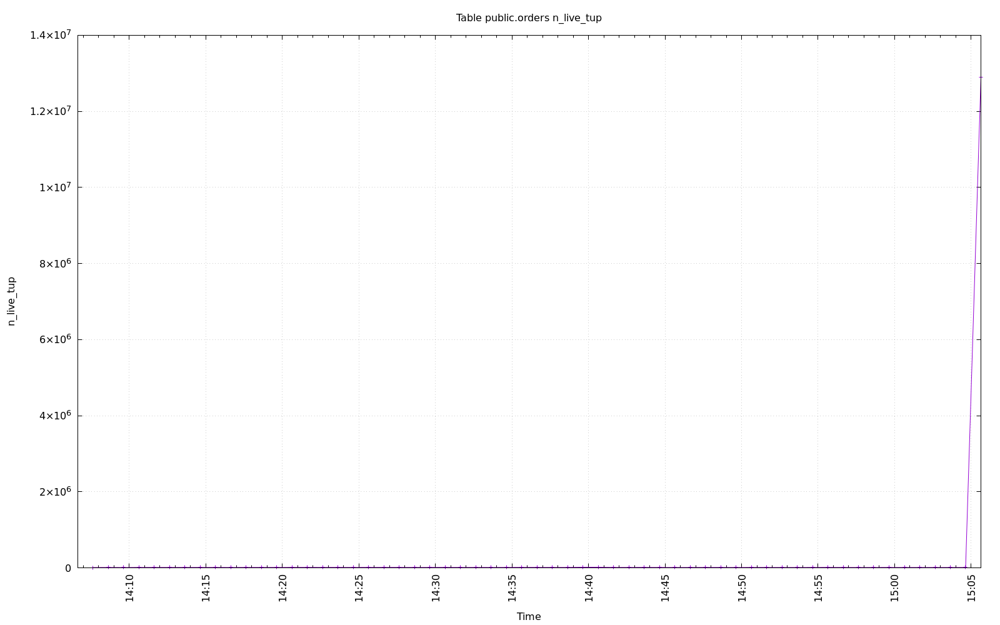
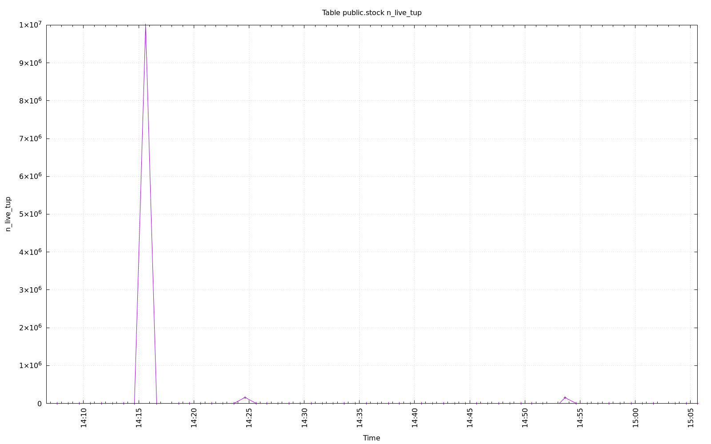
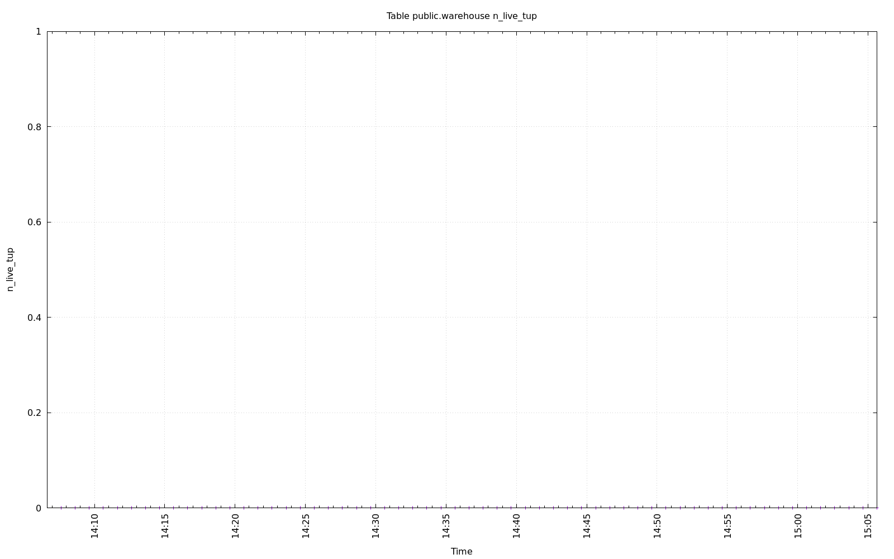

================================================================================
Database Test 2 Table n_live_tup Charts
================================================================================

