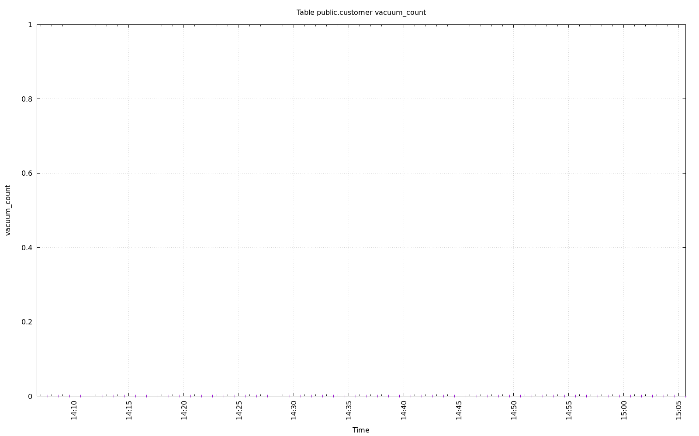
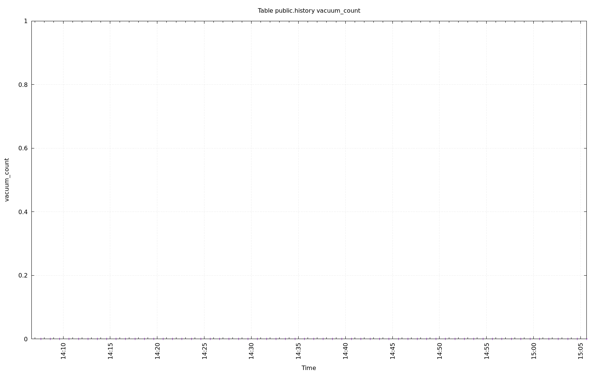

================================================================================
Database Test 2 Table vacuum_count Charts
================================================================================

.. image:: ../../table/pgsql-public.district-vacuum_count.png
   :target: ../../table/pgsql-public.district-vacuum_count.png
   :width: 100%

.. image:: ../../table/pgsql-public.order_line-vacuum_count.png
   :target: ../../table/pgsql-public.order_line-vacuum_count.png
   :width: 100%

