================================================================================
Database Test 2 public.customer Table Charts
================================================================================

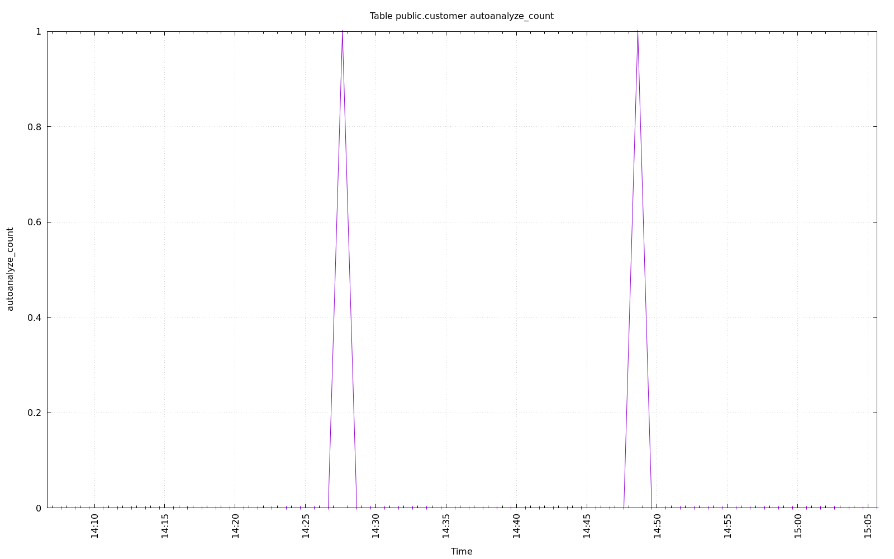

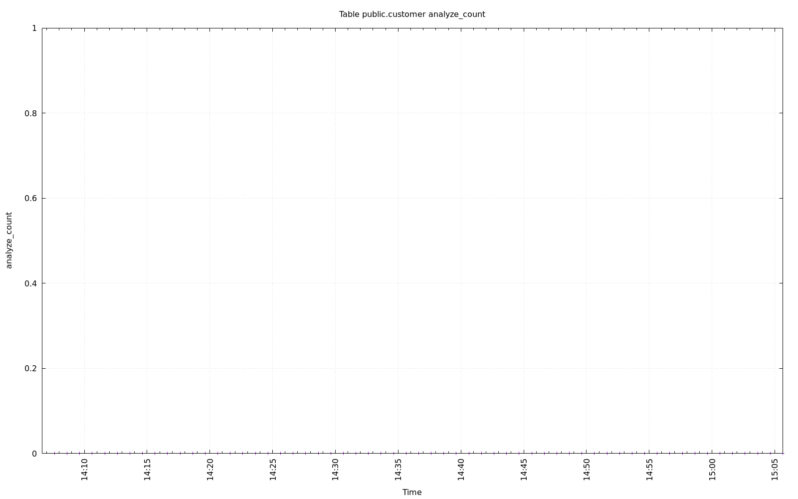

.. image:: ../pgsql-public.customer-vacuum_count.png
   :target: ../pgsql-public.customer-vacuum_count.png
   :width: 100%

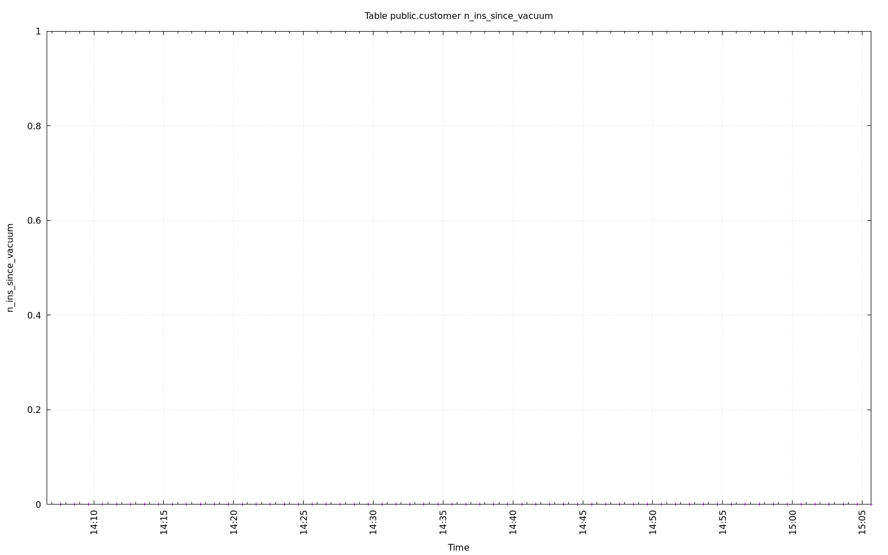

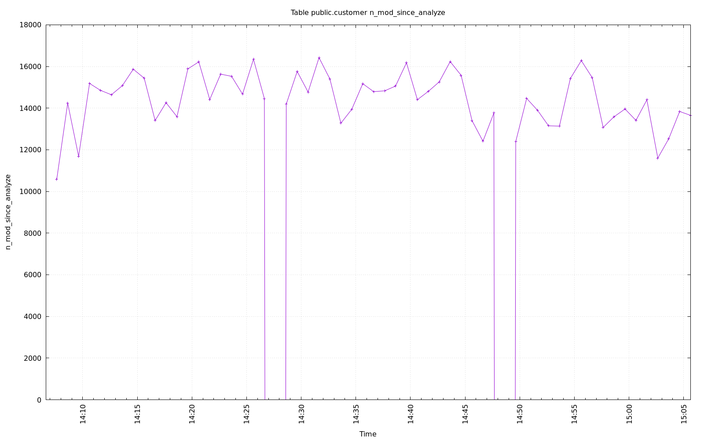

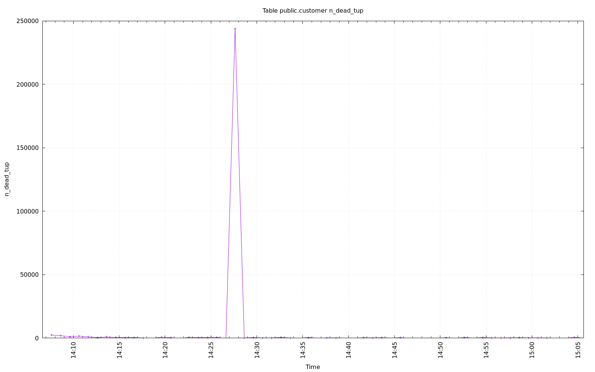

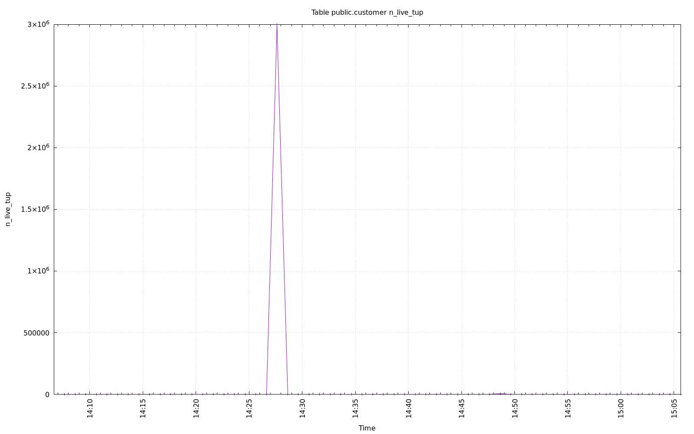

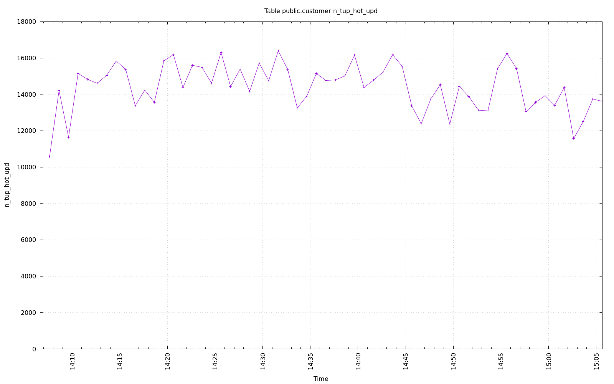

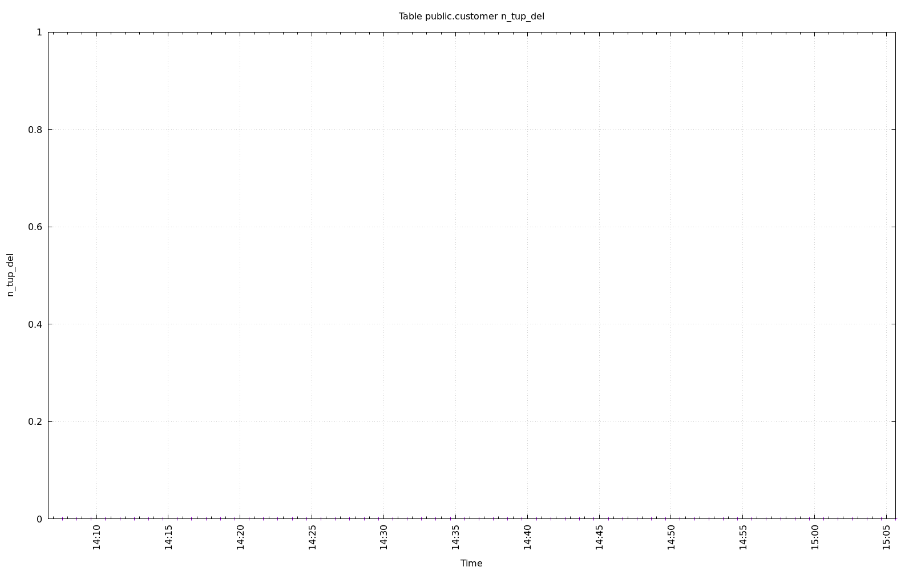

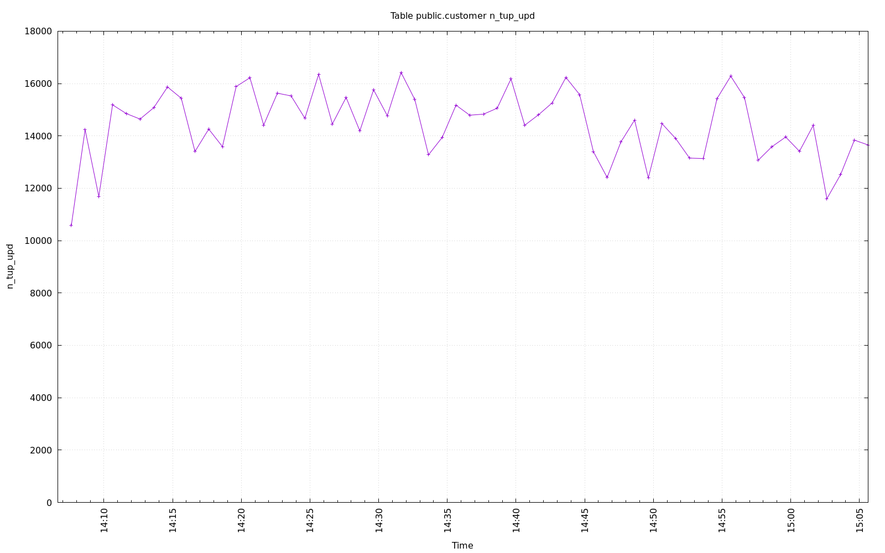

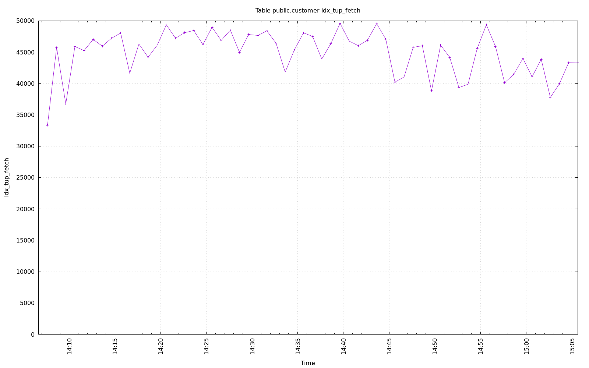

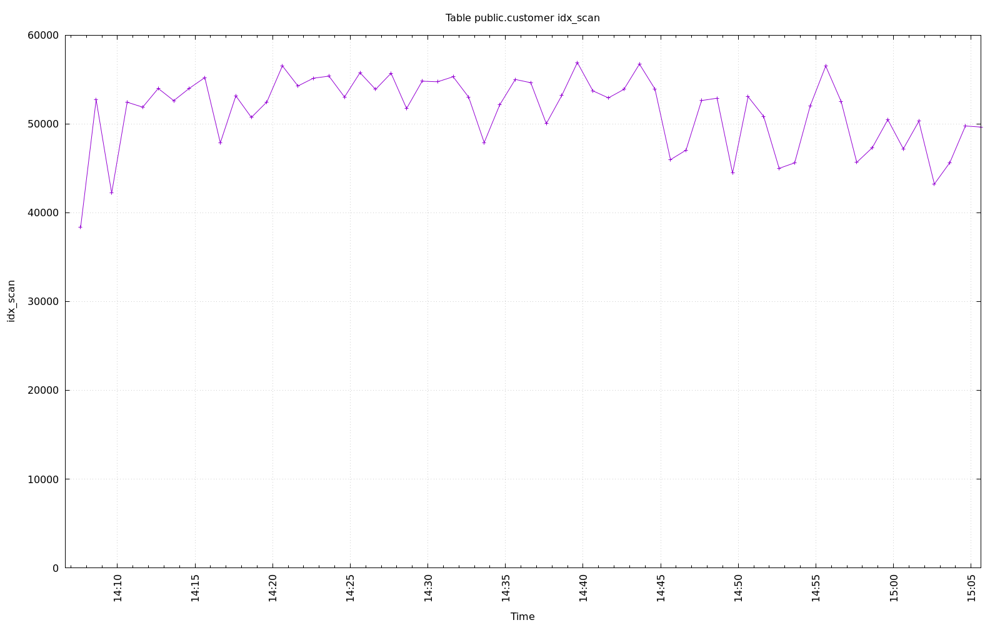

.. image:: ../pgsql-public.customer-seq_tup_read.png
   :target: ../pgsql-public.customer-seq_tup_read.png
   :width: 100%

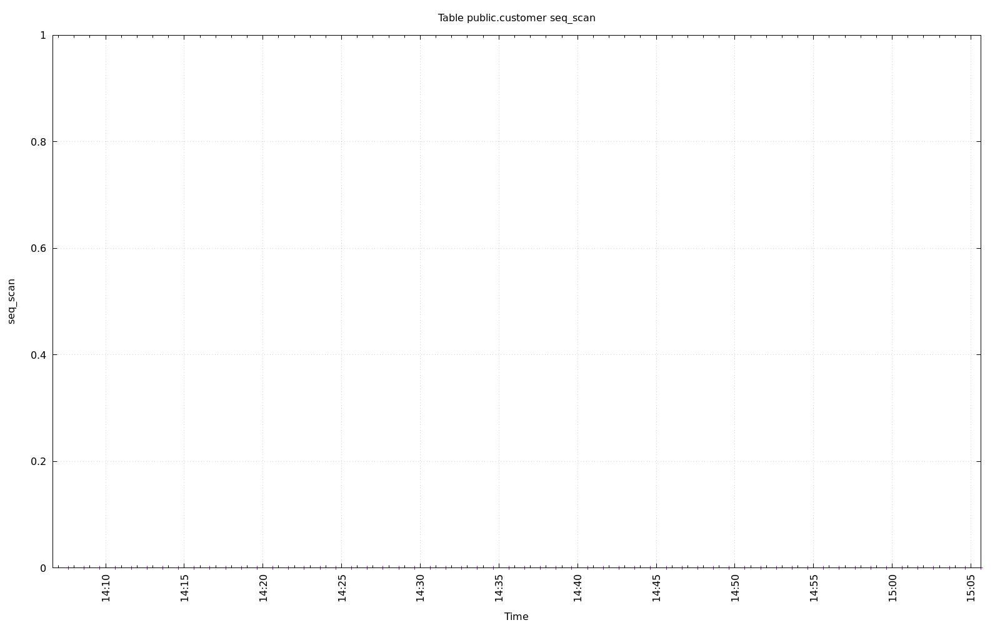

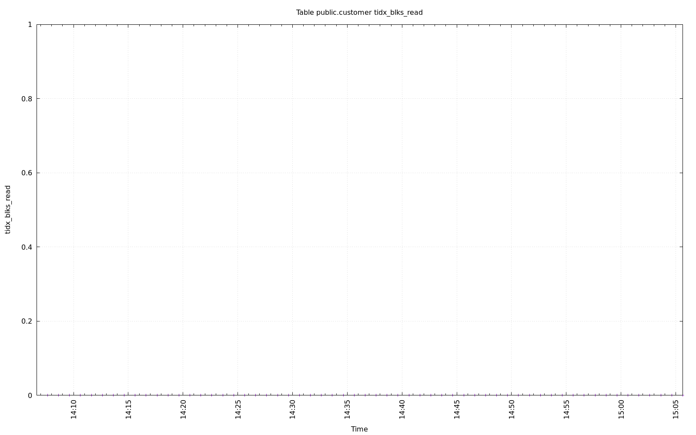

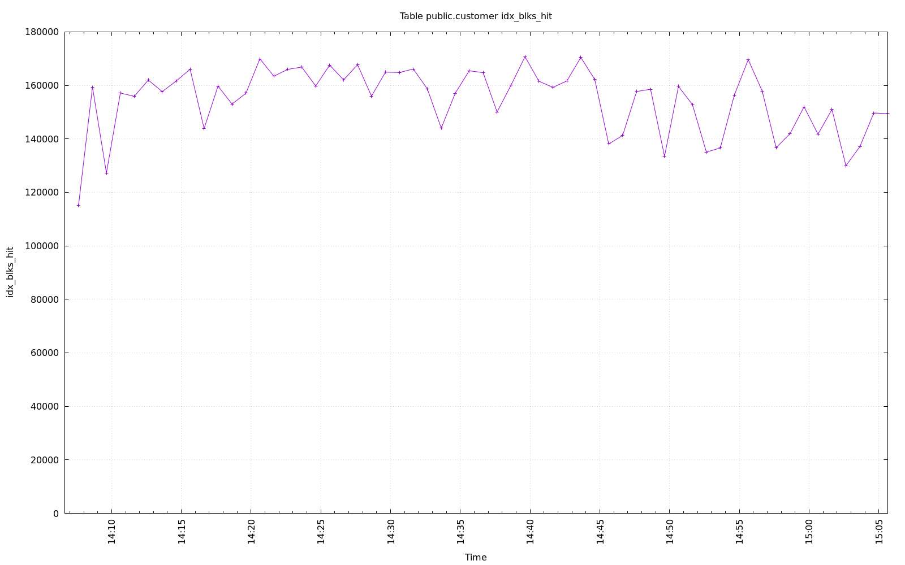

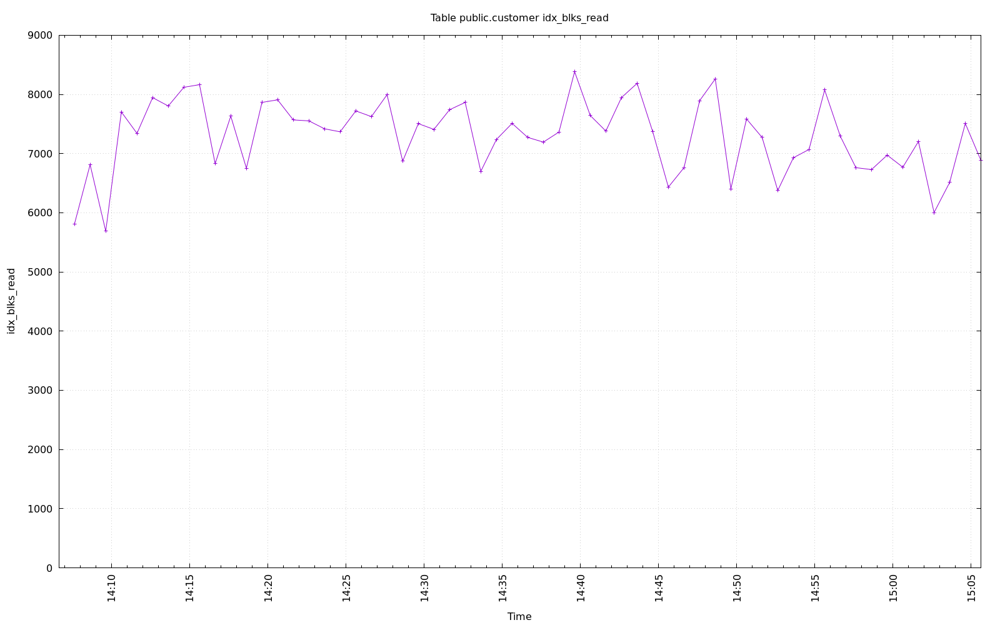

.. image:: ../pgsql-public.customer-heap_blks_hit.png
   :target: ../pgsql-public.customer-heap_blks_hit.png
   :width: 100%

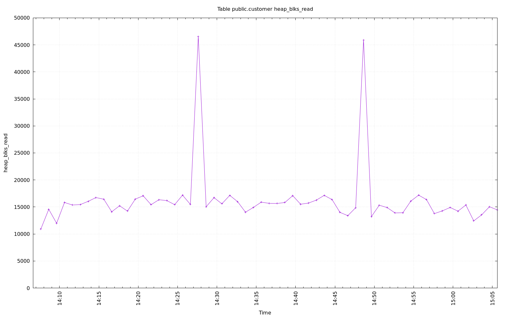
