================================================================================
Database Test 2 public.district Table Charts
================================================================================

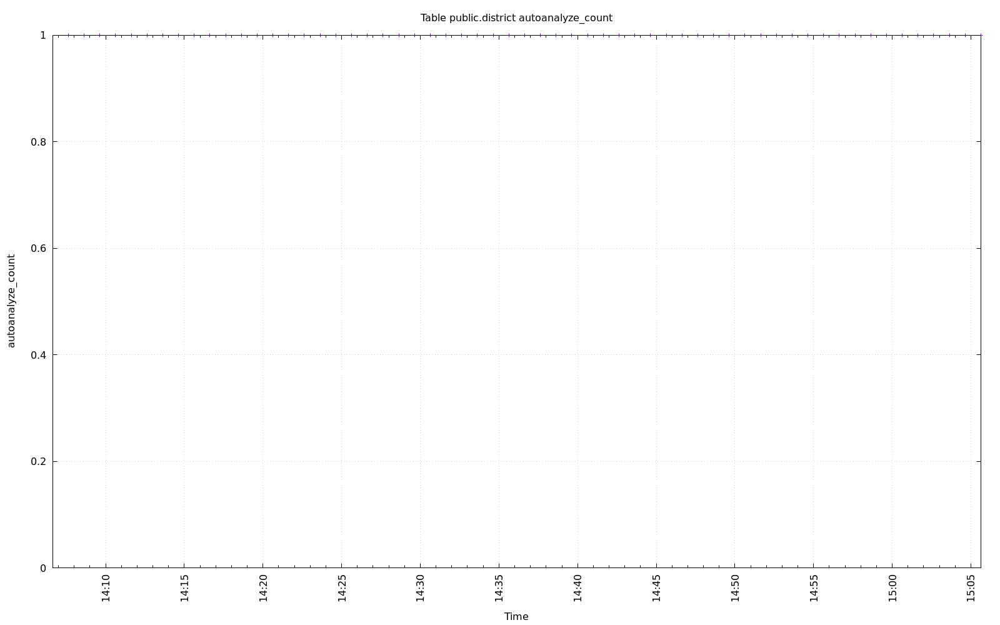

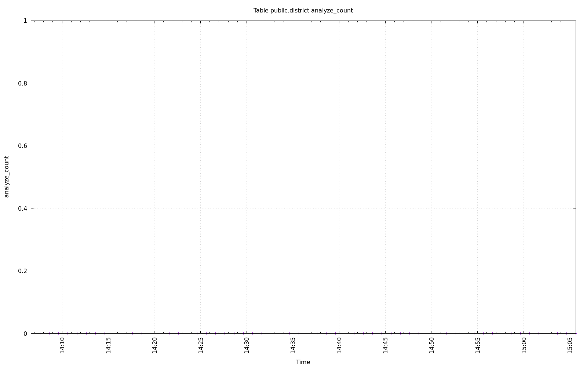

.. image:: ../pgsql-public.district-autovacuum_count.png
   :target: ../pgsql-public.district-autovacuum_count.png
   :width: 100%

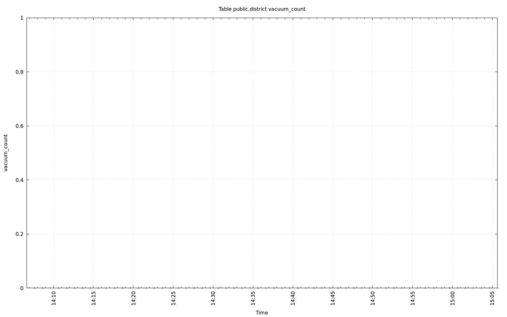

.. image:: ../pgsql-public.district-n_mod_since_analyze.png
   :target: ../pgsql-public.district-n_mod_since_analyze.png
   :width: 100%

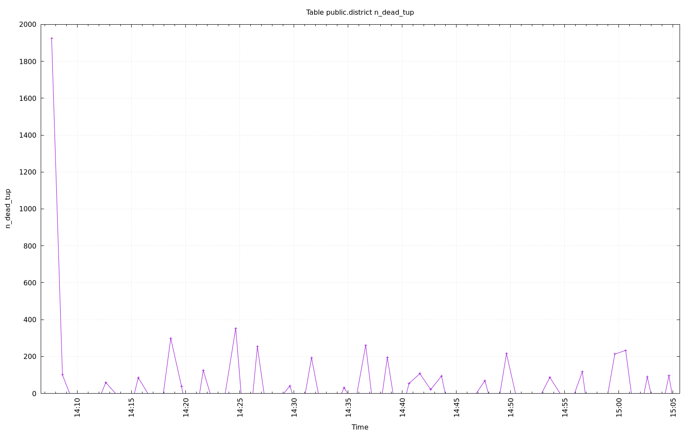

.. image:: ../pgsql-public.district-n_live_tup.png
   :target: ../pgsql-public.district-n_live_tup.png
   :width: 100%

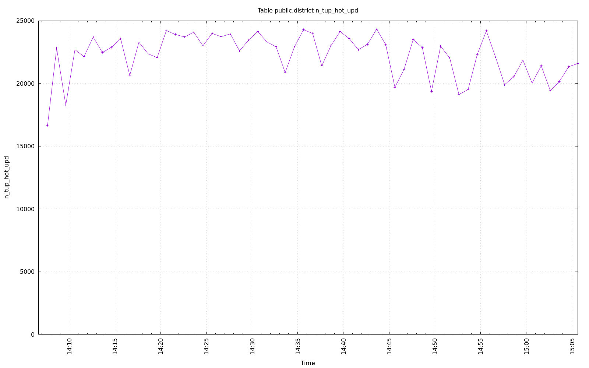

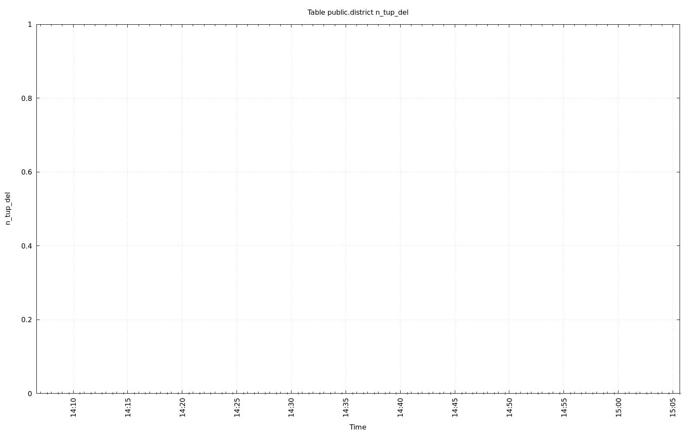

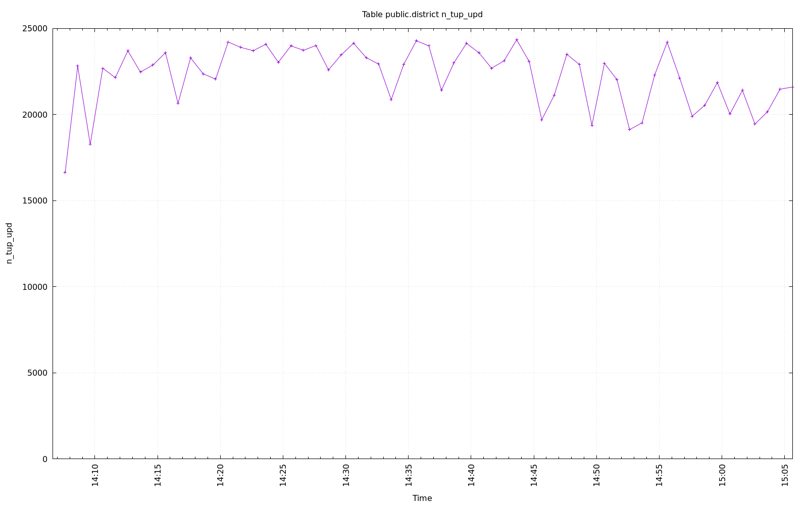

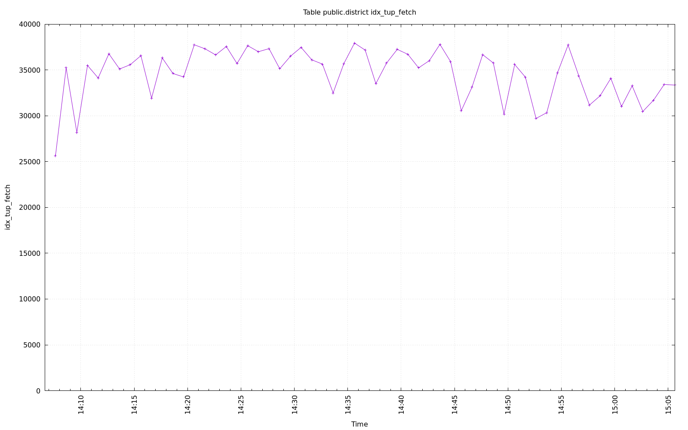

.. image:: ../pgsql-public.district-tidx_blks_hit.png
   :target: ../pgsql-public.district-tidx_blks_hit.png
   :width: 100%

.. image:: ../pgsql-public.district-tidx_blks_read.png
   :target: ../pgsql-public.district-tidx_blks_read.png
   :width: 100%

.. image:: ../pgsql-public.district-toast_blks_hit.png
   :target: ../pgsql-public.district-toast_blks_hit.png
   :width: 100%

.. image:: ../pgsql-public.district-toast_blks_read.png
   :target: ../pgsql-public.district-toast_blks_read.png
   :width: 100%

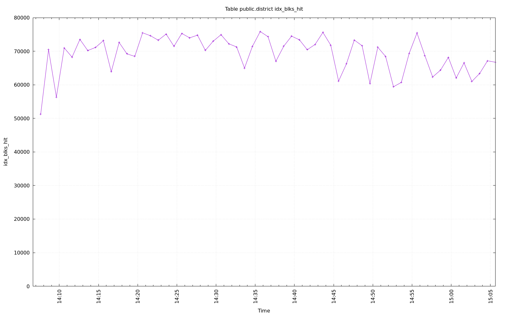

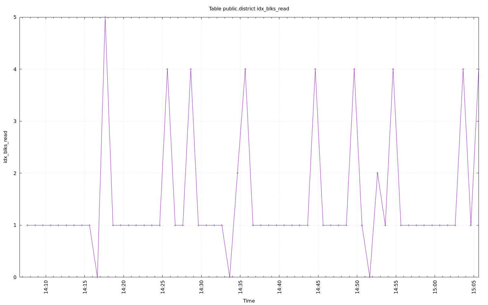

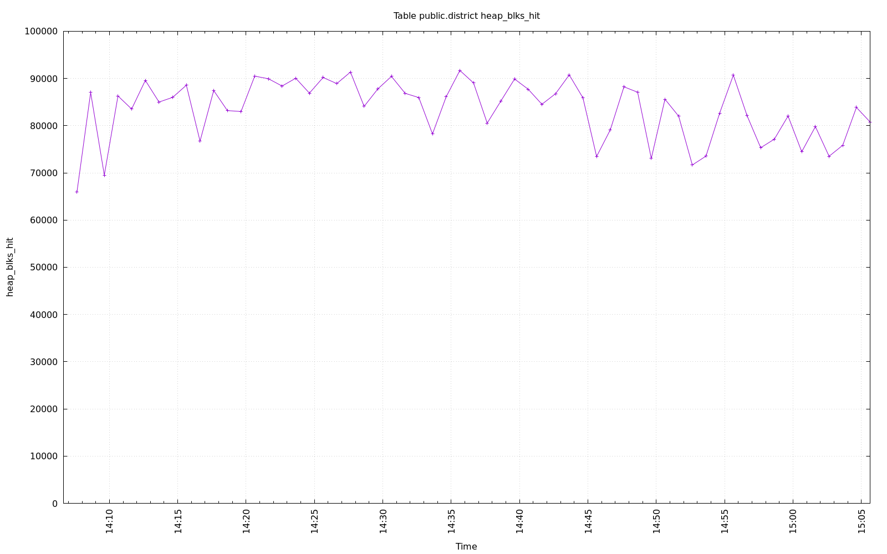

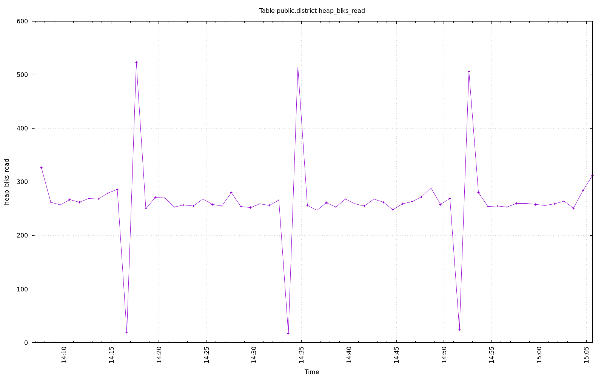
