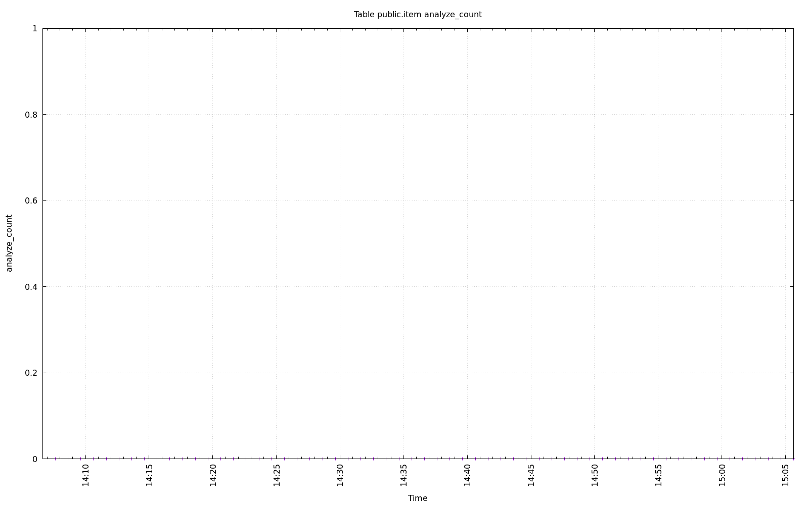
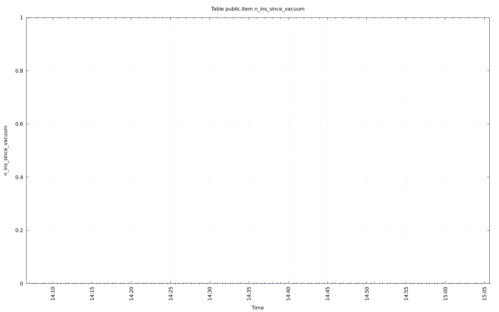
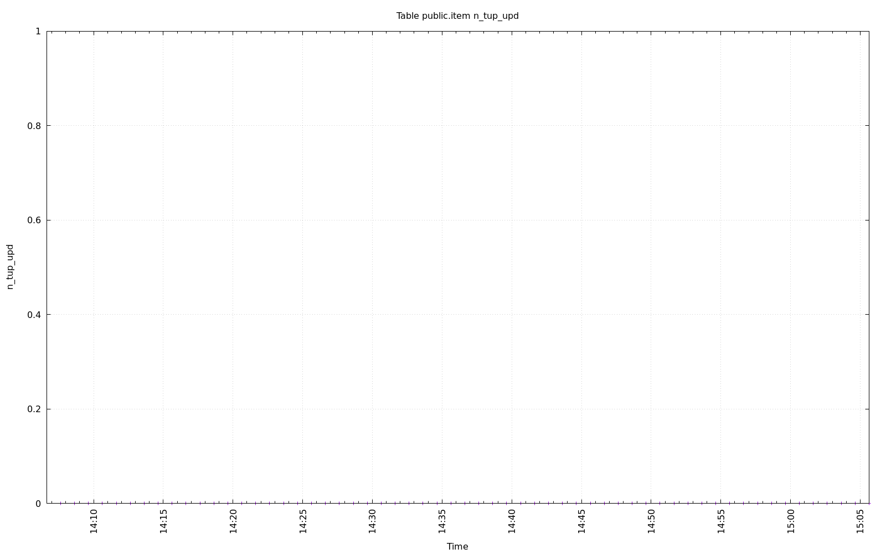
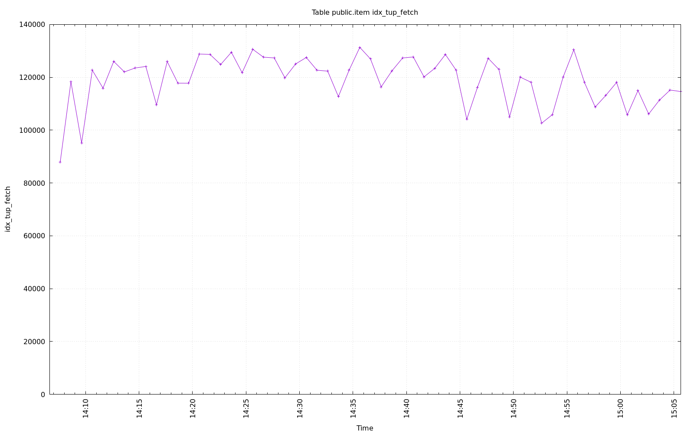
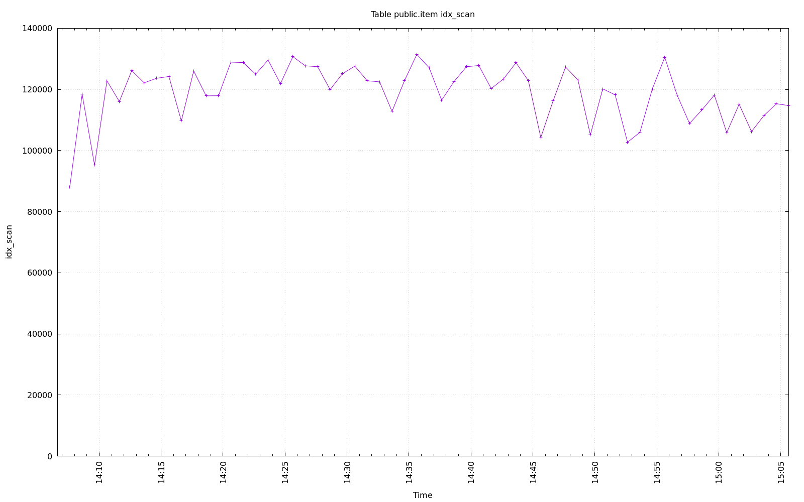
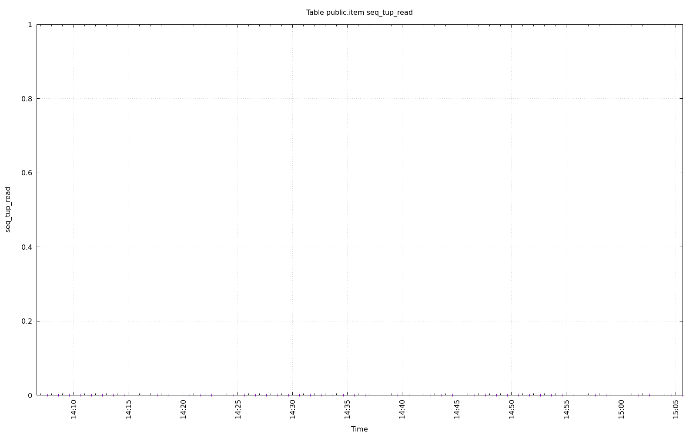
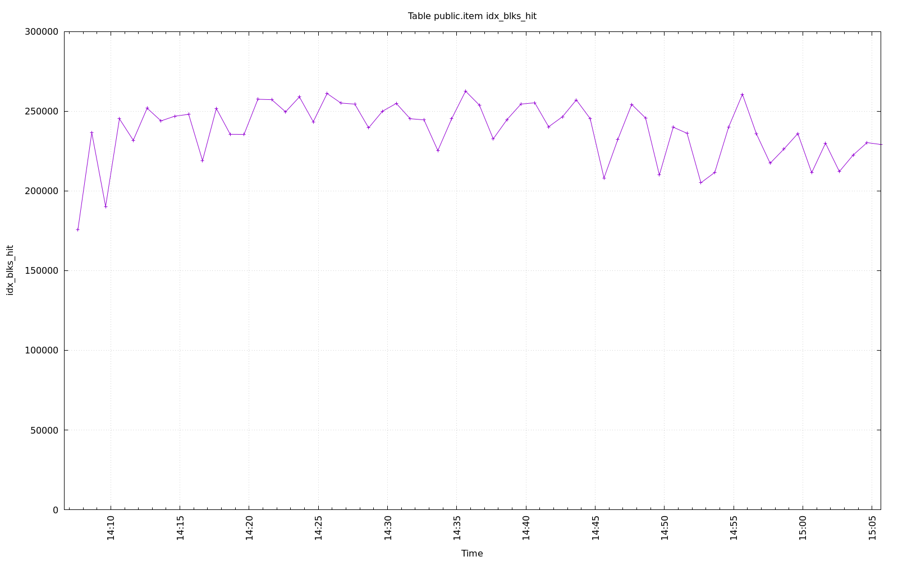
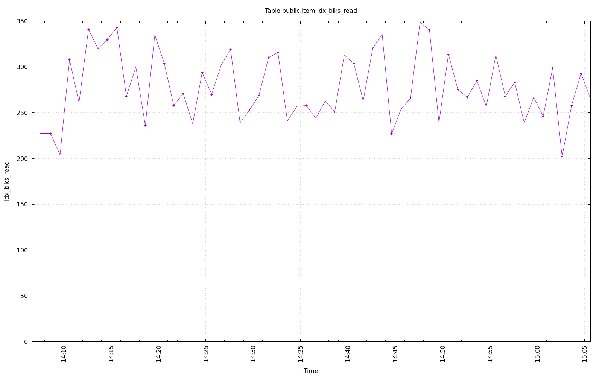
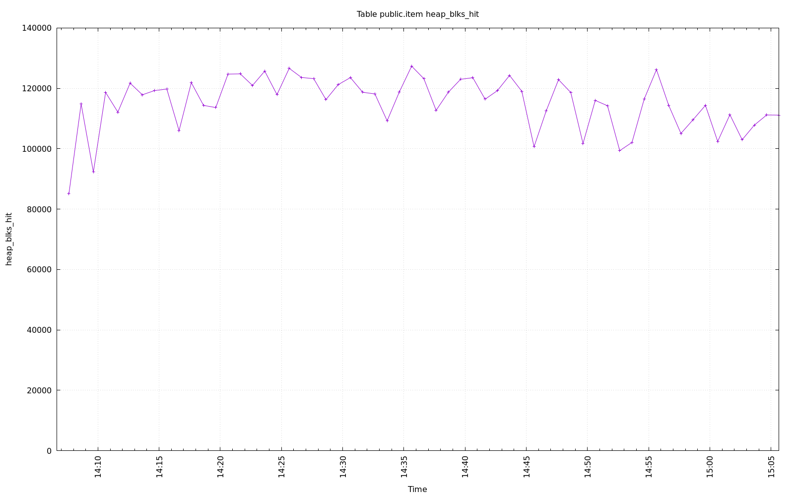
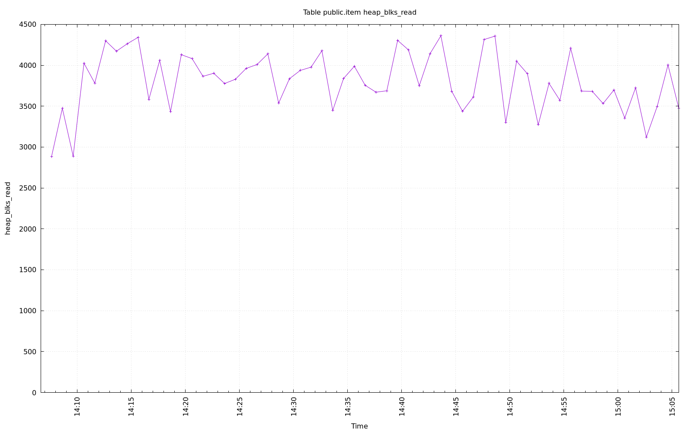

================================================================================
Database Test 2 public.item Table Charts
================================================================================

.. image:: ../pgsql-public.item-autovacuum_count.png
   :target: ../pgsql-public.item-autovacuum_count.png
   :width: 100%

.. image:: ../pgsql-public.item-vacuum_count.png
   :target: ../pgsql-public.item-vacuum_count.png
   :width: 100%

.. image:: ../pgsql-public.item-n_mod_since_analyze.png
   :target: ../pgsql-public.item-n_mod_since_analyze.png
   :width: 100%

.. image:: ../pgsql-public.item-n_live_tup.png
   :target: ../pgsql-public.item-n_live_tup.png
   :width: 100%

.. image:: ../pgsql-public.item-tidx_blks_hit.png
   :target: ../pgsql-public.item-tidx_blks_hit.png
   :width: 100%

.. image:: ../pgsql-public.item-tidx_blks_read.png
   :target: ../pgsql-public.item-tidx_blks_read.png
   :width: 100%

.. image:: ../pgsql-public.item-toast_blks_hit.png
   :target: ../pgsql-public.item-toast_blks_hit.png
   :width: 100%

.. image:: ../pgsql-public.item-toast_blks_read.png
   :target: ../pgsql-public.item-toast_blks_read.png
   :width: 100%

