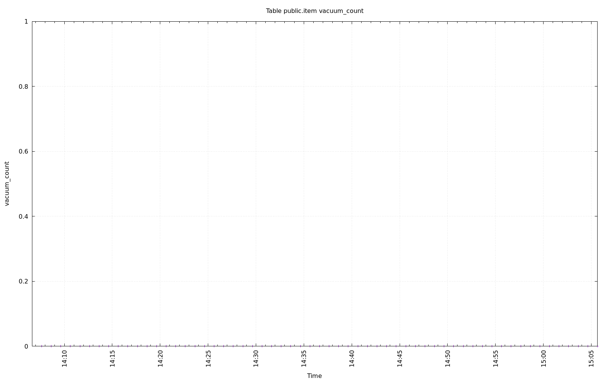

================================================================================
Database Test 2 public.item Table Charts
================================================================================

.. image:: ../pgsql-public.item-autoanalyze_count.png
   :target: ../pgsql-public.item-autoanalyze_count.png
   :width: 100%

.. image:: ../pgsql-public.item-n_dead_tup.png
   :target: ../pgsql-public.item-n_dead_tup.png
   :width: 100%

.. image:: ../pgsql-public.item-idx_tup_fetch.png
   :target: ../pgsql-public.item-idx_tup_fetch.png
   :width: 100%

.. image:: ../pgsql-public.item-seq_tup_read.png
   :target: ../pgsql-public.item-seq_tup_read.png
   :width: 100%

.. image:: ../pgsql-public.item-tidx_blks_hit.png
   :target: ../pgsql-public.item-tidx_blks_hit.png
   :width: 100%

.. image:: ../pgsql-public.item-tidx_blks_read.png
   :target: ../pgsql-public.item-tidx_blks_read.png
   :width: 100%

.. image:: ../pgsql-public.item-toast_blks_hit.png
   :target: ../pgsql-public.item-toast_blks_hit.png
   :width: 100%

.. image:: ../pgsql-public.item-toast_blks_read.png
   :target: ../pgsql-public.item-toast_blks_read.png
   :width: 100%

