================================================================================
Database Test 2 public.order_line Table Charts
================================================================================

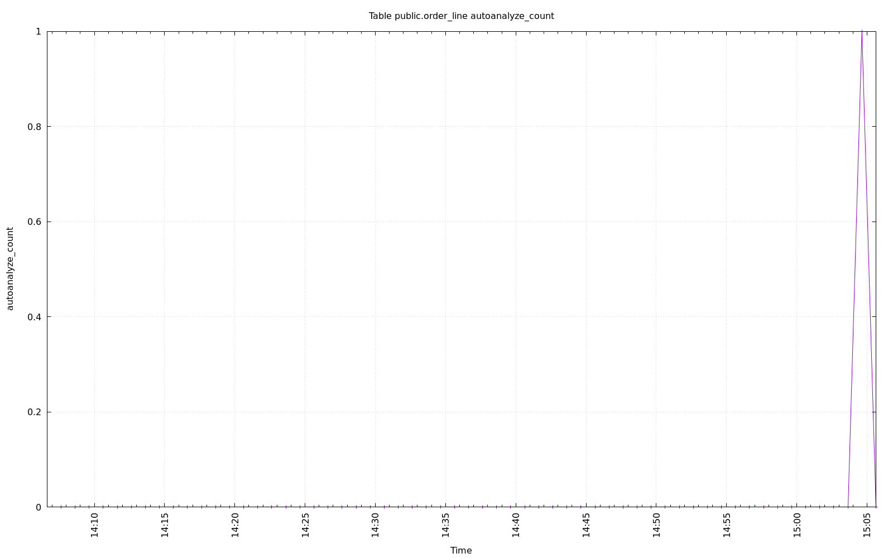

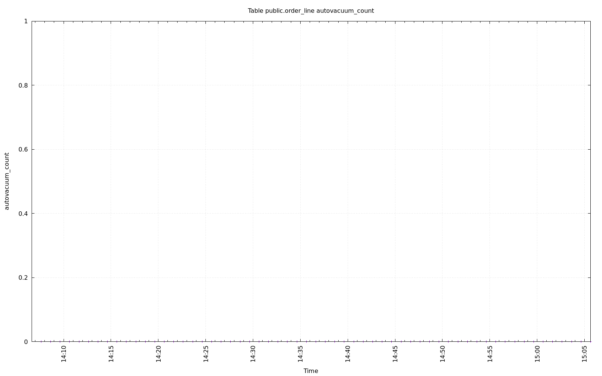

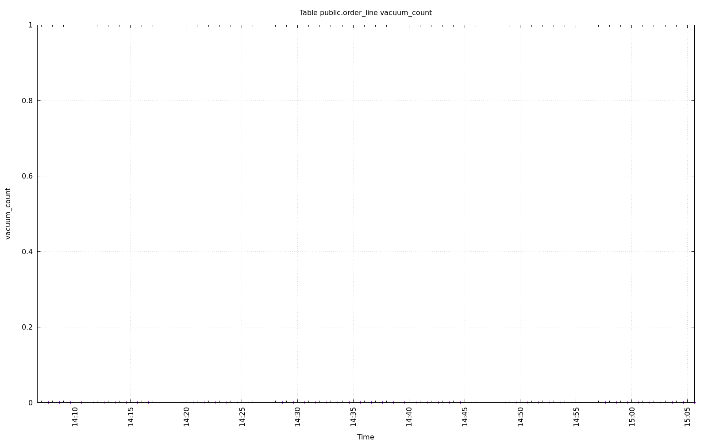

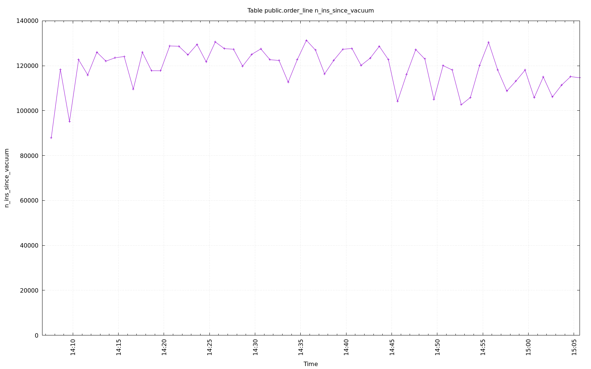

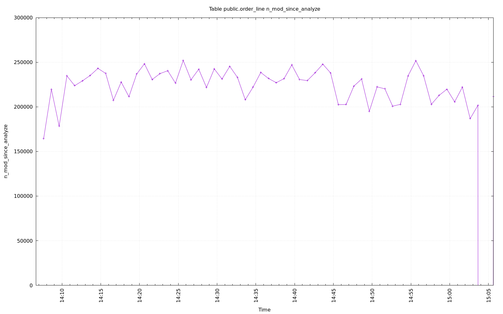

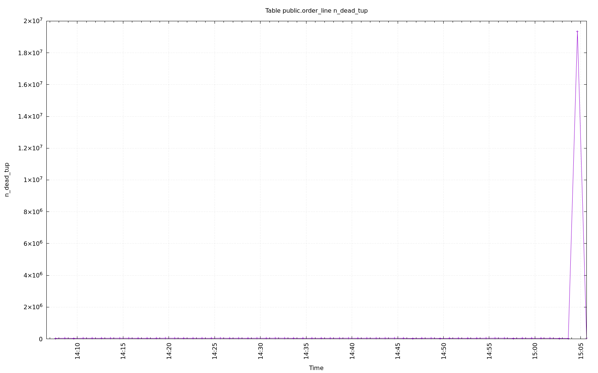

.. image:: ../pgsql-public.order_line-n_live_tup.png
   :target: ../pgsql-public.order_line-n_live_tup.png
   :width: 100%

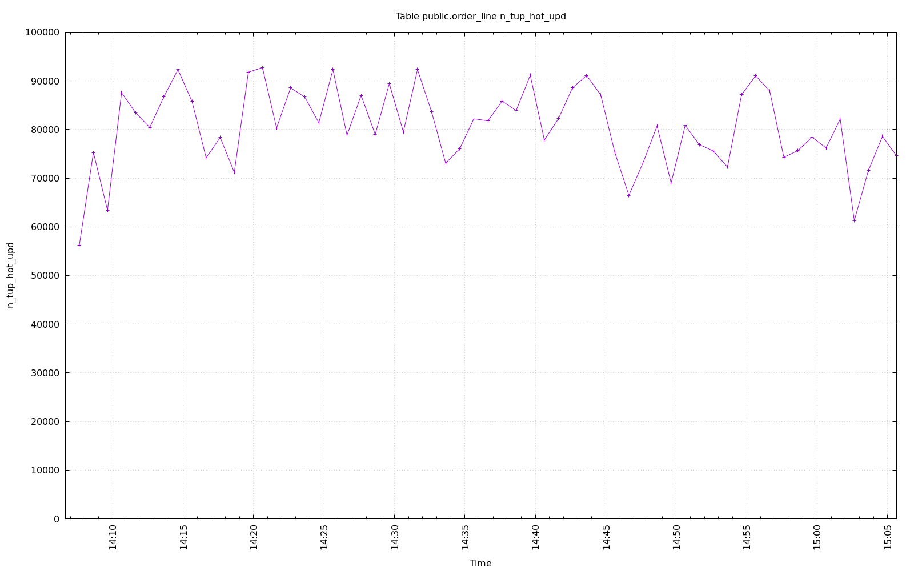

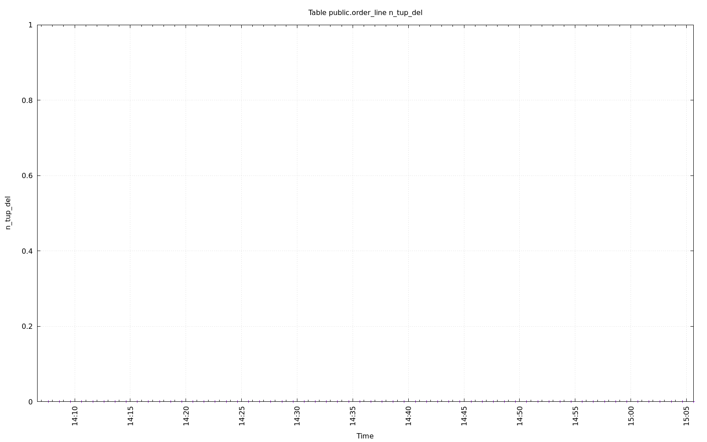

.. image:: ../pgsql-public.order_line-n_tup_upd.png
   :target: ../pgsql-public.order_line-n_tup_upd.png
   :width: 100%

.. image:: ../pgsql-public.order_line-n_tup_ins.png
   :target: ../pgsql-public.order_line-n_tup_ins.png
   :width: 100%

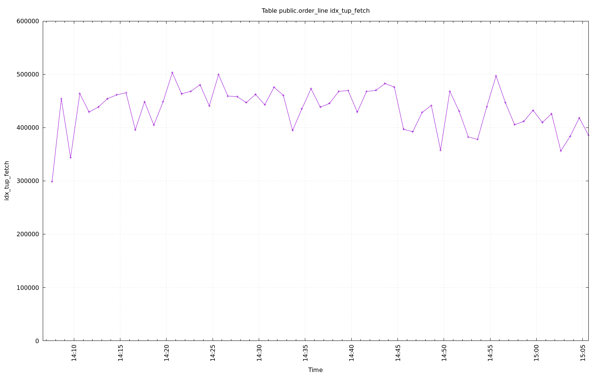

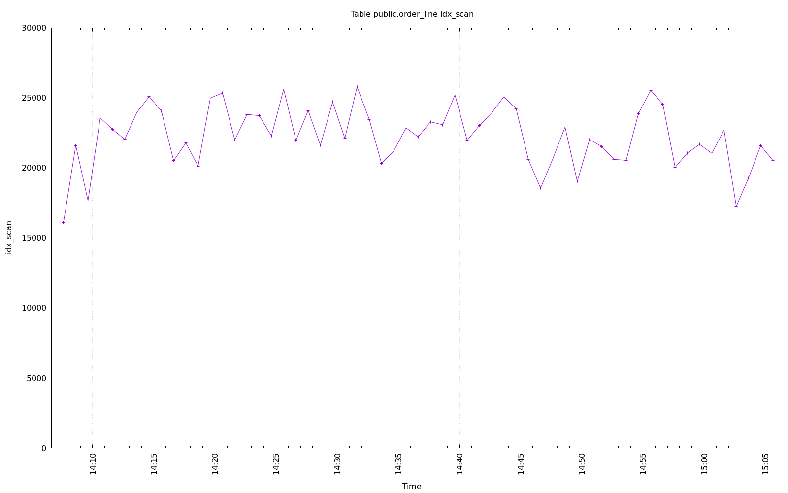

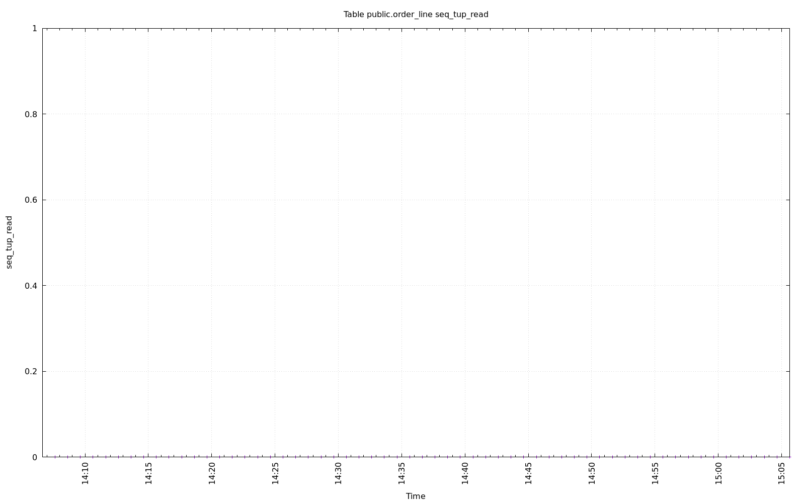

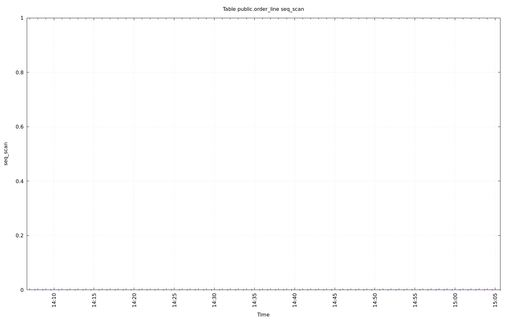

.. image:: ../pgsql-public.order_line-tidx_blks_hit.png
   :target: ../pgsql-public.order_line-tidx_blks_hit.png
   :width: 100%

.. image:: ../pgsql-public.order_line-tidx_blks_read.png
   :target: ../pgsql-public.order_line-tidx_blks_read.png
   :width: 100%

.. image:: ../pgsql-public.order_line-toast_blks_hit.png
   :target: ../pgsql-public.order_line-toast_blks_hit.png
   :width: 100%

.. image:: ../pgsql-public.order_line-toast_blks_read.png
   :target: ../pgsql-public.order_line-toast_blks_read.png
   :width: 100%

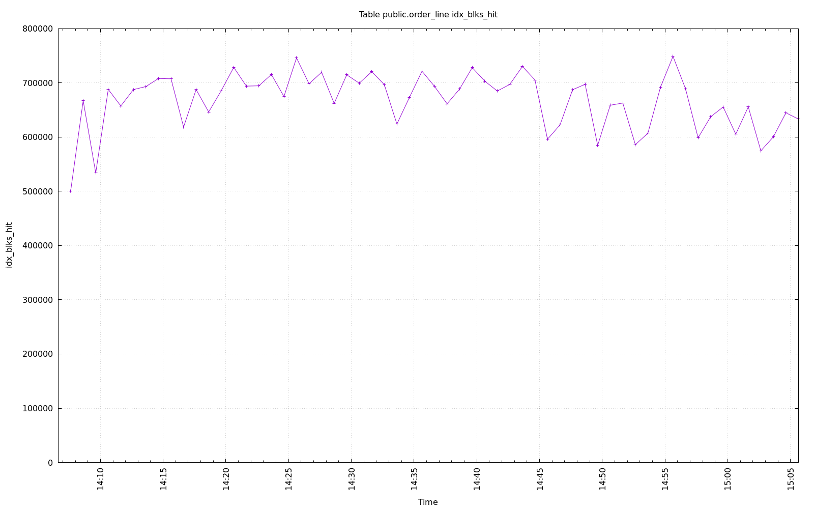

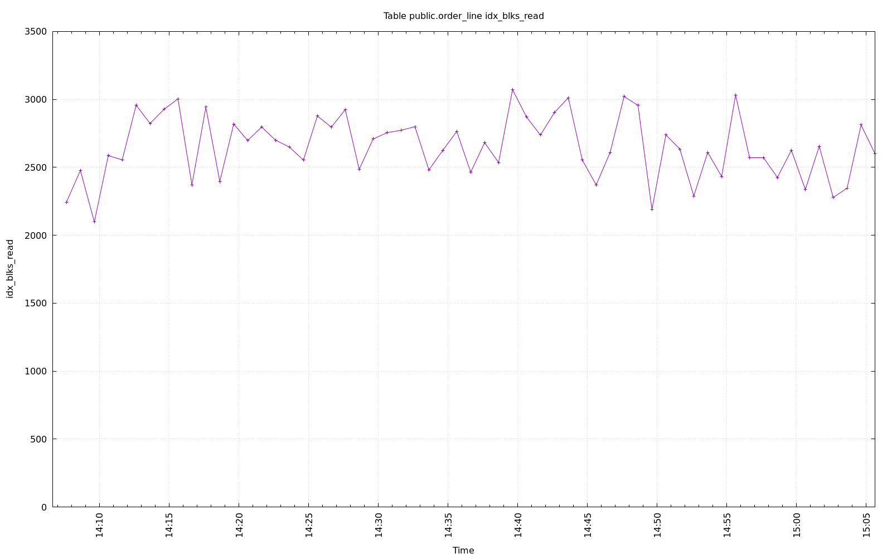

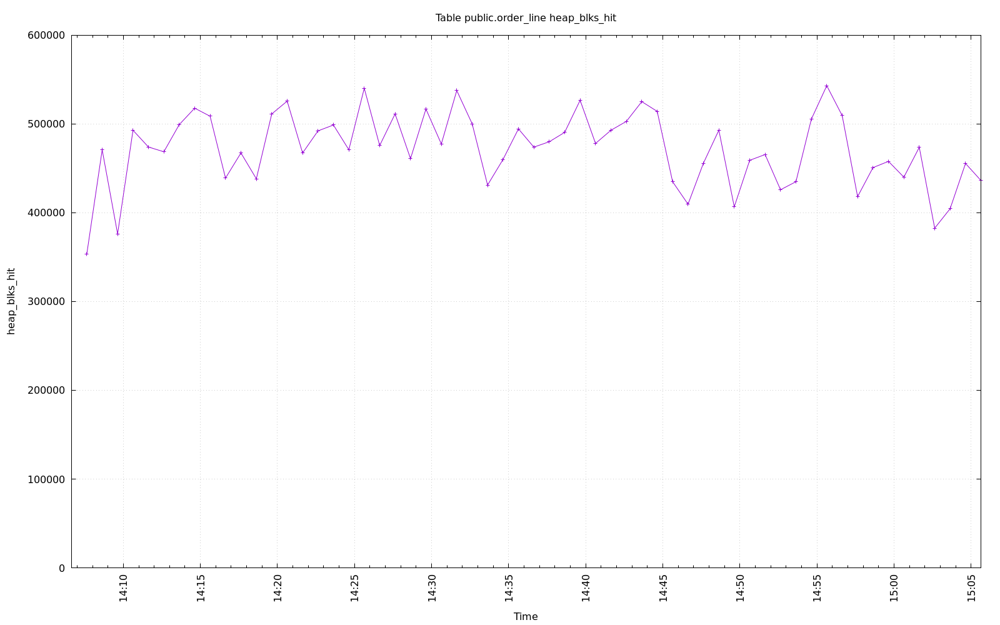

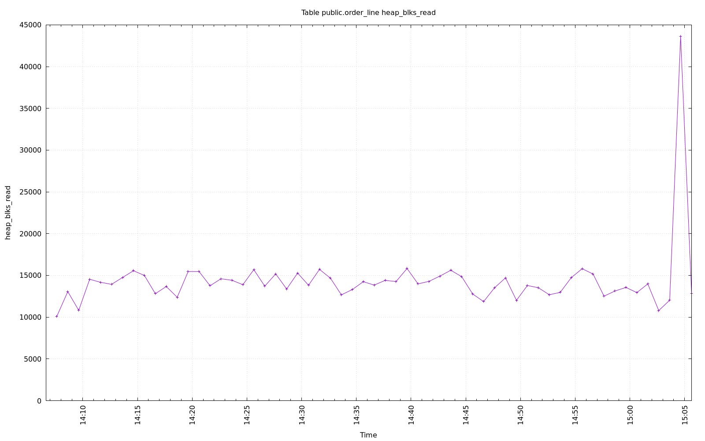
