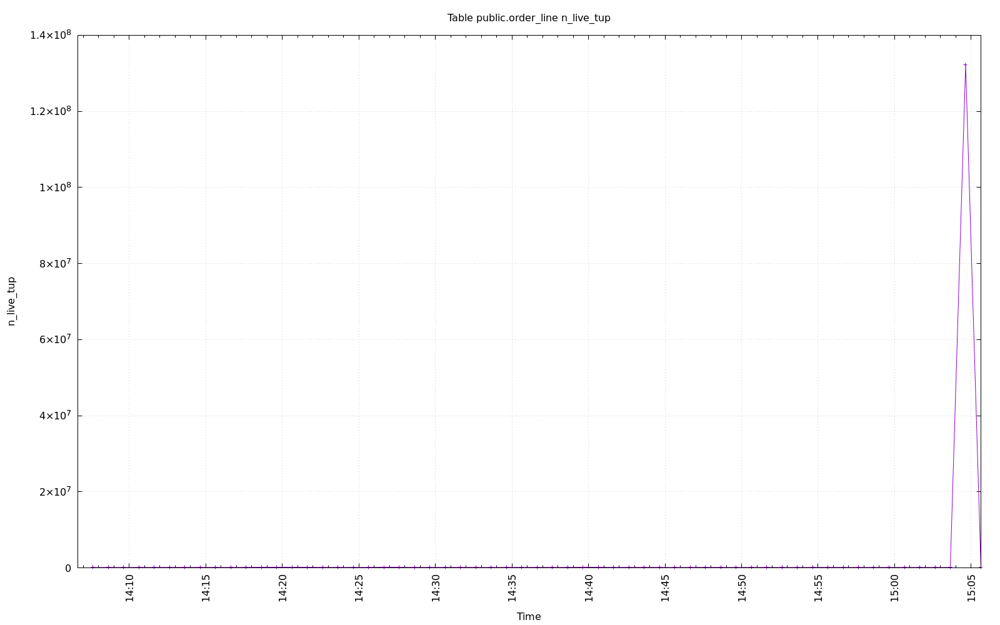
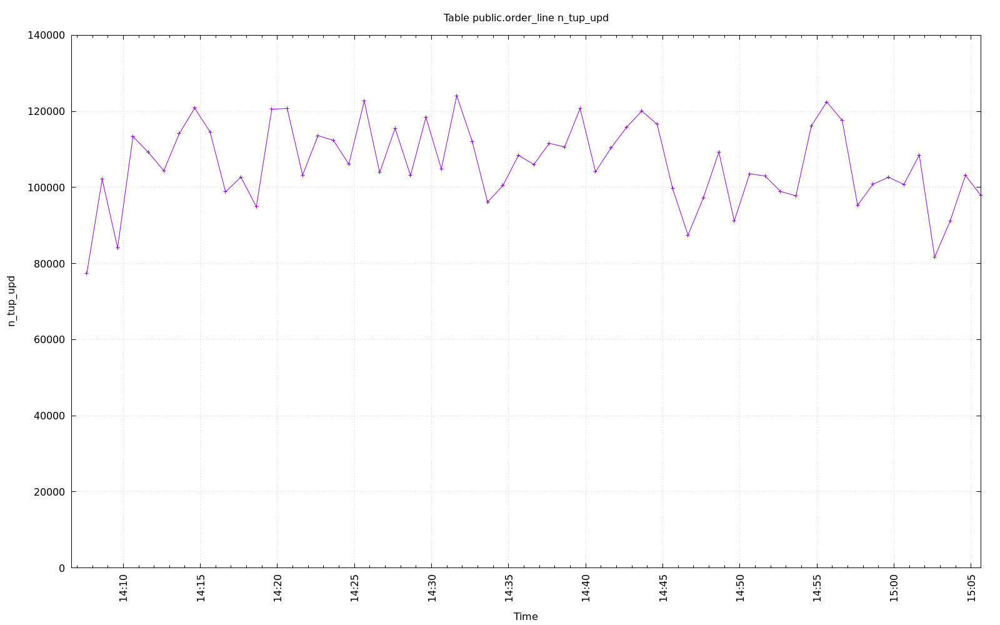
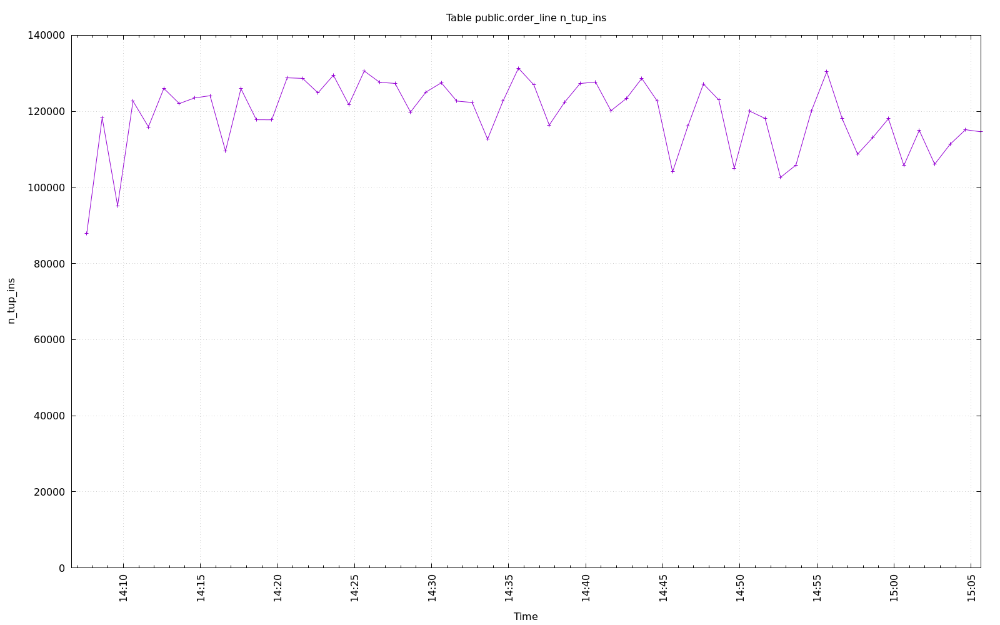

================================================================================
Database Test 2 public.order_line Table Charts
================================================================================

.. image:: ../pgsql-public.order_line-n_ins_since_vacuum.png
   :target: ../pgsql-public.order_line-n_ins_since_vacuum.png
   :width: 100%

.. image:: ../pgsql-public.order_line-n_mod_since_analyze.png
   :target: ../pgsql-public.order_line-n_mod_since_analyze.png
   :width: 100%

.. image:: ../pgsql-public.order_line-n_dead_tup.png
   :target: ../pgsql-public.order_line-n_dead_tup.png
   :width: 100%

.. image:: ../pgsql-public.order_line-seq_tup_read.png
   :target: ../pgsql-public.order_line-seq_tup_read.png
   :width: 100%

.. image:: ../pgsql-public.order_line-tidx_blks_hit.png
   :target: ../pgsql-public.order_line-tidx_blks_hit.png
   :width: 100%

.. image:: ../pgsql-public.order_line-tidx_blks_read.png
   :target: ../pgsql-public.order_line-tidx_blks_read.png
   :width: 100%

.. image:: ../pgsql-public.order_line-toast_blks_hit.png
   :target: ../pgsql-public.order_line-toast_blks_hit.png
   :width: 100%

.. image:: ../pgsql-public.order_line-toast_blks_read.png
   :target: ../pgsql-public.order_line-toast_blks_read.png
   :width: 100%

