================================================================================
Database Test 2 public.stock Table Charts
================================================================================

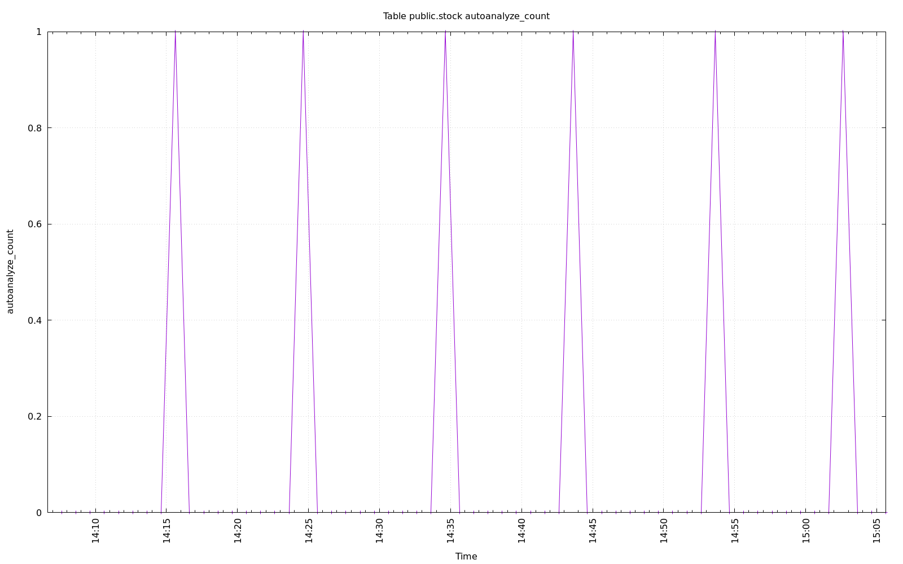

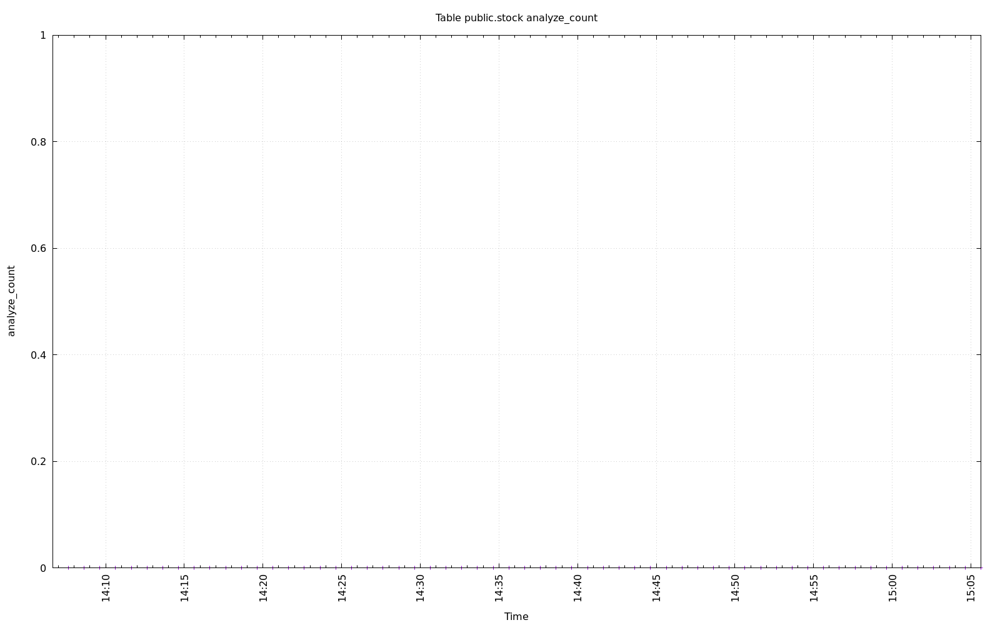

.. image:: ../pgsql-public.stock-autovacuum_count.png
   :target: ../pgsql-public.stock-autovacuum_count.png
   :width: 100%

.. image:: ../pgsql-public.stock-vacuum_count.png
   :target: ../pgsql-public.stock-vacuum_count.png
   :width: 100%

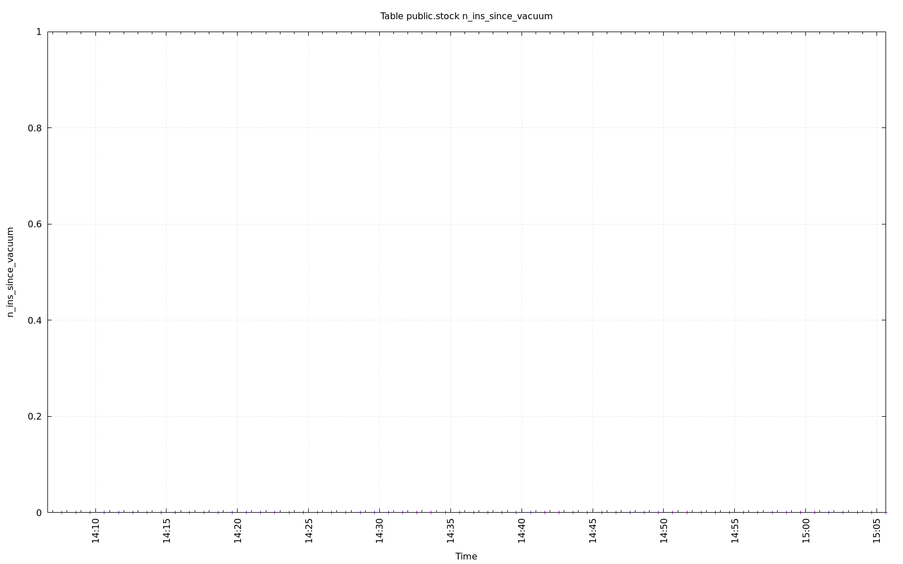

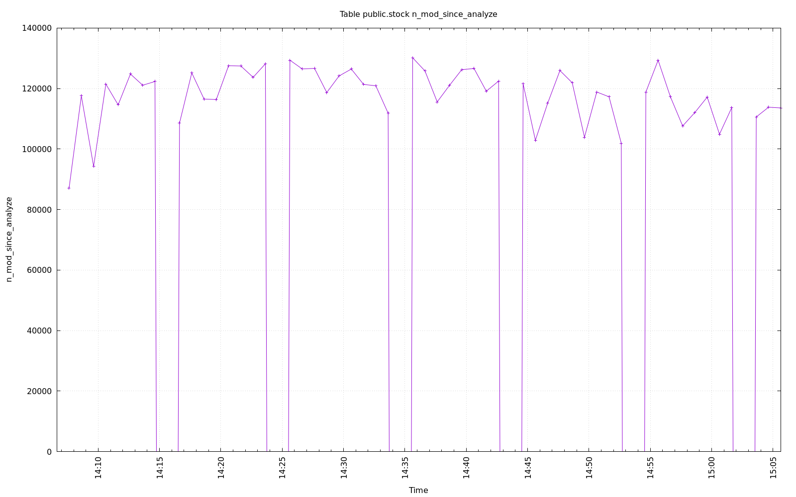

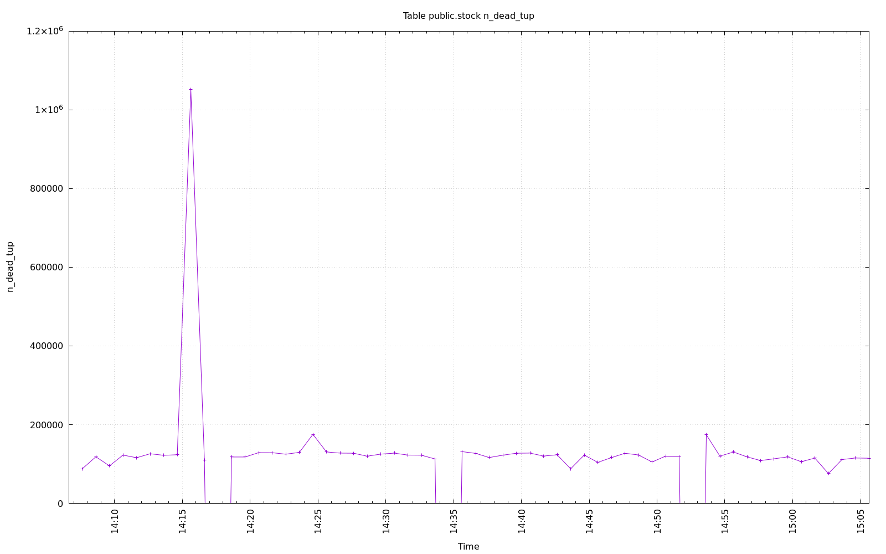

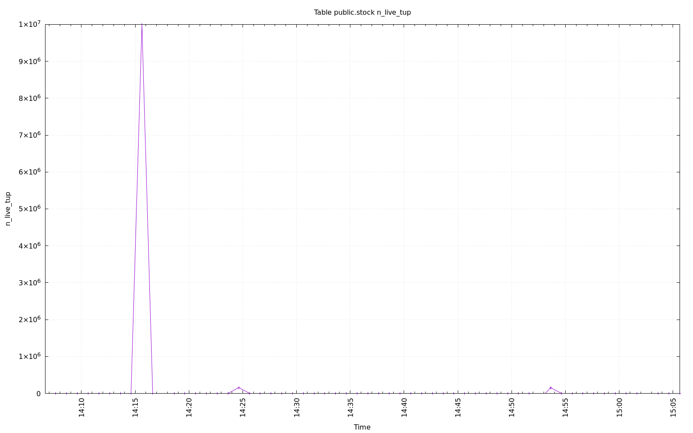

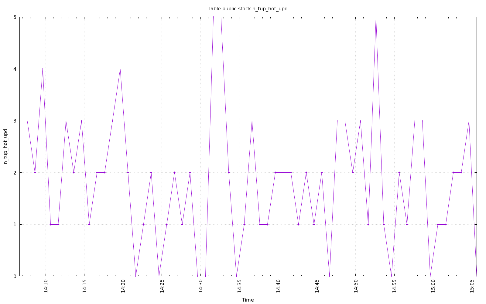

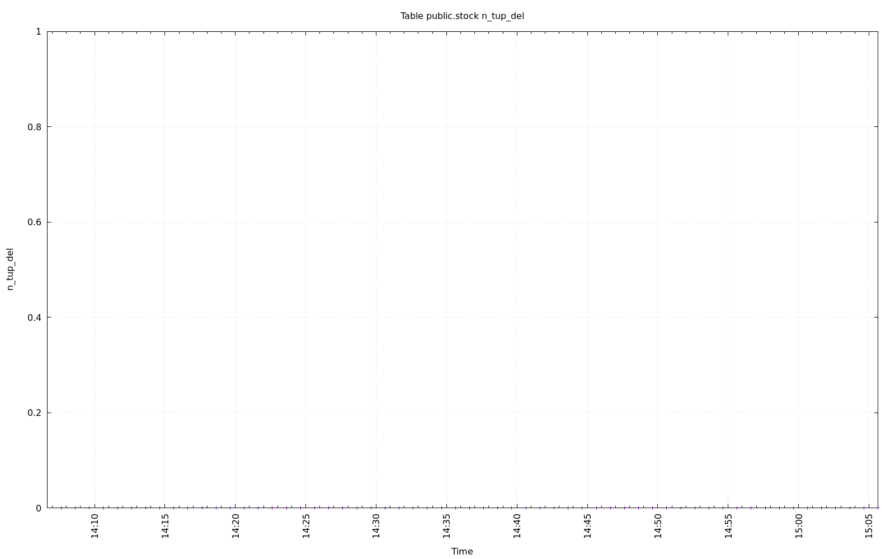

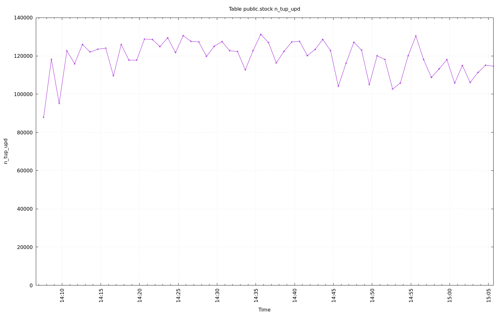

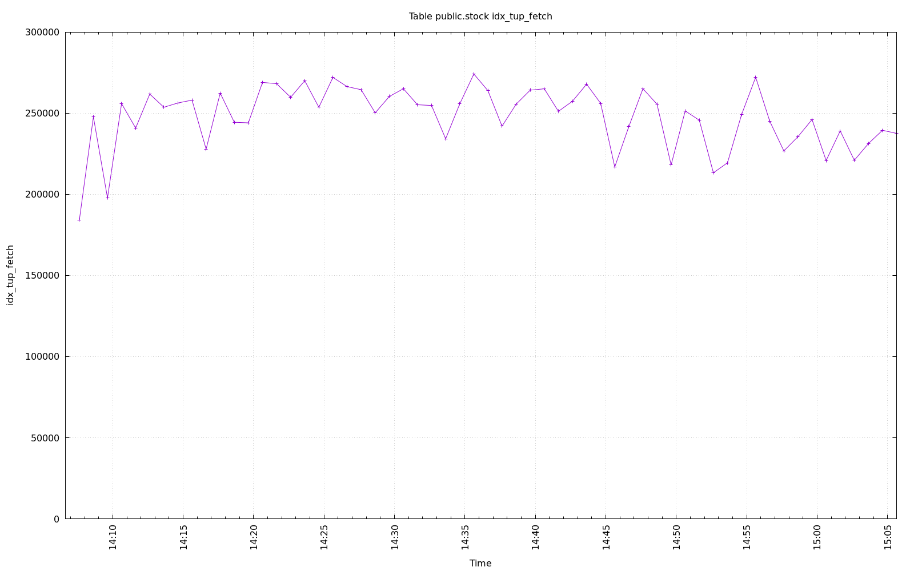

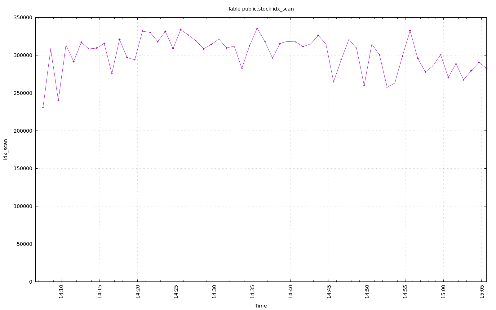

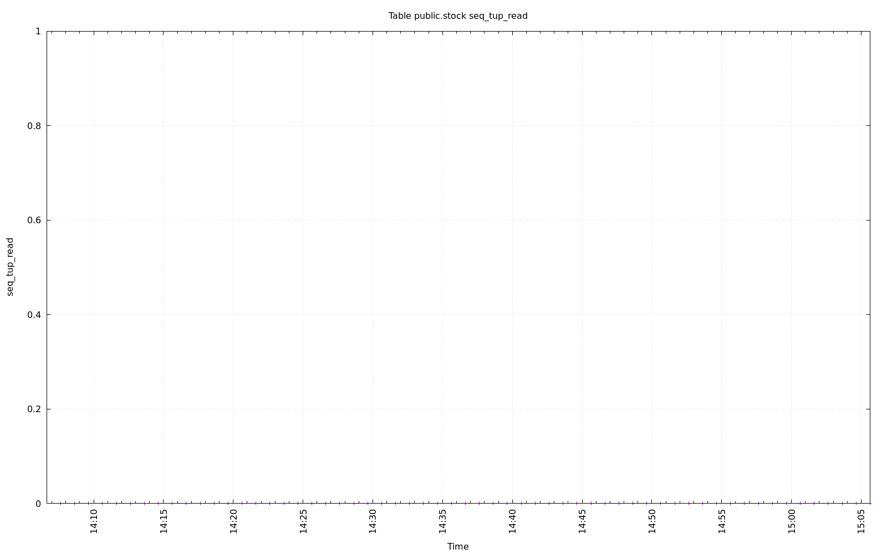

.. image:: ../pgsql-public.stock-seq_scan.png
   :target: ../pgsql-public.stock-seq_scan.png
   :width: 100%

.. image:: ../pgsql-public.stock-tidx_blks_hit.png
   :target: ../pgsql-public.stock-tidx_blks_hit.png
   :width: 100%

.. image:: ../pgsql-public.stock-tidx_blks_read.png
   :target: ../pgsql-public.stock-tidx_blks_read.png
   :width: 100%

.. image:: ../pgsql-public.stock-toast_blks_hit.png
   :target: ../pgsql-public.stock-toast_blks_hit.png
   :width: 100%

.. image:: ../pgsql-public.stock-toast_blks_read.png
   :target: ../pgsql-public.stock-toast_blks_read.png
   :width: 100%

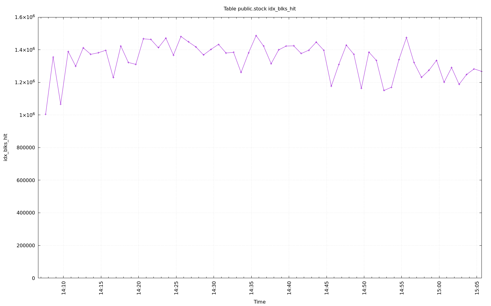

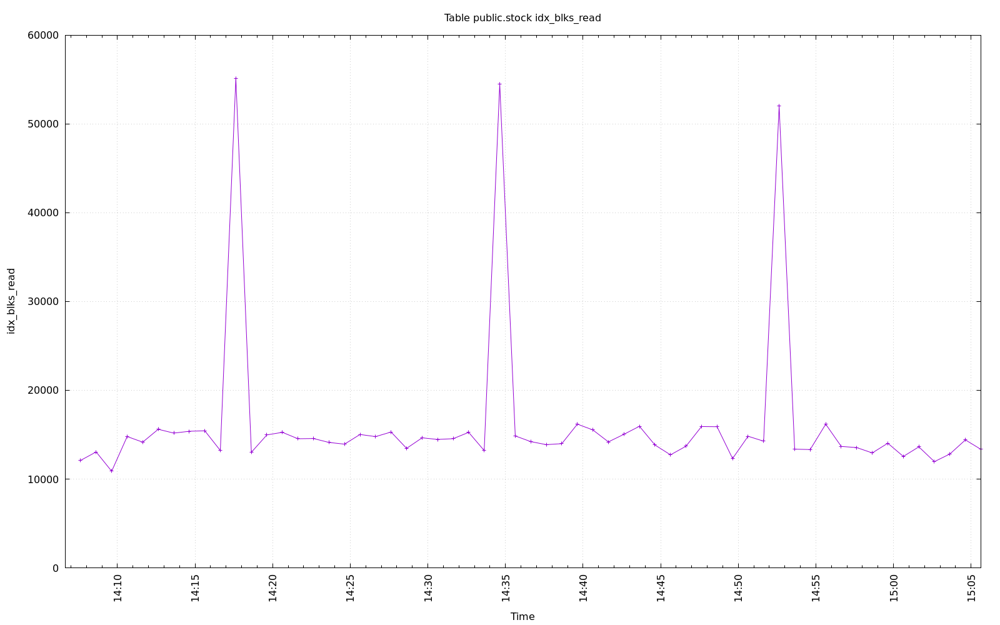

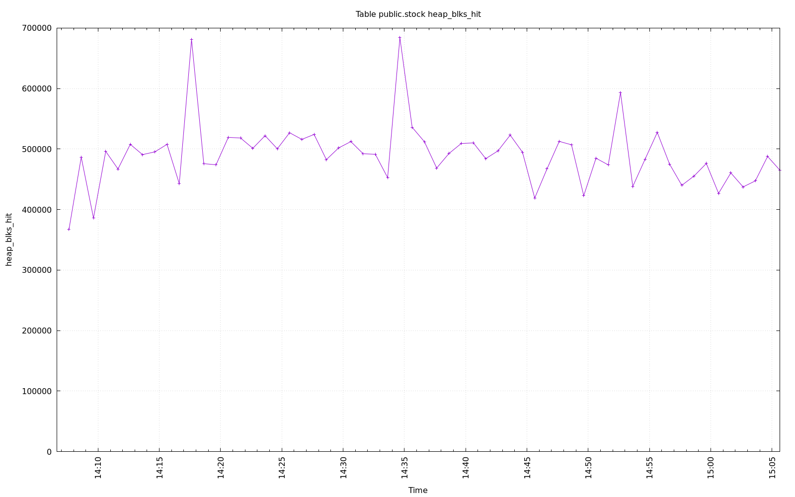

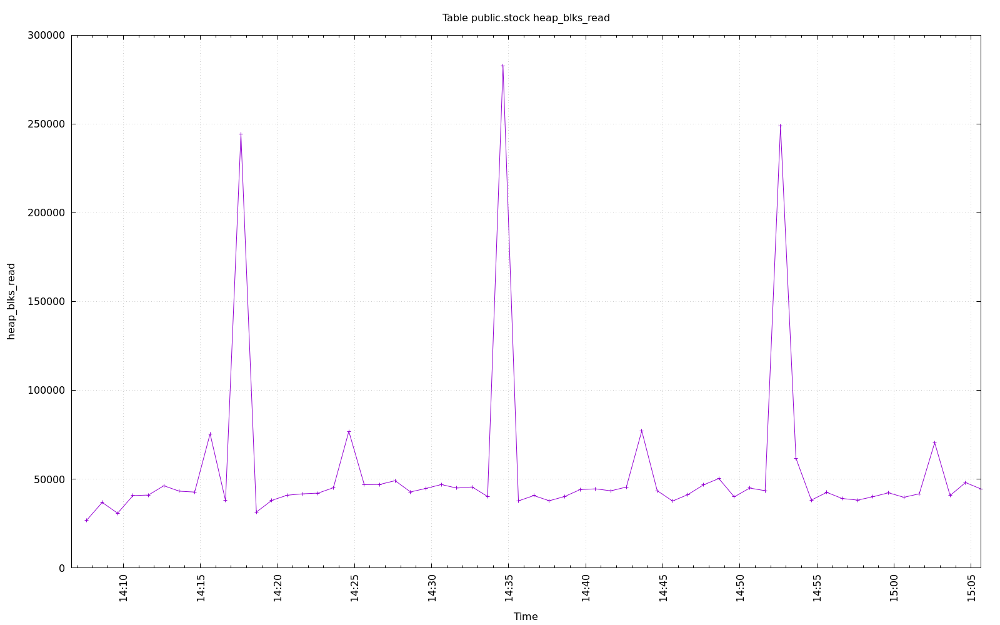
