================================================================================
Database Test 2 db mem Charts
================================================================================

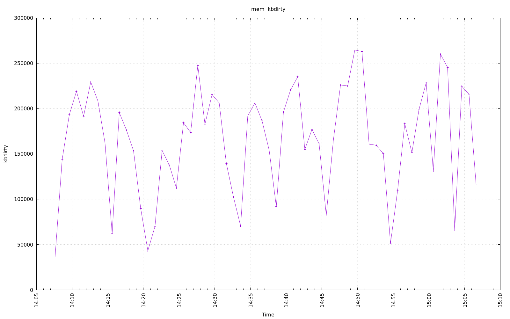

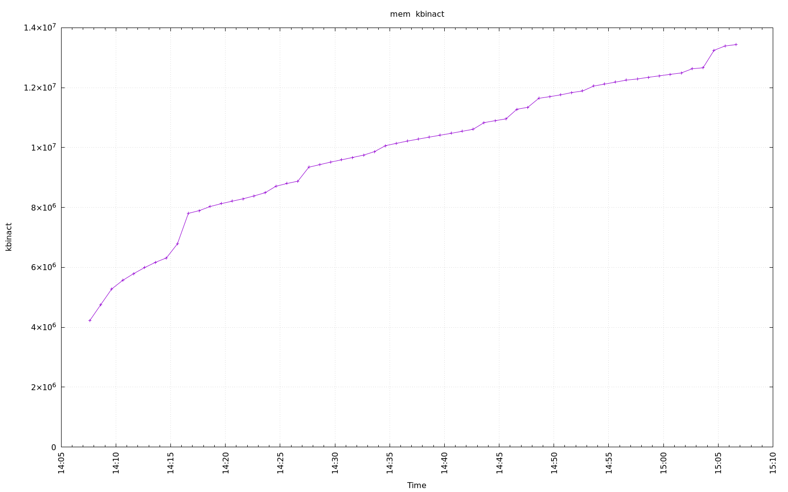

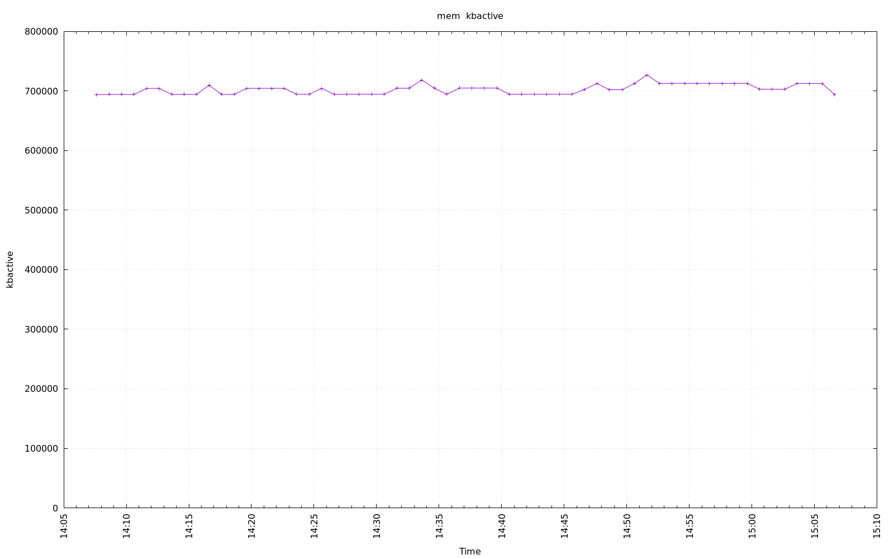

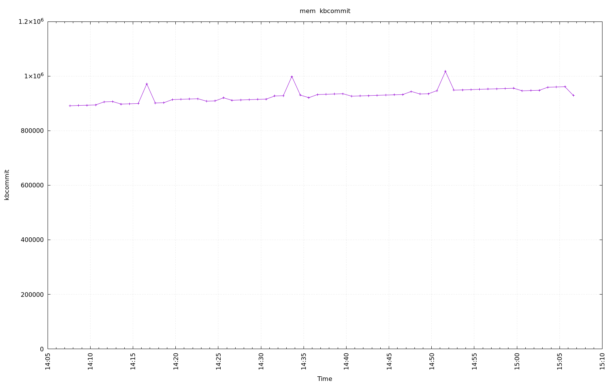

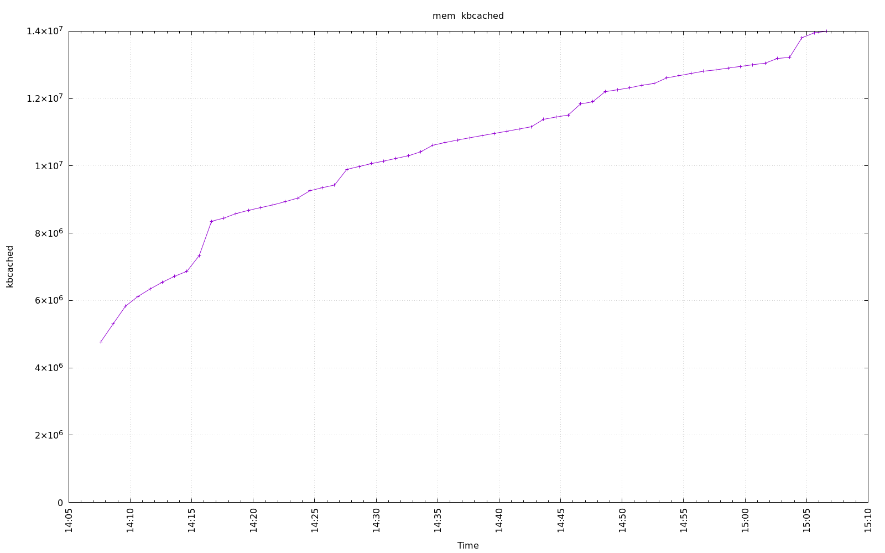

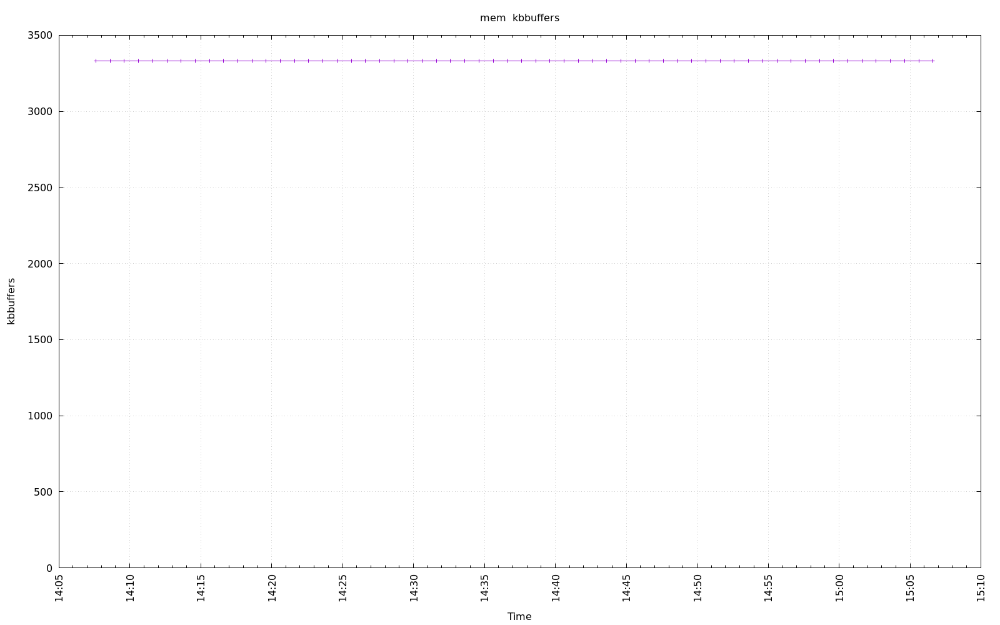

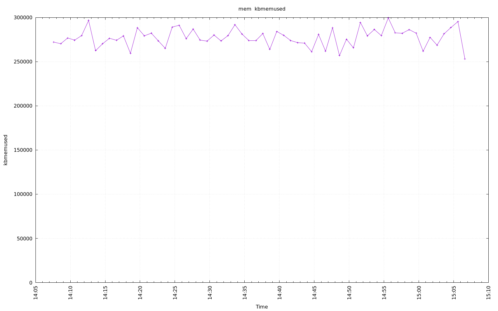

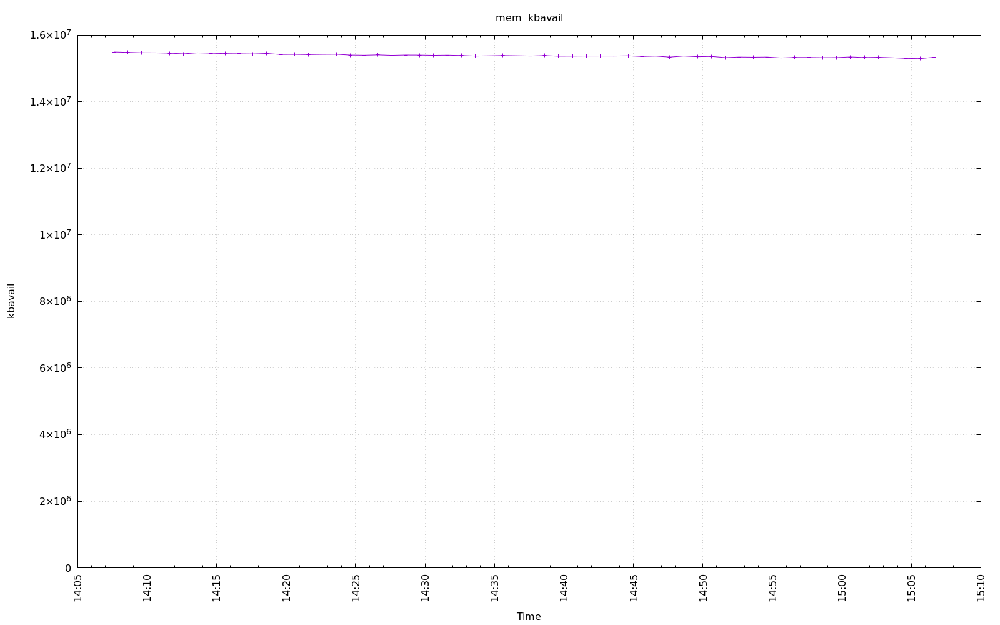

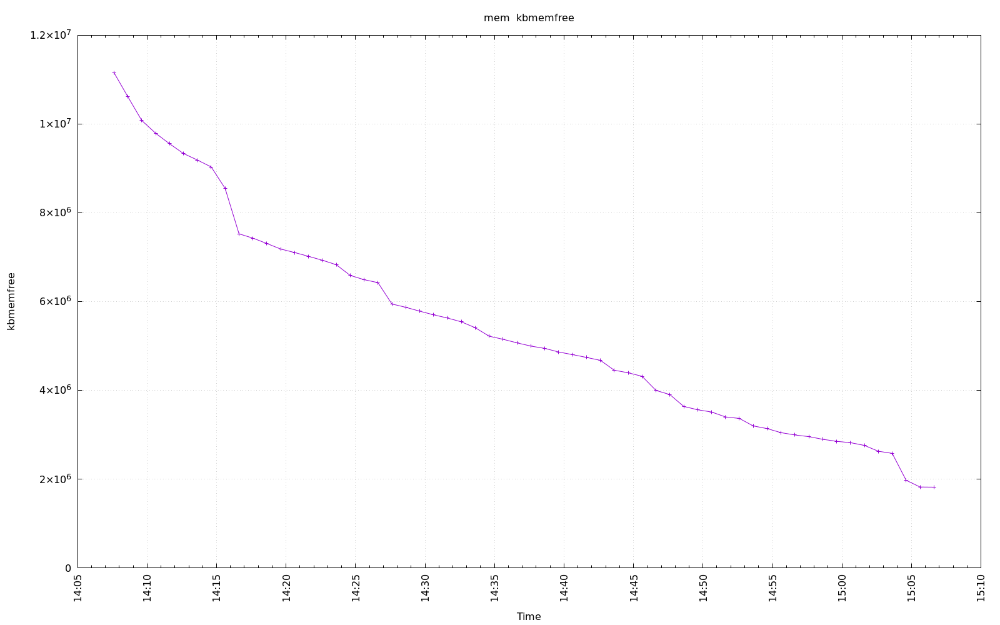

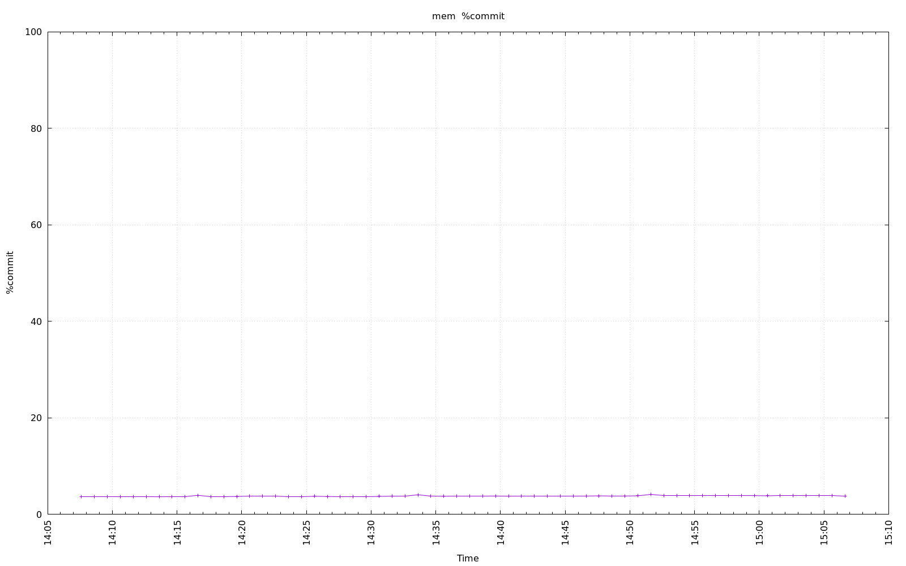

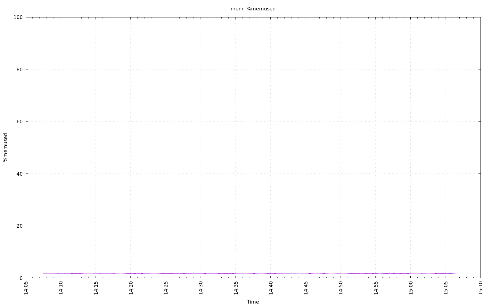
