================================================================================
Database Test 2 pidstat checkpointer Charts
================================================================================

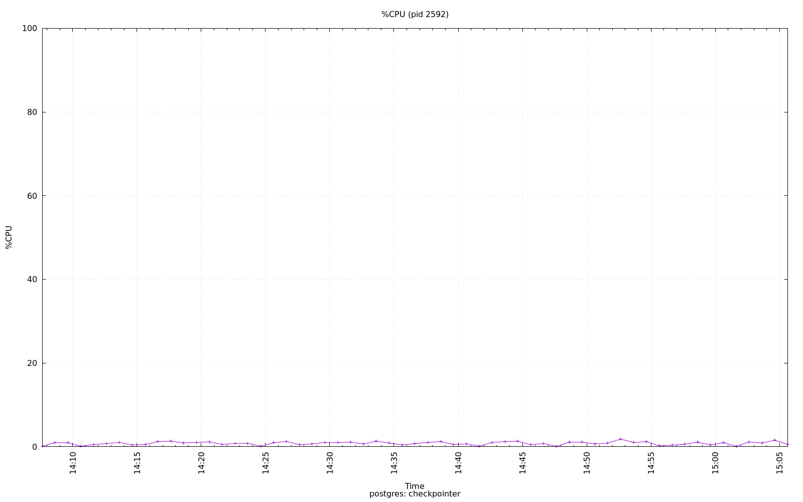

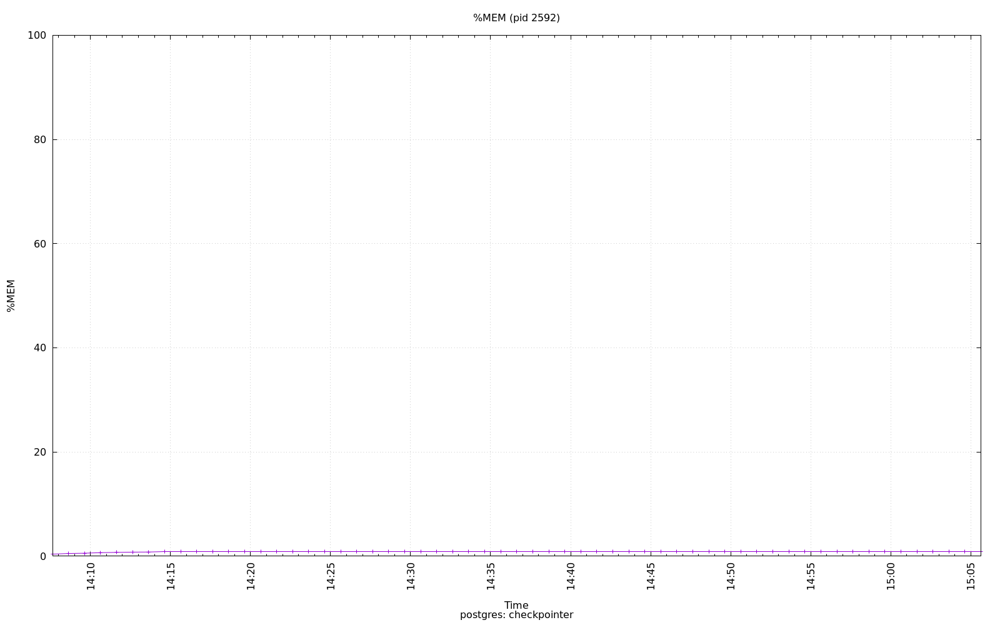

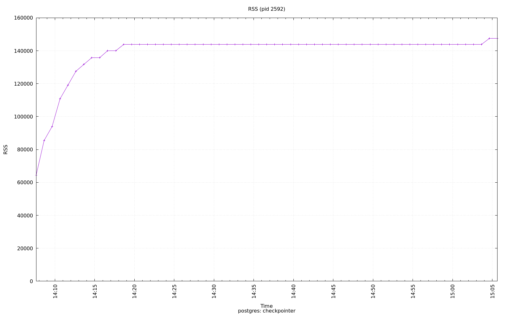

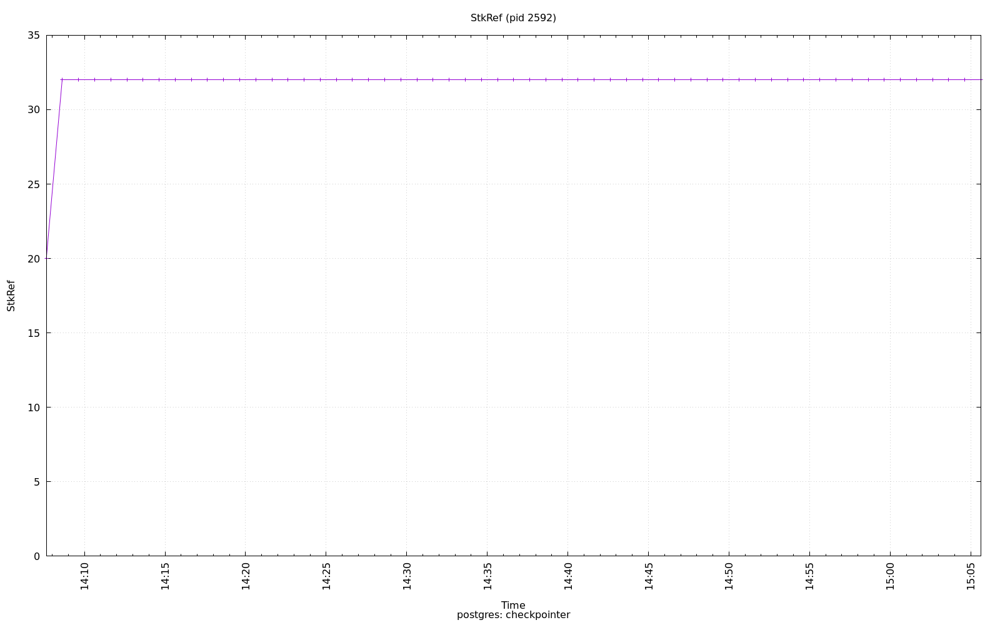

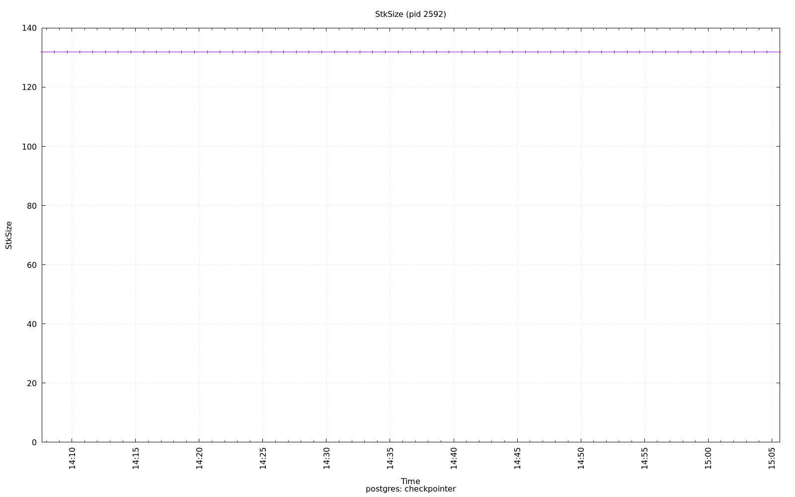

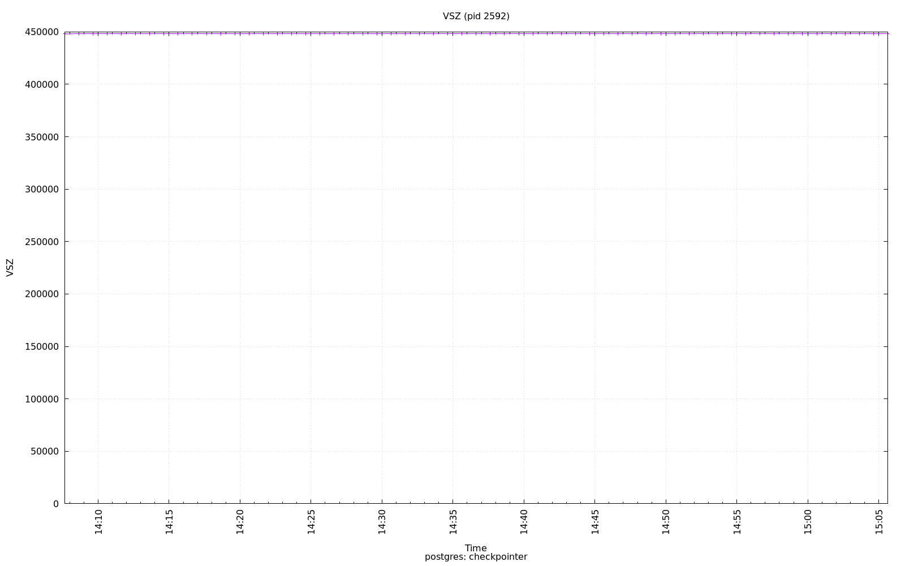

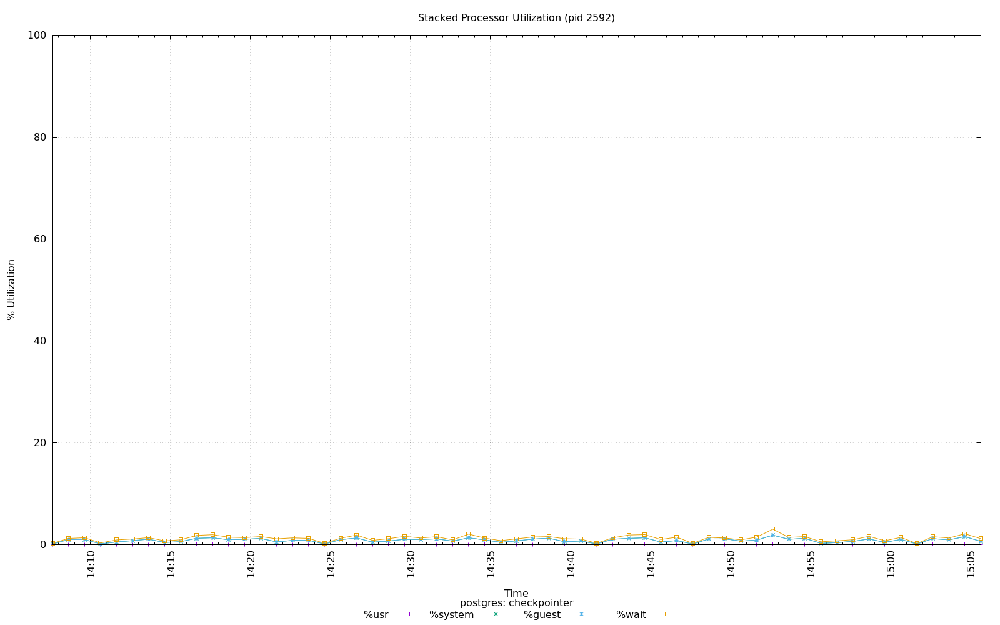

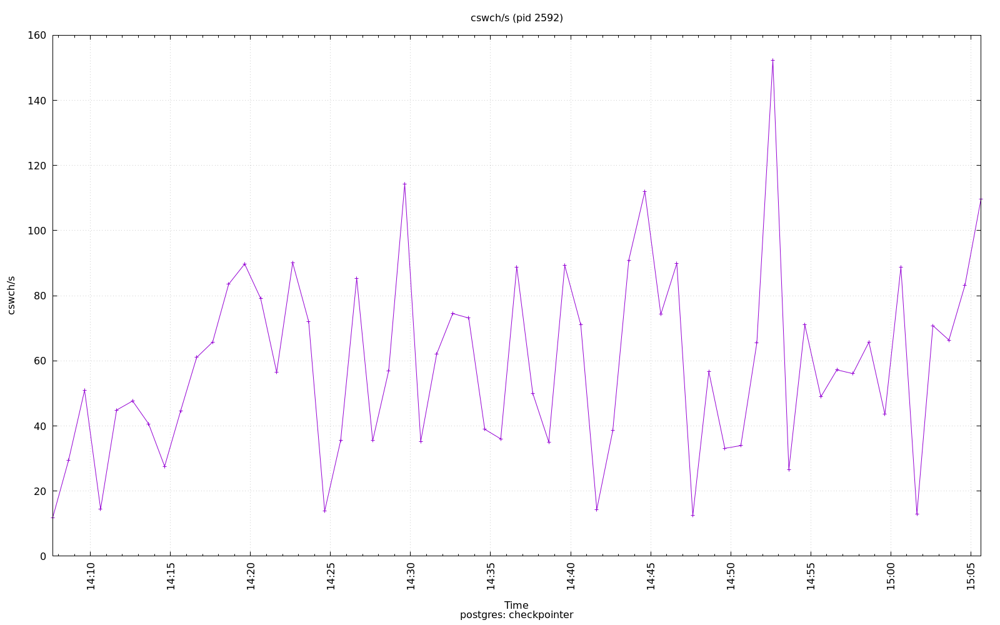

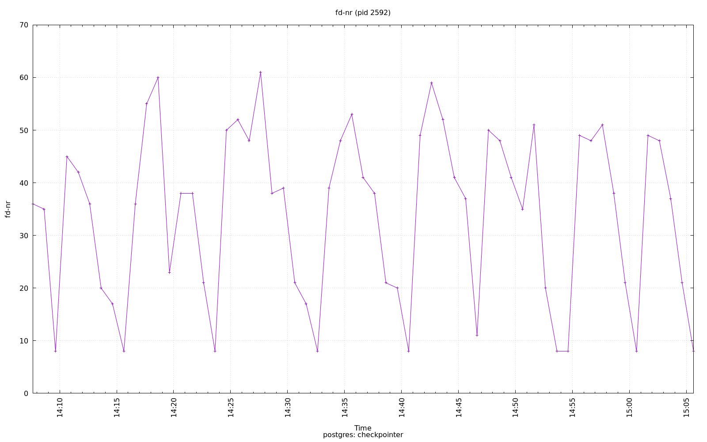

.. image:: ../pidstat/pidstat-2592-guest.png
   :target: ../pidstat/pidstat-2592-guest.png
   :width: 100%

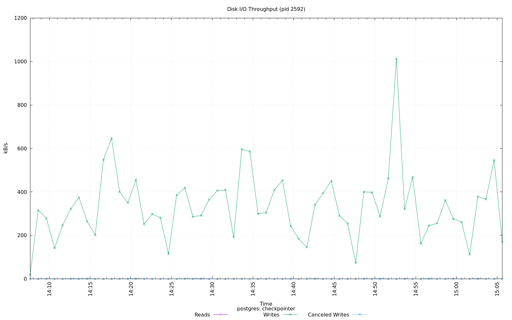

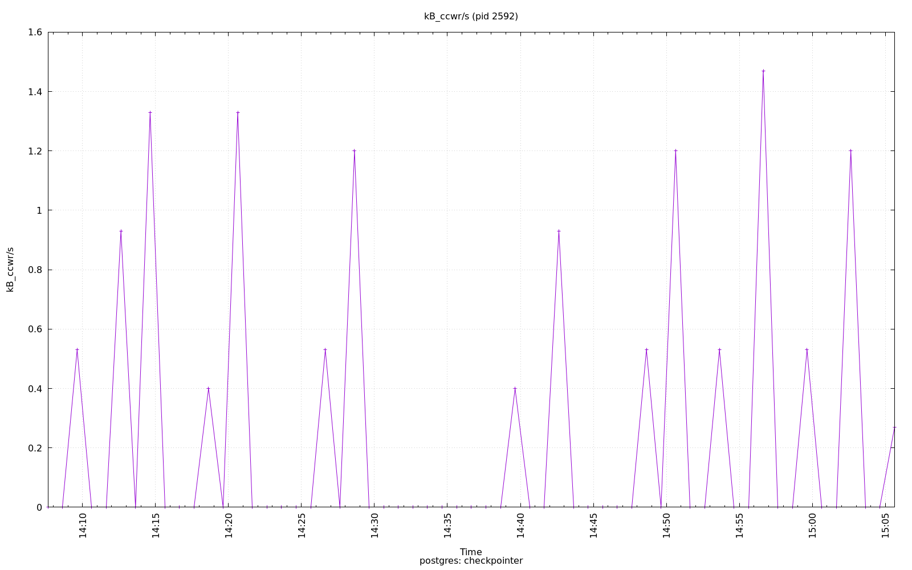

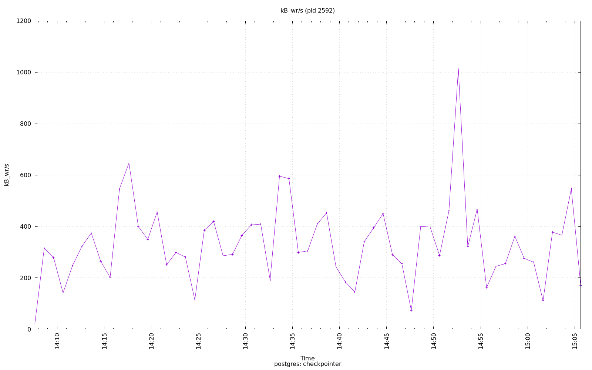

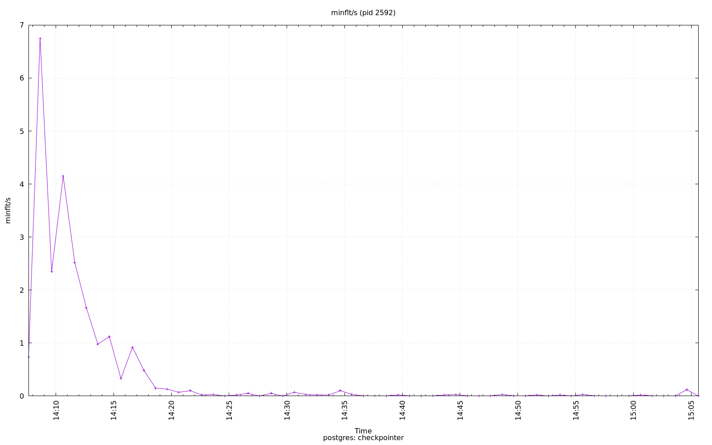

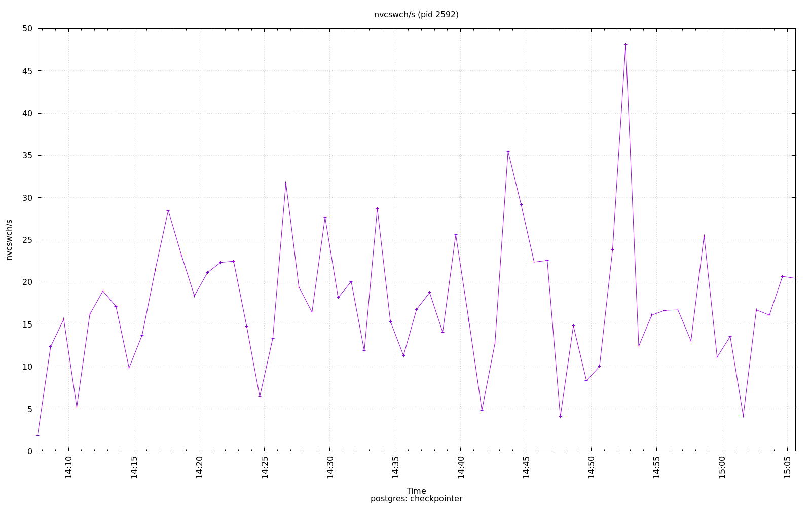

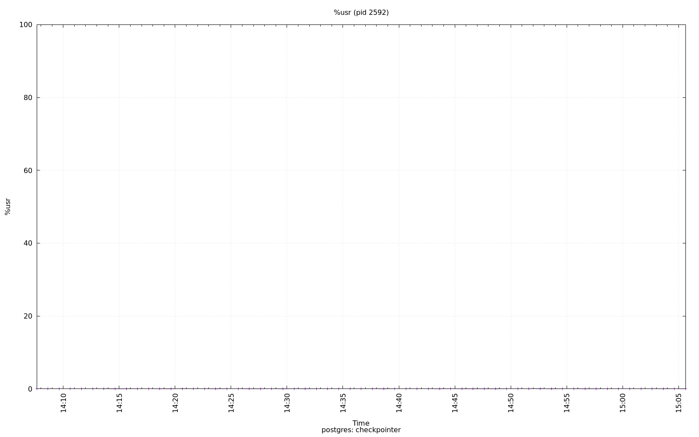

