================================================================================
Database Test 2 pidstat logical Charts
================================================================================

.. image:: ../pidstat/pidstat-2597-MEM.png
   :target: ../pidstat/pidstat-2597-MEM.png
   :width: 100%

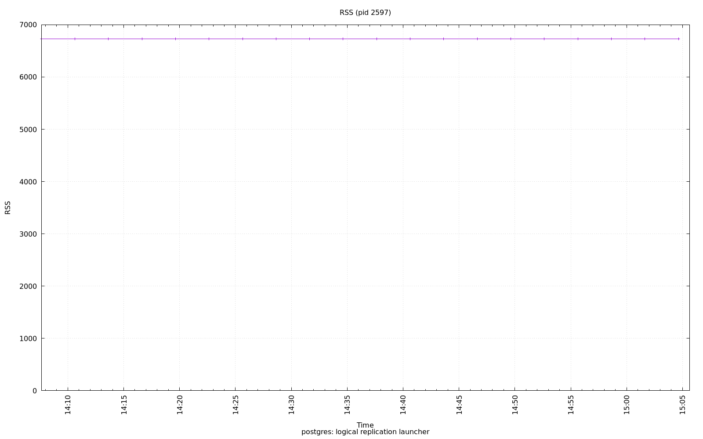

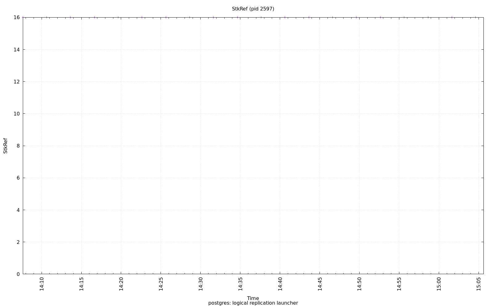

.. image:: ../pidstat/pidstat-2597-StkSize.png
   :target: ../pidstat/pidstat-2597-StkSize.png
   :width: 100%

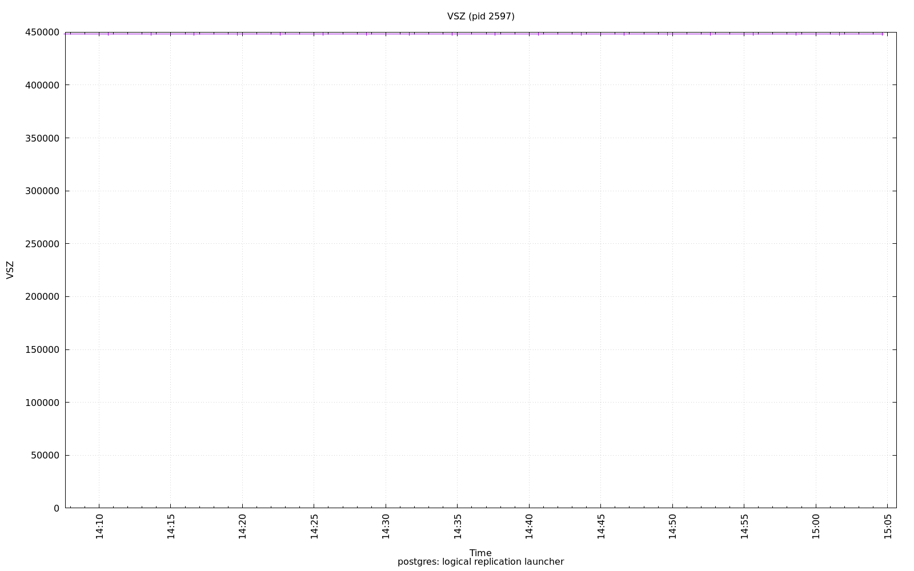

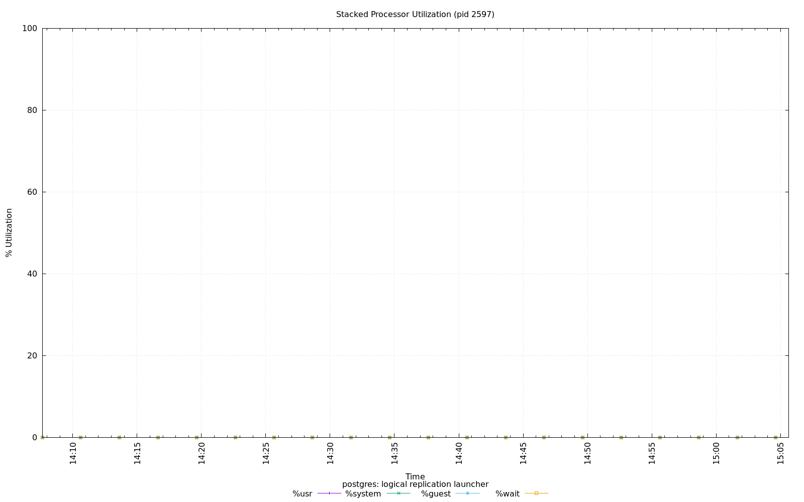

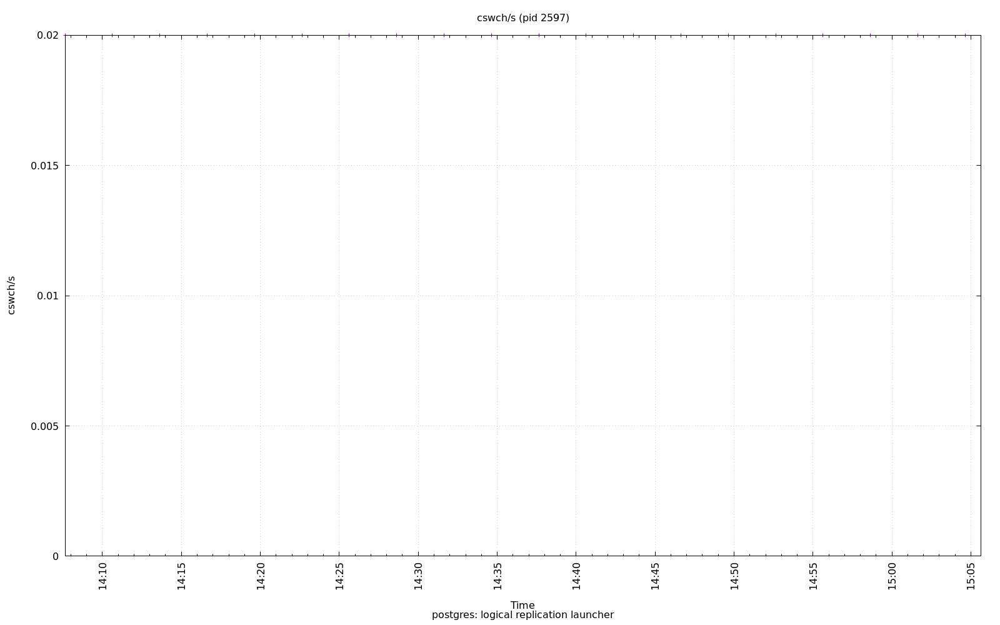

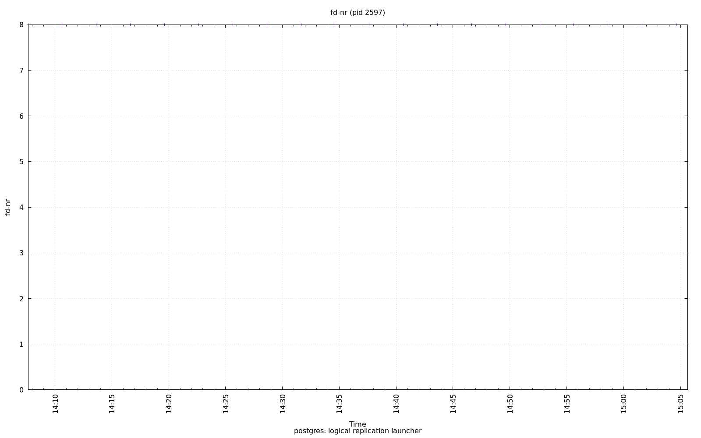

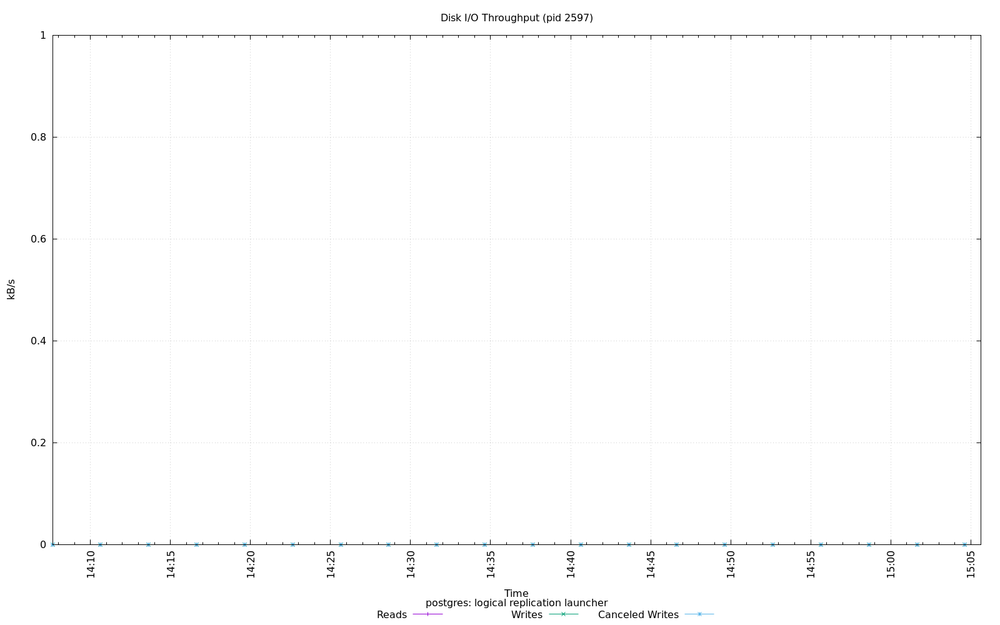

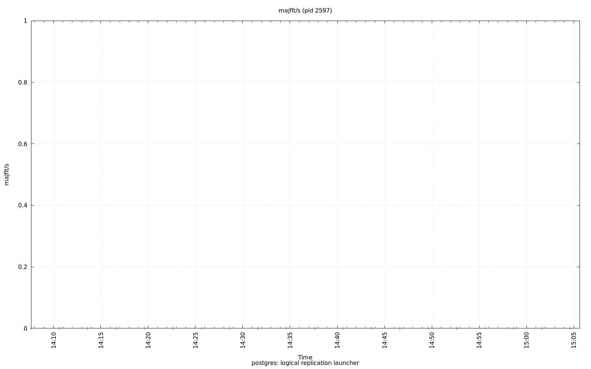

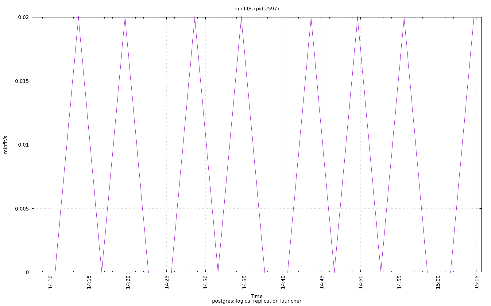

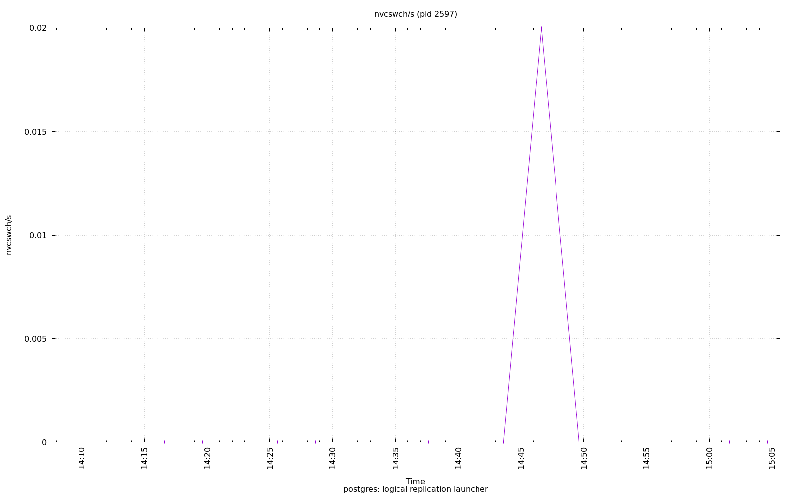

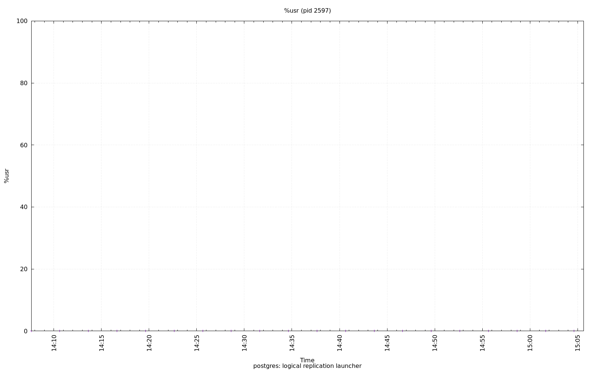

