================================================================================
Database Test 2 pidstat bgwriter Charts
================================================================================

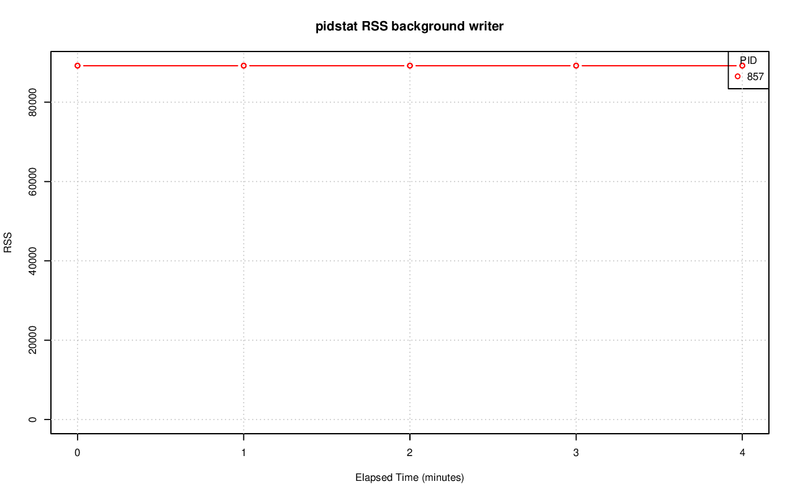

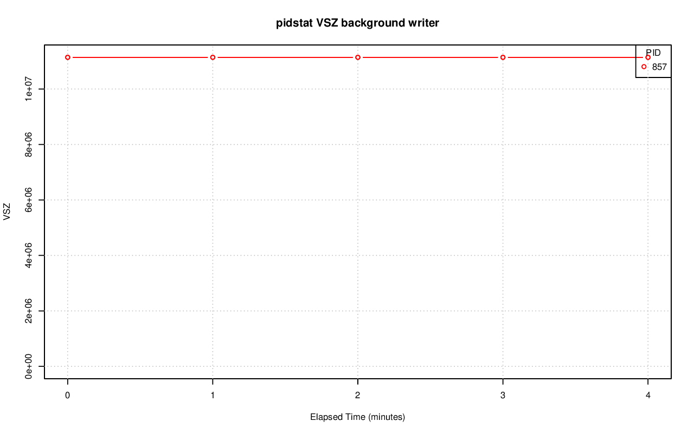

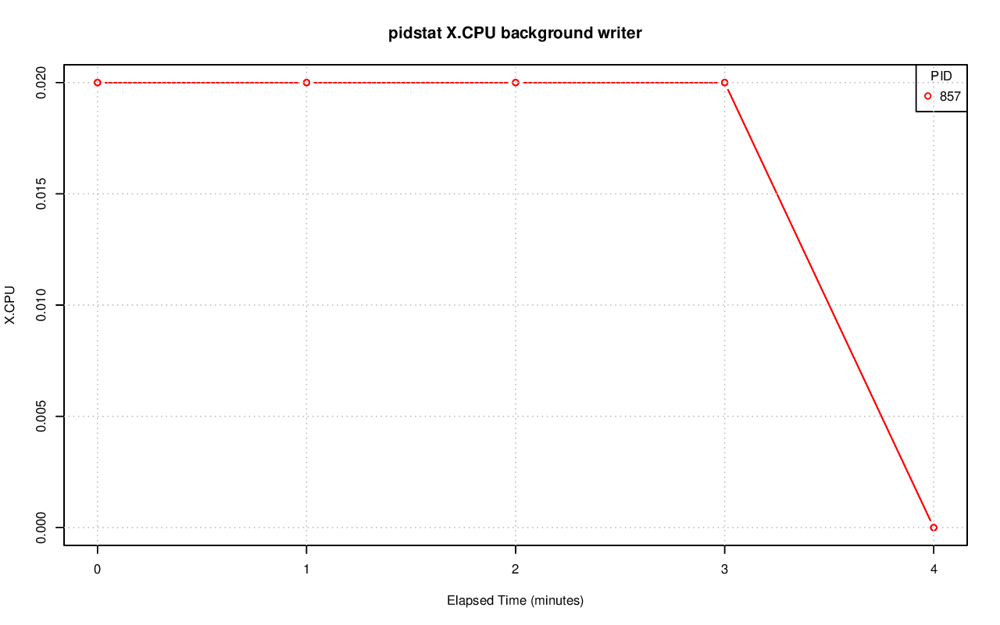

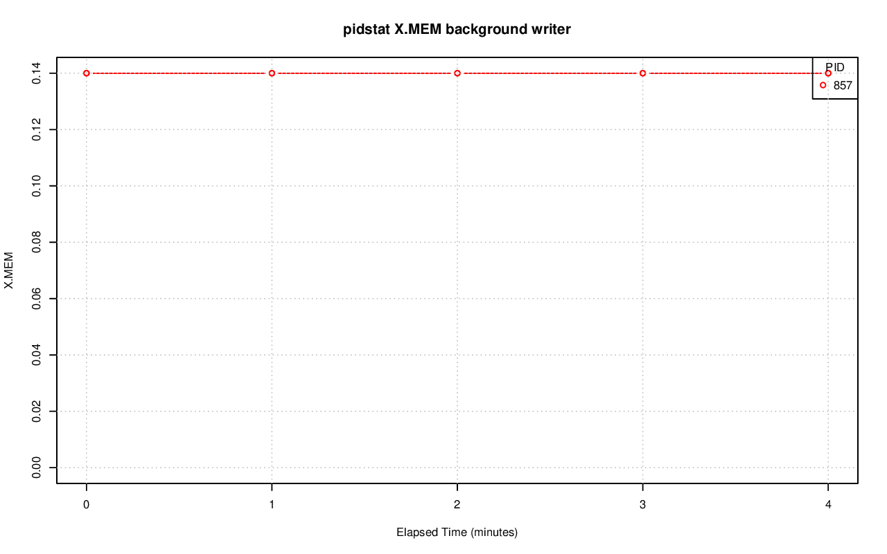

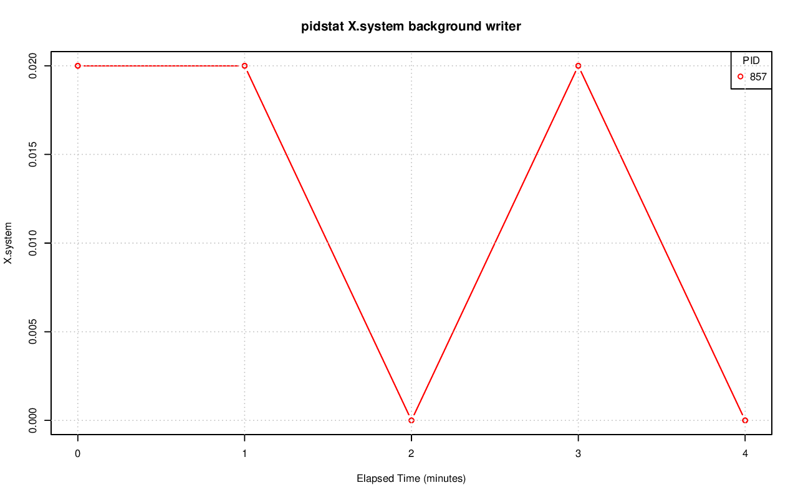

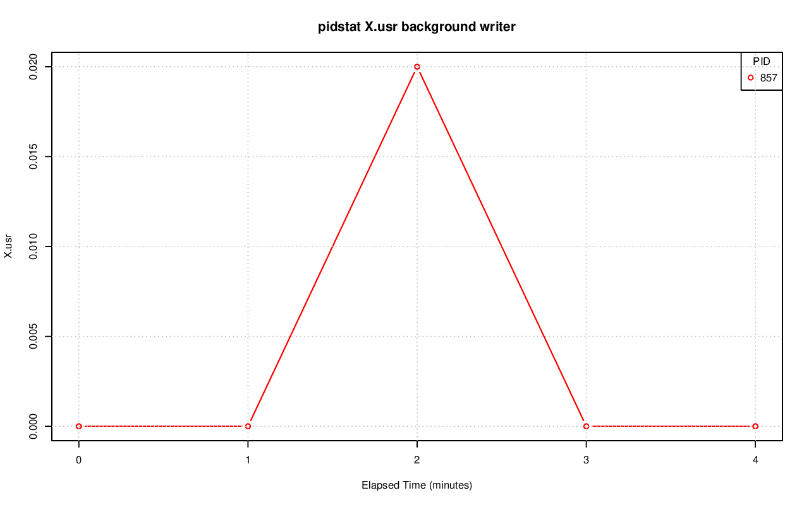

.. image:: pidstat-bgwriter-X.wait.png
   :target: pidstat-bgwriter-X.wait.png
   :width: 100%

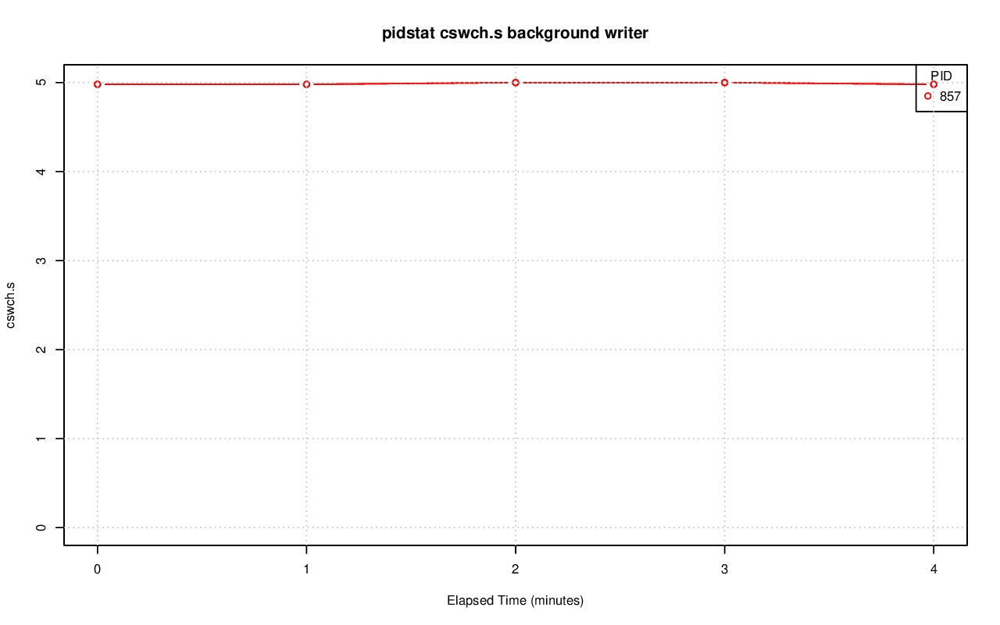

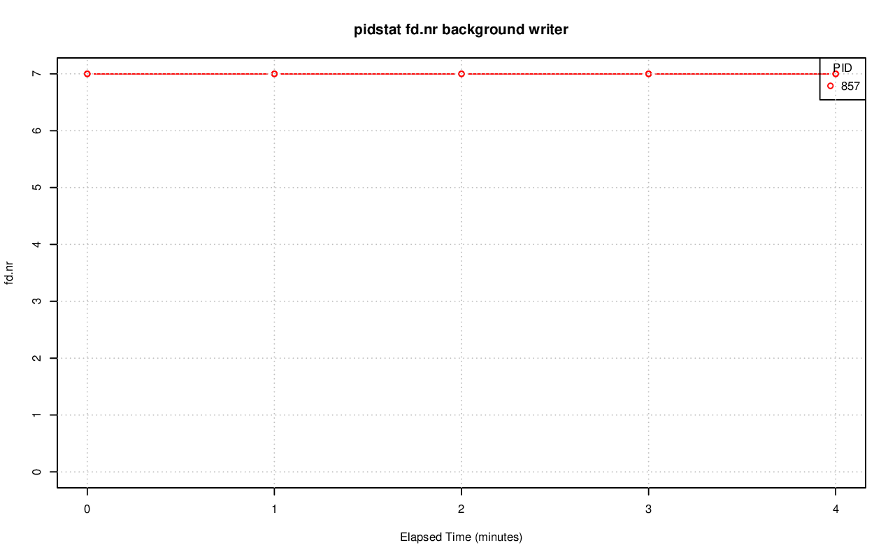

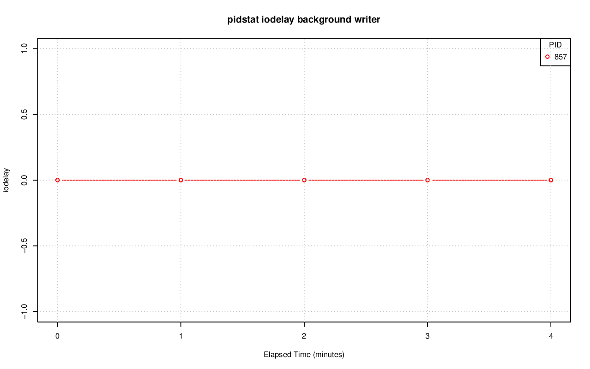

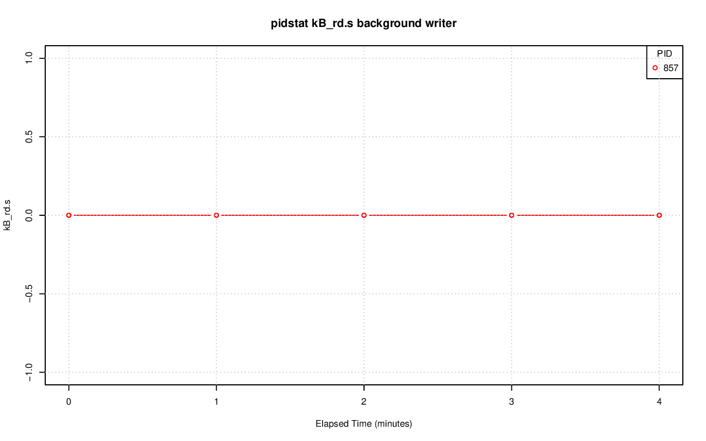

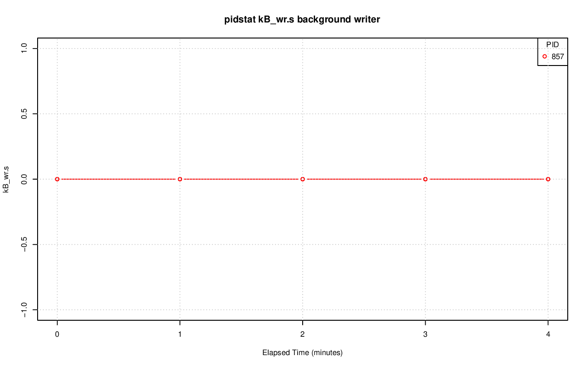

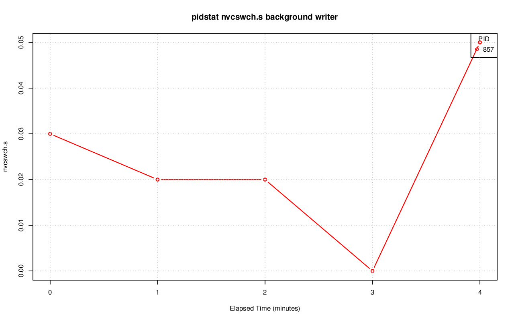

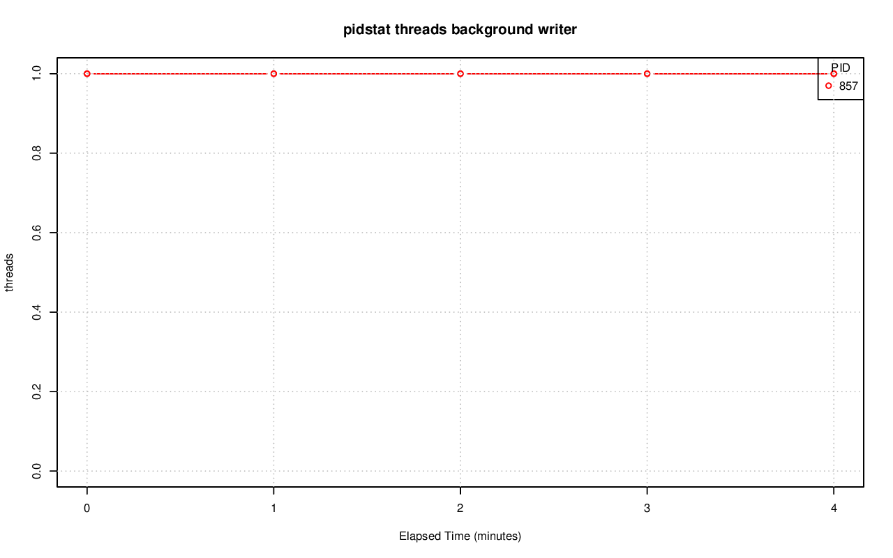
