================================================================================
Database Test 2 pidstat checkpointer Charts
================================================================================

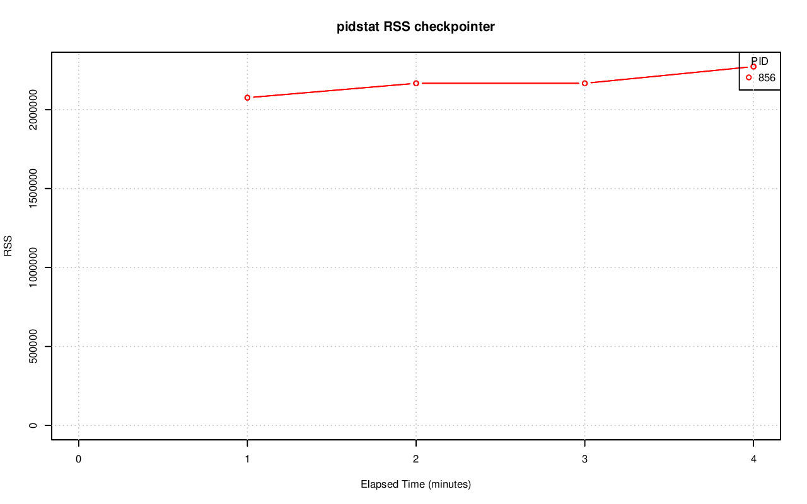

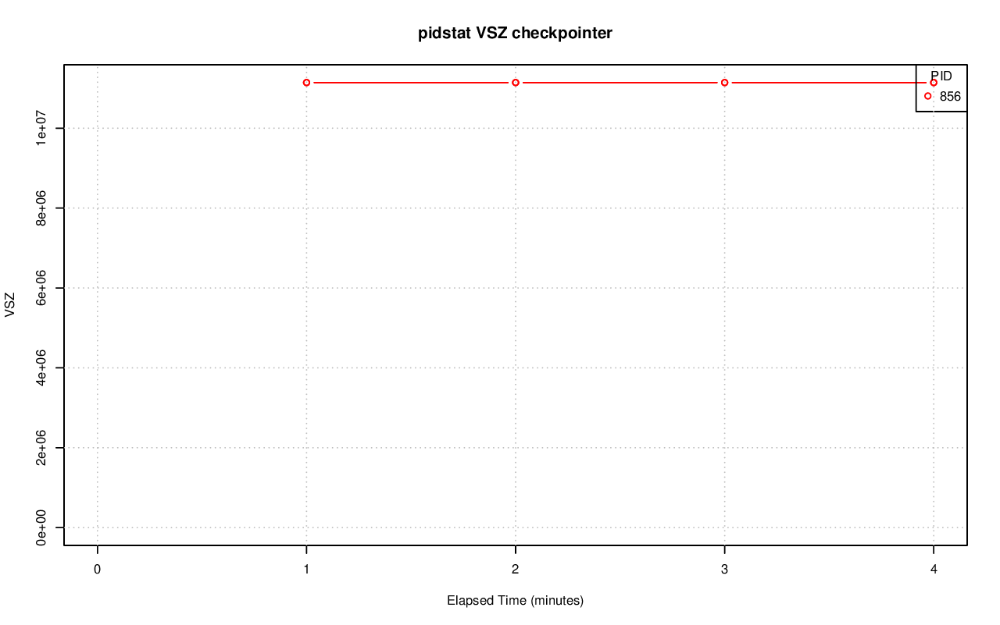

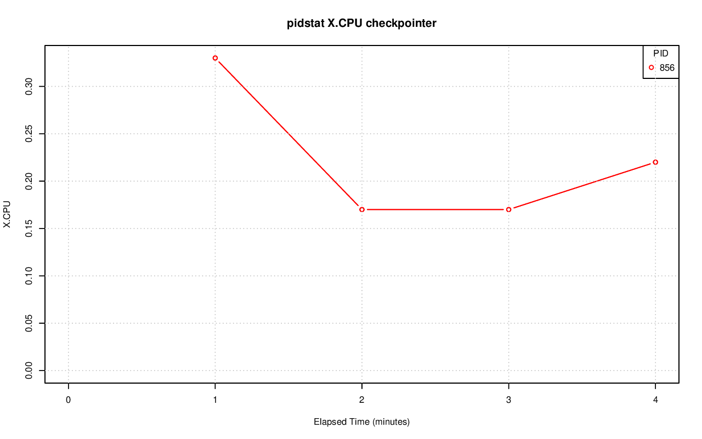

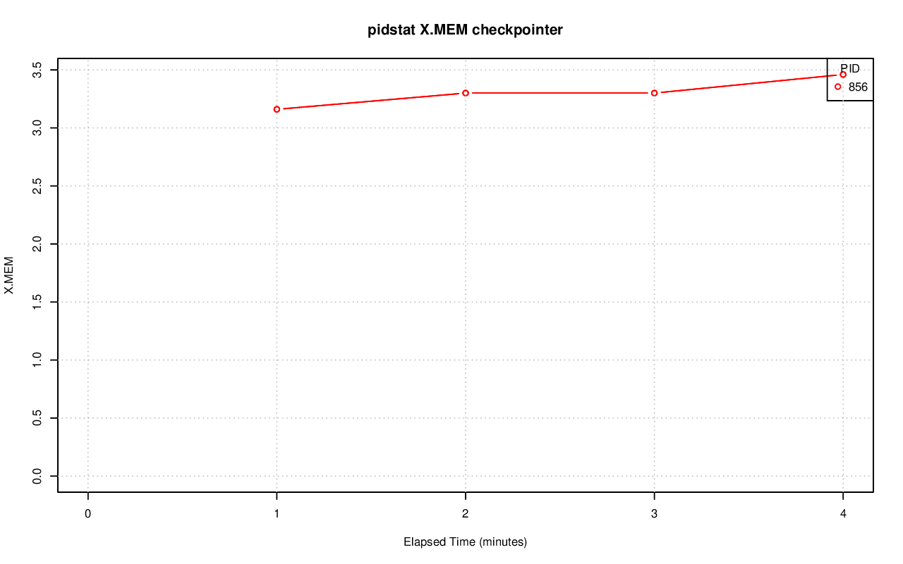

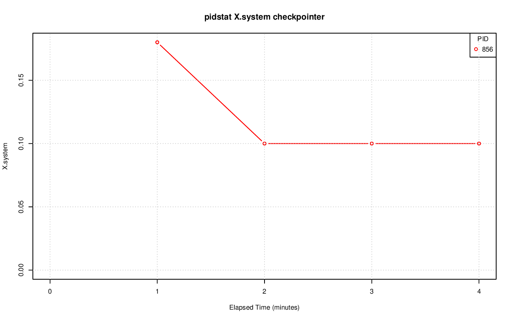

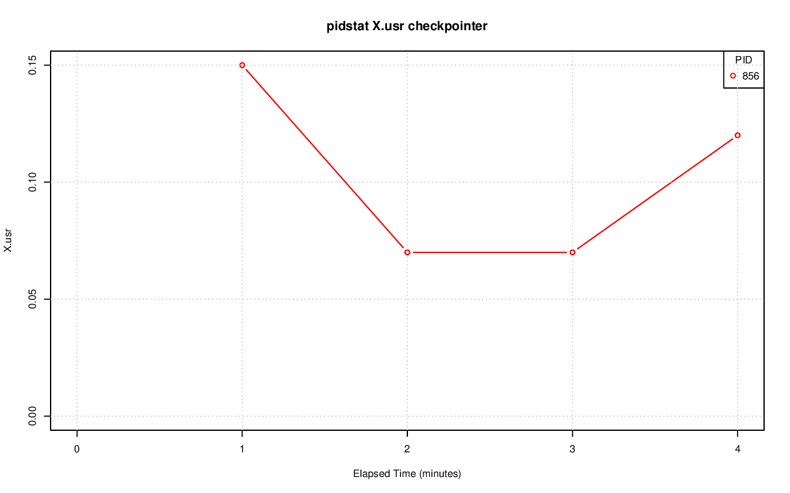

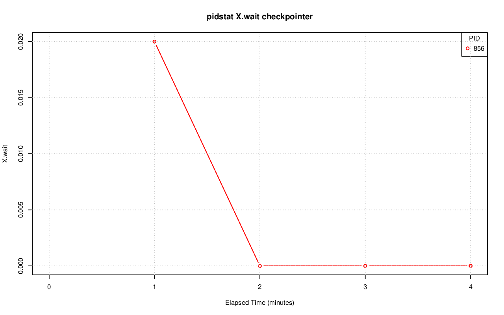

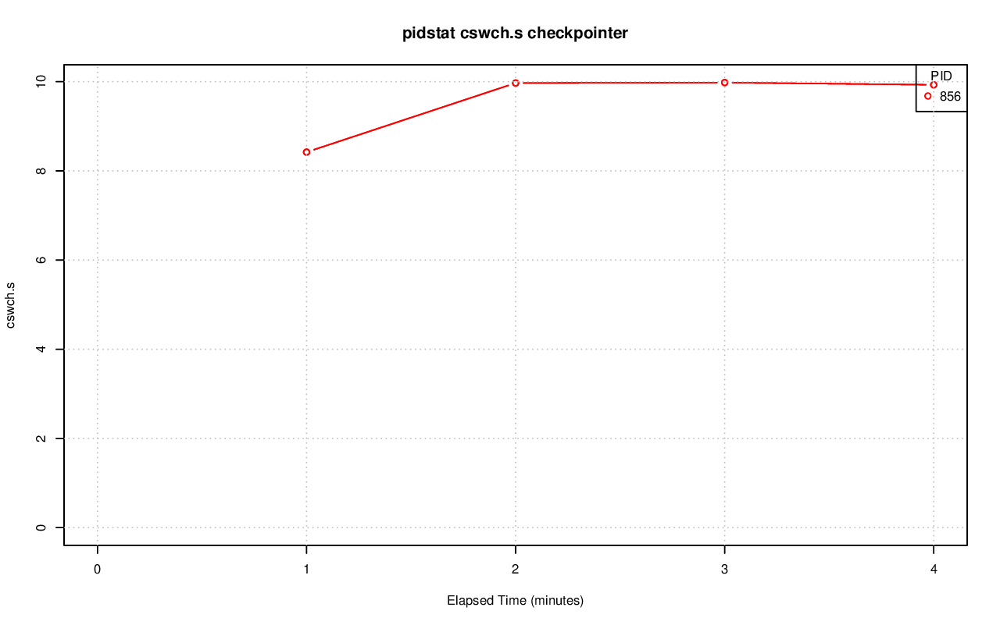

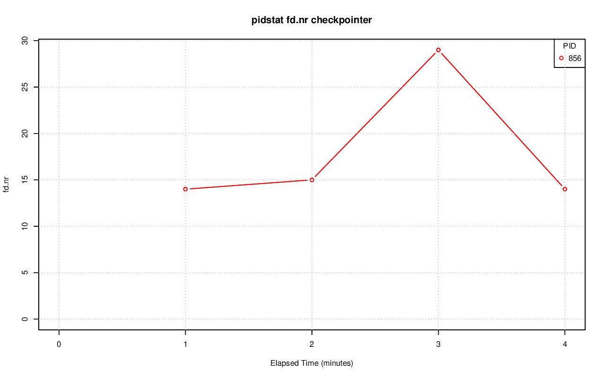

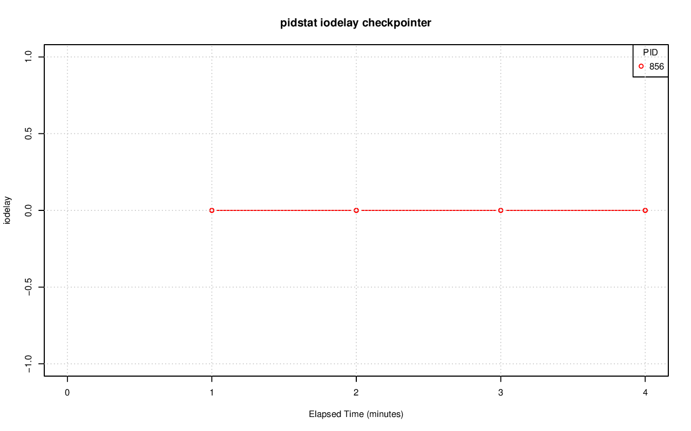

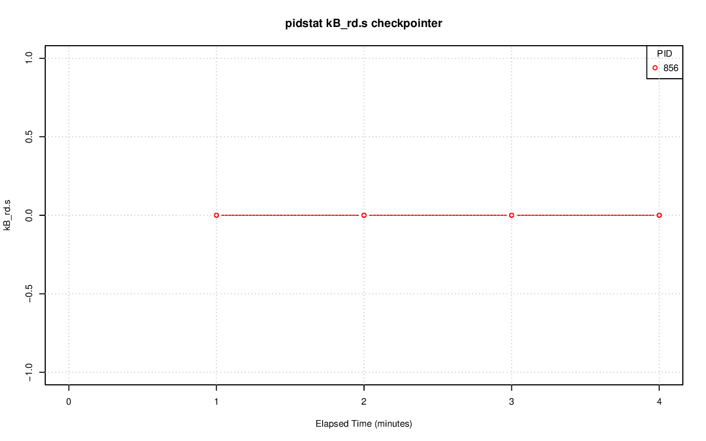

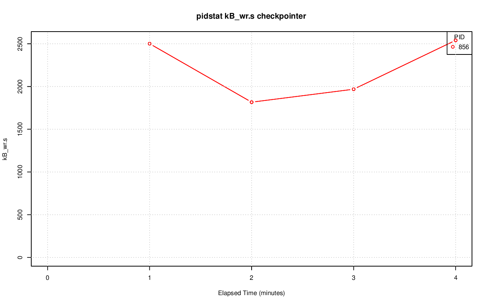

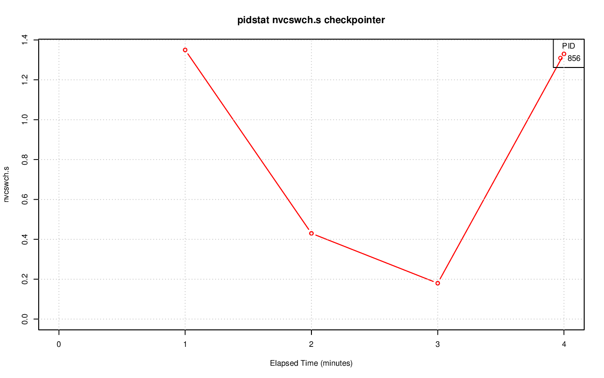

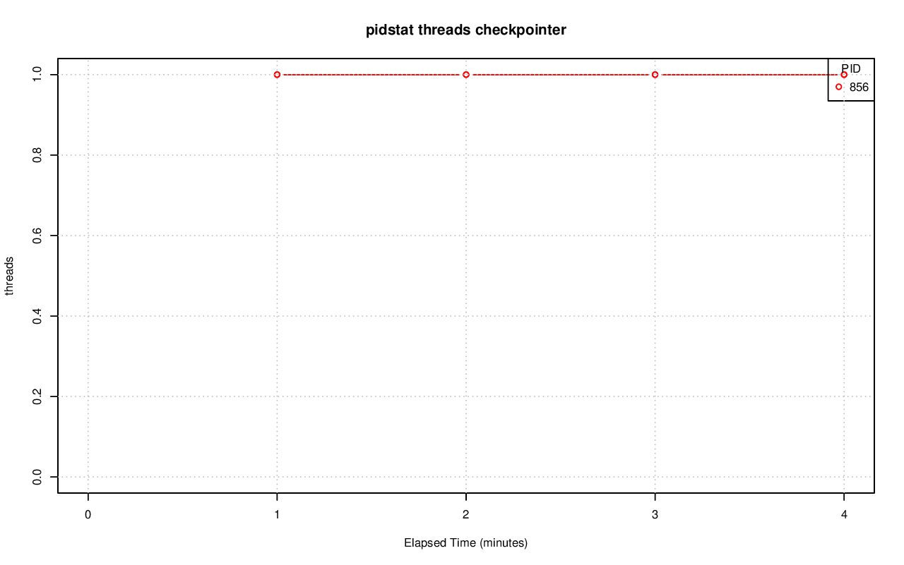
