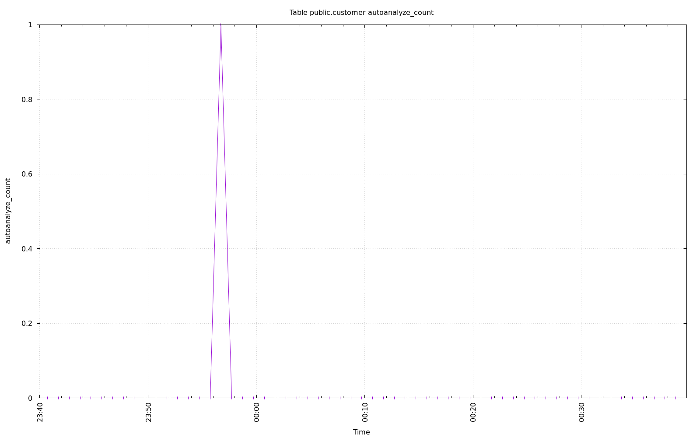
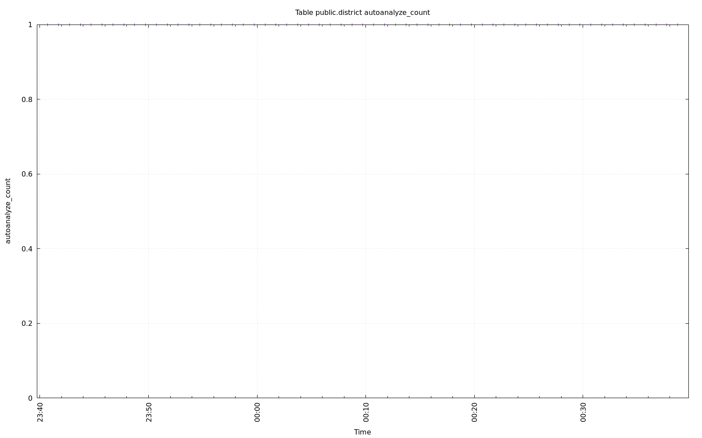
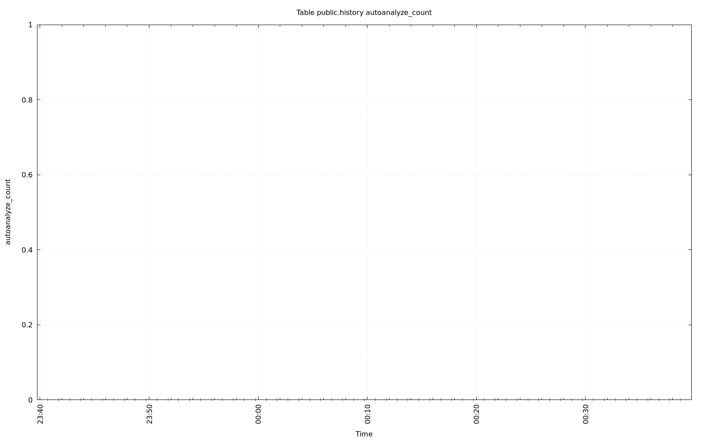
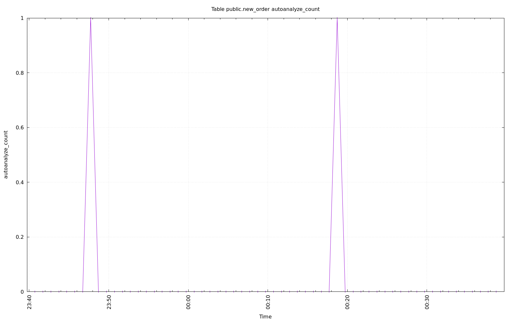
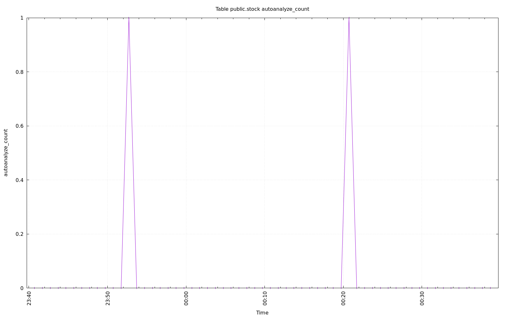

================================================================================
Database Test 2 Table autoanalyze_count Charts
================================================================================

.. image:: ../../table/pgsql-public.item-autoanalyze_count.png
   :target: ../../table/pgsql-public.item-autoanalyze_count.png
   :width: 100%

.. image:: ../../table/pgsql-public.orders-autoanalyze_count.png
   :target: ../../table/pgsql-public.orders-autoanalyze_count.png
   :width: 100%

.. image:: ../../table/pgsql-public.warehouse-autoanalyze_count.png
   :target: ../../table/pgsql-public.warehouse-autoanalyze_count.png
   :width: 100%
