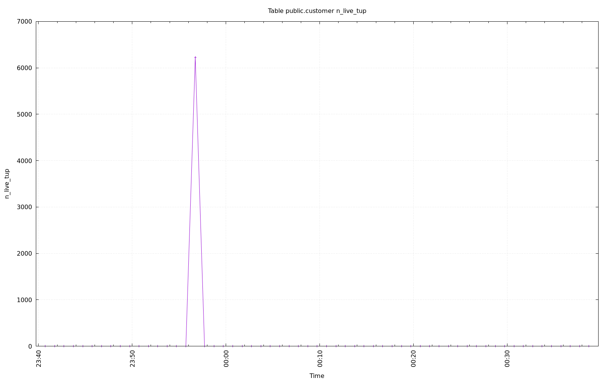
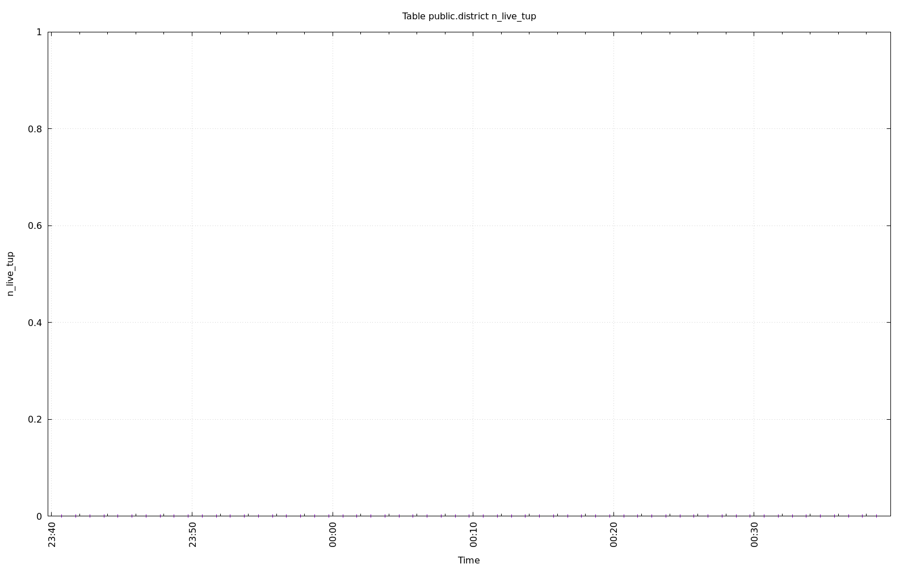
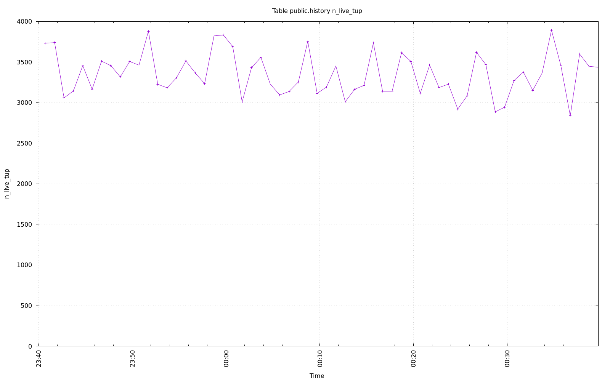
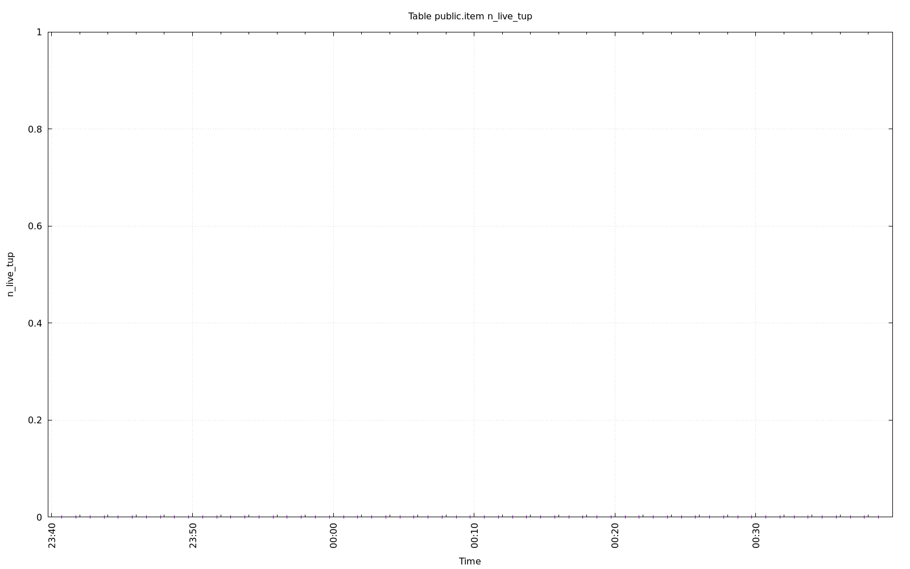
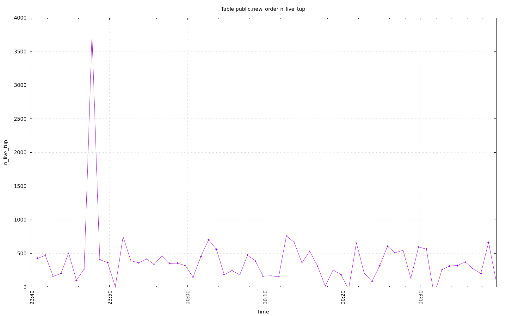
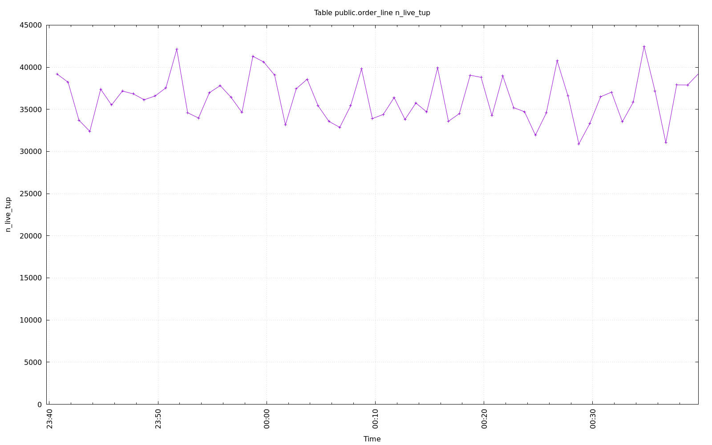
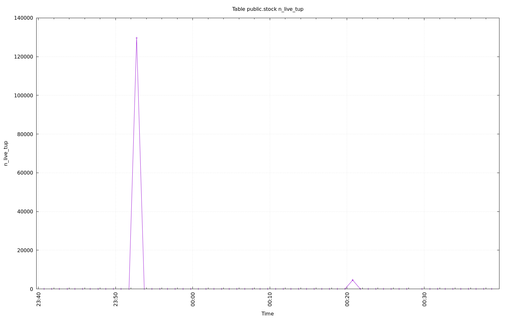
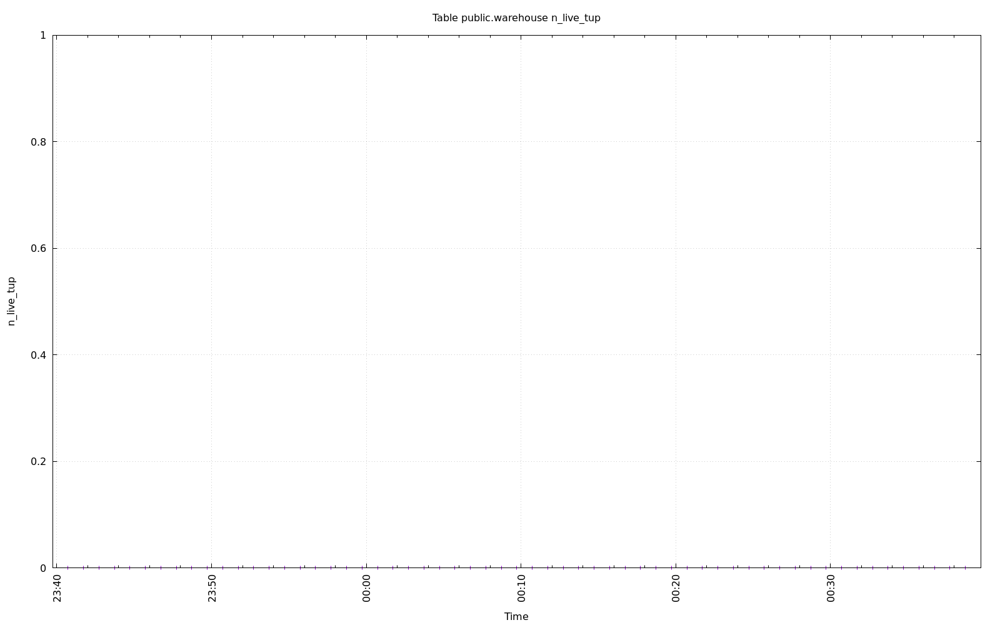

================================================================================
Database Test 2 Table n_live_tup Charts
================================================================================

.. image:: ../../table/pgsql-public.orders-n_live_tup.png
   :target: ../../table/pgsql-public.orders-n_live_tup.png
   :width: 100%

