================================================================================
Database Test 2 public.customer Table Charts
================================================================================

.. image:: ../pgsql-public.customer-autoanalyze_count.png
   :target: ../pgsql-public.customer-autoanalyze_count.png
   :width: 100%

.. image:: ../pgsql-public.customer-analyze_count.png
   :target: ../pgsql-public.customer-analyze_count.png
   :width: 100%

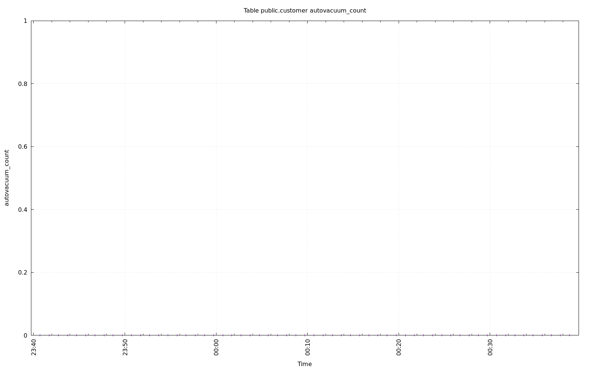

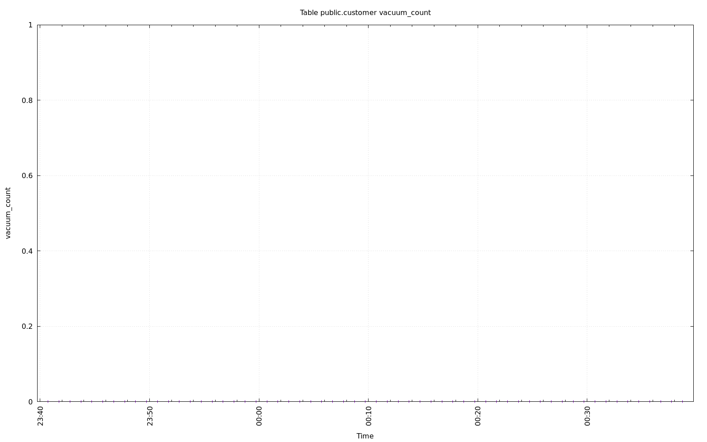

.. image:: ../pgsql-public.customer-n_ins_since_vacuum.png
   :target: ../pgsql-public.customer-n_ins_since_vacuum.png
   :width: 100%

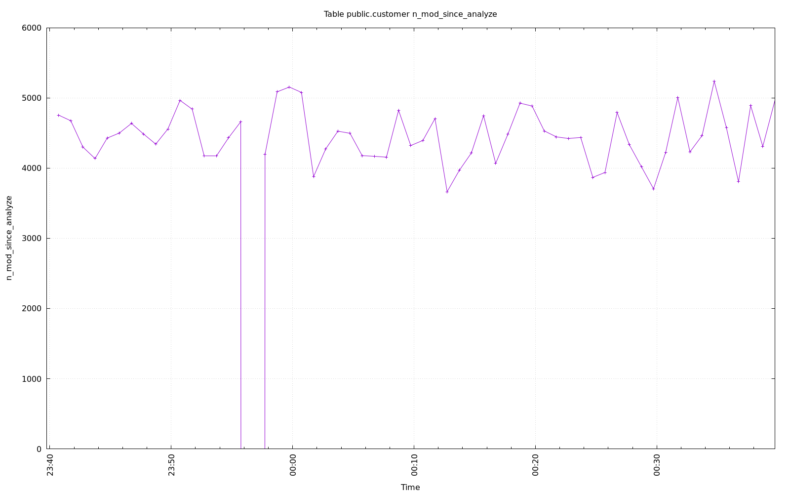

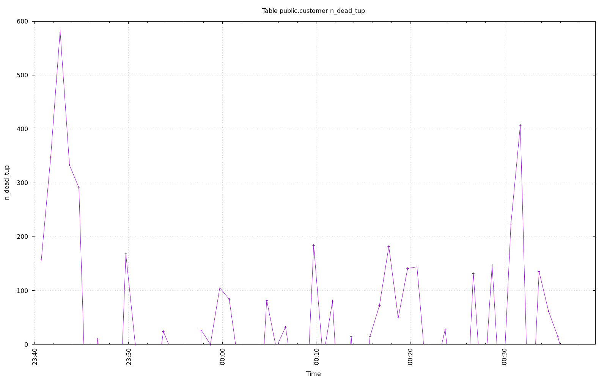

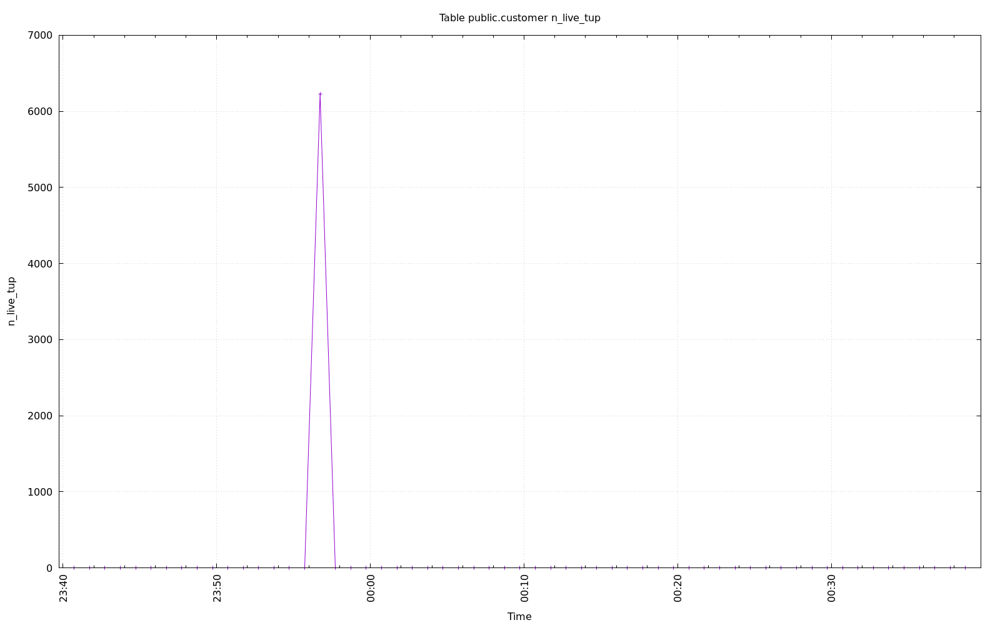

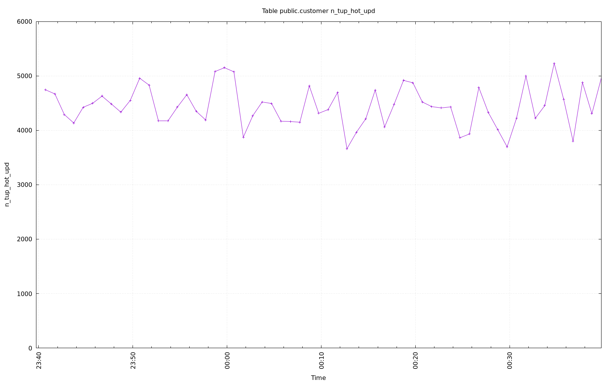

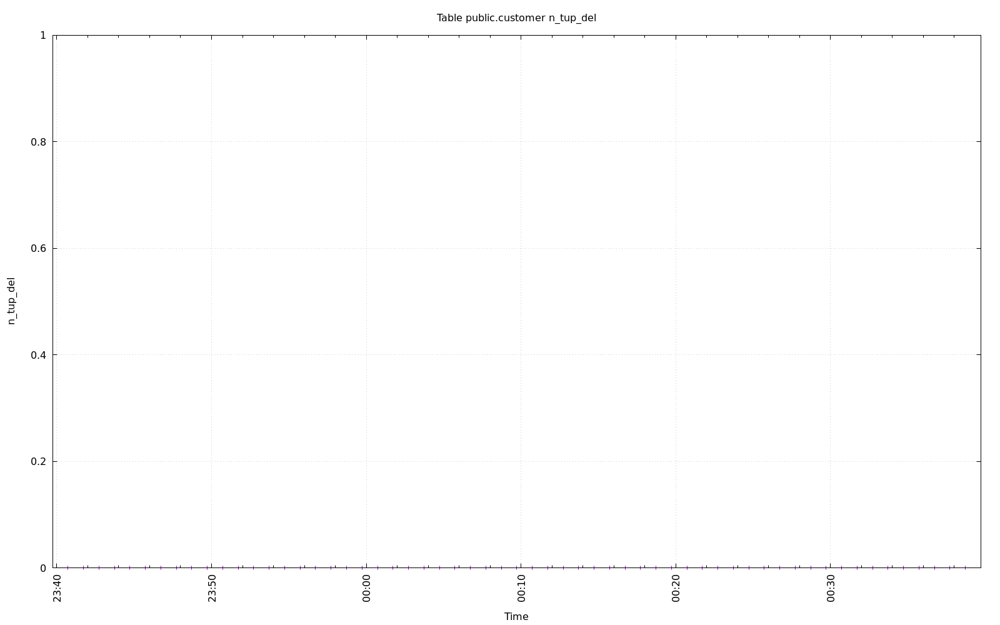

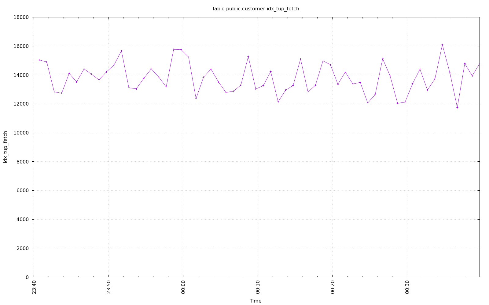

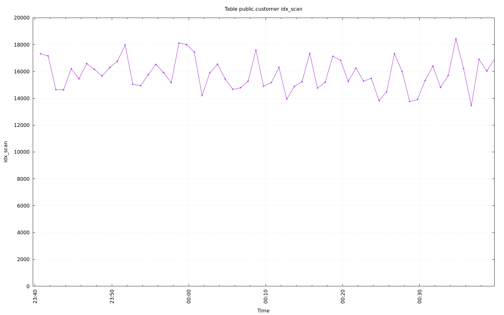

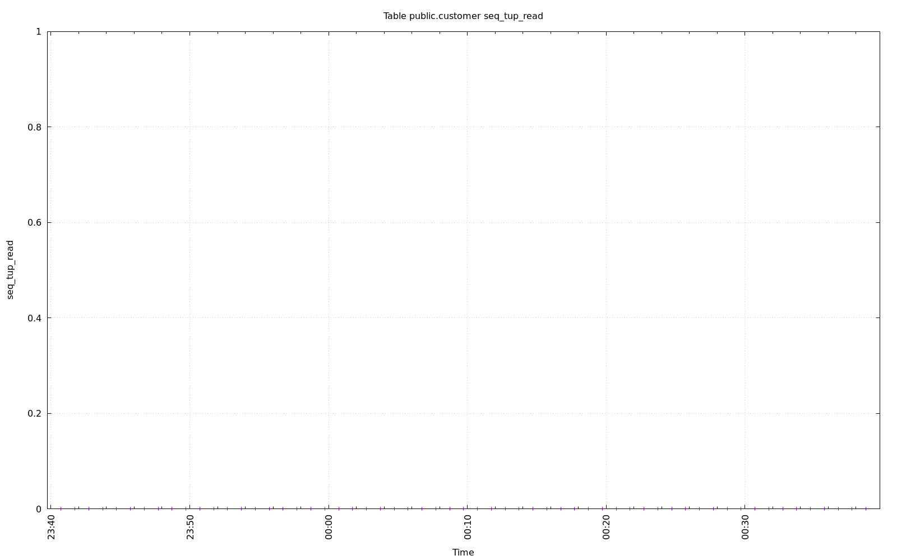

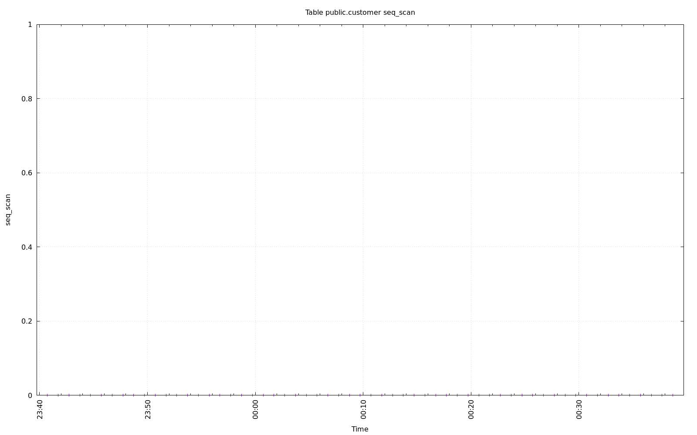

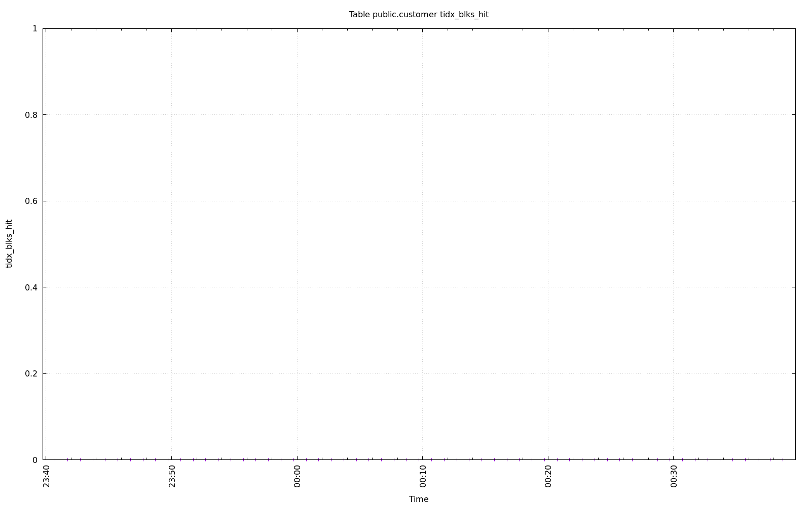

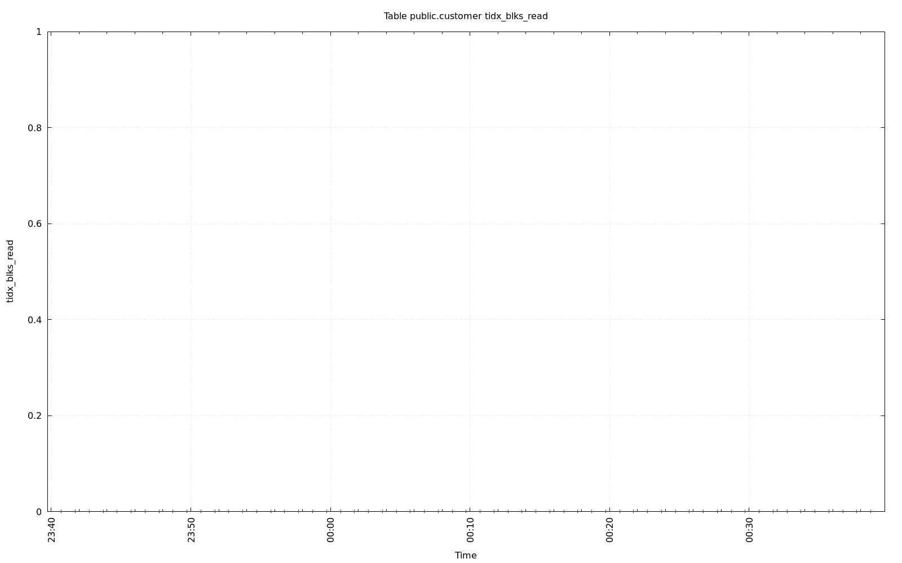

.. image:: ../pgsql-public.customer-toast_blks_read.png
   :target: ../pgsql-public.customer-toast_blks_read.png
   :width: 100%

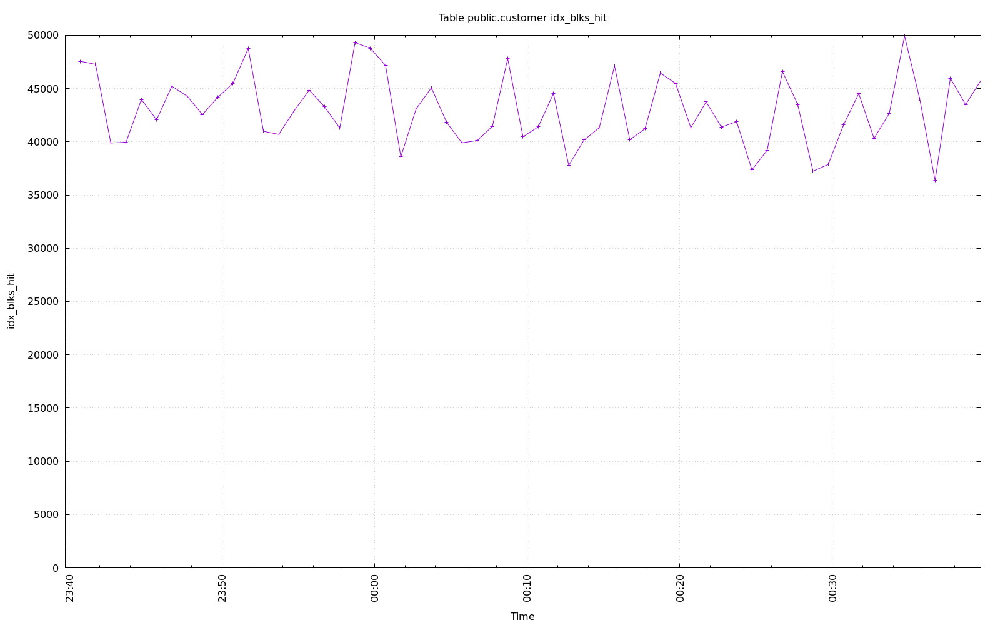

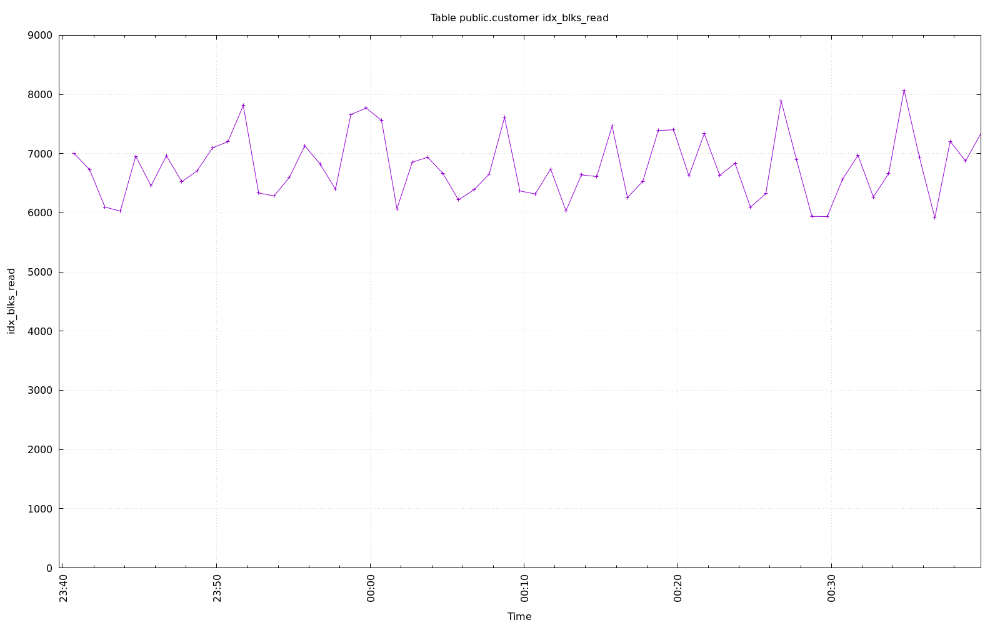

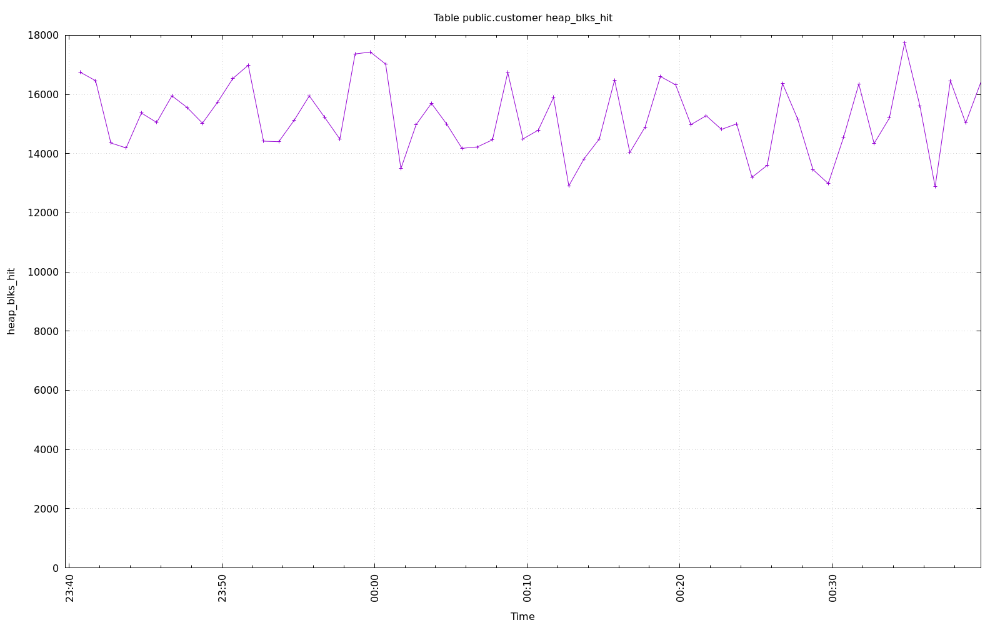

.. image:: ../pgsql-public.customer-heap_blks_read.png
   :target: ../pgsql-public.customer-heap_blks_read.png
   :width: 100%
