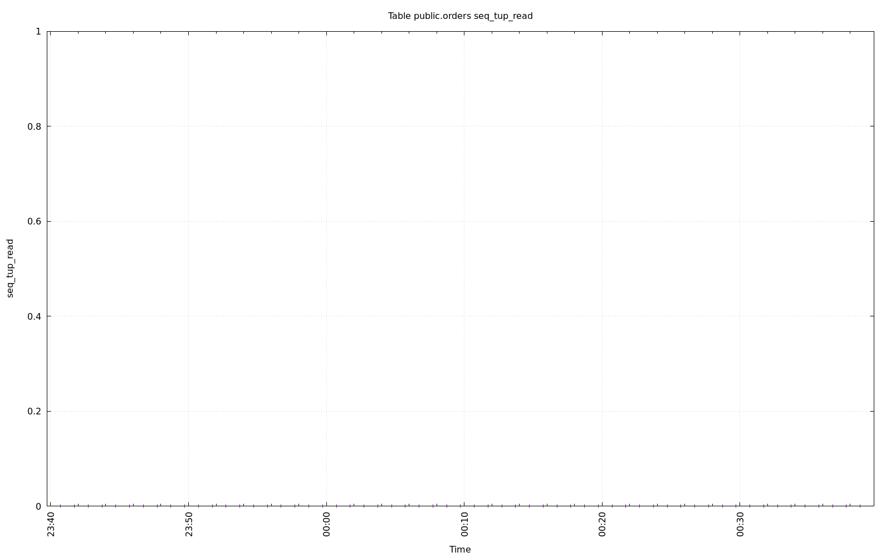
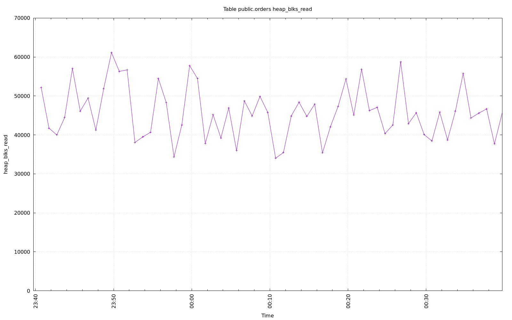

================================================================================
Database Test 2 public.orders Table Charts
================================================================================

.. image:: ../pgsql-public.orders-analyze_count.png
   :target: ../pgsql-public.orders-analyze_count.png
   :width: 100%

.. image:: ../pgsql-public.orders-tidx_blks_hit.png
   :target: ../pgsql-public.orders-tidx_blks_hit.png
   :width: 100%

.. image:: ../pgsql-public.orders-tidx_blks_read.png
   :target: ../pgsql-public.orders-tidx_blks_read.png
   :width: 100%

.. image:: ../pgsql-public.orders-toast_blks_hit.png
   :target: ../pgsql-public.orders-toast_blks_hit.png
   :width: 100%

.. image:: ../pgsql-public.orders-toast_blks_read.png
   :target: ../pgsql-public.orders-toast_blks_read.png
   :width: 100%

