================================================================================
Database Test 2 public.stock Table Charts
================================================================================

.. image:: ../pgsql-public.stock-autoanalyze_count.png
   :target: ../pgsql-public.stock-autoanalyze_count.png
   :width: 100%

.. image:: ../pgsql-public.stock-analyze_count.png
   :target: ../pgsql-public.stock-analyze_count.png
   :width: 100%

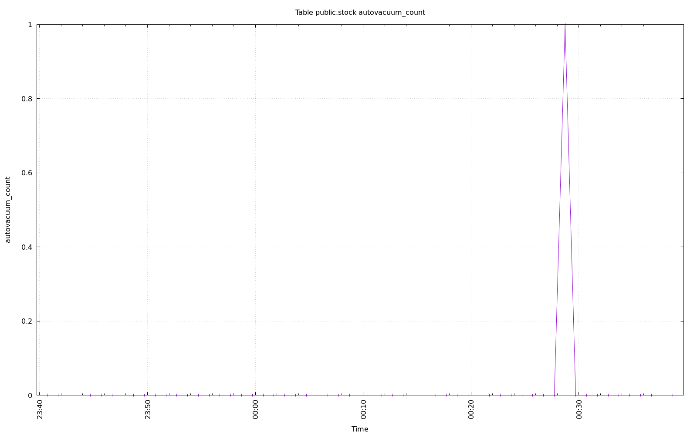

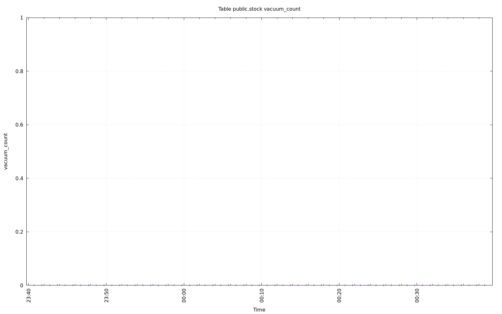

.. image:: ../pgsql-public.stock-n_ins_since_vacuum.png
   :target: ../pgsql-public.stock-n_ins_since_vacuum.png
   :width: 100%

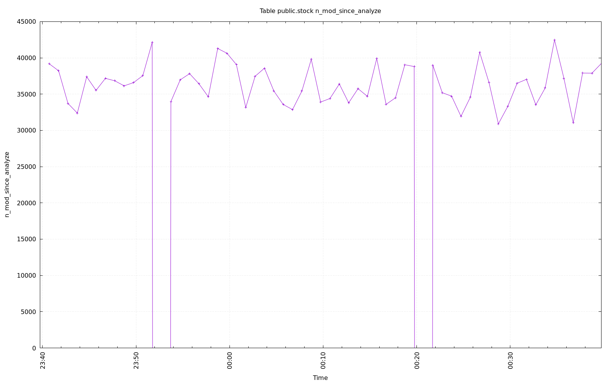

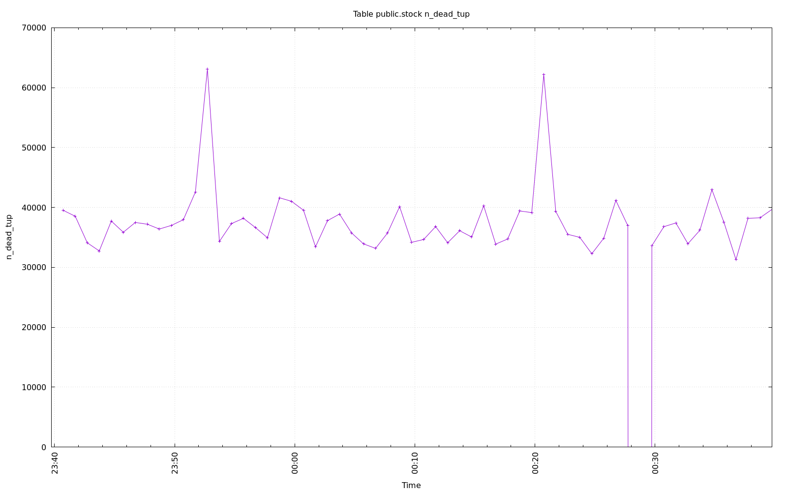

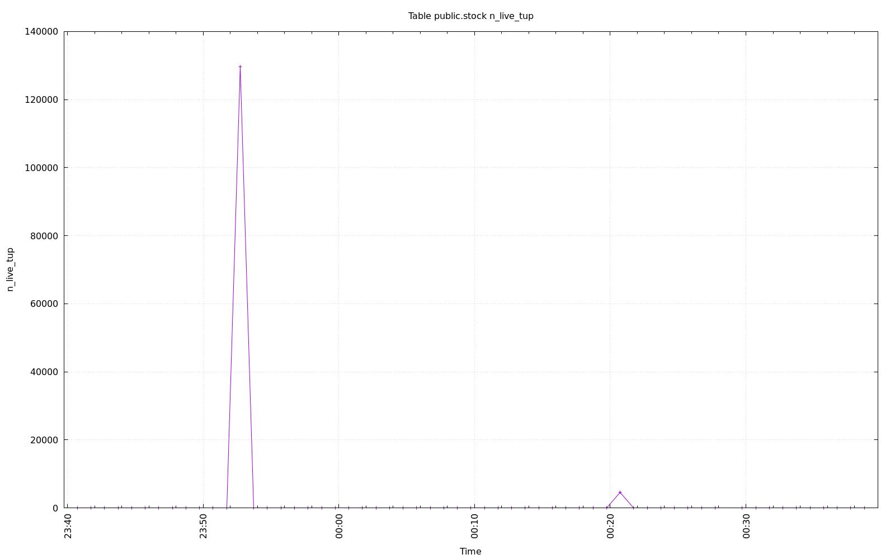

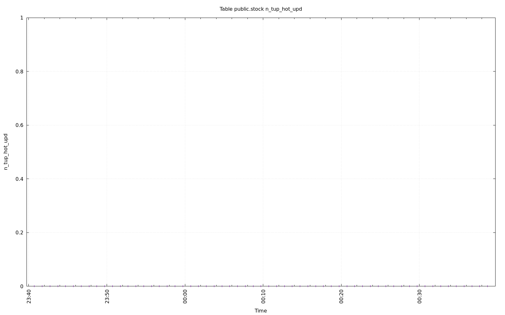

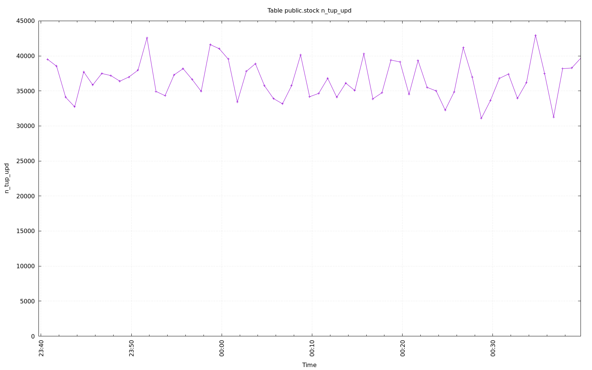

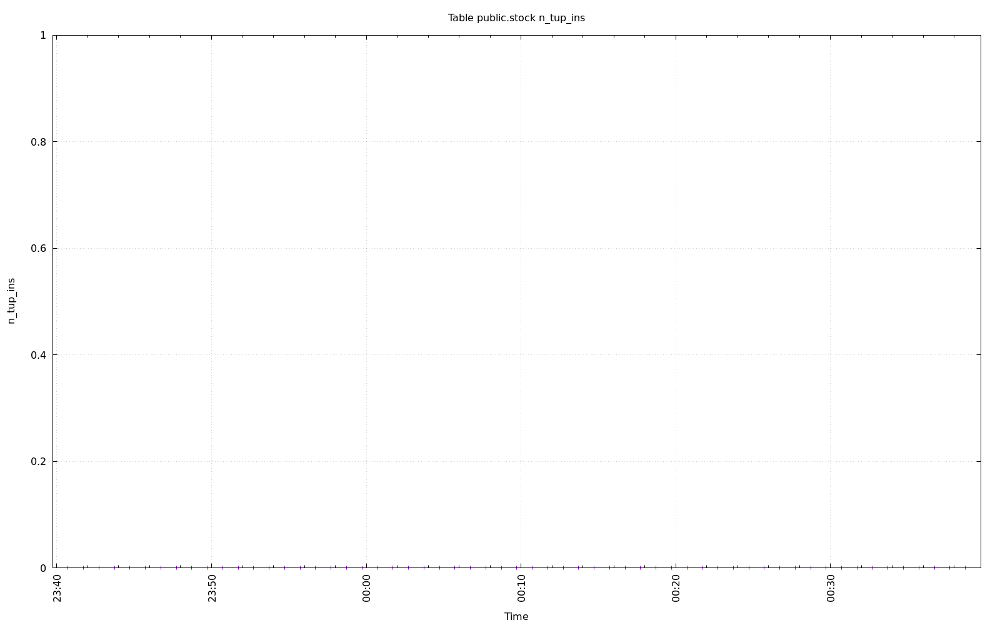

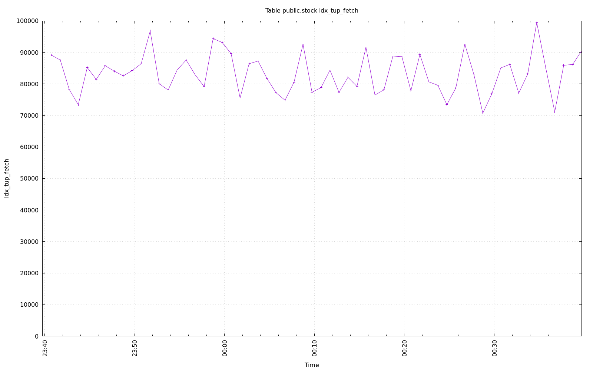

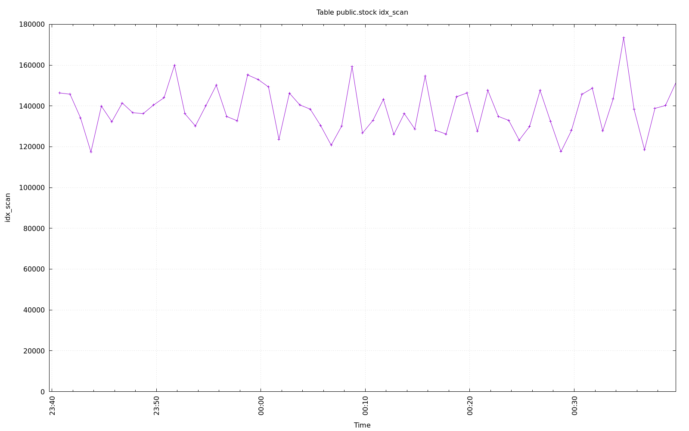

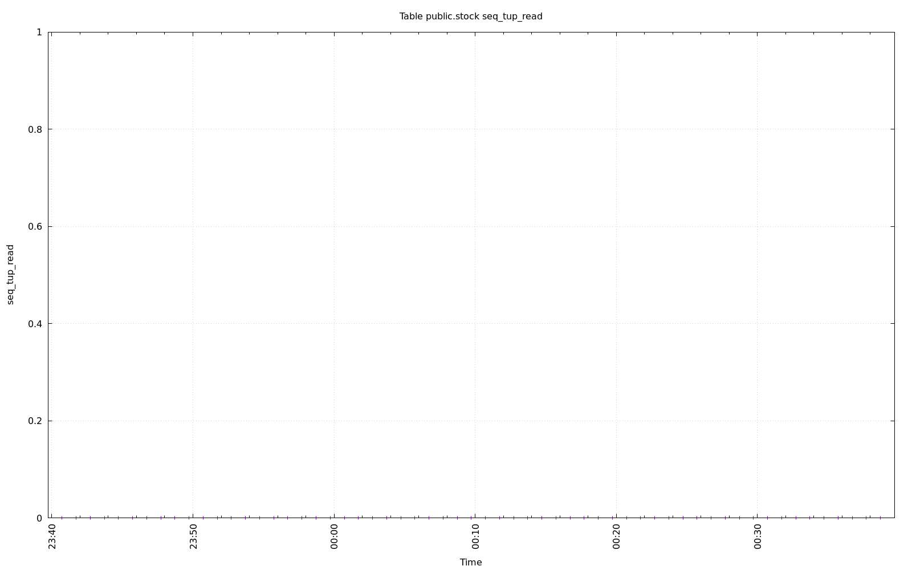

.. image:: ../pgsql-public.stock-tidx_blks_hit.png
   :target: ../pgsql-public.stock-tidx_blks_hit.png
   :width: 100%

.. image:: ../pgsql-public.stock-tidx_blks_read.png
   :target: ../pgsql-public.stock-tidx_blks_read.png
   :width: 100%

.. image:: ../pgsql-public.stock-toast_blks_hit.png
   :target: ../pgsql-public.stock-toast_blks_hit.png
   :width: 100%

.. image:: ../pgsql-public.stock-toast_blks_read.png
   :target: ../pgsql-public.stock-toast_blks_read.png
   :width: 100%

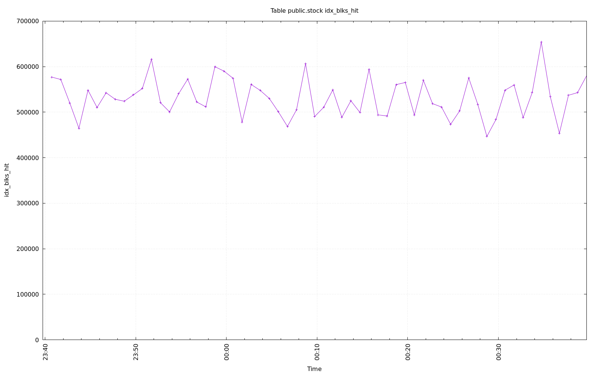

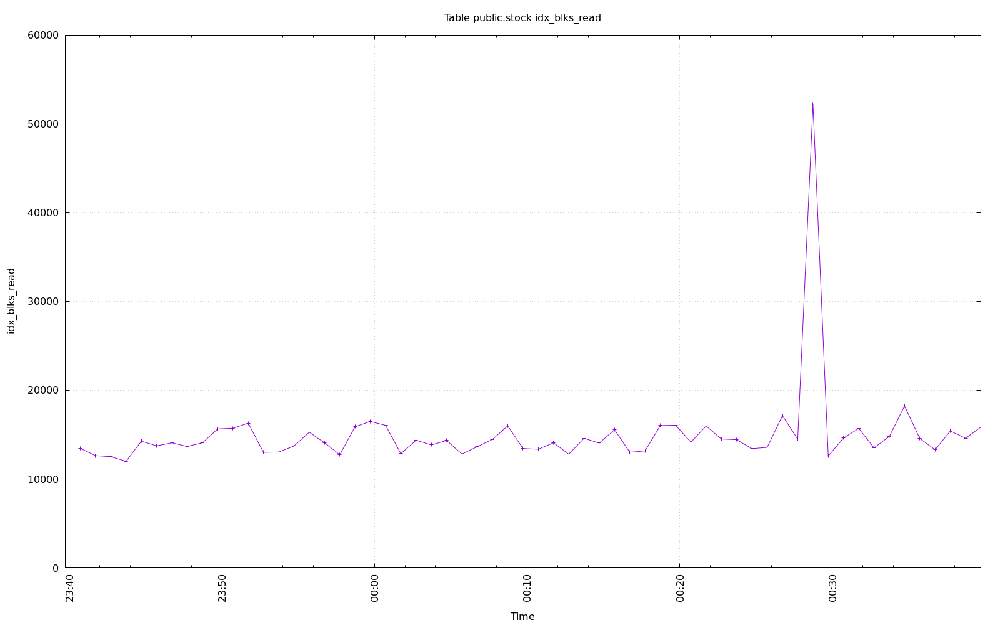

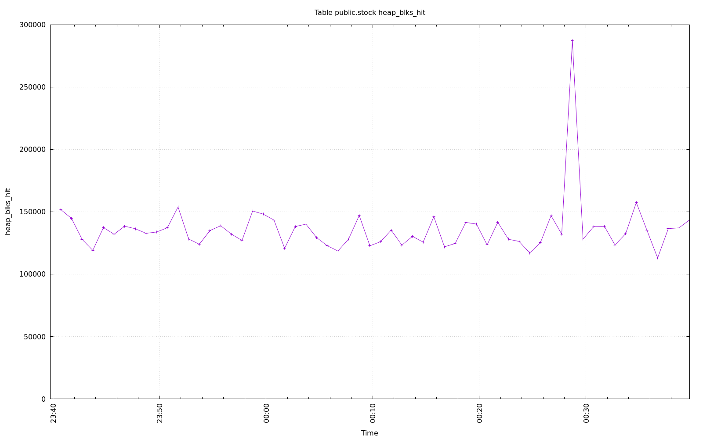

.. image:: ../pgsql-public.stock-heap_blks_read.png
   :target: ../pgsql-public.stock-heap_blks_read.png
   :width: 100%
