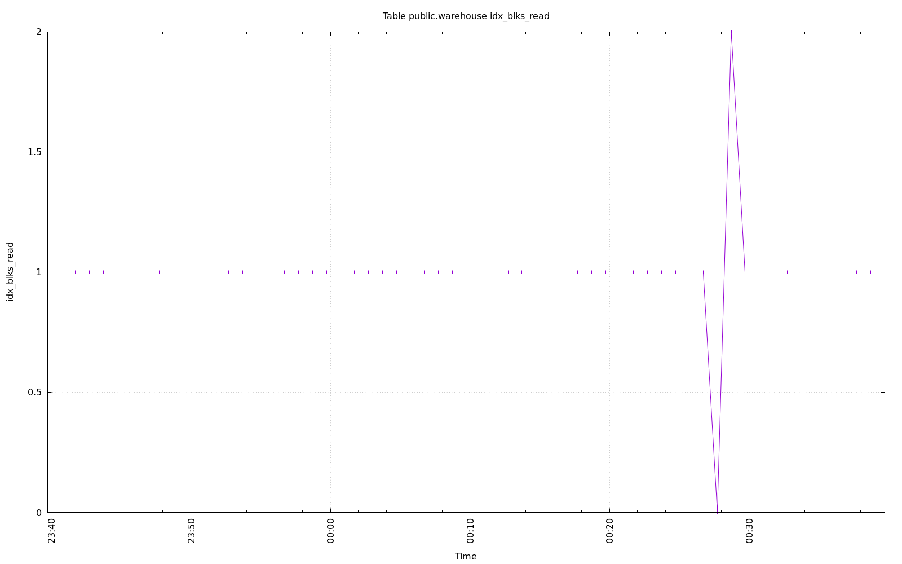
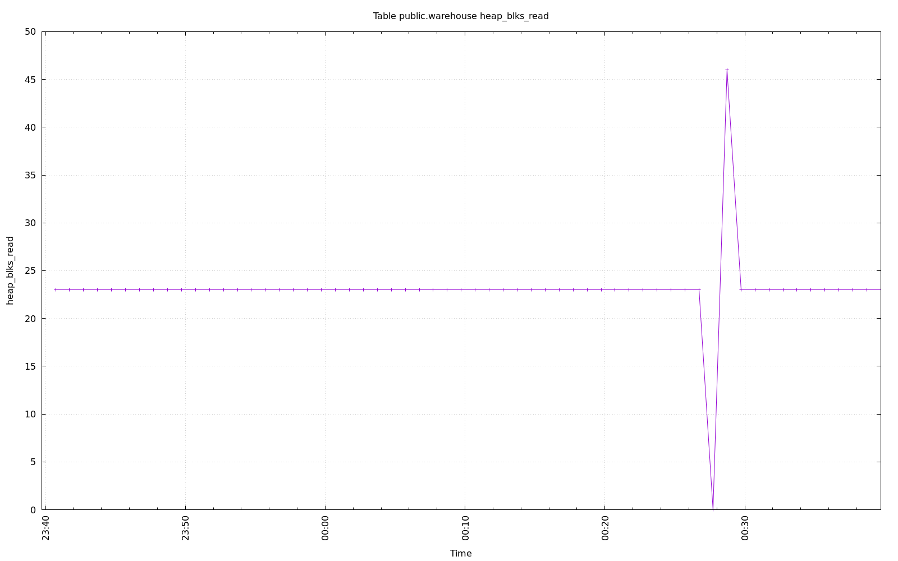

================================================================================
Database Test 2 public.warehouse Table Charts
================================================================================

.. image:: ../pgsql-public.warehouse-analyze_count.png
   :target: ../pgsql-public.warehouse-analyze_count.png
   :width: 100%

.. image:: ../pgsql-public.warehouse-n_live_tup.png
   :target: ../pgsql-public.warehouse-n_live_tup.png
   :width: 100%

.. image:: ../pgsql-public.warehouse-n_tup_hot_upd.png
   :target: ../pgsql-public.warehouse-n_tup_hot_upd.png
   :width: 100%

.. image:: ../pgsql-public.warehouse-tidx_blks_hit.png
   :target: ../pgsql-public.warehouse-tidx_blks_hit.png
   :width: 100%

.. image:: ../pgsql-public.warehouse-tidx_blks_read.png
   :target: ../pgsql-public.warehouse-tidx_blks_read.png
   :width: 100%

.. image:: ../pgsql-public.warehouse-toast_blks_hit.png
   :target: ../pgsql-public.warehouse-toast_blks_hit.png
   :width: 100%

.. image:: ../pgsql-public.warehouse-toast_blks_read.png
   :target: ../pgsql-public.warehouse-toast_blks_read.png
   :width: 100%

.. image:: ../pgsql-public.warehouse-idx_blks_hit.png
   :target: ../pgsql-public.warehouse-idx_blks_hit.png
   :width: 100%

