================================================================================
Database Test 2 pidstat walwriter Charts
================================================================================

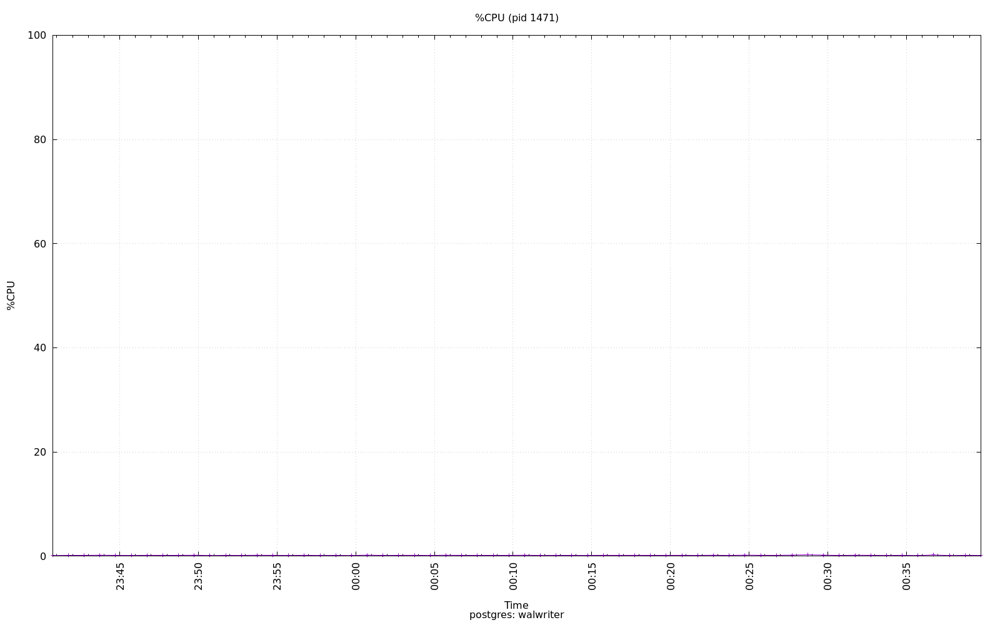

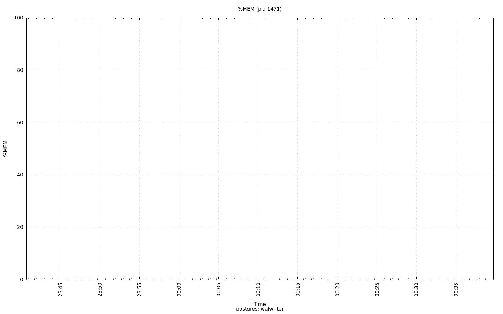

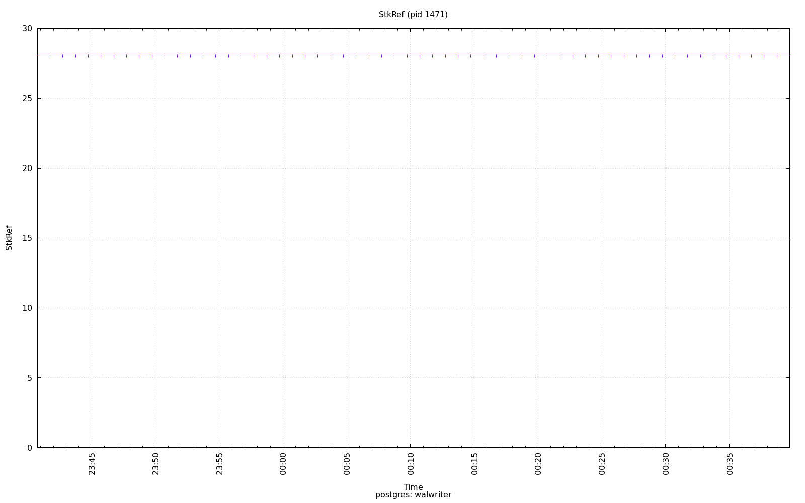

.. image:: ../pidstat/pidstat-1471-StkSize.png
   :target: ../pidstat/pidstat-1471-StkSize.png
   :width: 100%

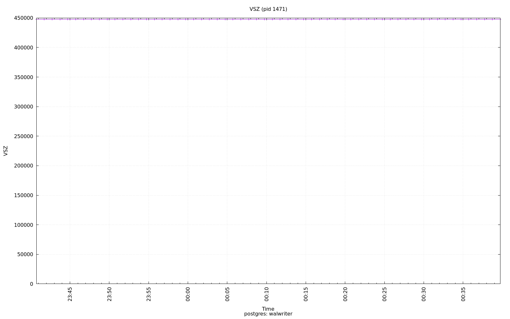

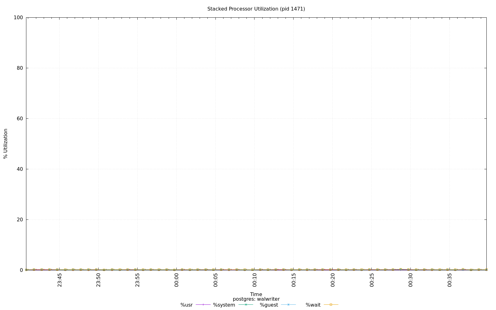

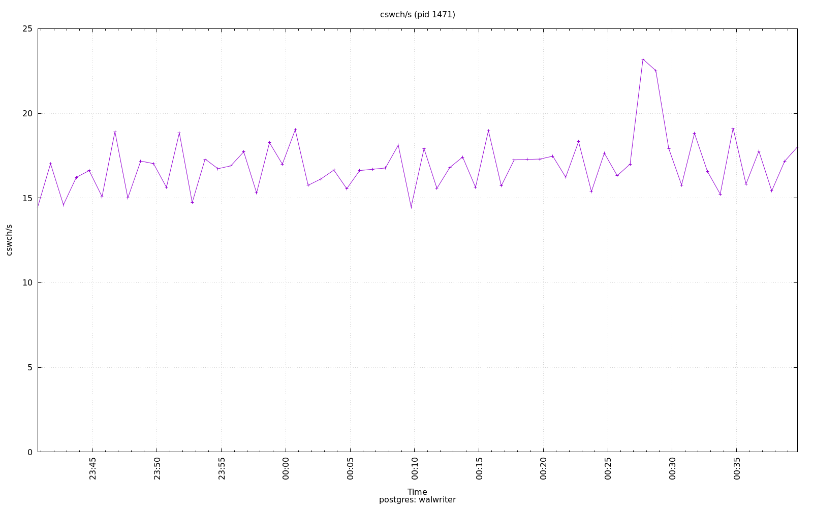

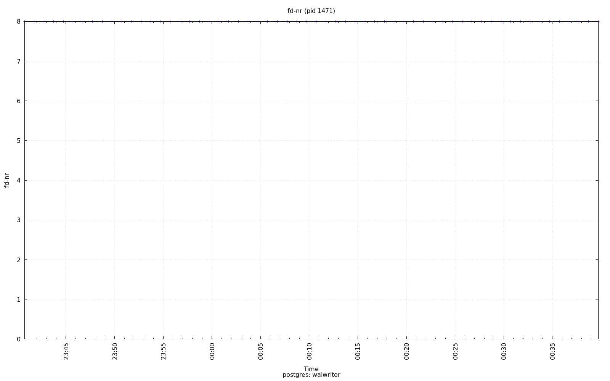

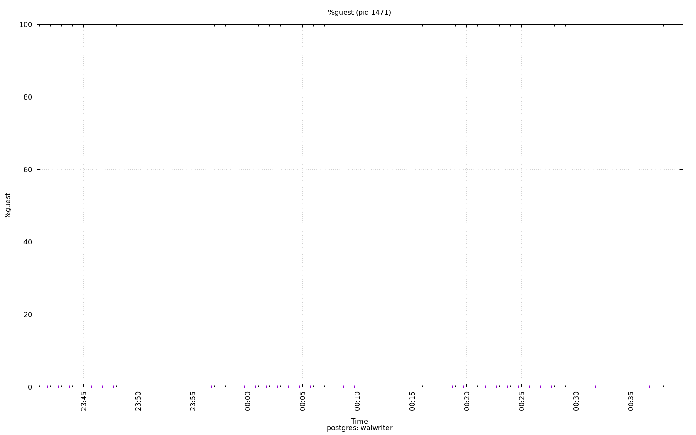

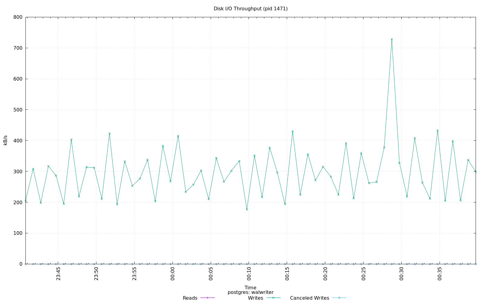

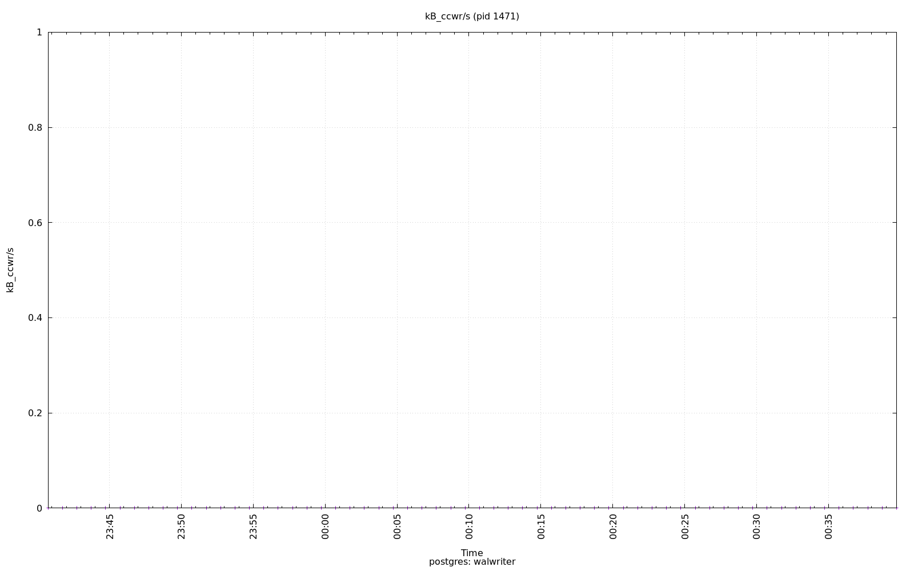

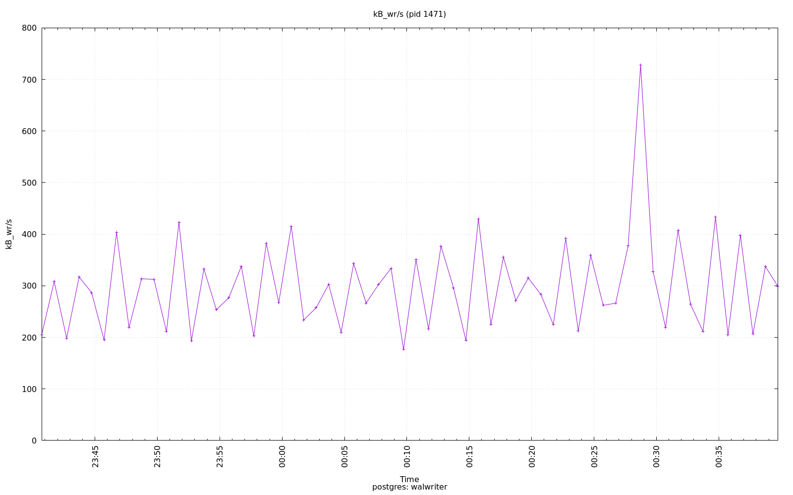

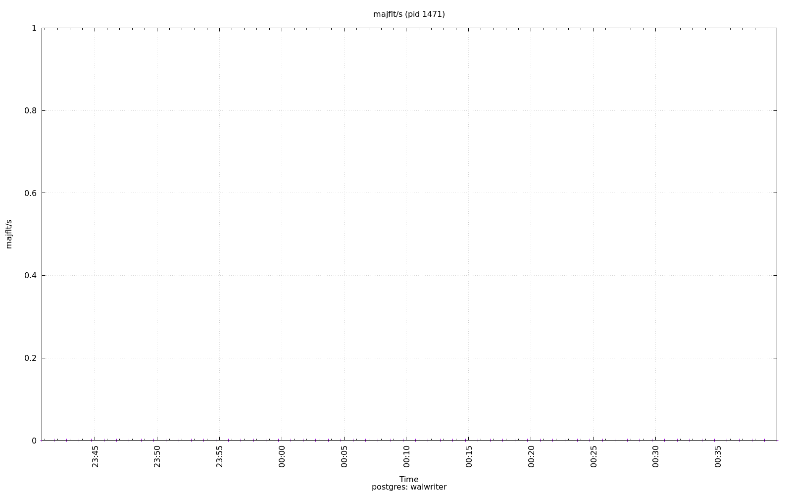

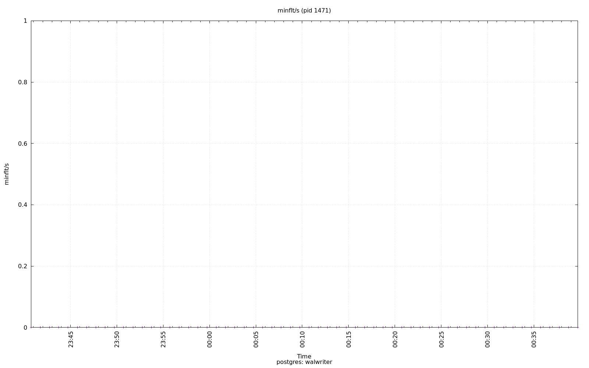

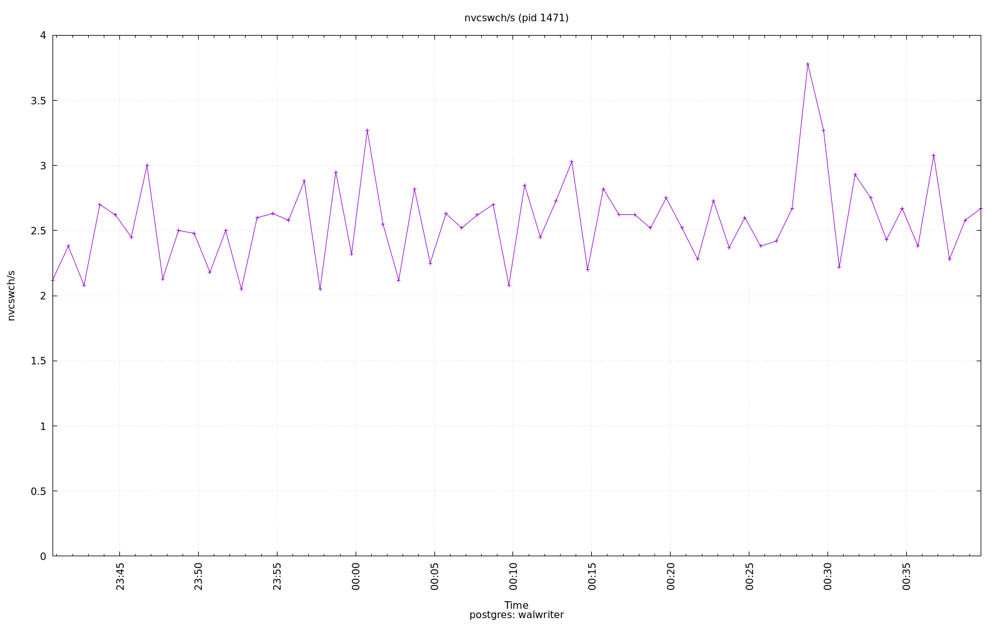

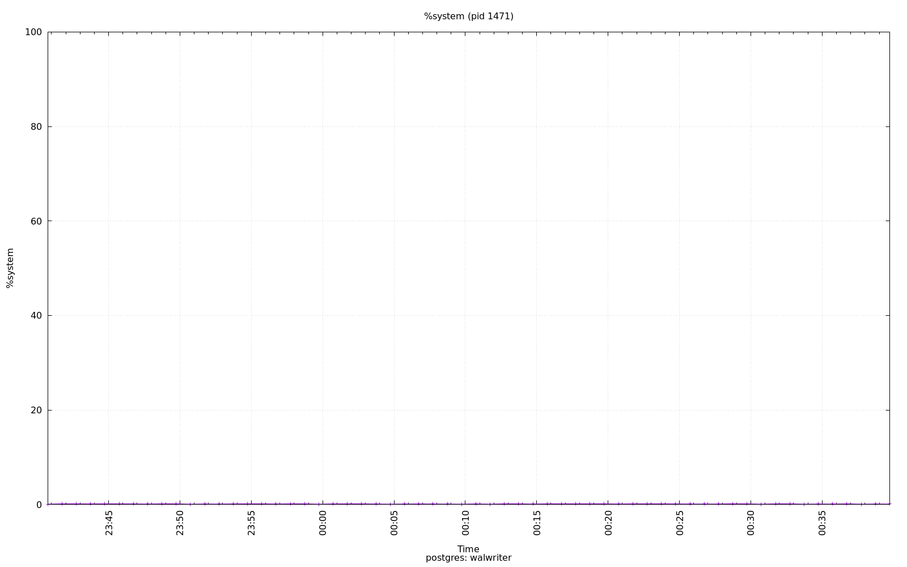

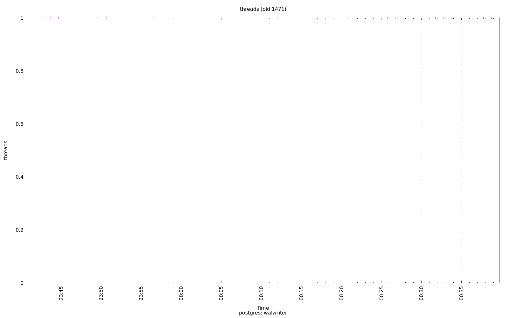

