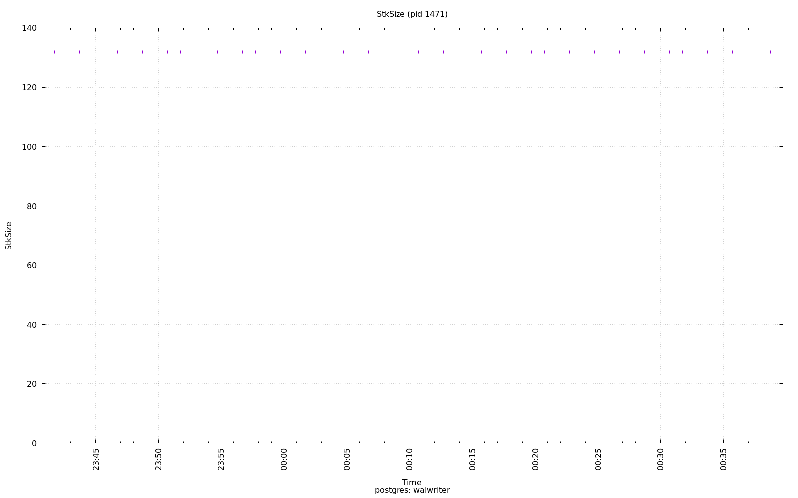

================================================================================
Database Test 2 pidstat walwriter Charts
================================================================================

