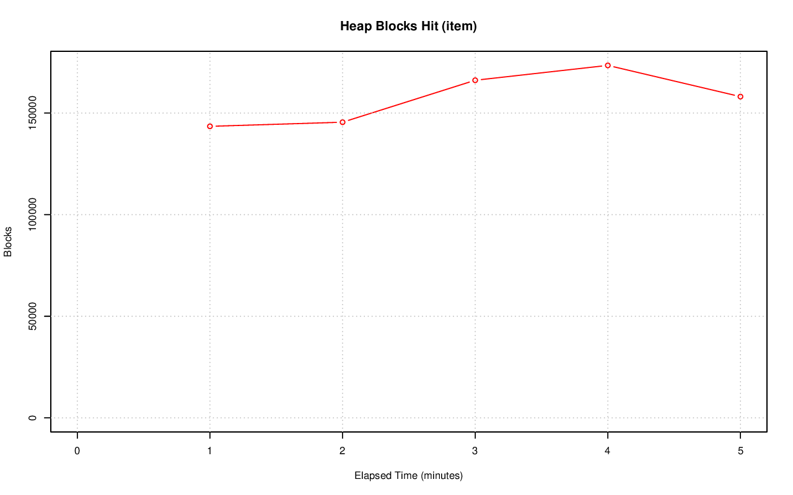
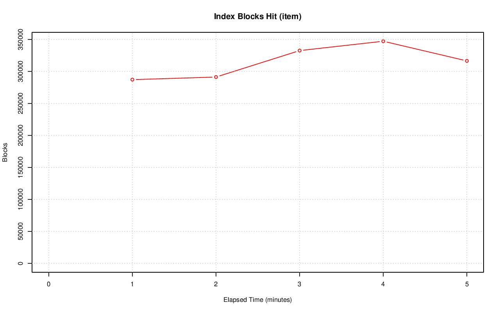
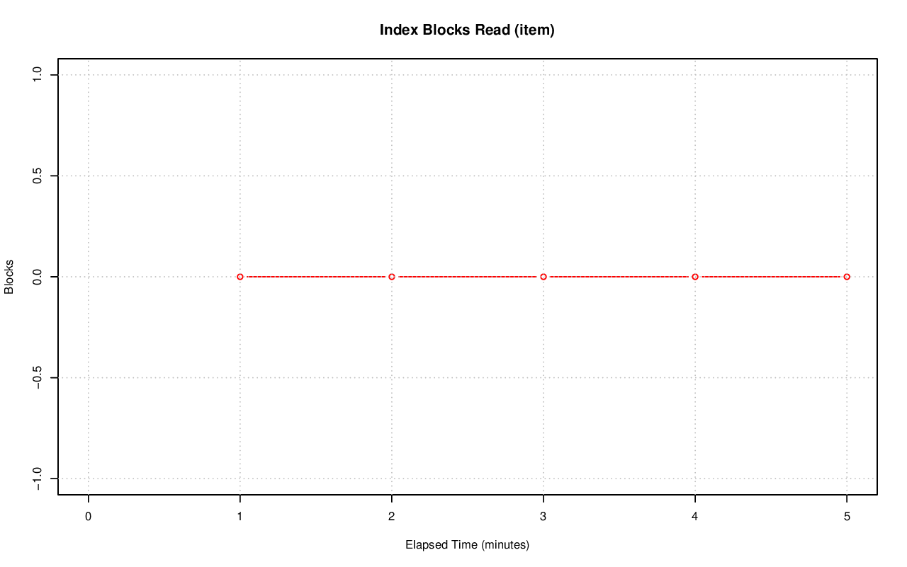
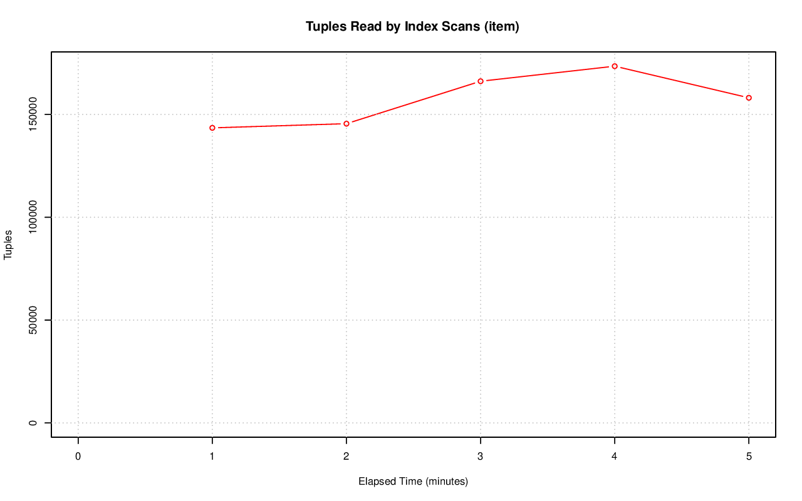
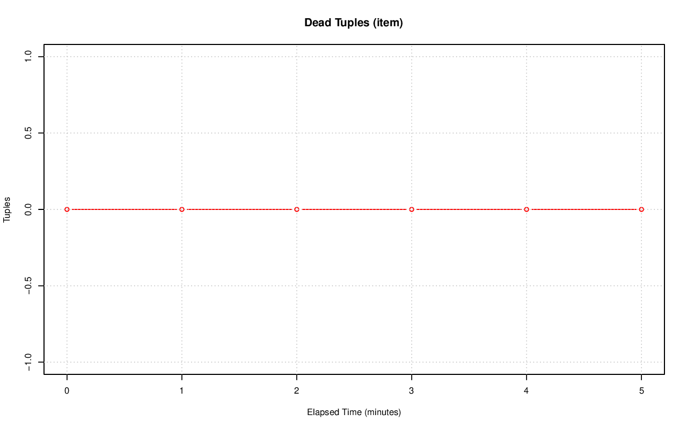
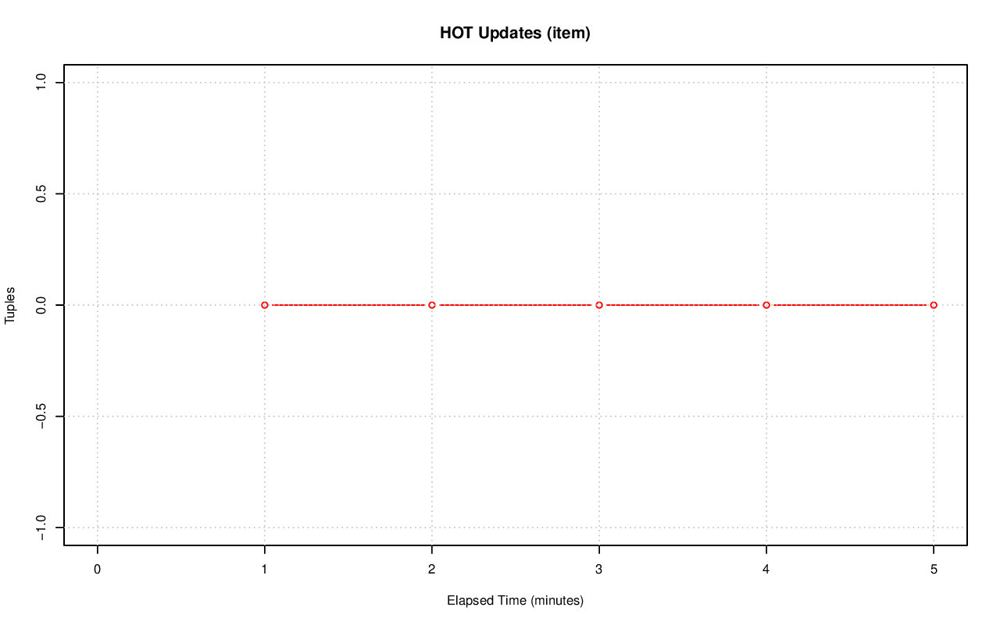
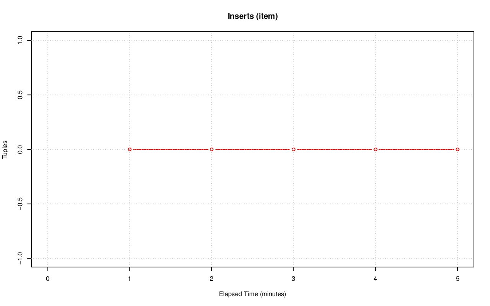
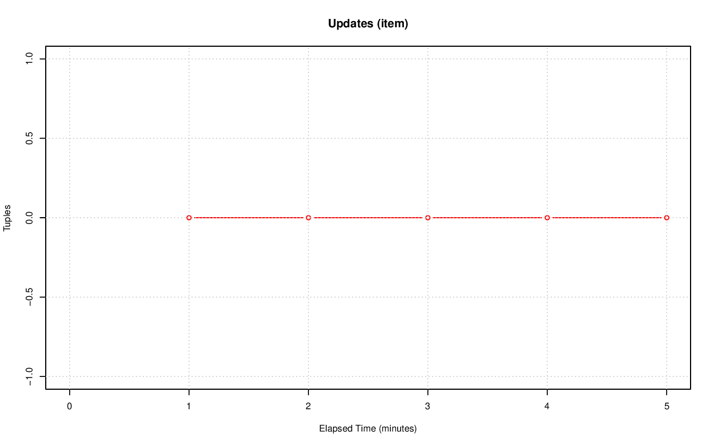
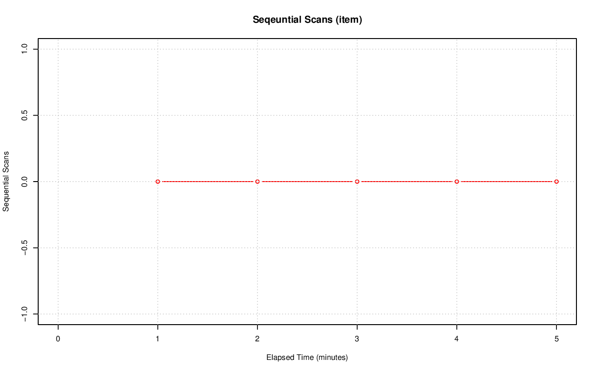
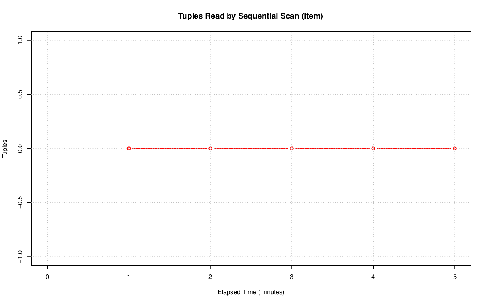

================================================================================
Database Test 2 item Table Charts
================================================================================

.. image:: ../table-stat-item-heap_blks_read.png
   :target: ../table-stat-item-heap_blks_read.png
   :width: 100%

.. image:: ../table-stat-item-idx_scan.png
   :target: ../table-stat-item-idx_scan.png
   :width: 100%

.. image:: ../table-stat-item-n_live_tup.png
   :target: ../table-stat-item-n_live_tup.png
   :width: 100%

.. image:: ../table-stat-item-n_tup_del.png
   :target: ../table-stat-item-n_tup_del.png
   :width: 100%

.. image:: ../table-stat-item-toast_blks_read.png
   :target: ../table-stat-item-toast_blks_read.png
   :width: 100%
