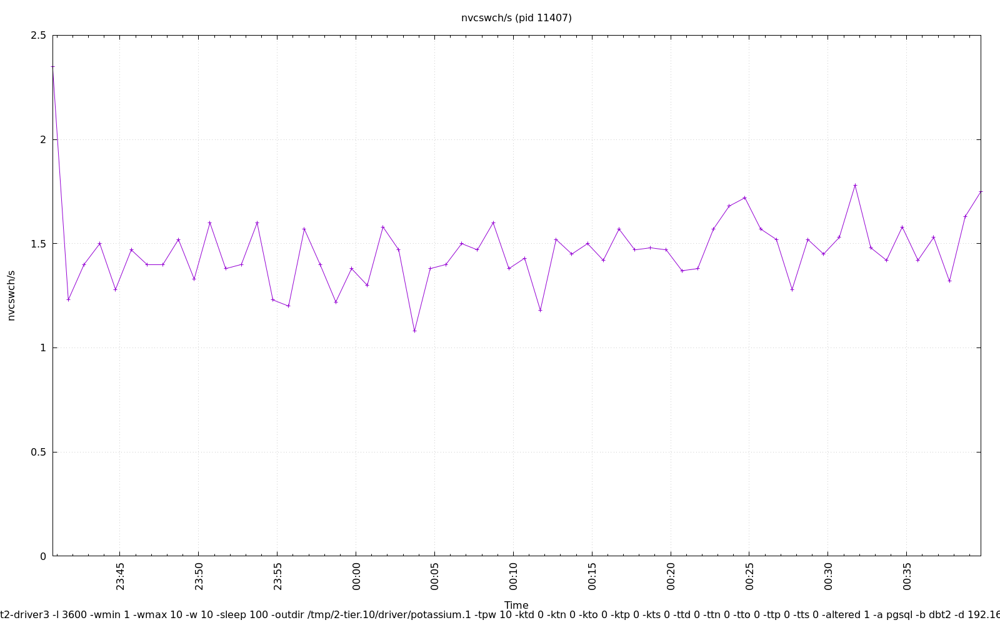

================================================================================
Database Test 2 pidstat driver Charts
================================================================================

.. image:: ../sysstat/pidstat/pidstat-11407-threads.png
   :target: ../sysstat/pidstat/pidstat-11407-threads.png
   :width: 100%

