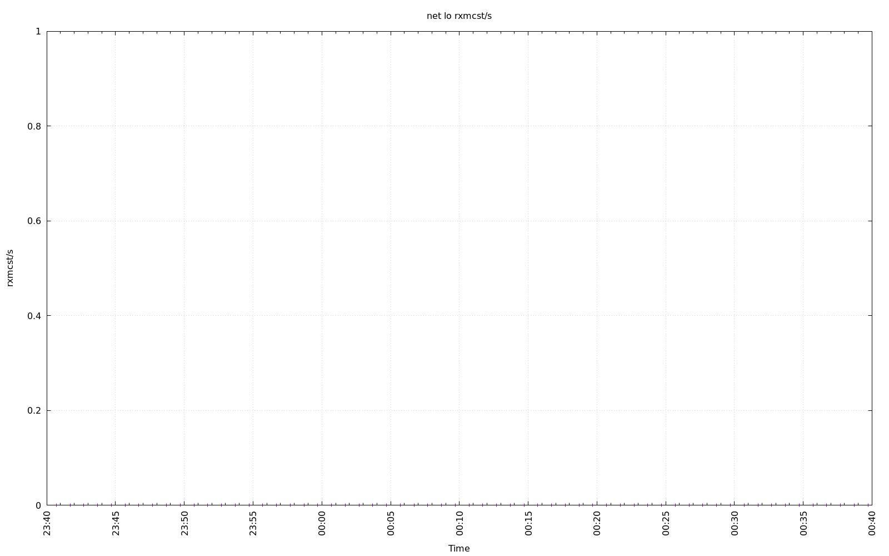
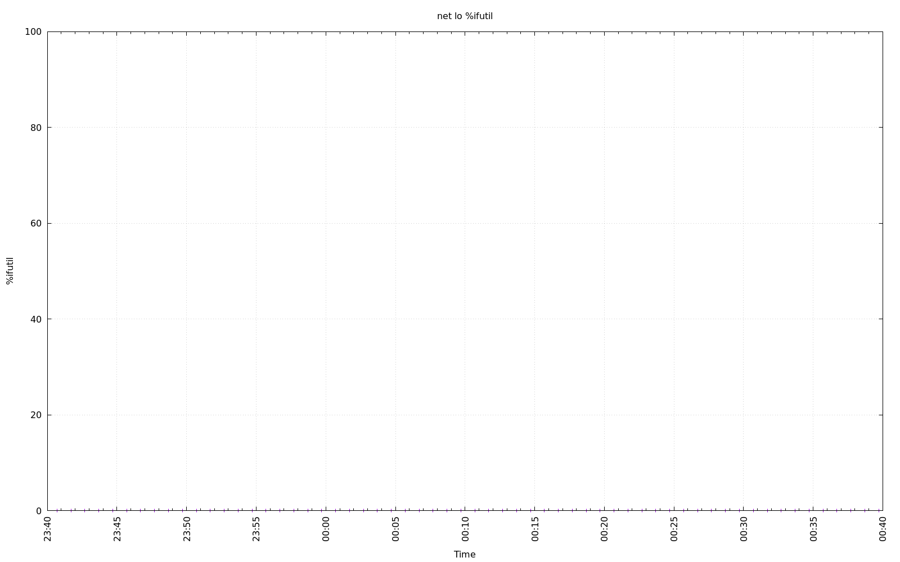
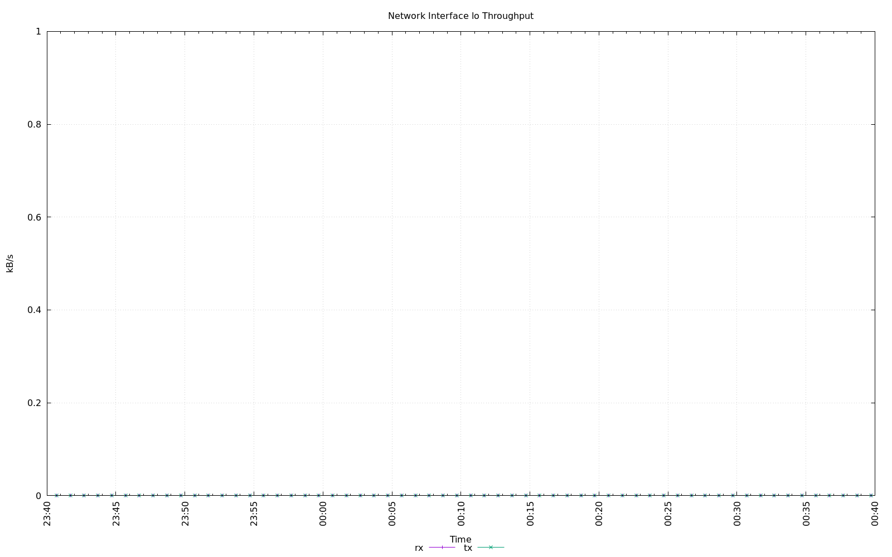
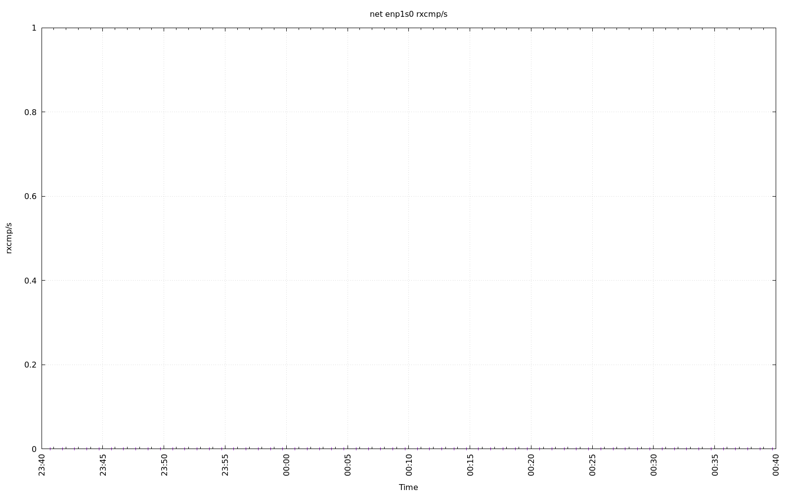
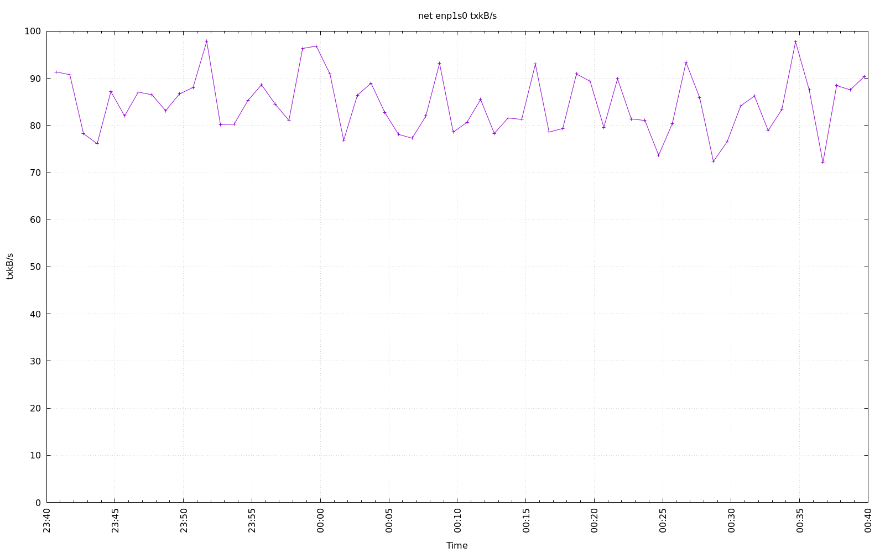
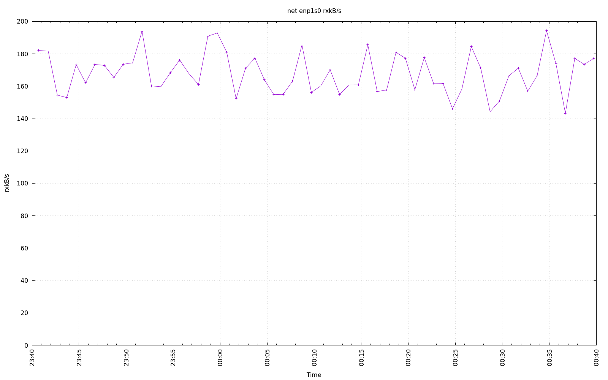
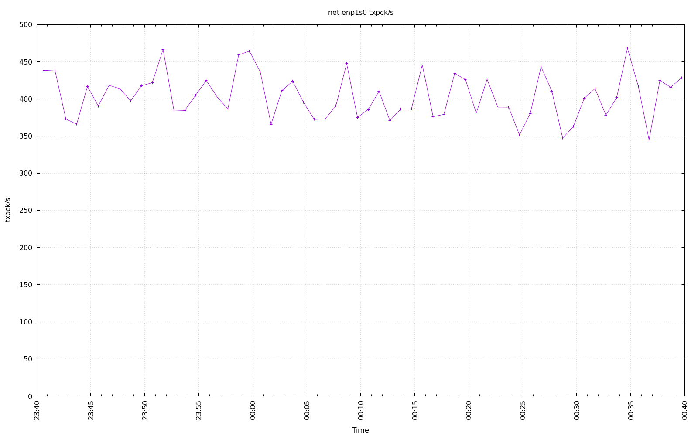
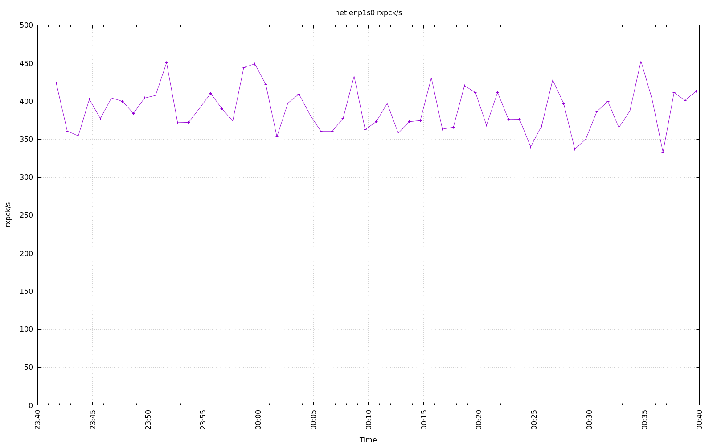
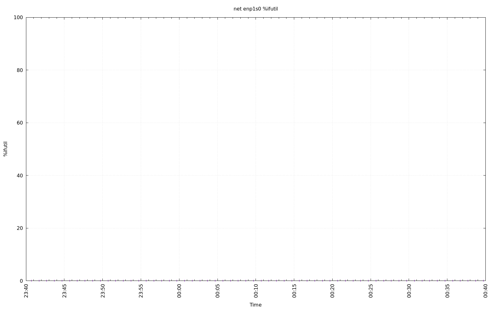

================================================================================
Database Test 2 driver net Charts
================================================================================

.. image:: ../sysstat/sar/net/sar-net-enp1s0-throughput.png
   :target: ../sysstat/sar/net/sar-net-enp1s0-throughput.png
   :width: 100%
