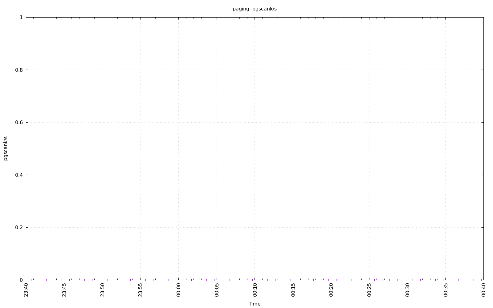
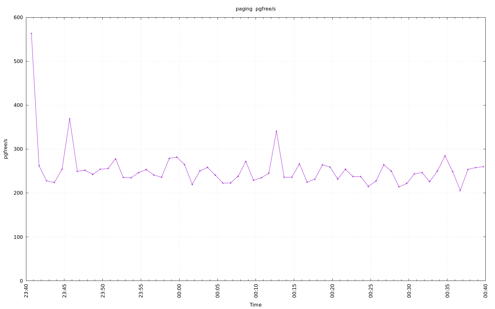
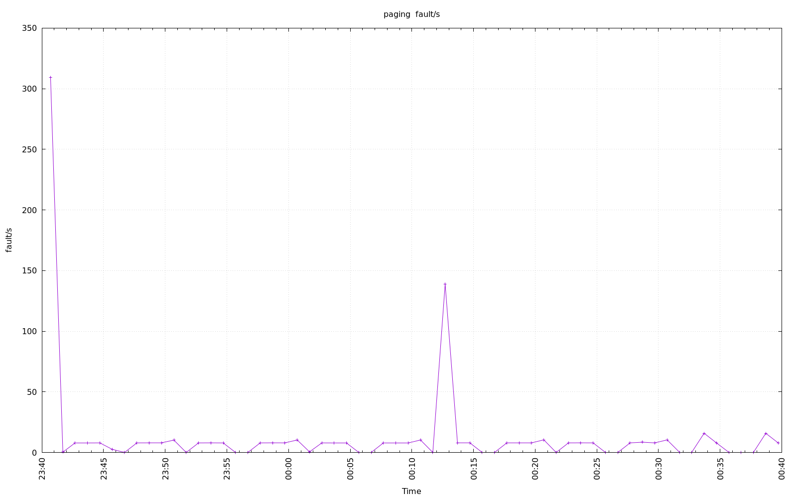
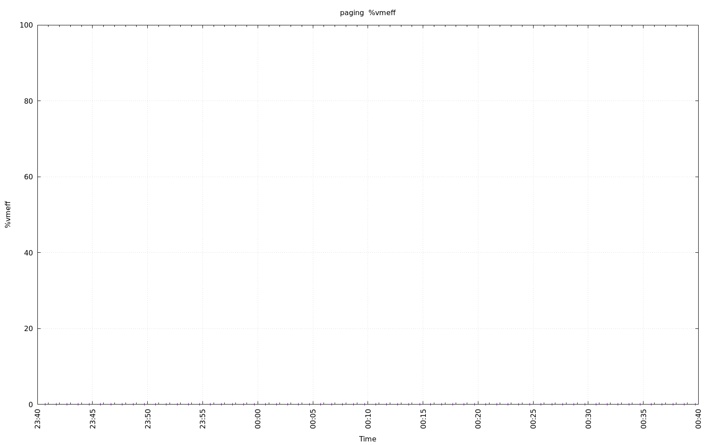
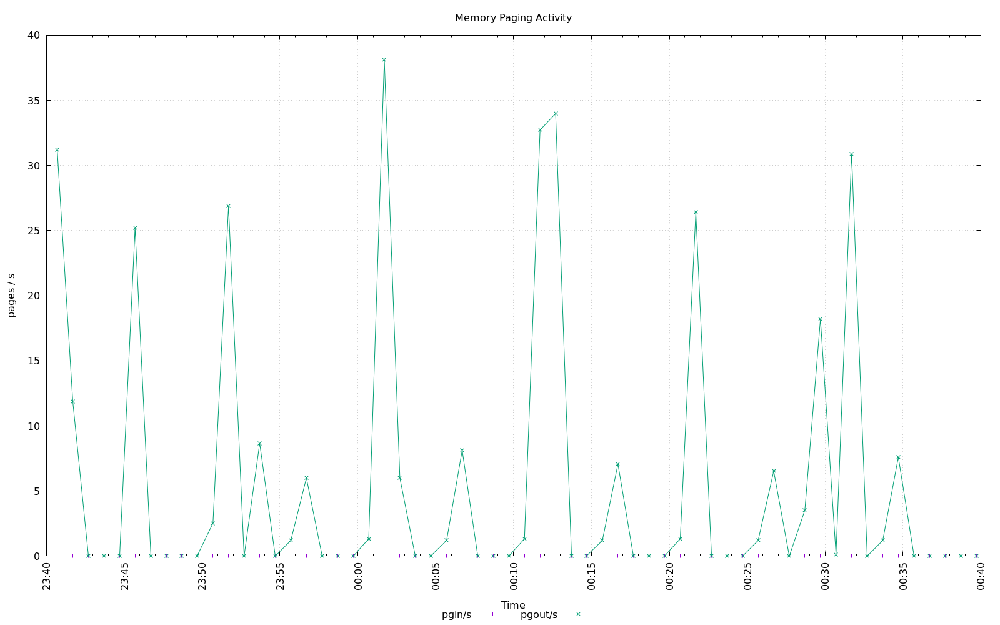

================================================================================
Database Test 2 driver paging Charts
================================================================================

