================================================================================
Database Test 2 pidstat client Charts
================================================================================

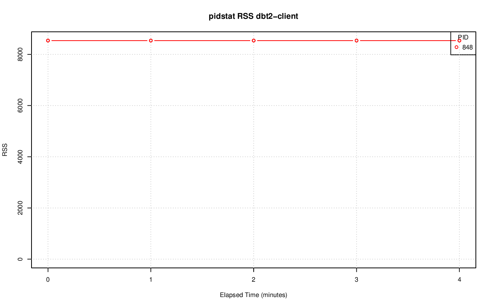

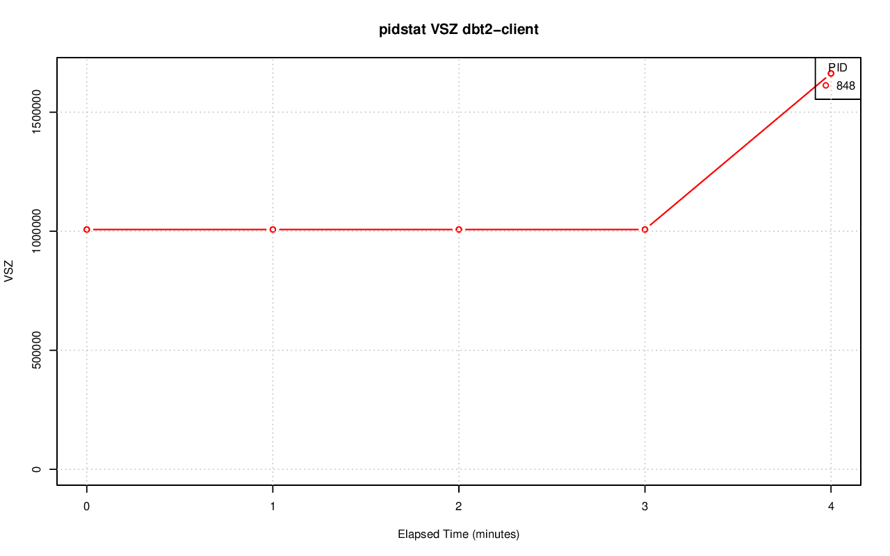

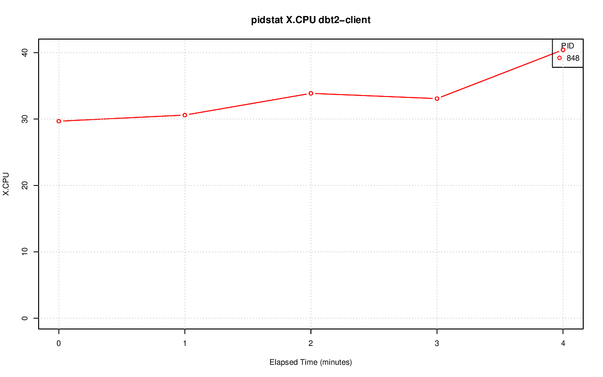

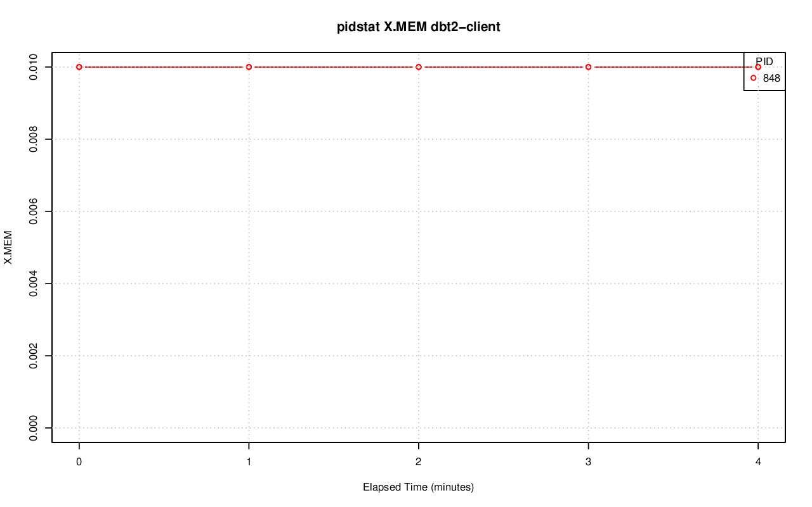

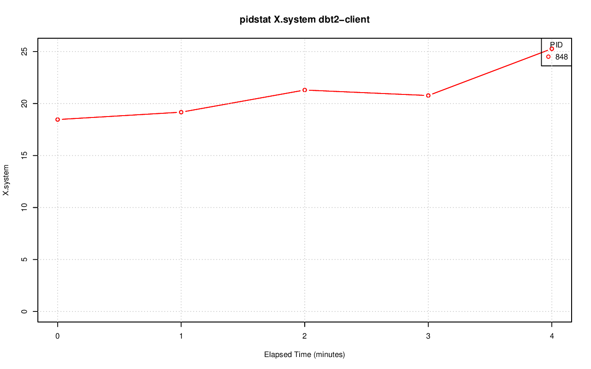

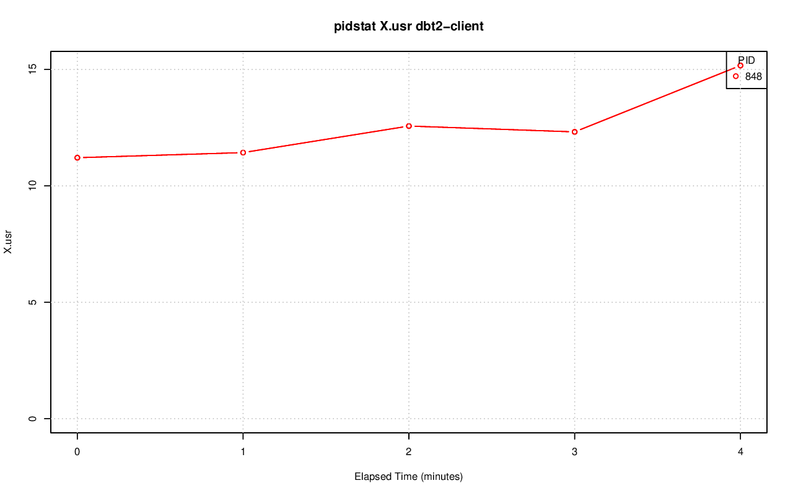

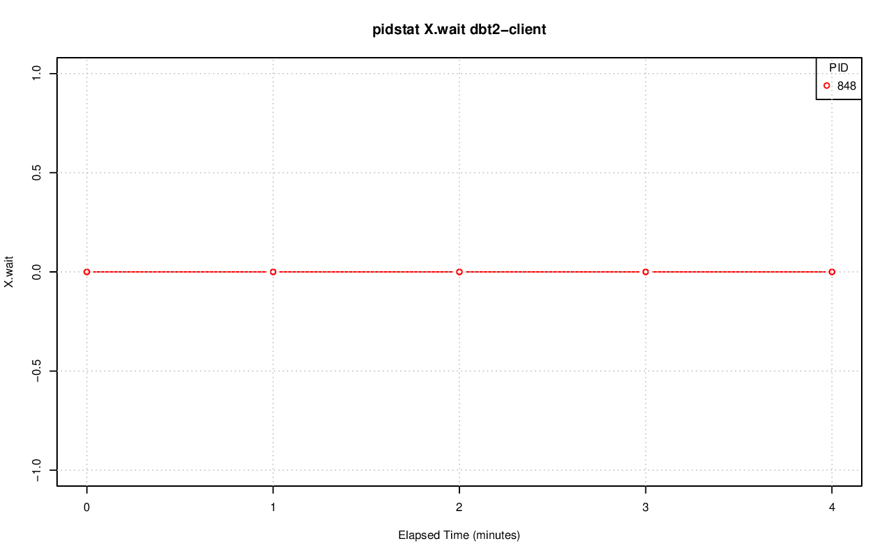

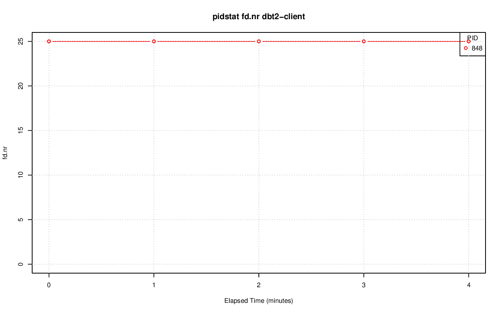

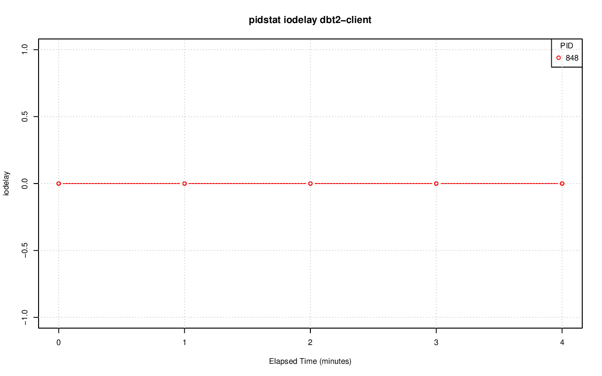

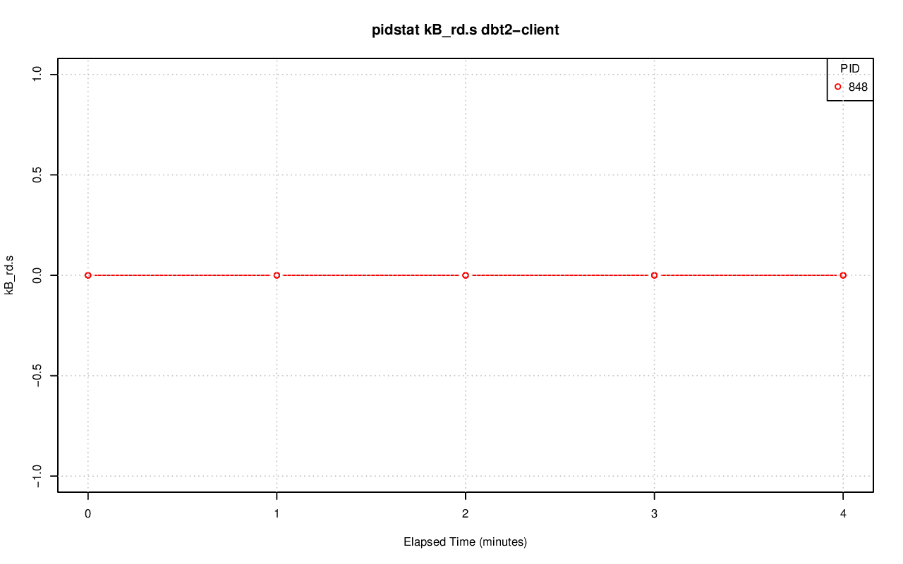

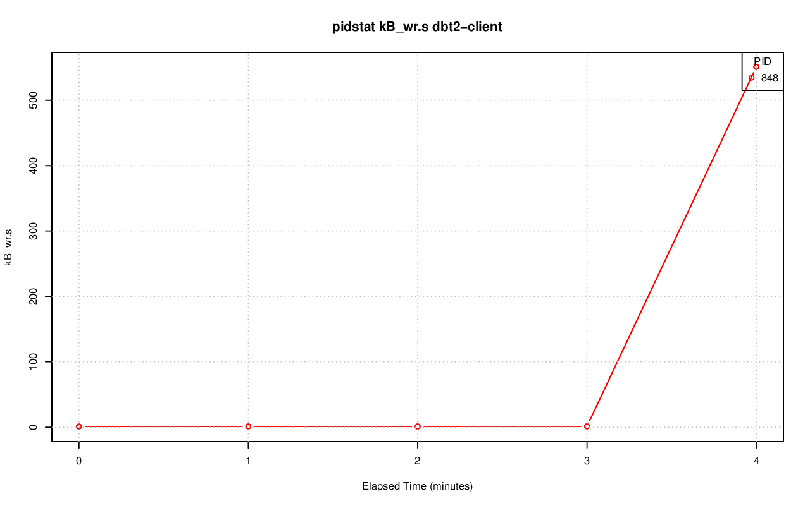

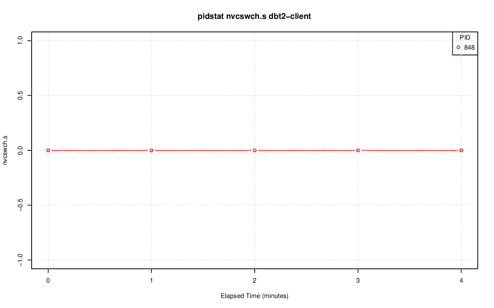

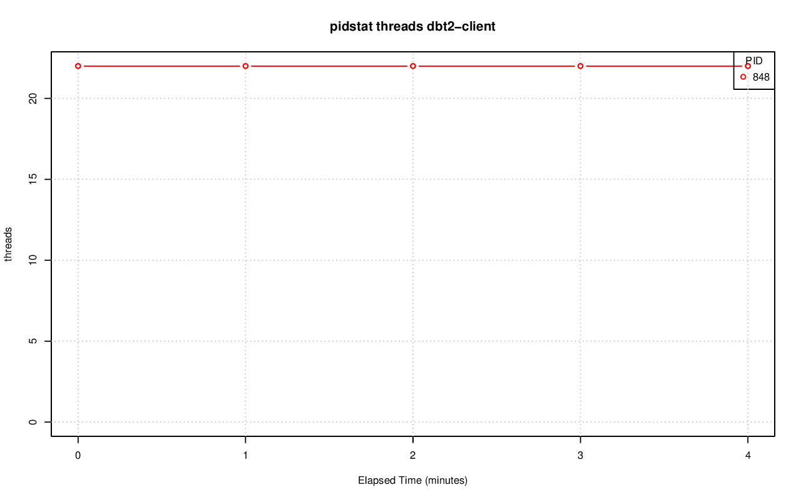
