================================================================================
Database Test 2 pidstat client Charts
================================================================================

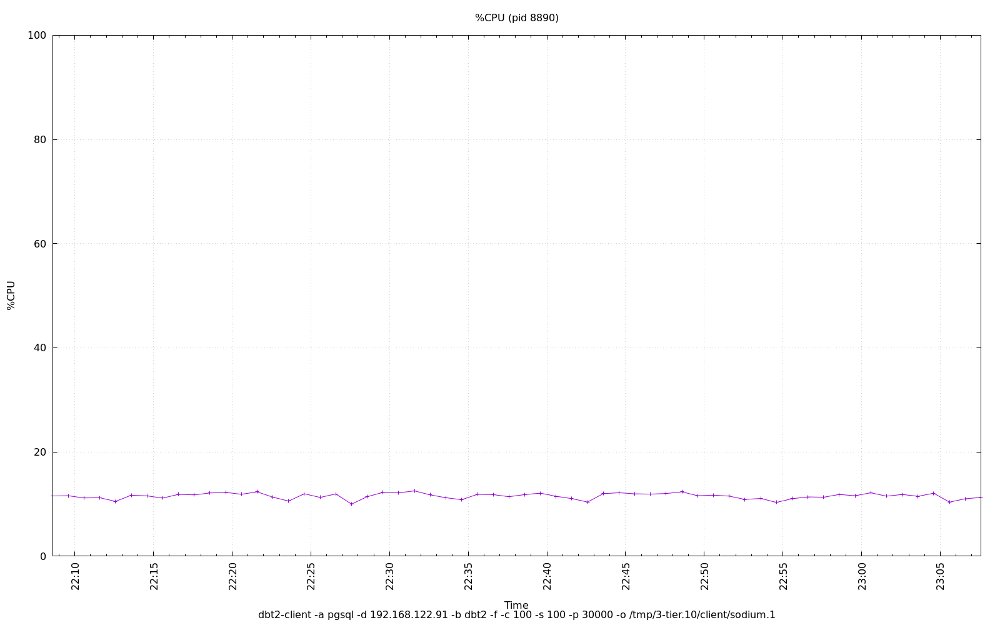

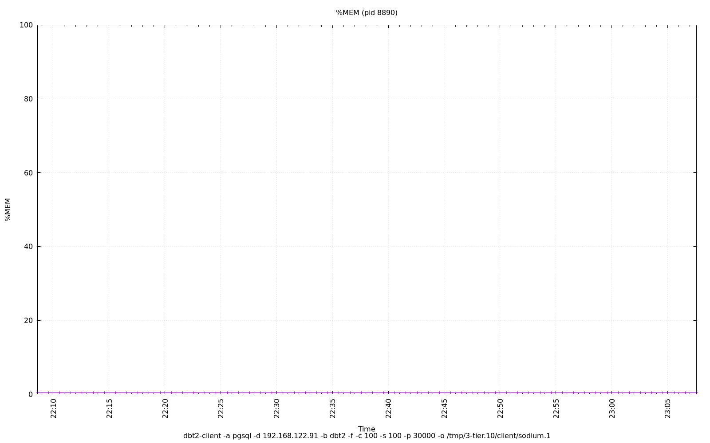

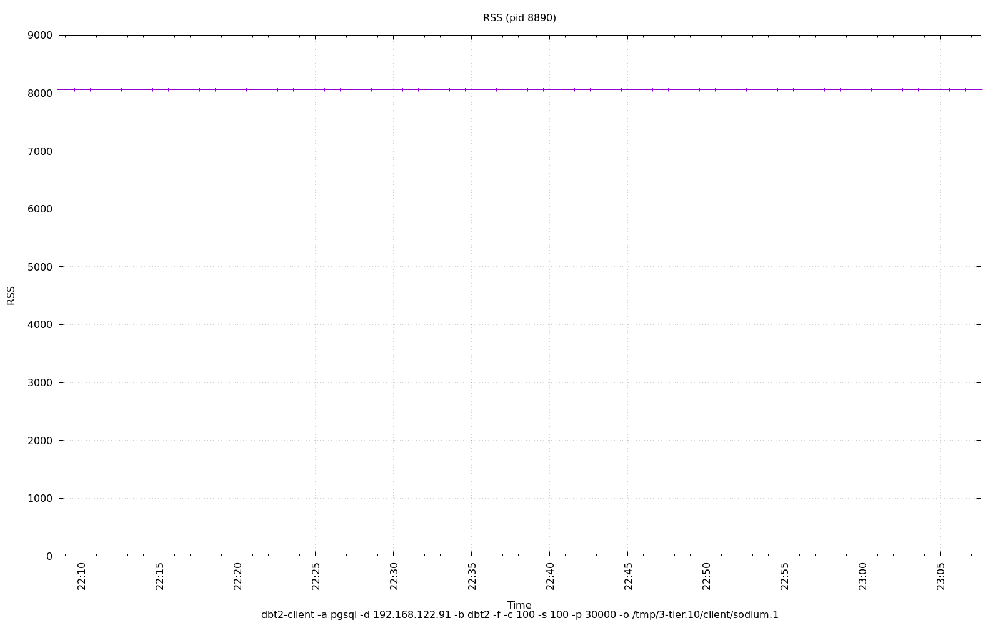

.. image:: ../sysstat/pidstat/pidstat-8890-StkRef.png
   :target: ../sysstat/pidstat/pidstat-8890-StkRef.png
   :width: 100%

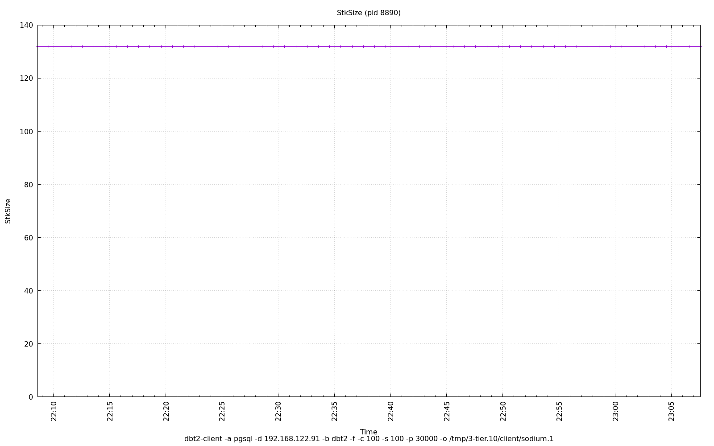

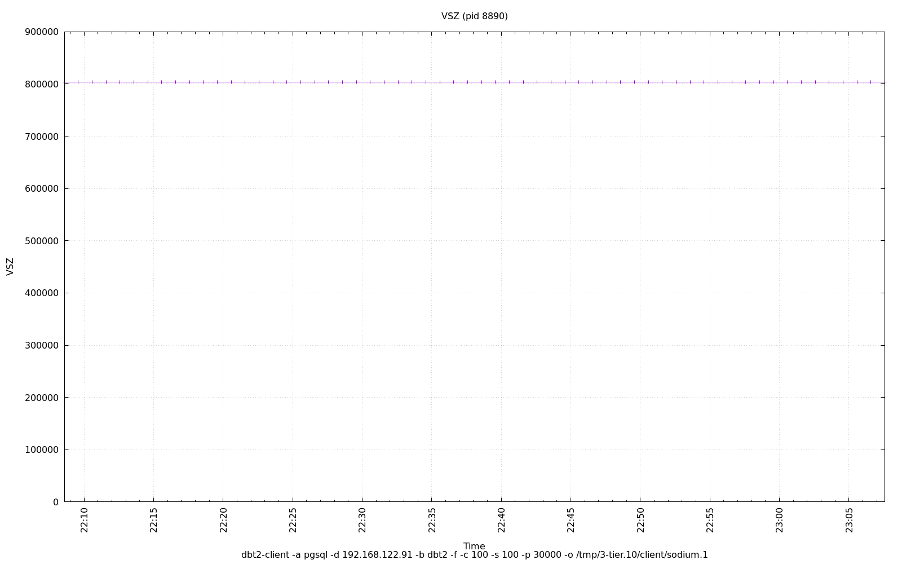

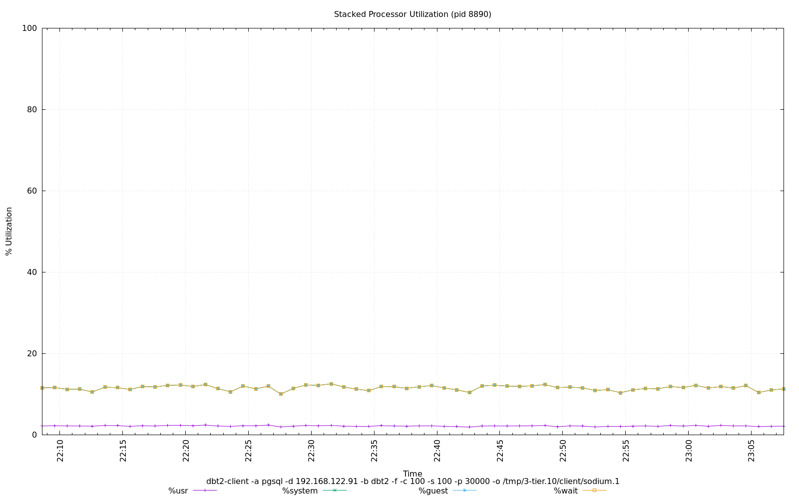

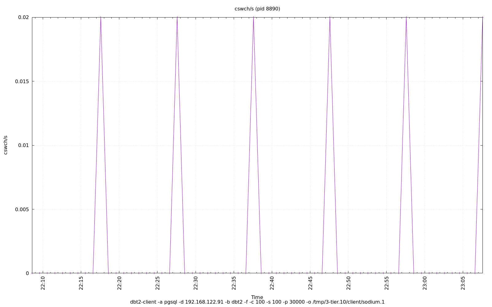

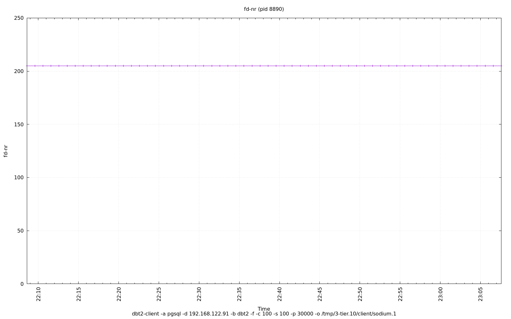

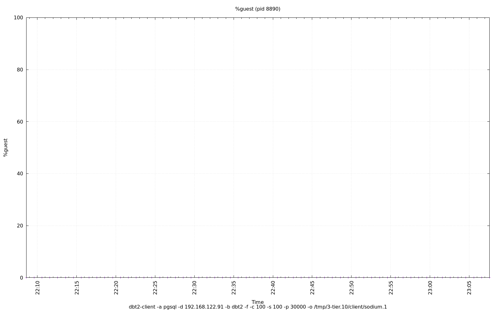

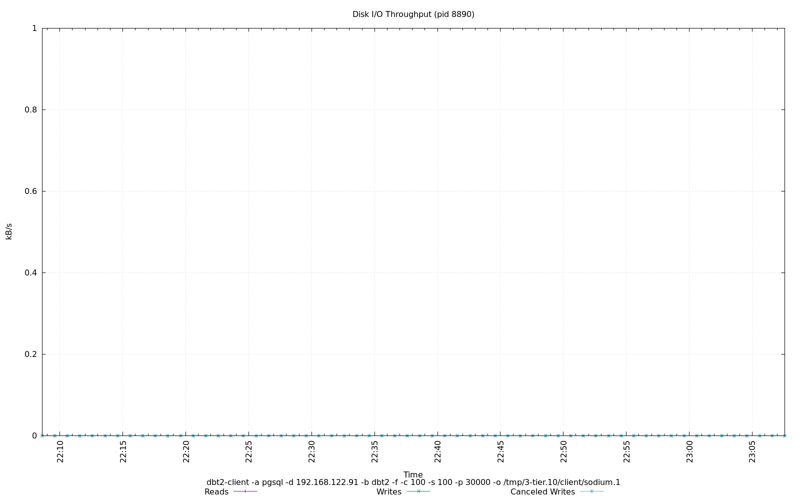

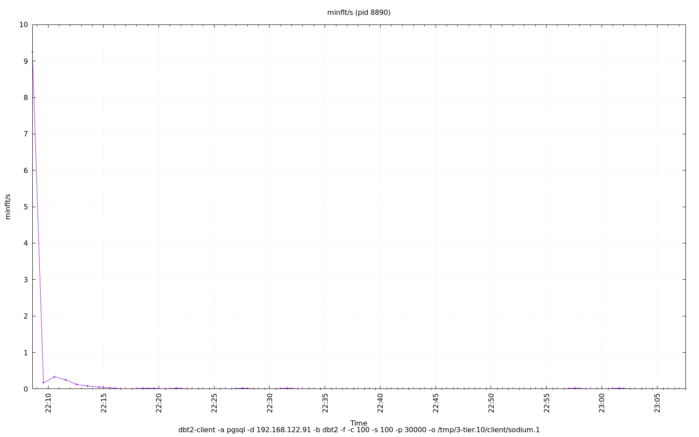

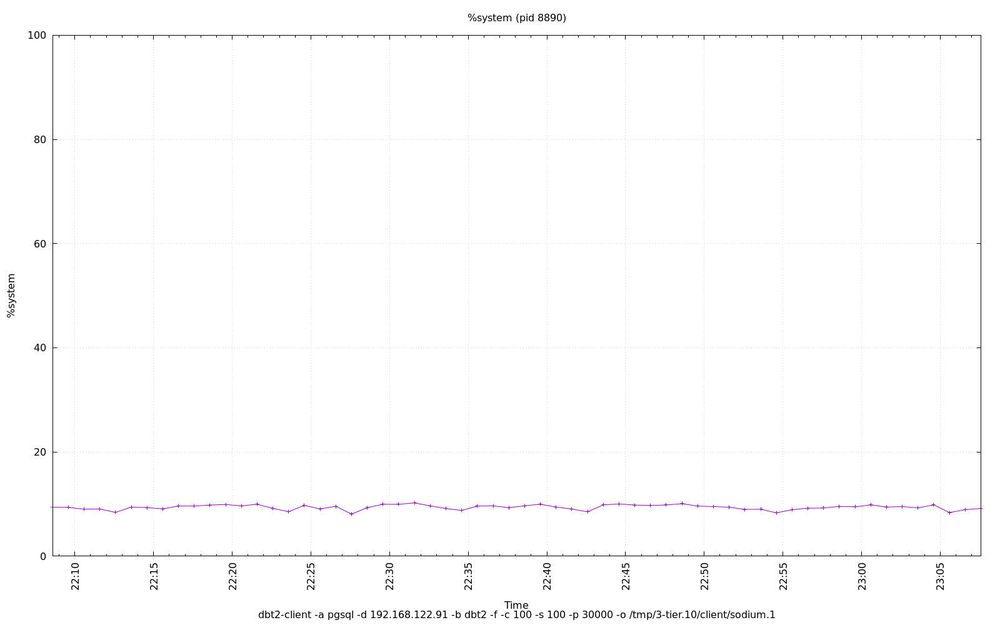

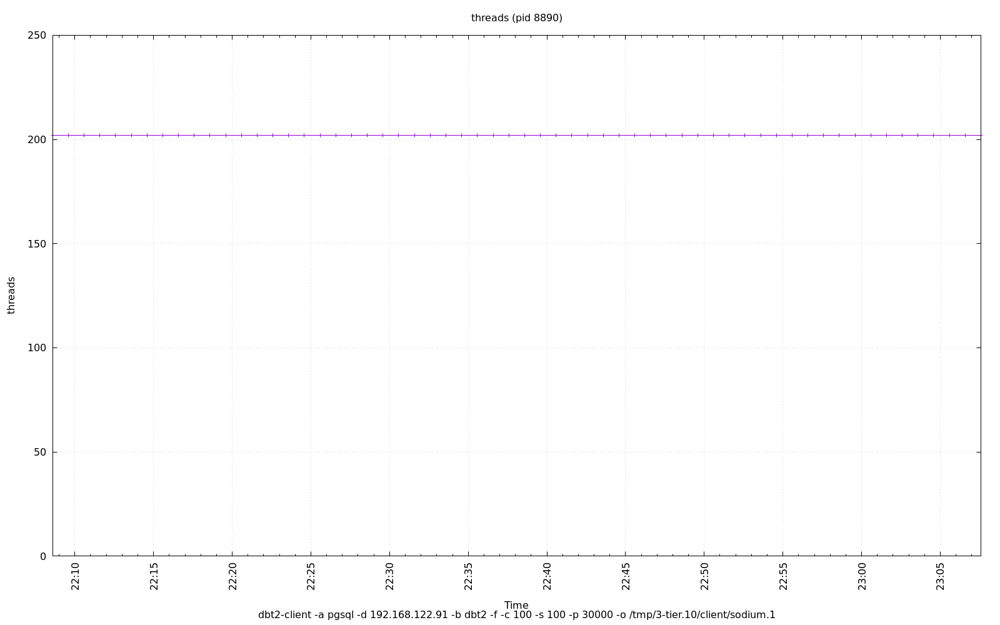

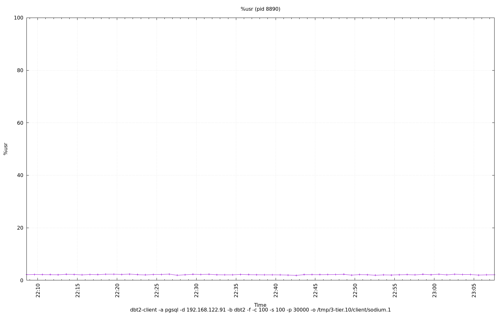

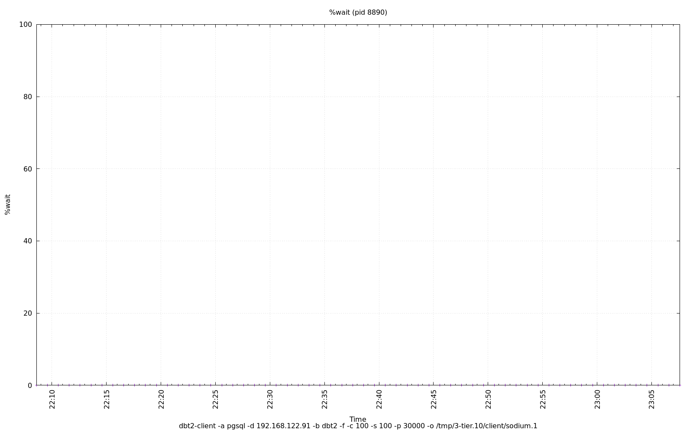
