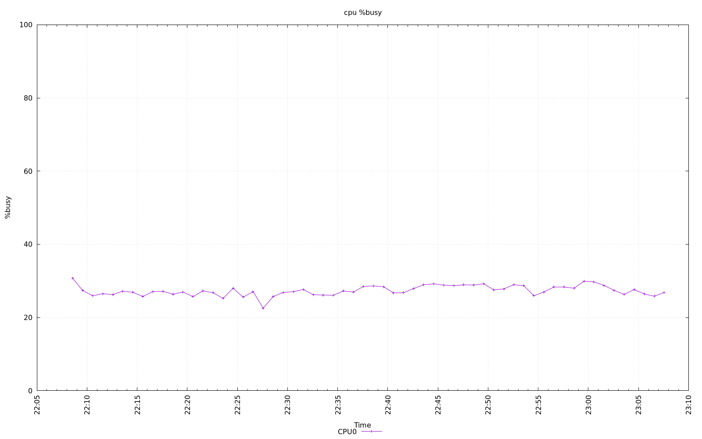
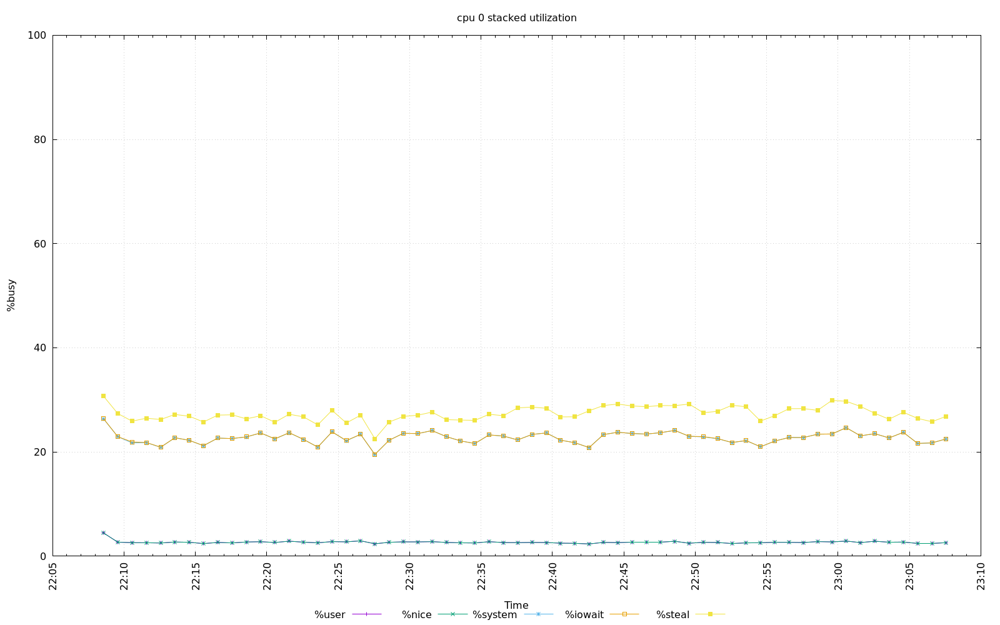
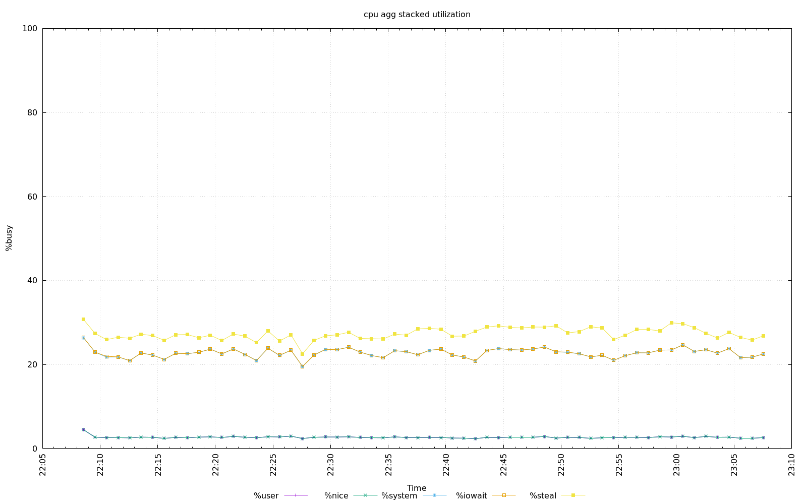
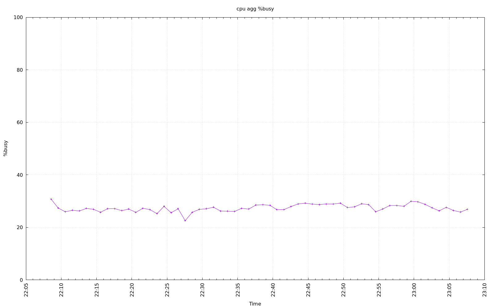

================================================================================
Database Test 2 client cpu Charts
================================================================================

.. image:: ../sysstat/sar/cpu/sar-cpu-0-busy.png
   :target: ../sysstat/sar/cpu/sar-cpu-0-busy.png
   :width: 100%

