================================================================================
Database Test 2 pidstat autovacum Charts
================================================================================

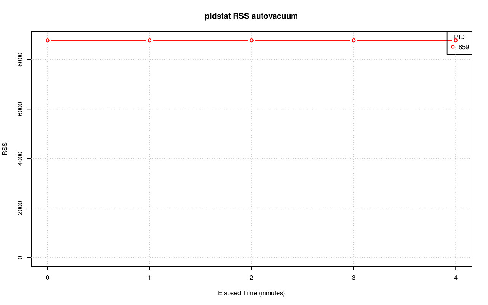

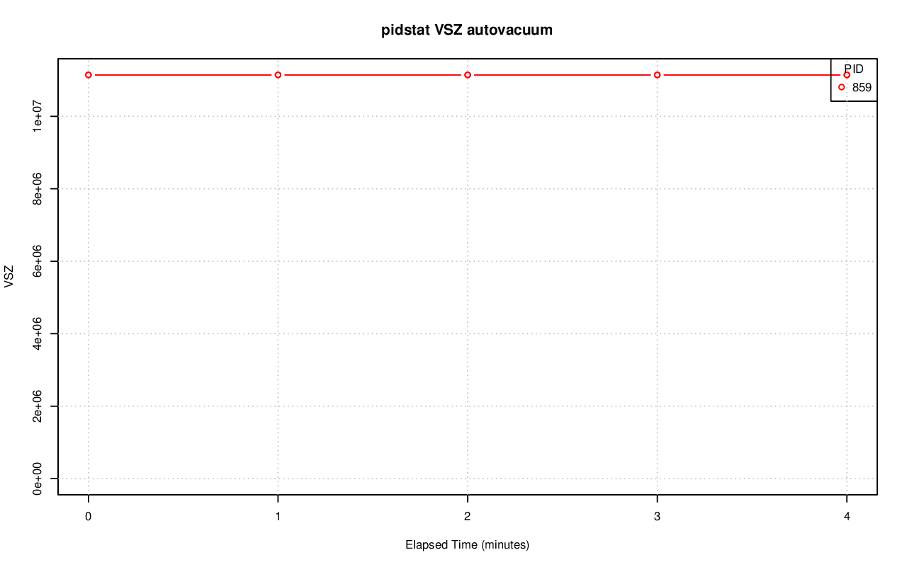

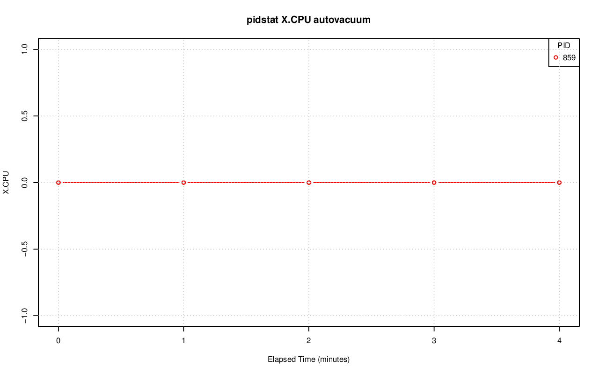

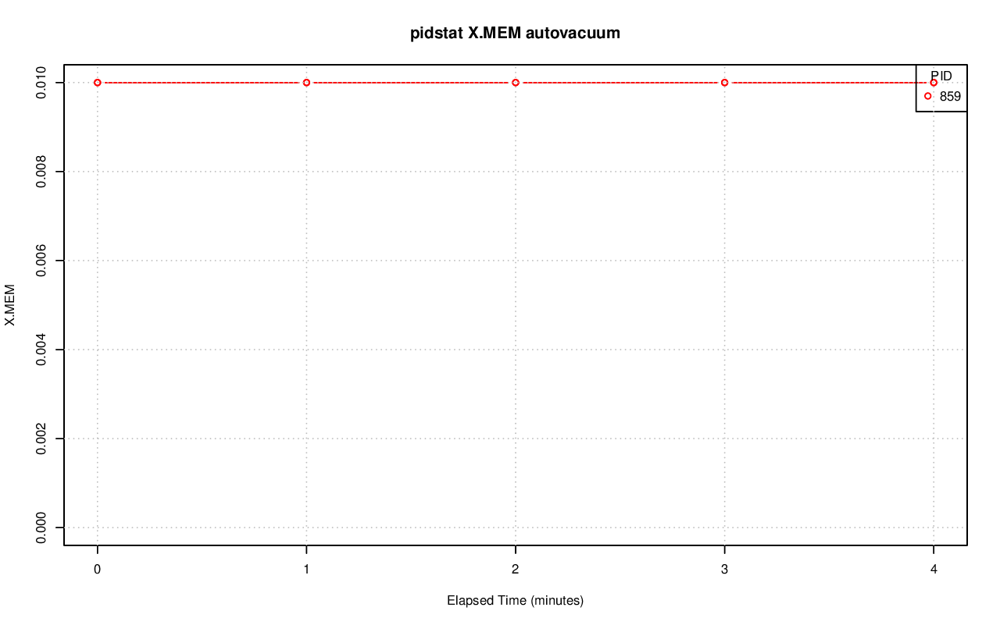

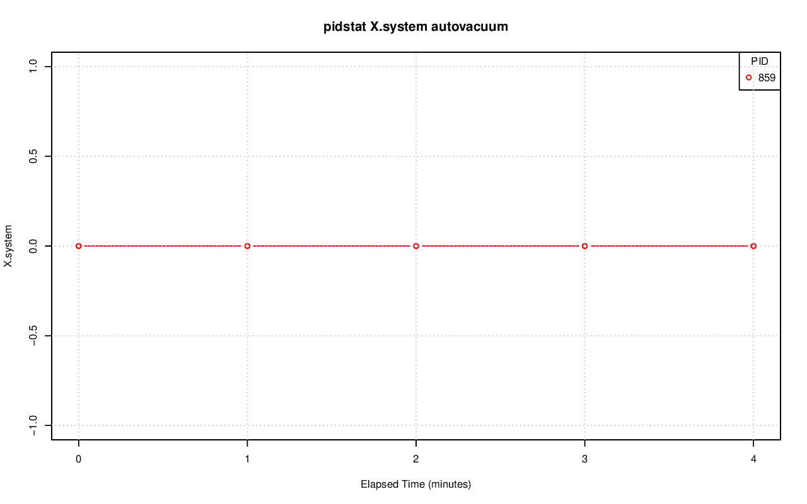

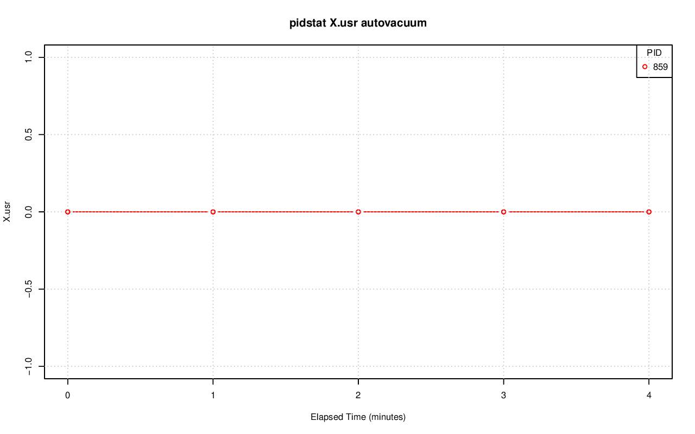

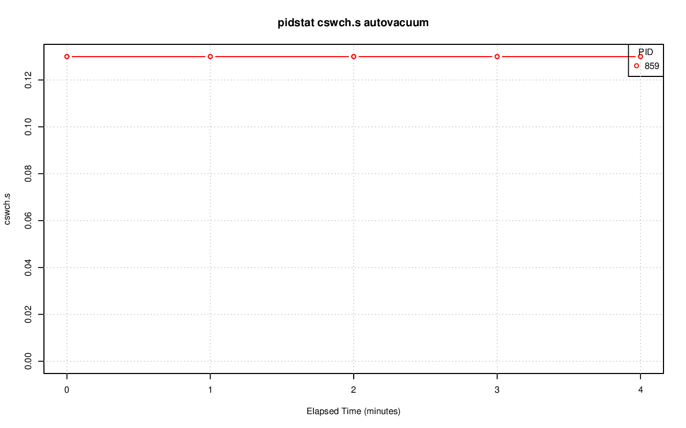

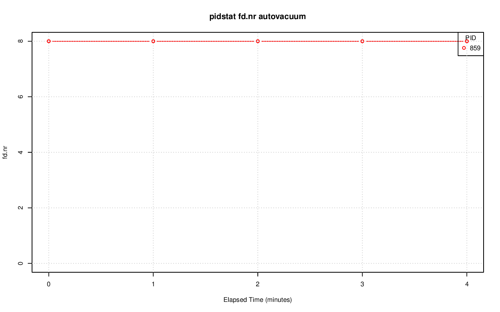

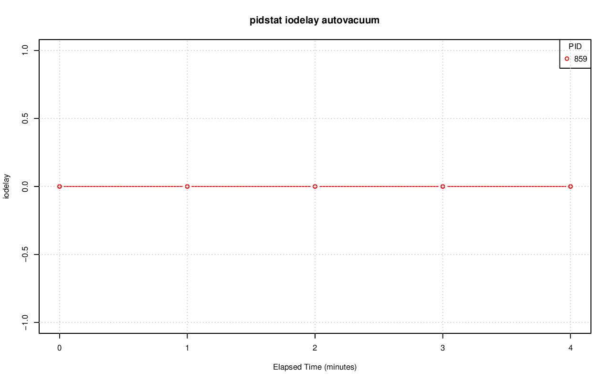

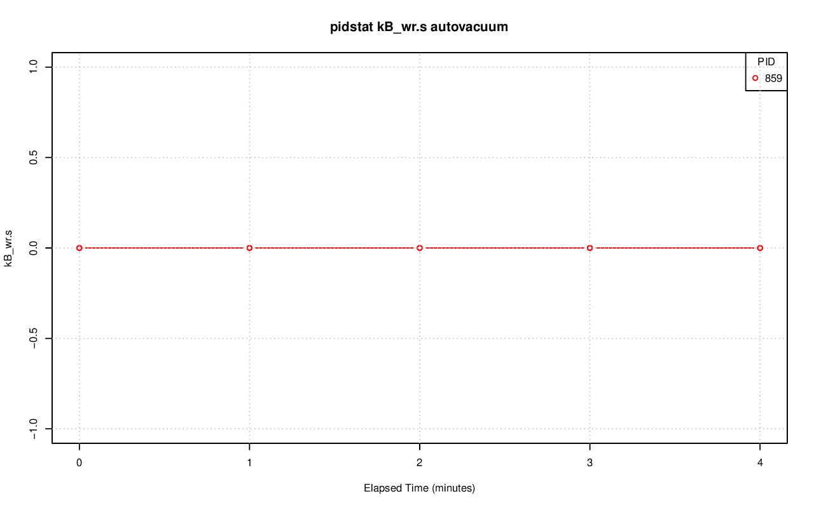

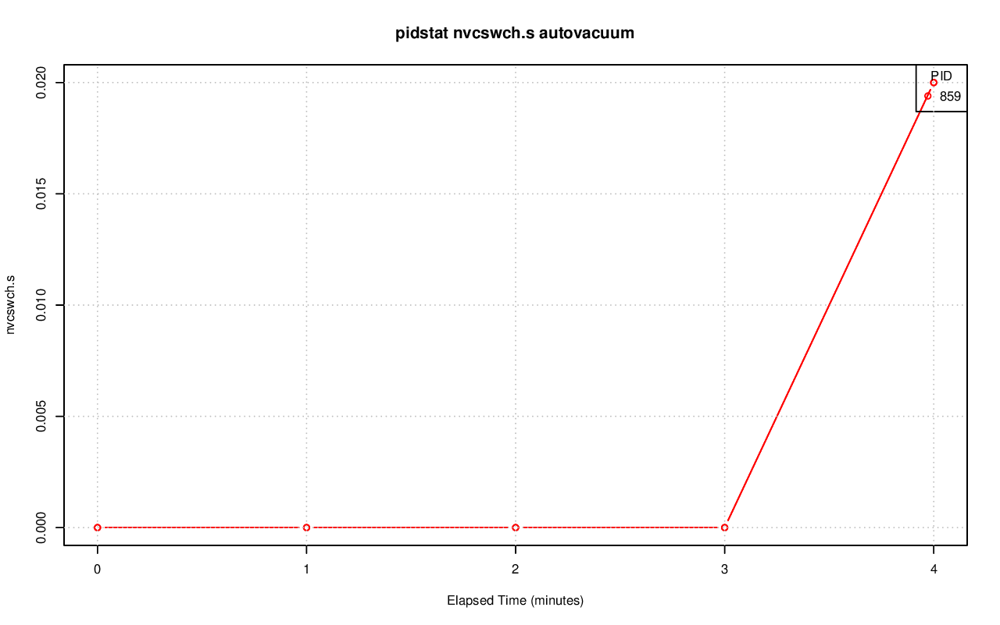

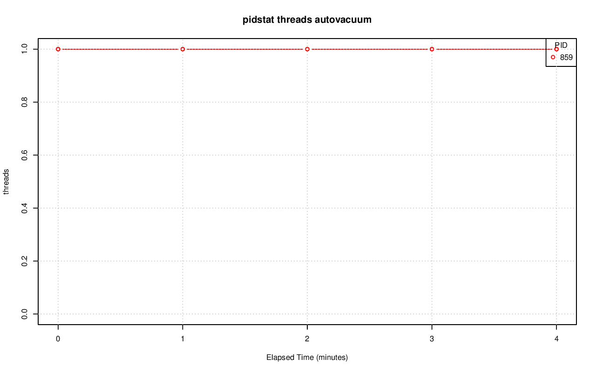
