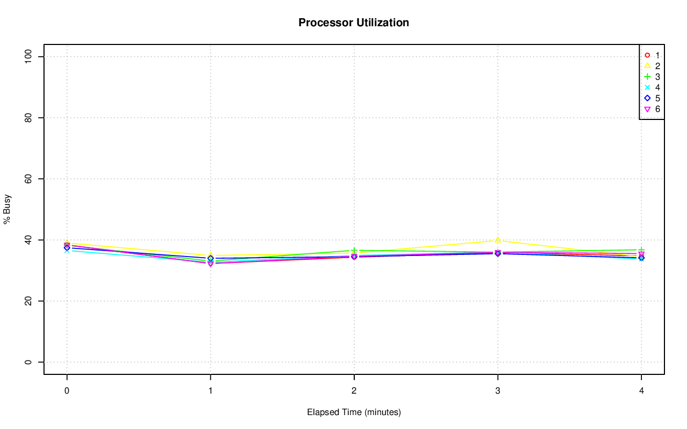
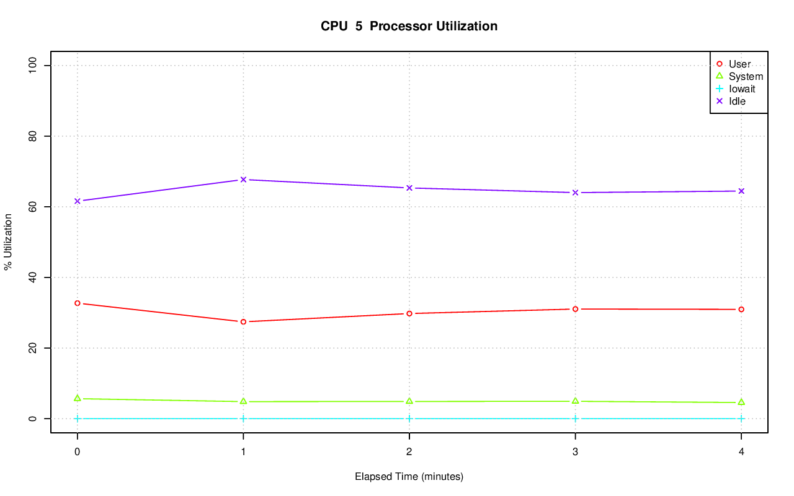
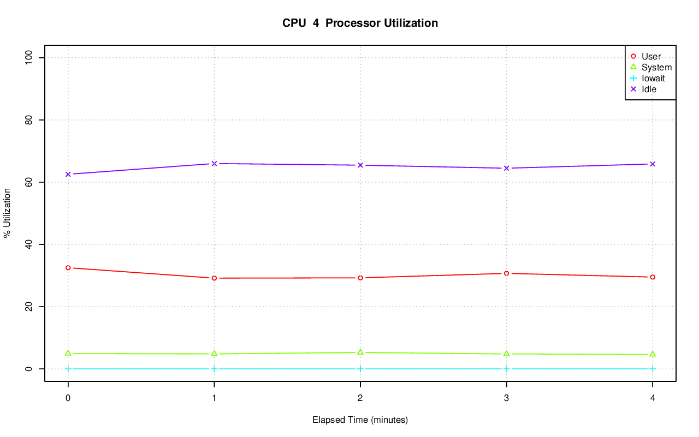
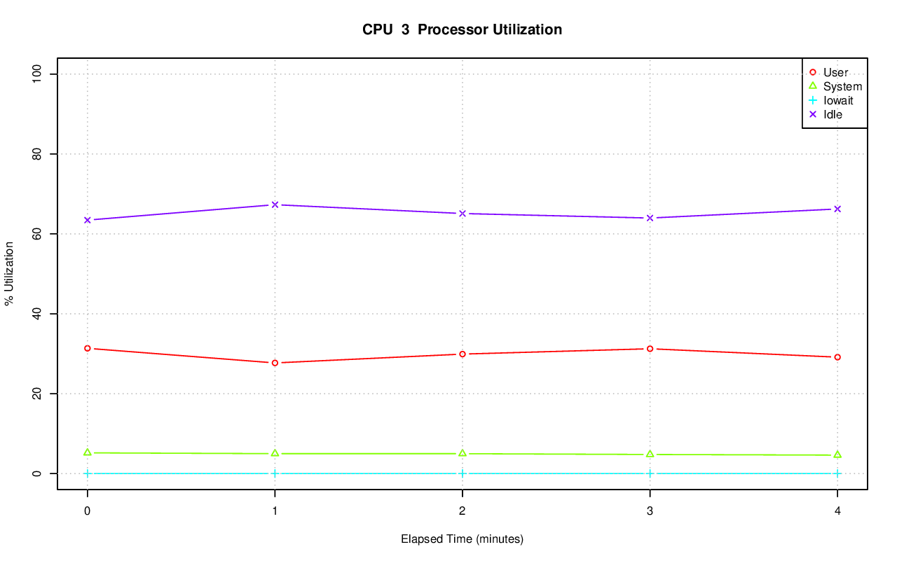
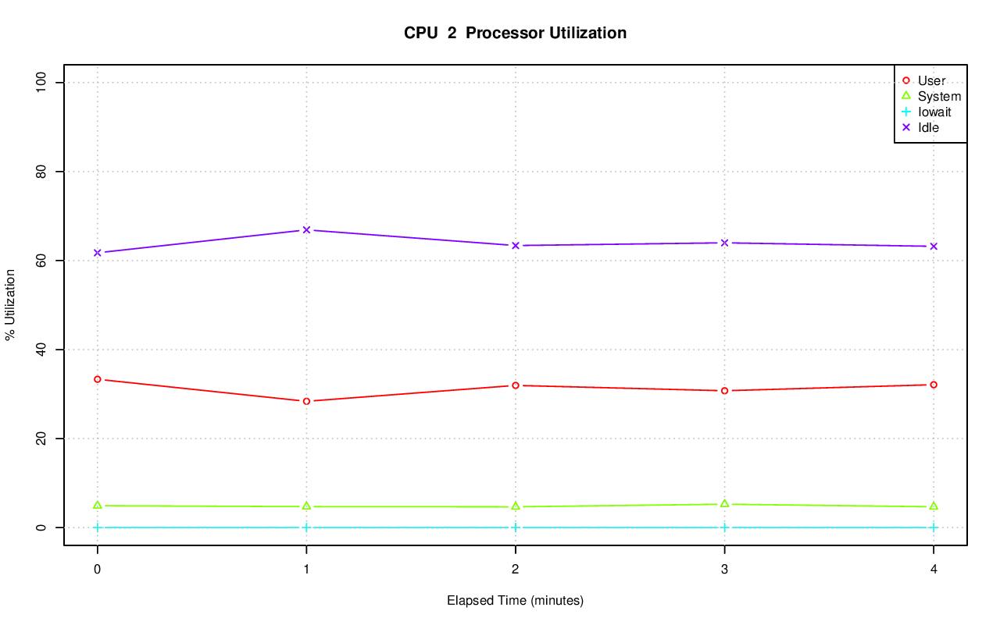
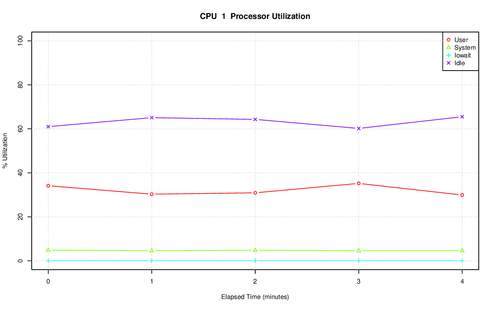
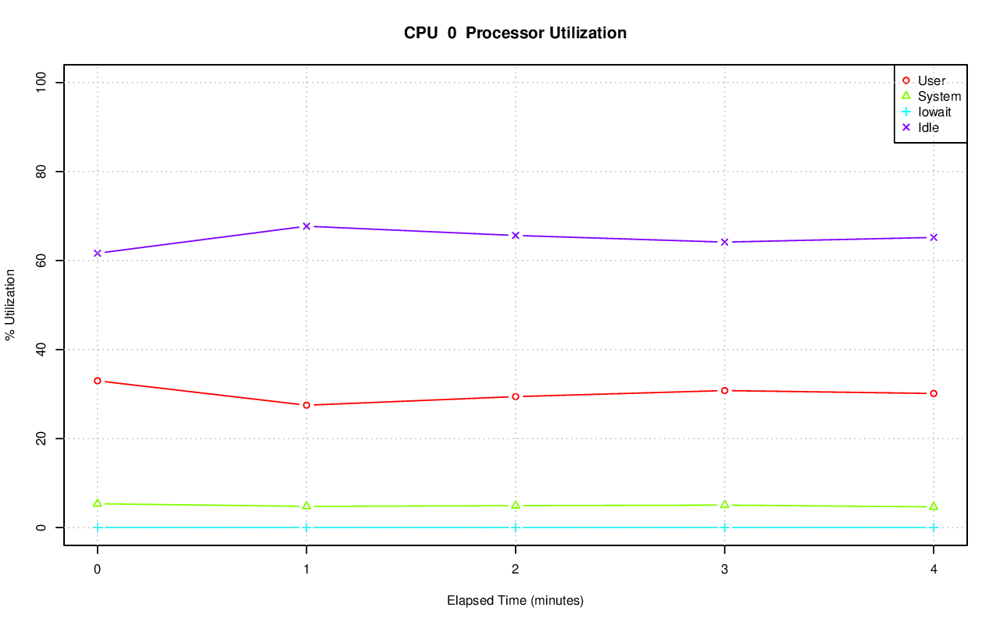
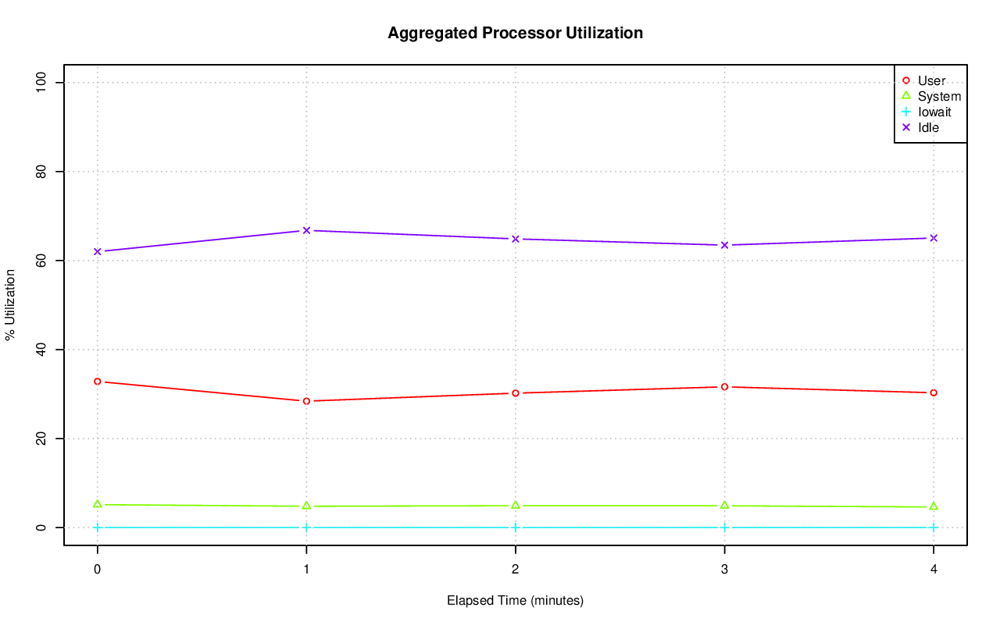

================================================================================
Database Test 2 db cpu Charts
================================================================================

