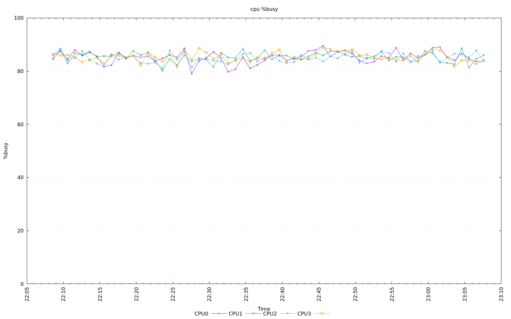
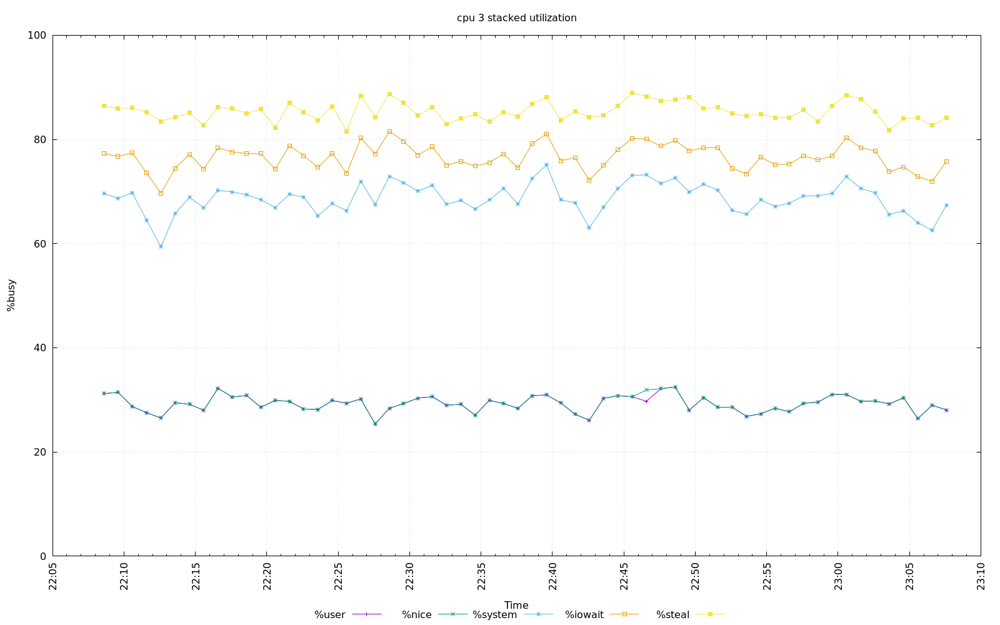
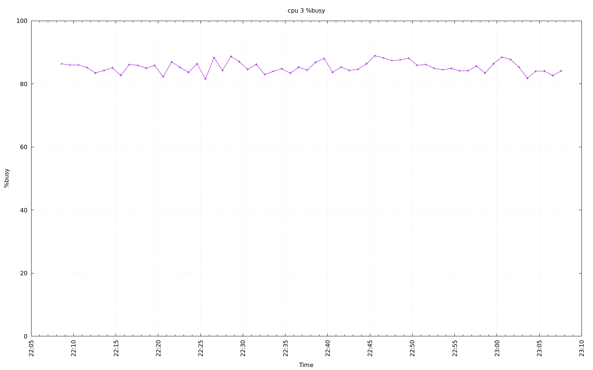
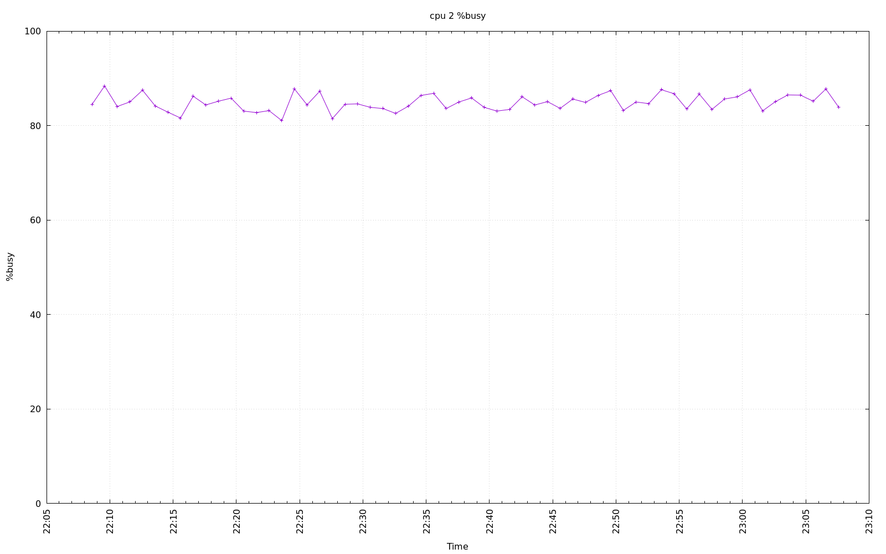
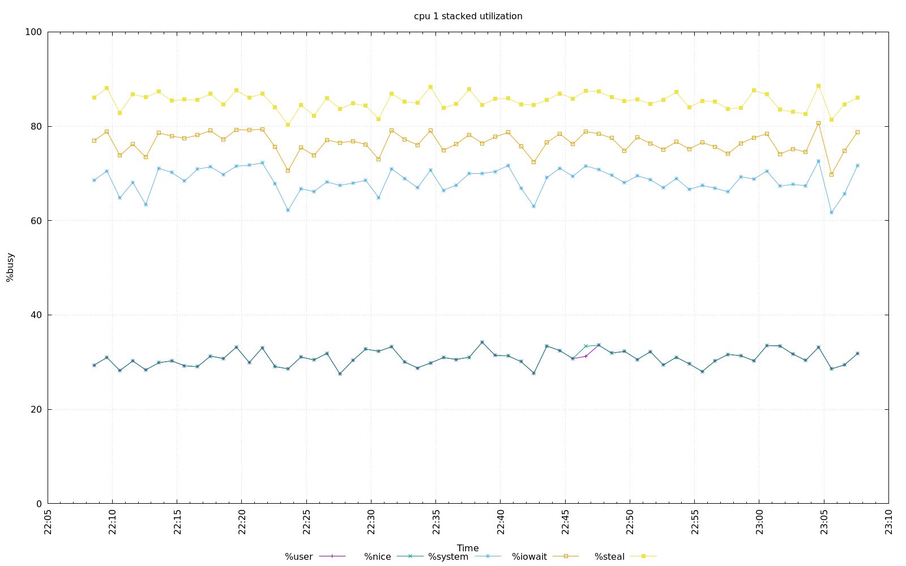
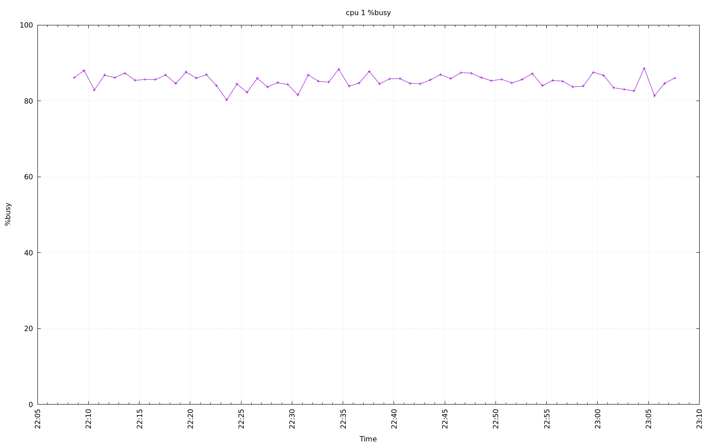
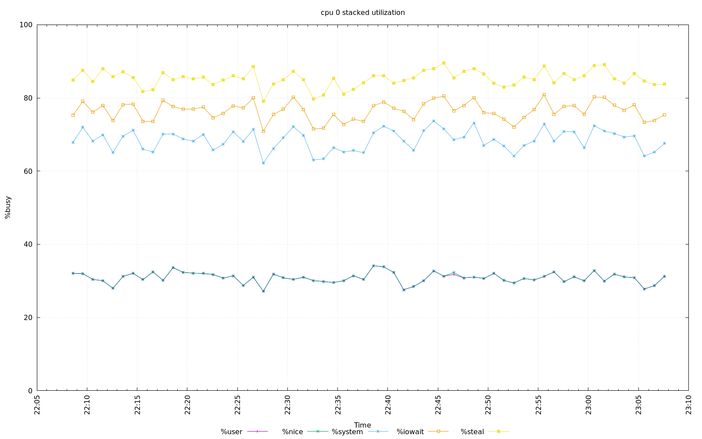
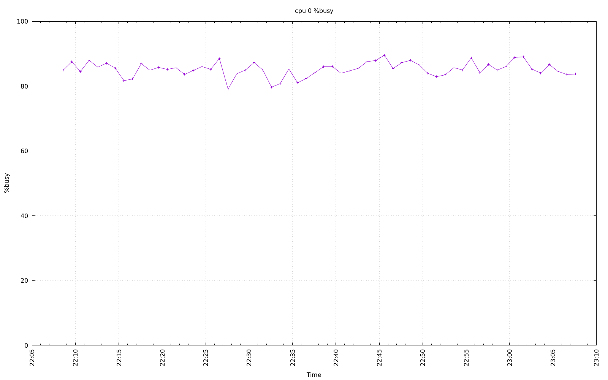
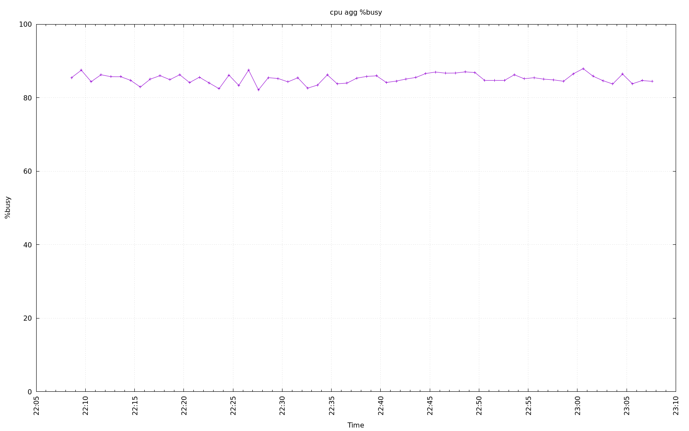

================================================================================
Database Test 2 db cpu Charts
================================================================================

.. image:: ../sysstat/sar/cpu/sar-cpu-2-stacked.png
   :target: ../sysstat/sar/cpu/sar-cpu-2-stacked.png
   :width: 100%

.. image:: ../sysstat/sar/cpu/sar-cpu-agg-stacked.png
   :target: ../sysstat/sar/cpu/sar-cpu-agg-stacked.png
   :width: 100%

