================================================================================
Database Test 2 public.district Table Charts
================================================================================

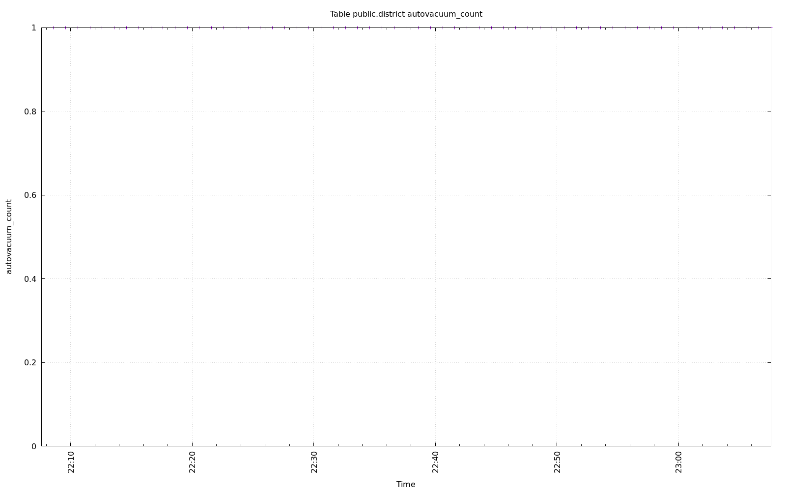

.. image:: ../pgsql-public.district-vacuum_count.png
   :target: ../pgsql-public.district-vacuum_count.png
   :width: 100%

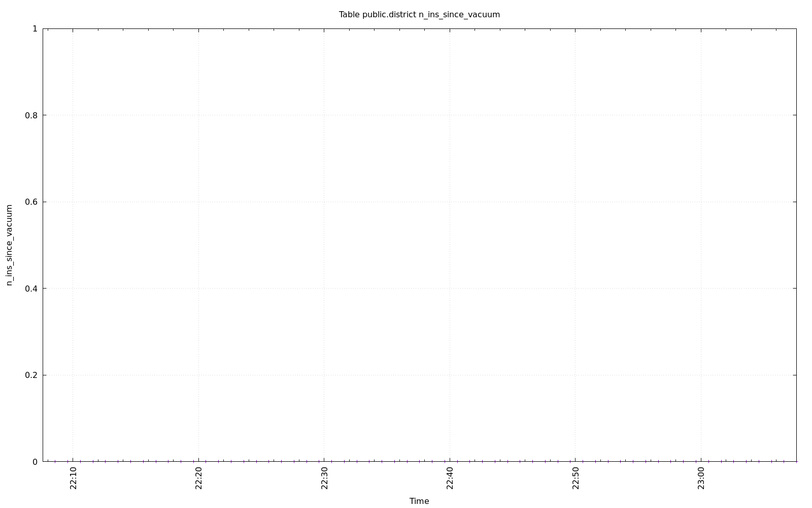

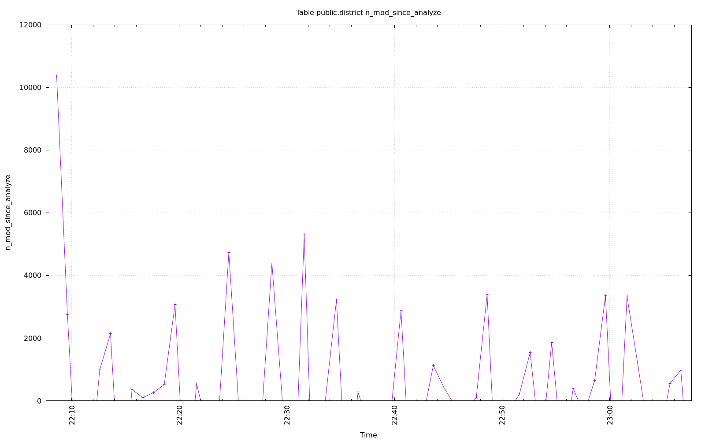

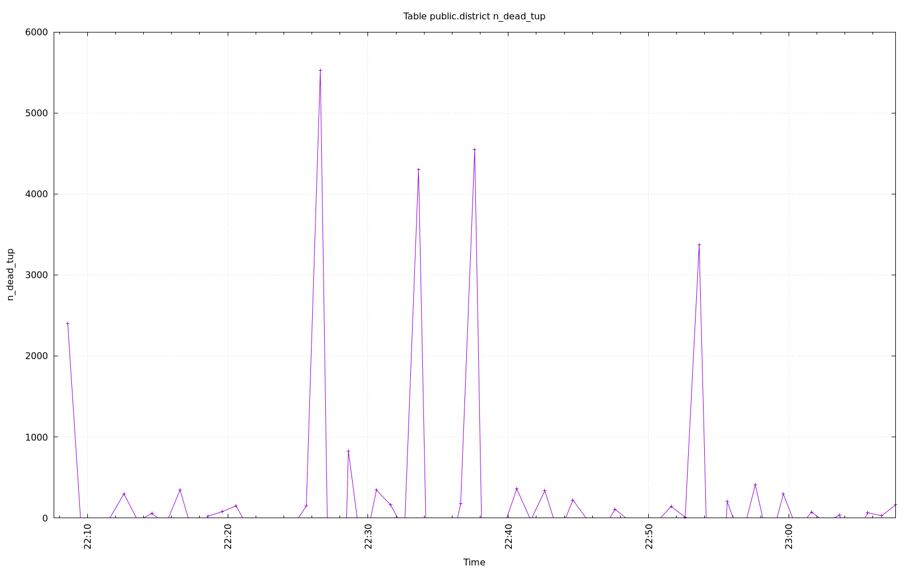

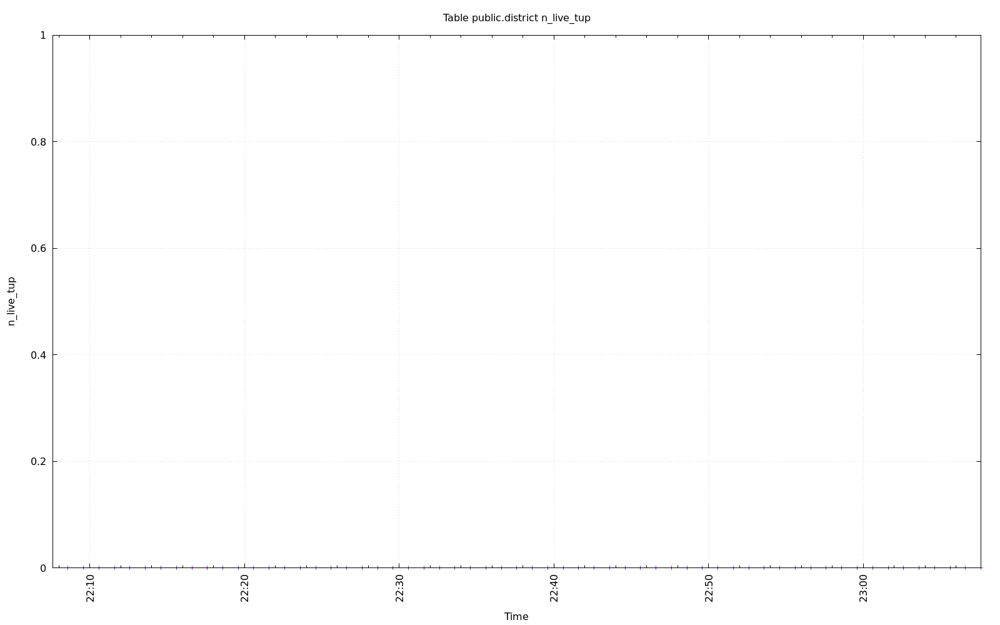

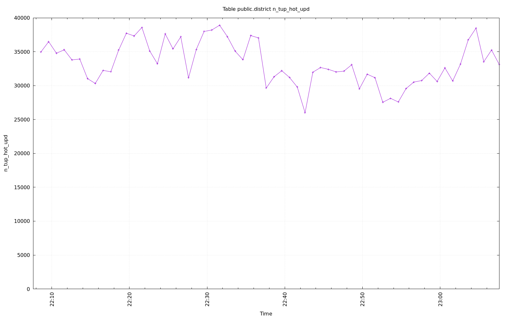

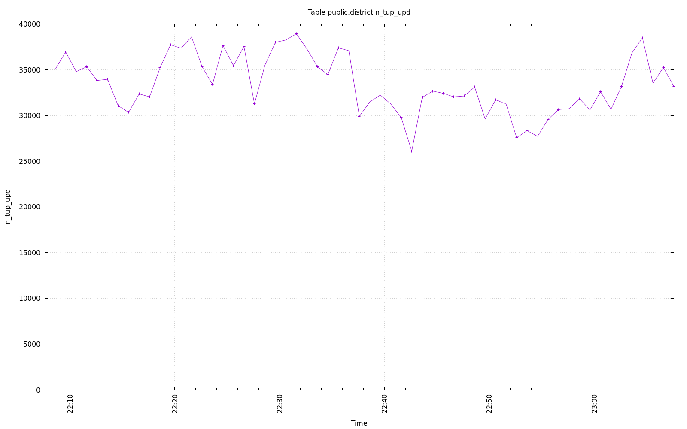

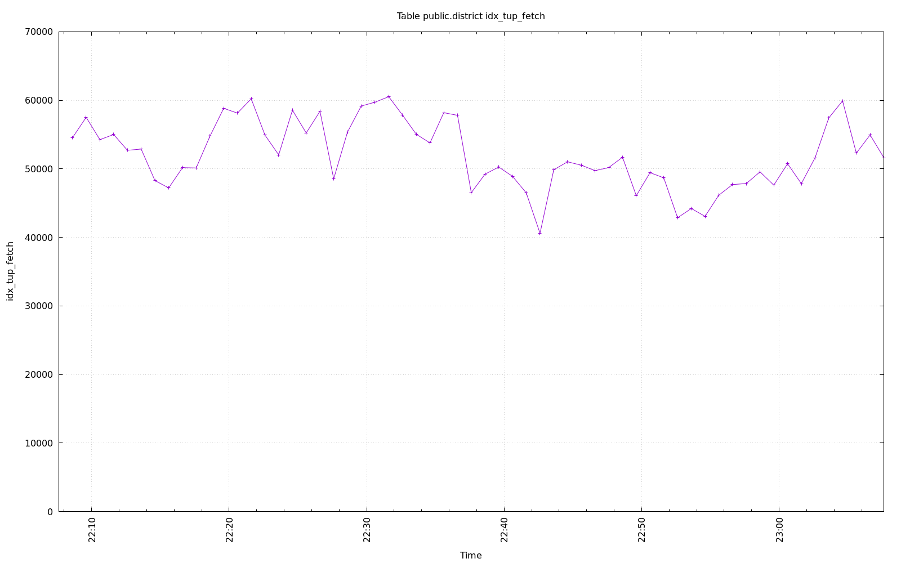

.. image:: ../pgsql-public.district-idx_scan.png
   :target: ../pgsql-public.district-idx_scan.png
   :width: 100%

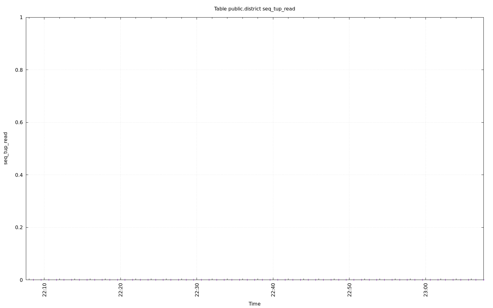

.. image:: ../pgsql-public.district-tidx_blks_hit.png
   :target: ../pgsql-public.district-tidx_blks_hit.png
   :width: 100%

.. image:: ../pgsql-public.district-tidx_blks_read.png
   :target: ../pgsql-public.district-tidx_blks_read.png
   :width: 100%

.. image:: ../pgsql-public.district-toast_blks_hit.png
   :target: ../pgsql-public.district-toast_blks_hit.png
   :width: 100%

.. image:: ../pgsql-public.district-toast_blks_read.png
   :target: ../pgsql-public.district-toast_blks_read.png
   :width: 100%

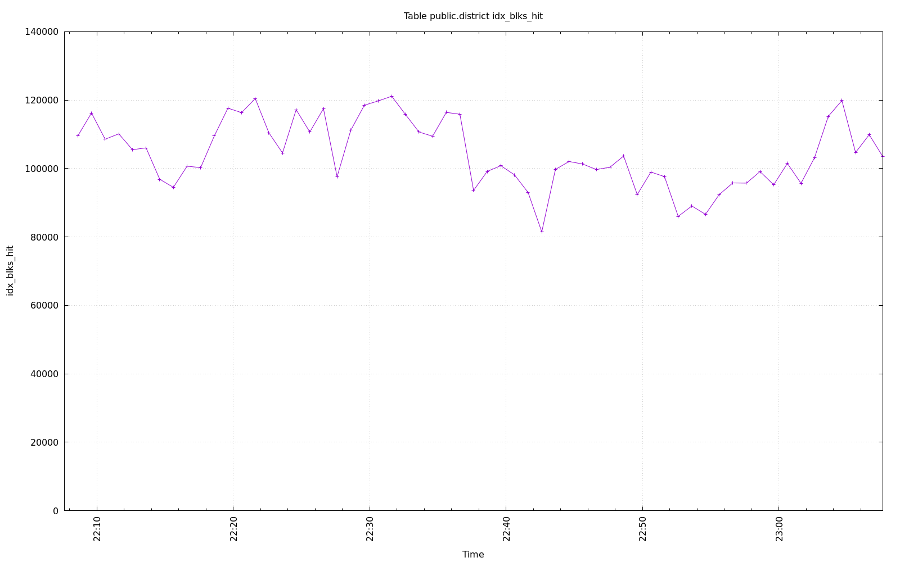

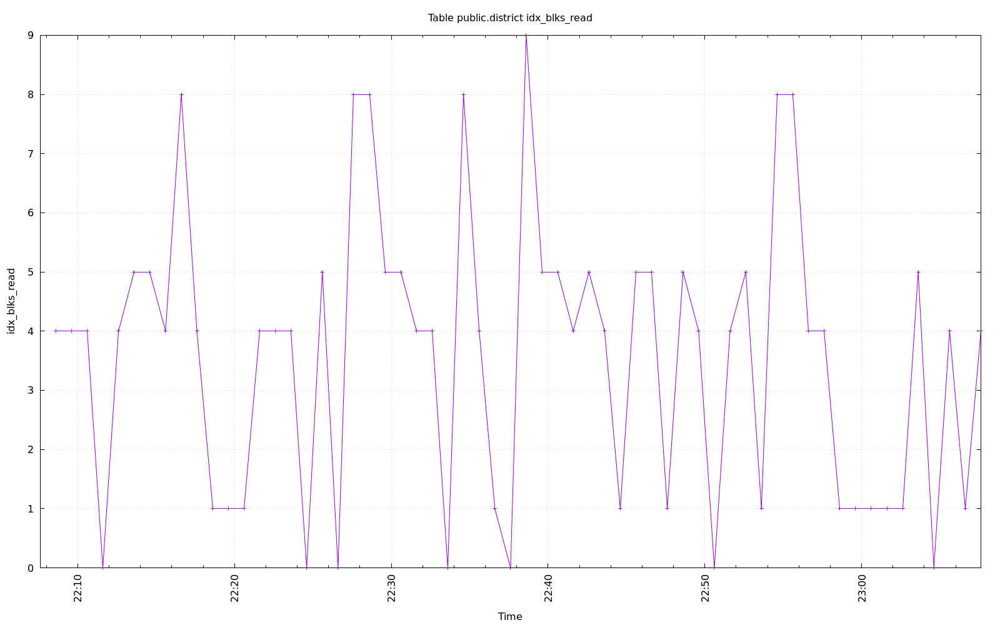

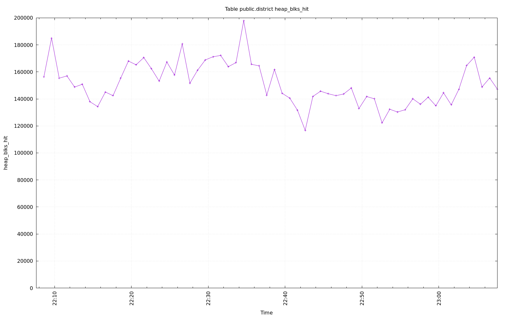

.. image:: ../pgsql-public.district-heap_blks_read.png
   :target: ../pgsql-public.district-heap_blks_read.png
   :width: 100%
