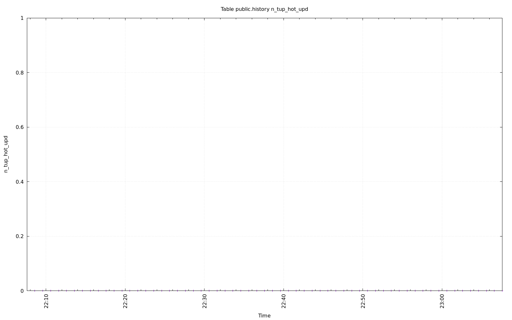

================================================================================
Database Test 2 public.history Table Charts
================================================================================

.. image:: ../pgsql-public.history-n_mod_since_analyze.png
   :target: ../pgsql-public.history-n_mod_since_analyze.png
   :width: 100%

.. image:: ../pgsql-public.history-idx_tup_fetch.png
   :target: ../pgsql-public.history-idx_tup_fetch.png
   :width: 100%

.. image:: ../pgsql-public.history-idx_scan.png
   :target: ../pgsql-public.history-idx_scan.png
   :width: 100%

.. image:: ../pgsql-public.history-tidx_blks_hit.png
   :target: ../pgsql-public.history-tidx_blks_hit.png
   :width: 100%

.. image:: ../pgsql-public.history-tidx_blks_read.png
   :target: ../pgsql-public.history-tidx_blks_read.png
   :width: 100%

.. image:: ../pgsql-public.history-toast_blks_hit.png
   :target: ../pgsql-public.history-toast_blks_hit.png
   :width: 100%

.. image:: ../pgsql-public.history-toast_blks_read.png
   :target: ../pgsql-public.history-toast_blks_read.png
   :width: 100%

.. image:: ../pgsql-public.history-idx_blks_hit.png
   :target: ../pgsql-public.history-idx_blks_hit.png
   :width: 100%

.. image:: ../pgsql-public.history-idx_blks_read.png
   :target: ../pgsql-public.history-idx_blks_read.png
   :width: 100%

.. image:: ../pgsql-public.history-heap_blks_read.png
   :target: ../pgsql-public.history-heap_blks_read.png
   :width: 100%
