================================================================================
Database Test 2 pidstat logical Charts
================================================================================

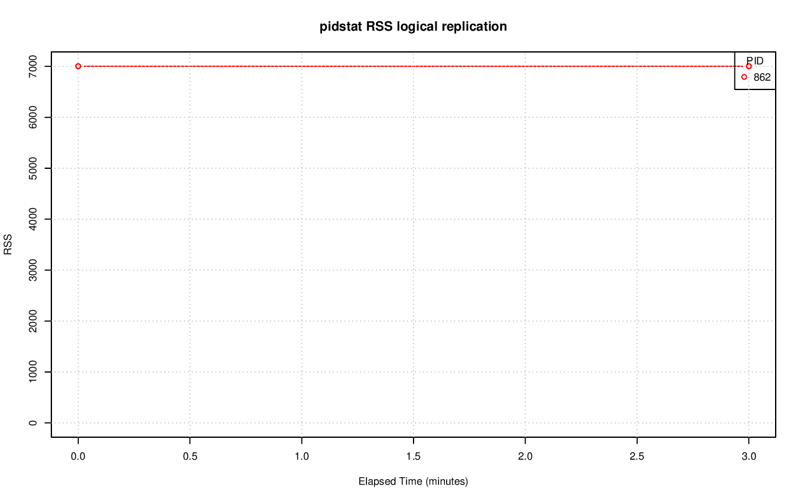

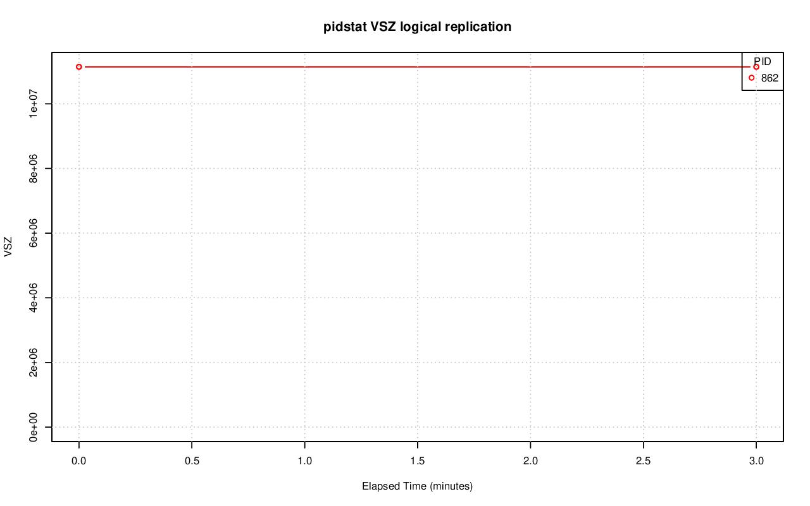

.. image:: pidstat-logical-X.CPU.png
   :target: pidstat-logical-X.CPU.png
   :width: 100%

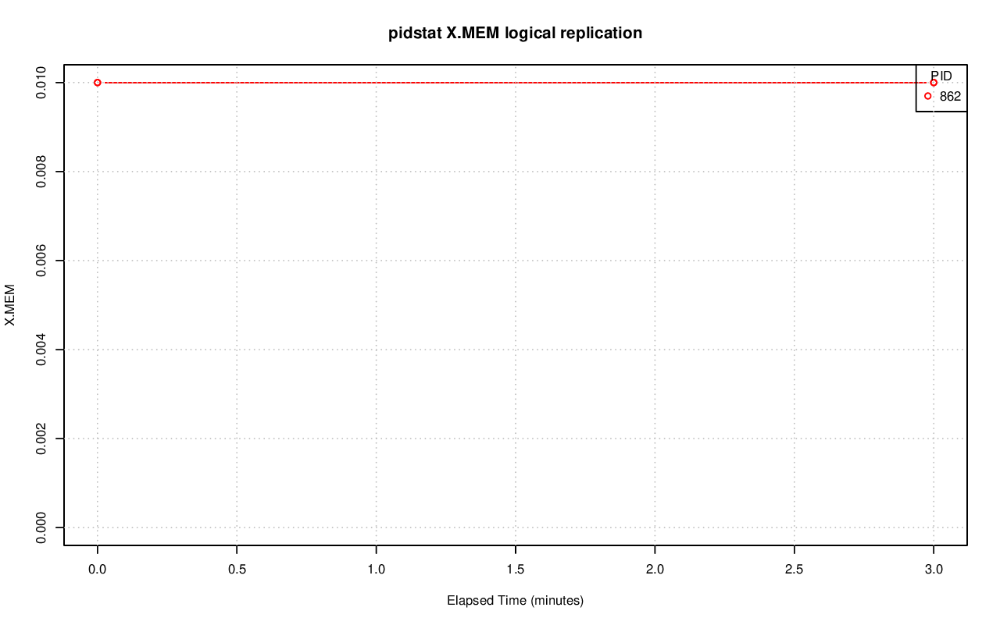

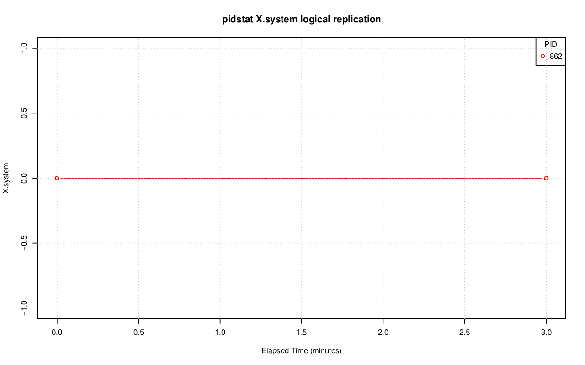

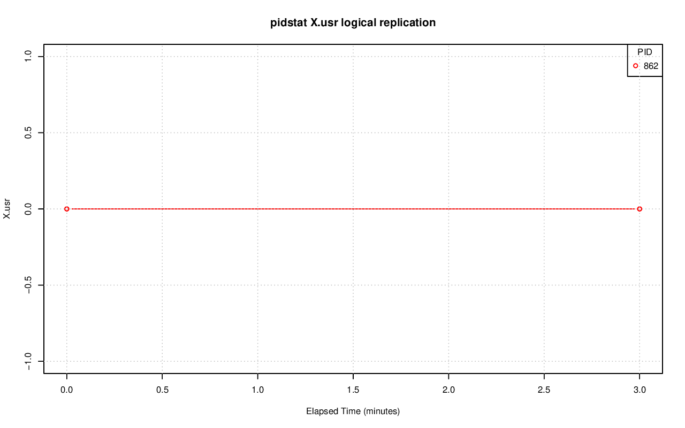

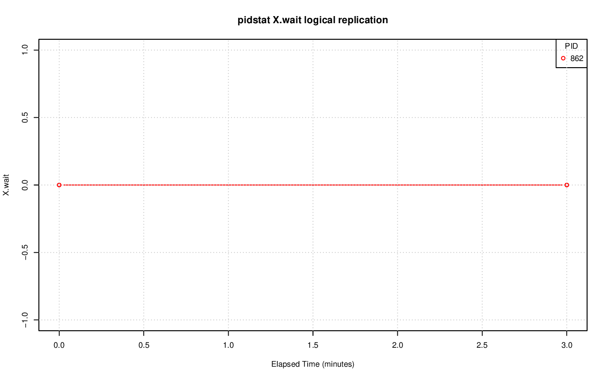

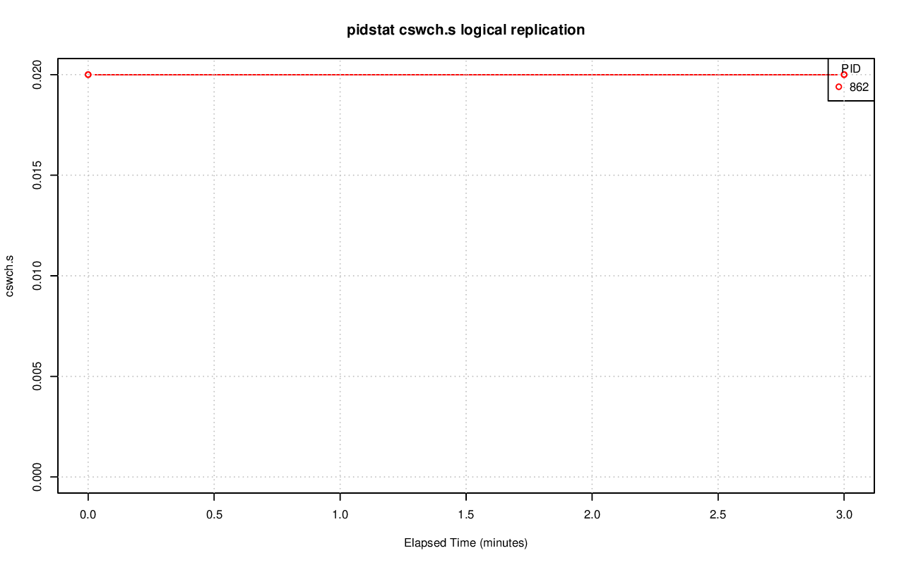

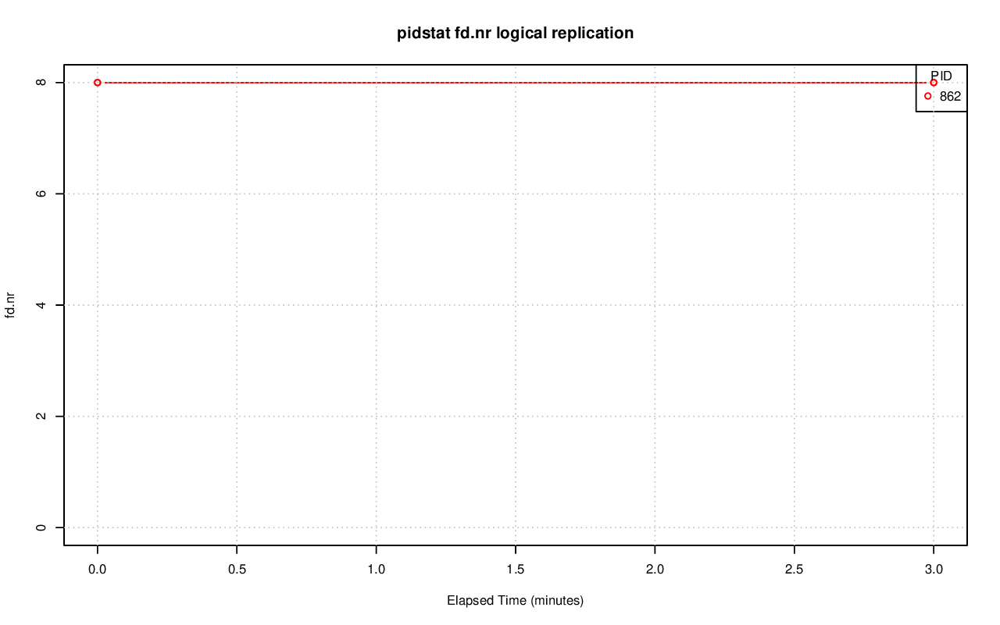

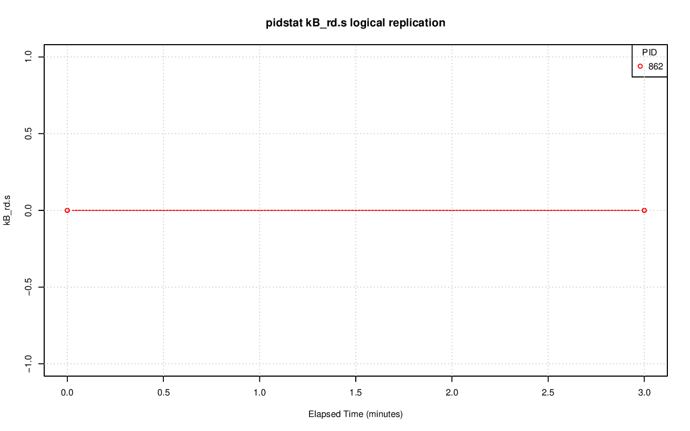

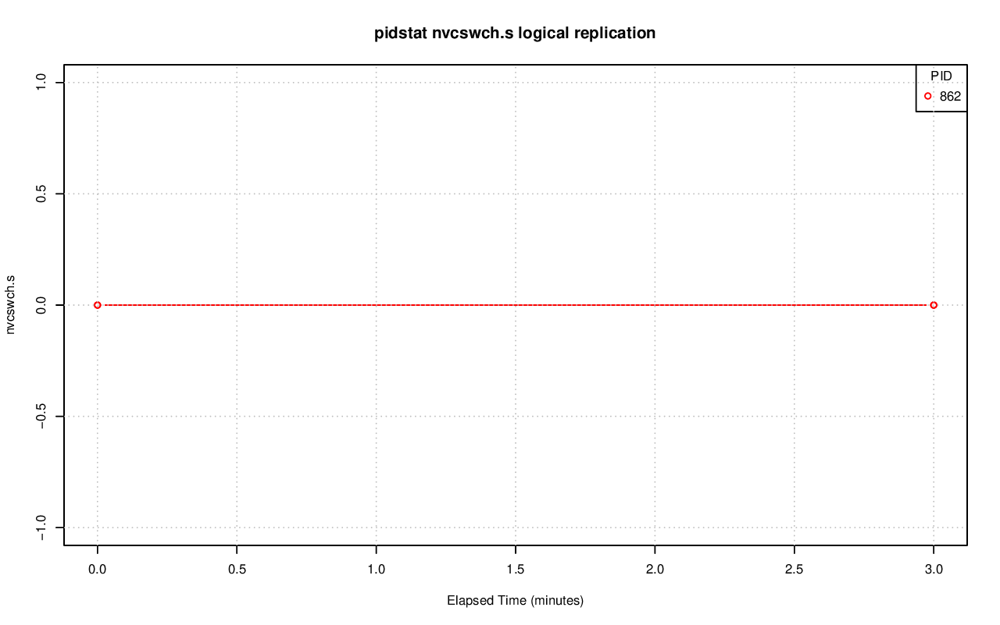

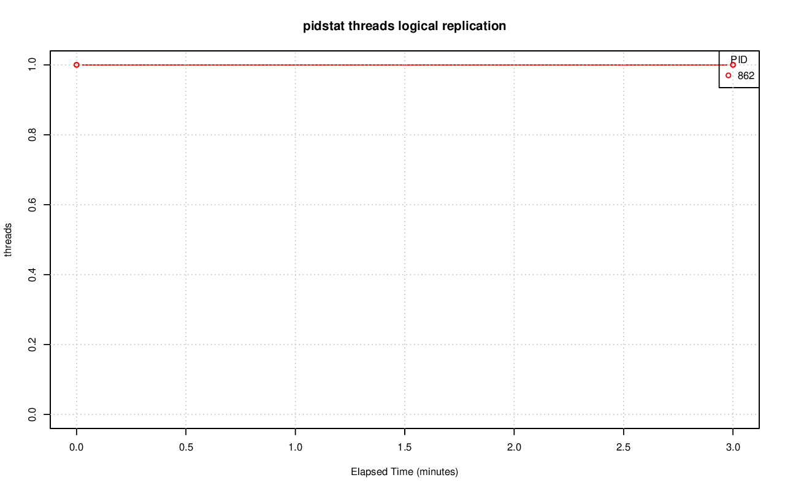
