================================================================================
Database Test 2 pidstat statscollector Charts
================================================================================

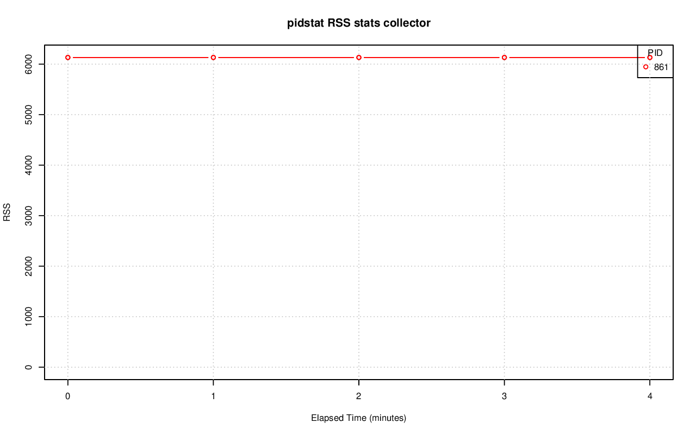

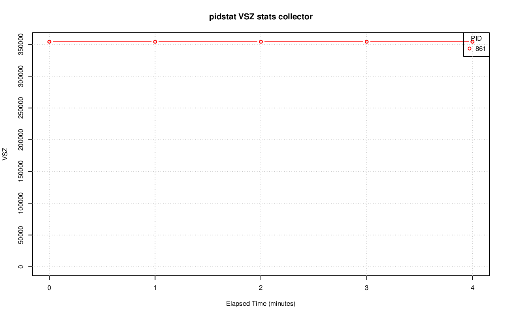

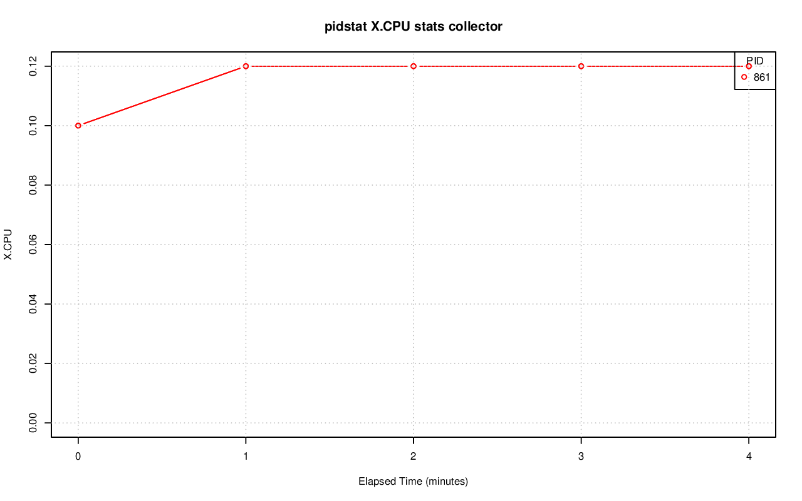

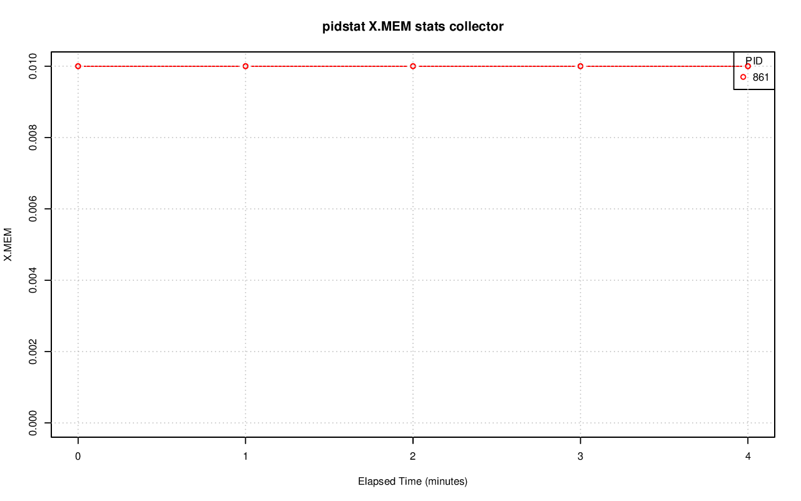

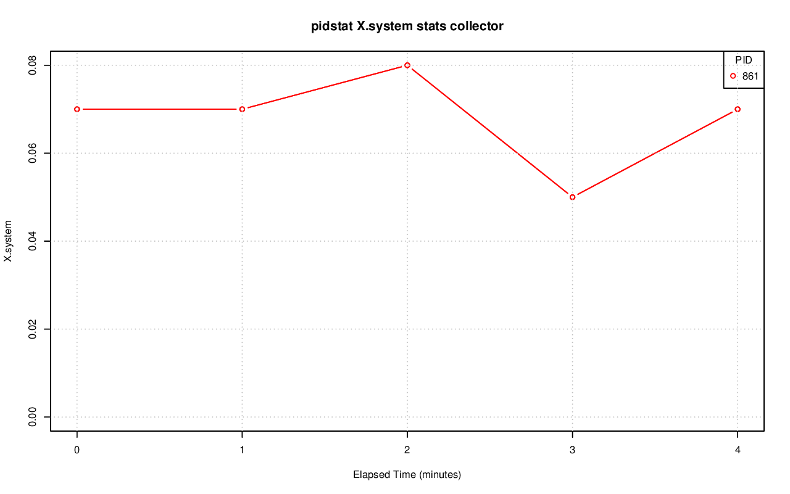

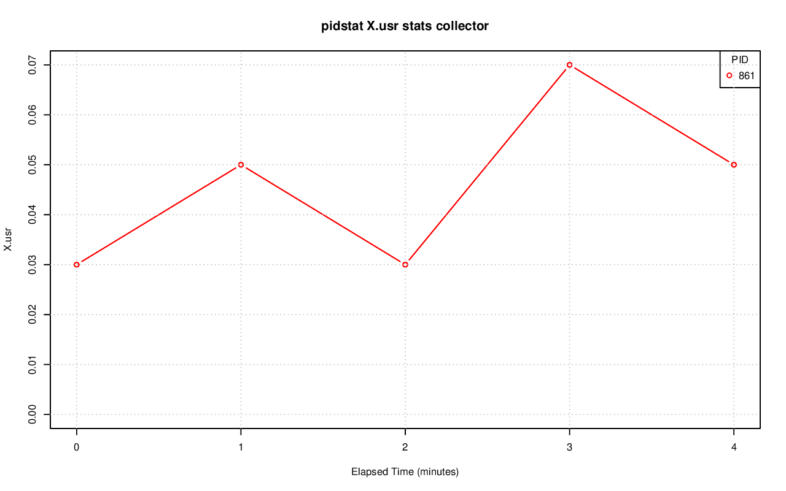

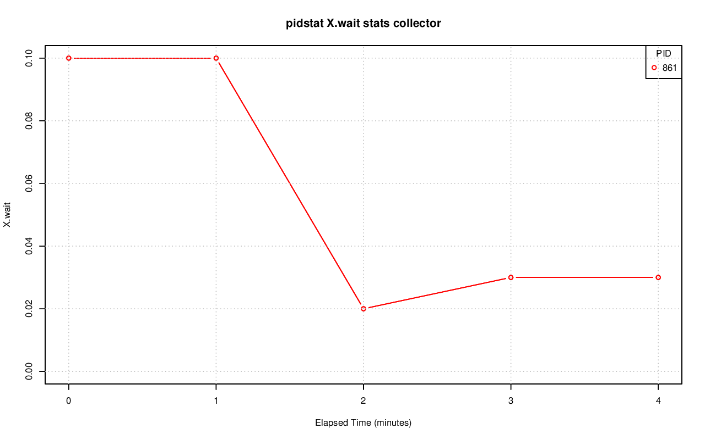

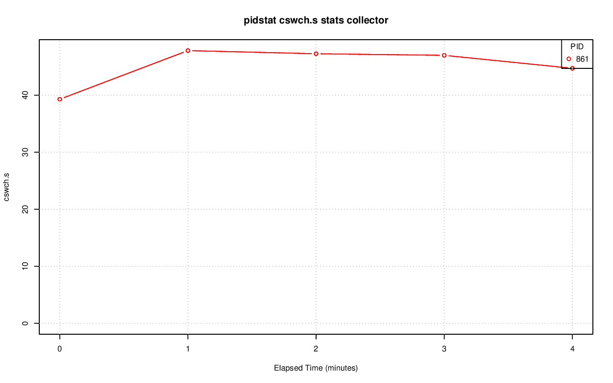

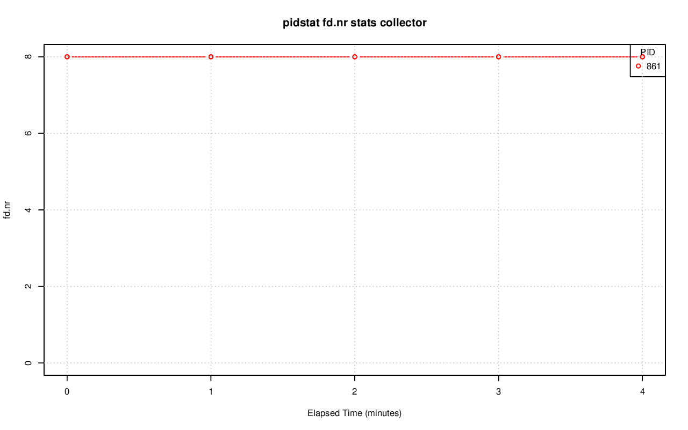

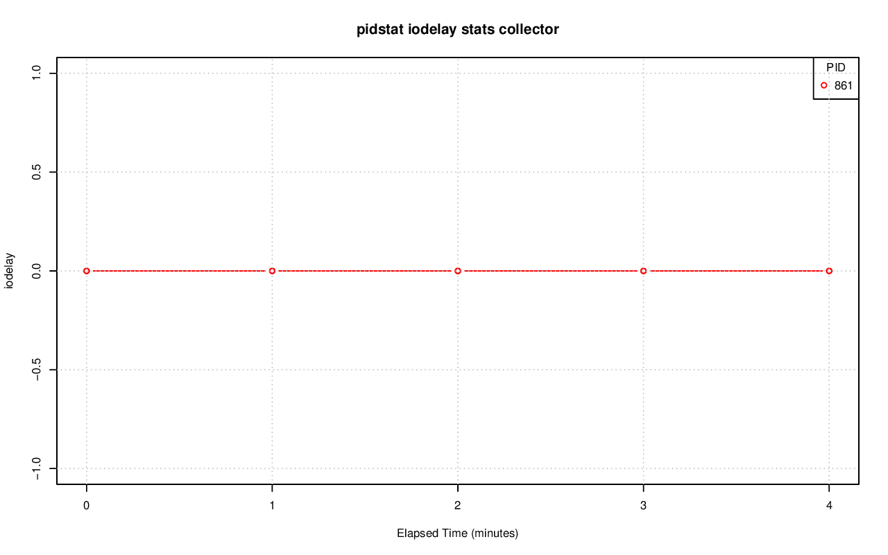

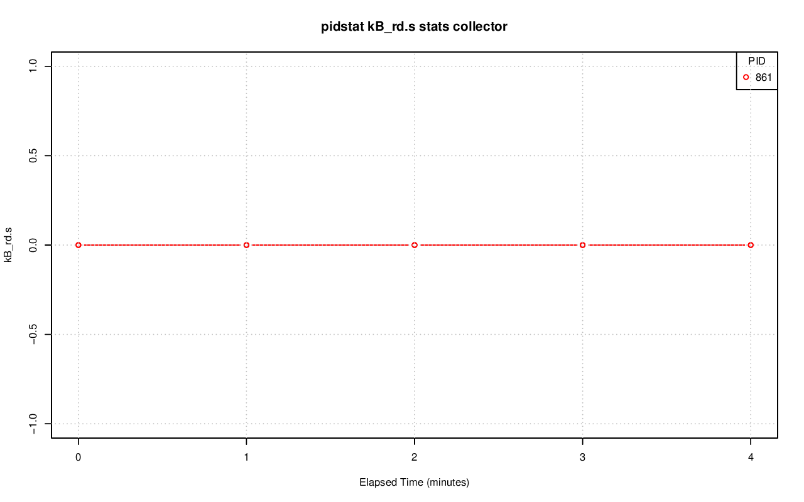

.. image:: pidstat-statscollector-kB_wr.s.png
   :target: pidstat-statscollector-kB_wr.s.png
   :width: 100%

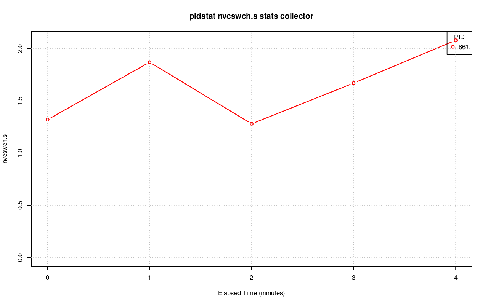

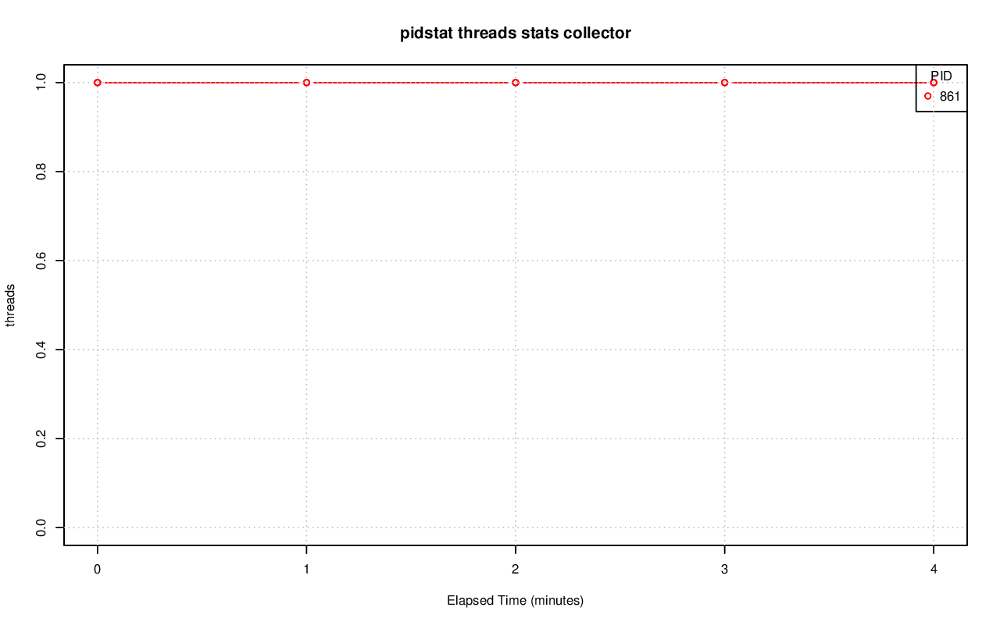
