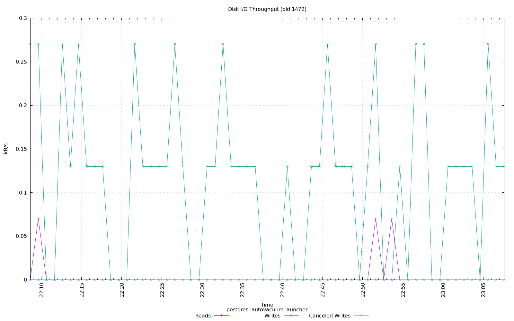
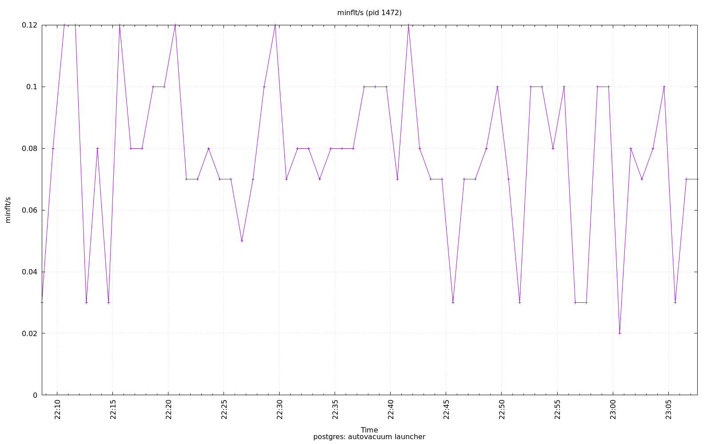
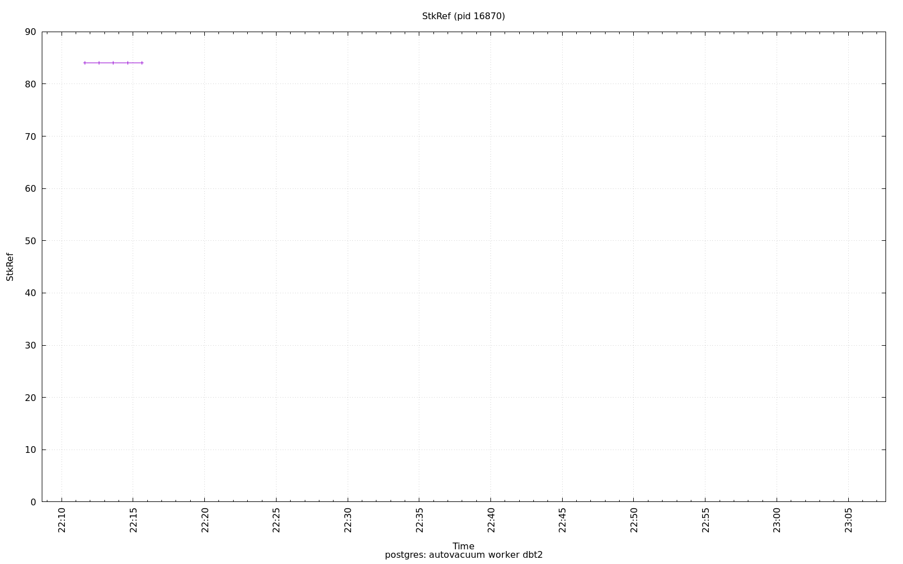
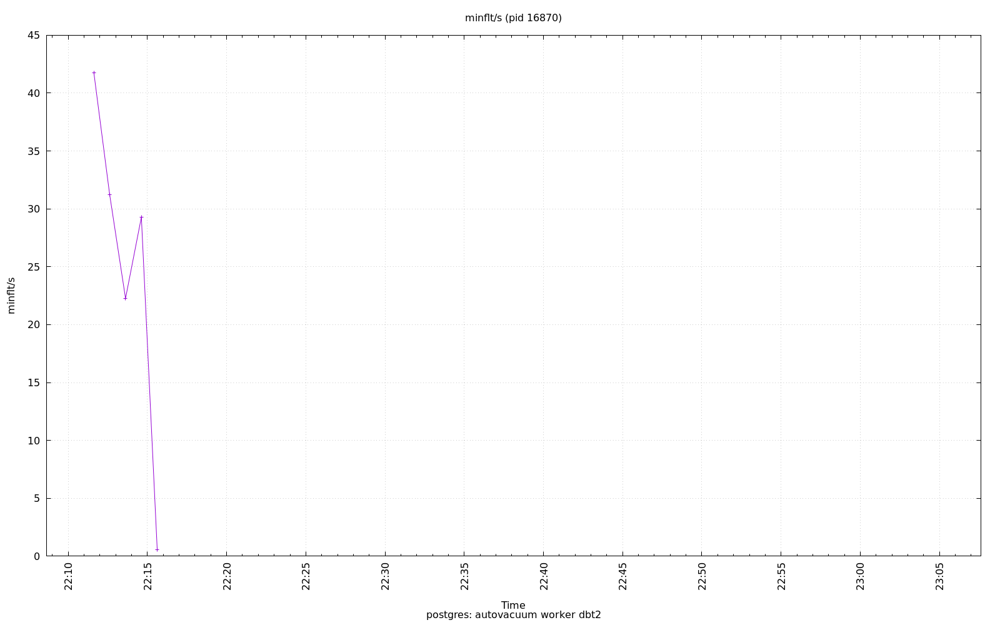
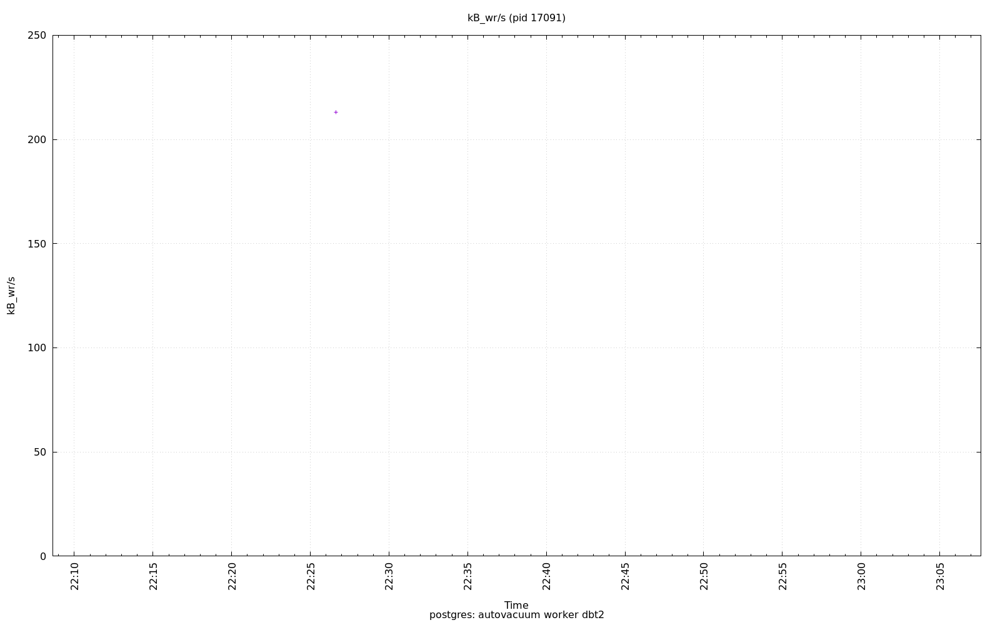
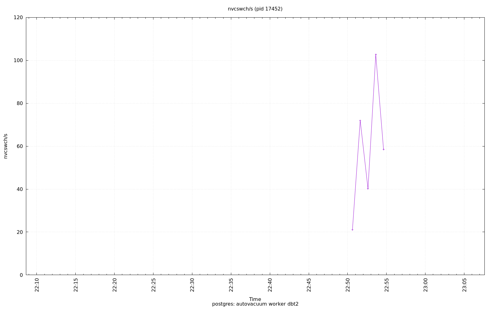

================================================================================
Database Test 2 pidstat autovacuum Charts
================================================================================

.. image:: ../pidstat/pidstat-1472-threads.png
   :target: ../pidstat/pidstat-1472-threads.png
   :width: 100%

.. image:: ../pidstat/pidstat-16870-MEM.png
   :target: ../pidstat/pidstat-16870-MEM.png
   :width: 100%

.. image:: ../pidstat/pidstat-17452-system.png
   :target: ../pidstat/pidstat-17452-system.png
   :width: 100%

.. image:: ../pidstat/pidstat-17496-system.png
   :target: ../pidstat/pidstat-17496-system.png
   :width: 100%

.. image:: ../pidstat/pidstat-17658-guest.png
   :target: ../pidstat/pidstat-17658-guest.png
   :width: 100%

.. image:: ../pidstat/pidstat-17658-majflt_s.png
   :target: ../pidstat/pidstat-17658-majflt_s.png
   :width: 100%

