================================================================================
Database Test 2 pidstat logical Charts
================================================================================

.. image:: ../pidstat/pidstat-1474-MEM.png
   :target: ../pidstat/pidstat-1474-MEM.png
   :width: 100%

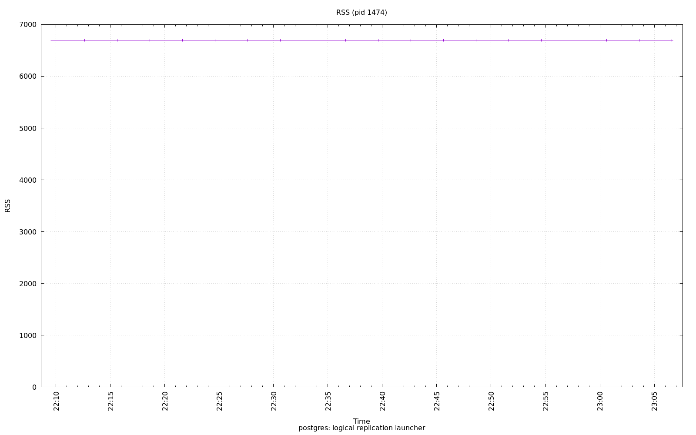

.. image:: ../pidstat/pidstat-1474-StkRef.png
   :target: ../pidstat/pidstat-1474-StkRef.png
   :width: 100%

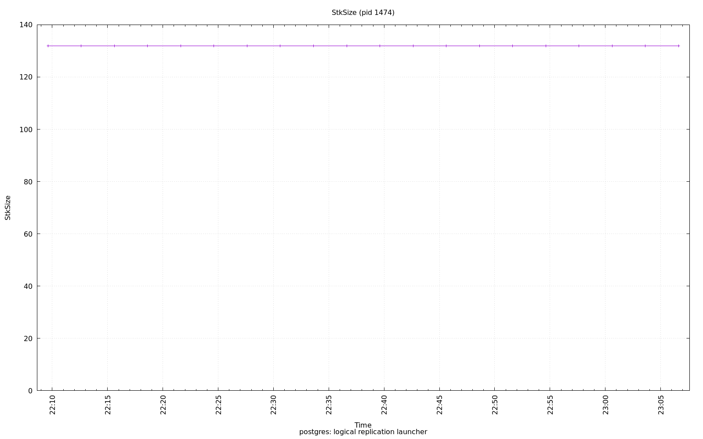

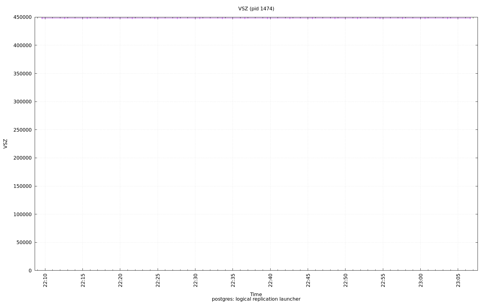

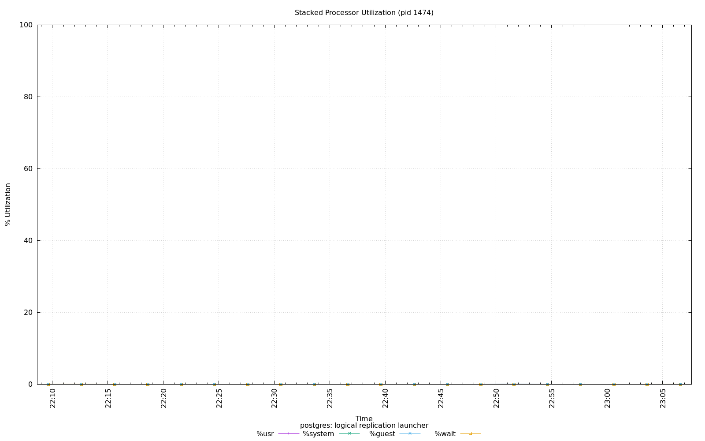

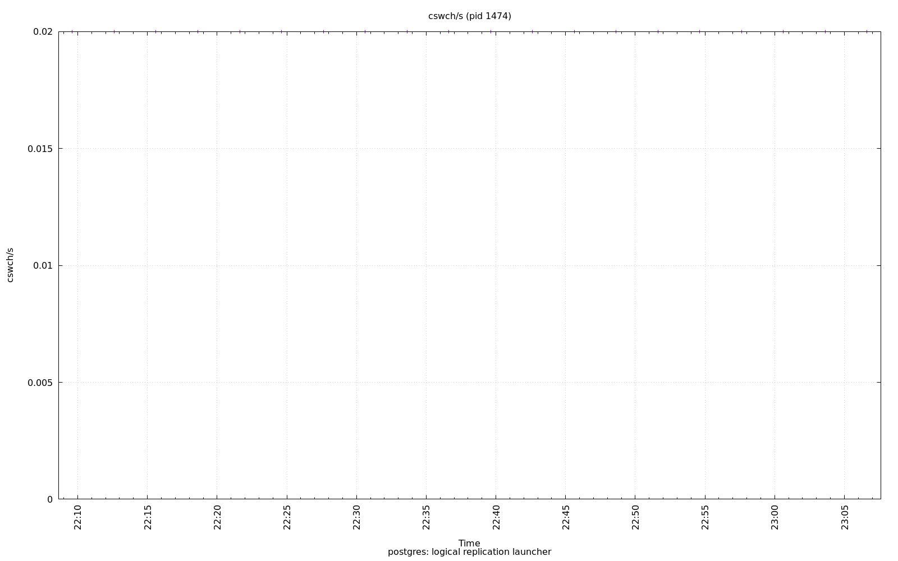

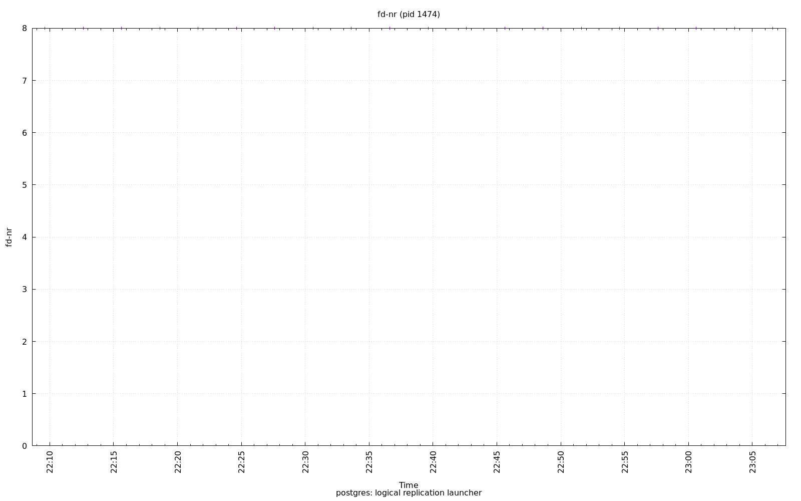

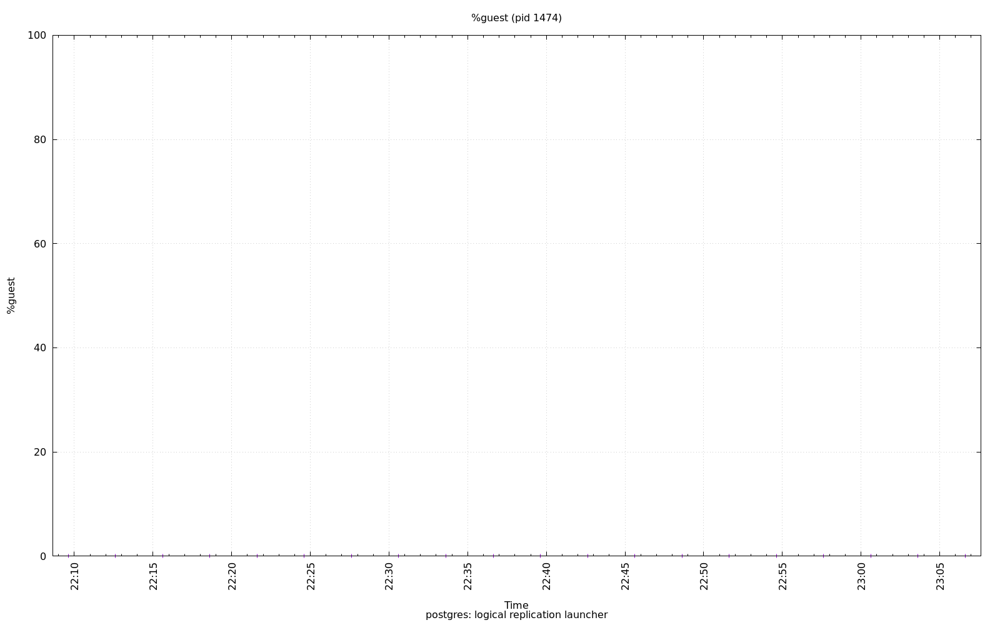

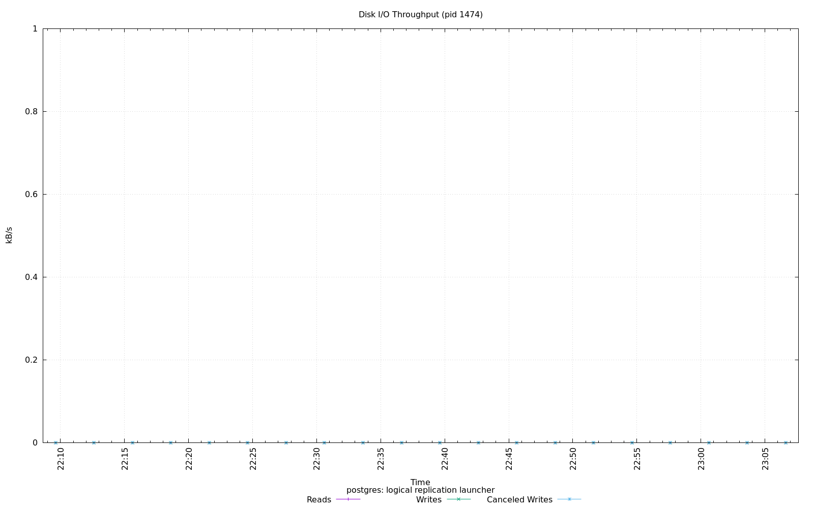

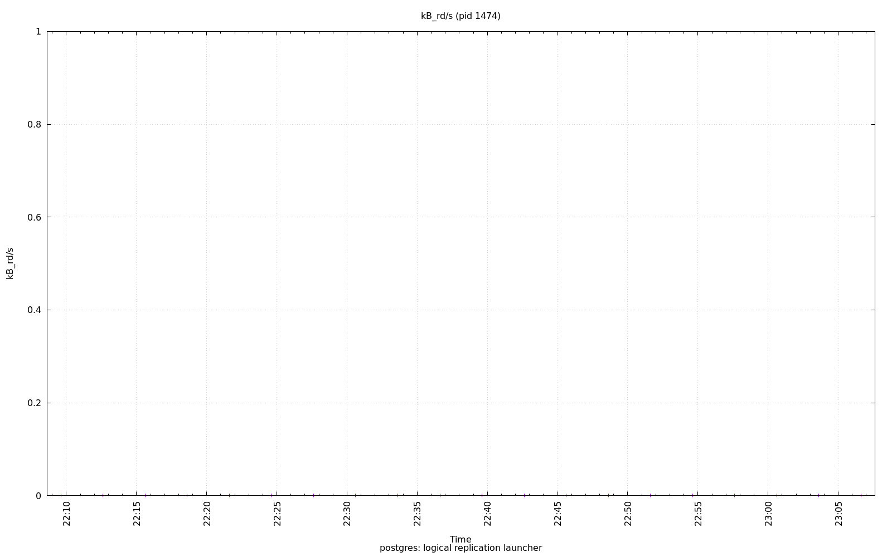

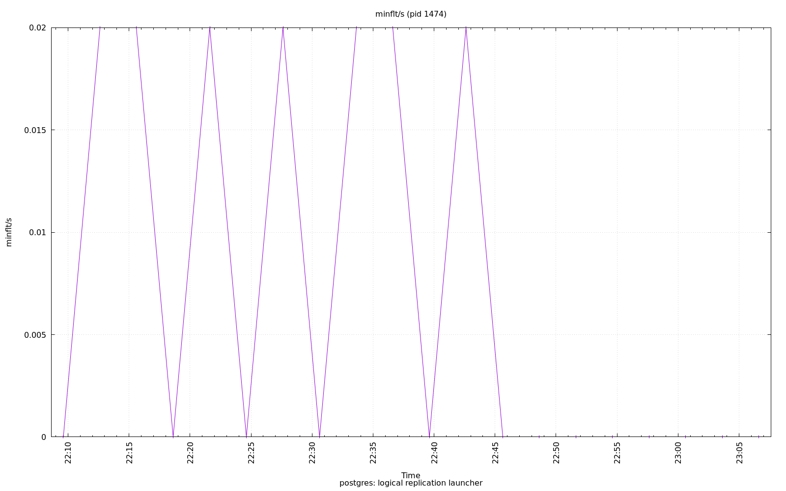

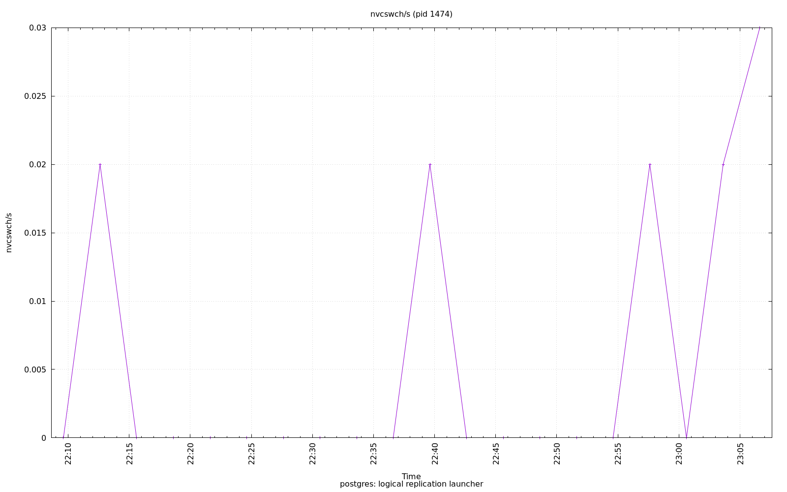

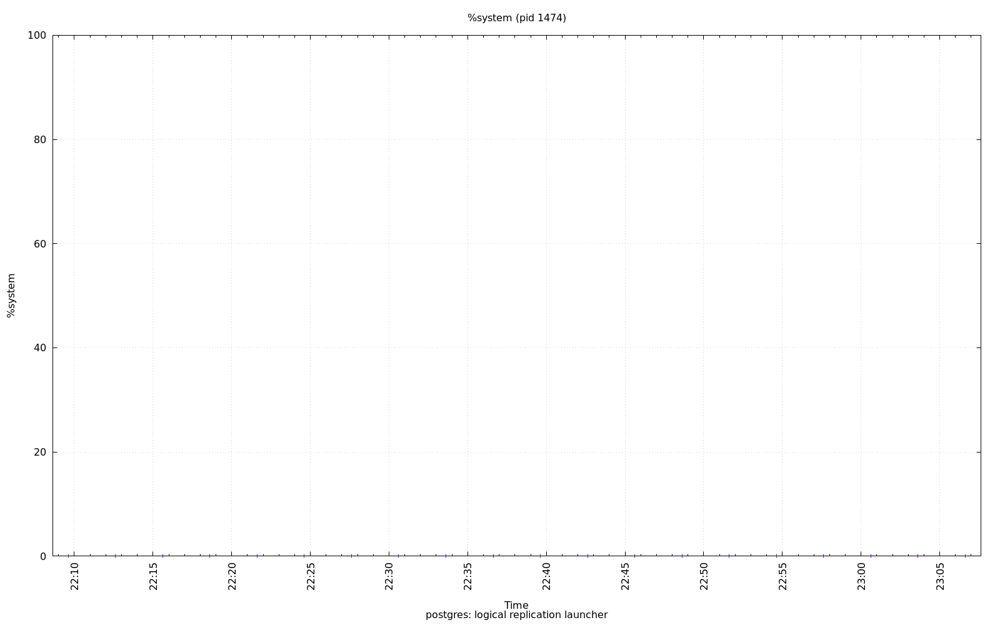

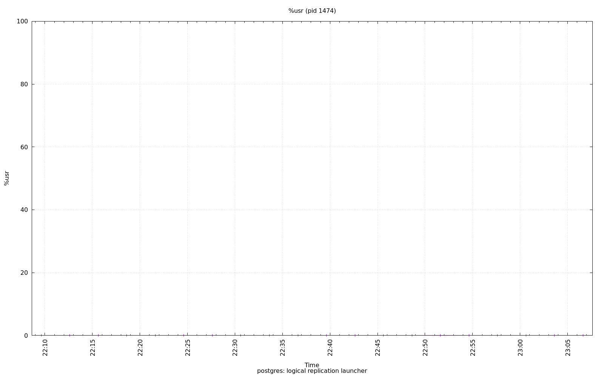

