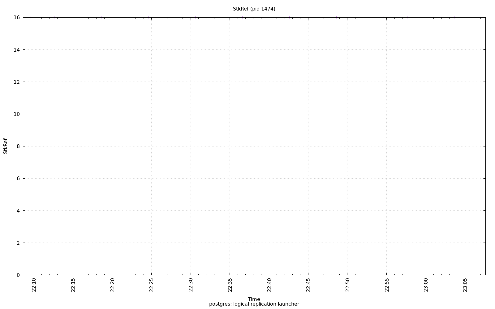

================================================================================
Database Test 2 pidstat logical Charts
================================================================================

