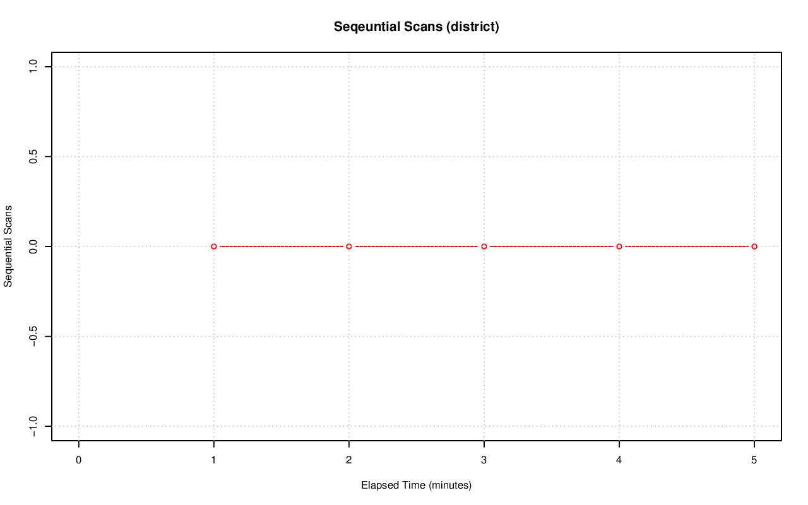
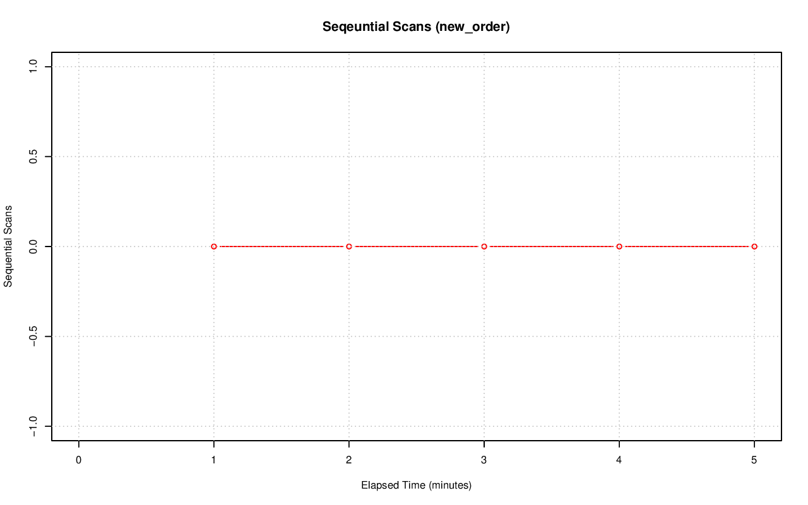
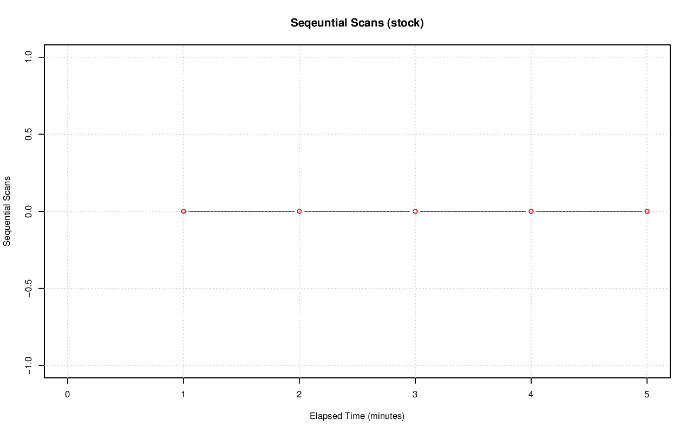
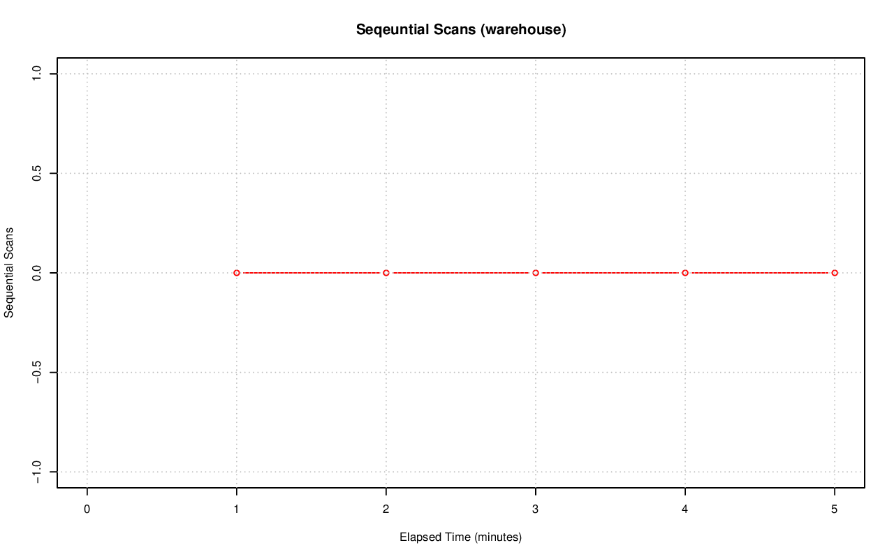

================================================================================
Database Test 2 Table seq_scan Charts
================================================================================

.. image:: ../table-stat-orders-seq_scan.png
   :target: ../table-stat-orders-seq_scan.png
   :width: 100%

