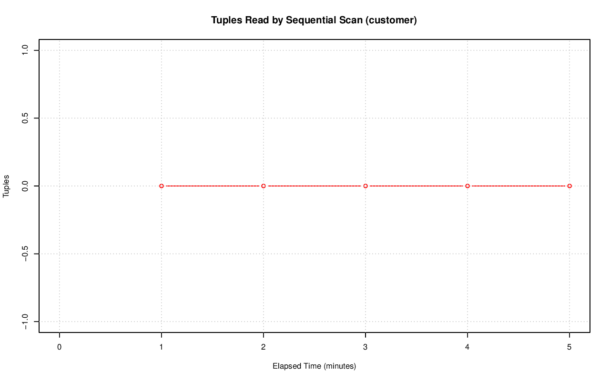
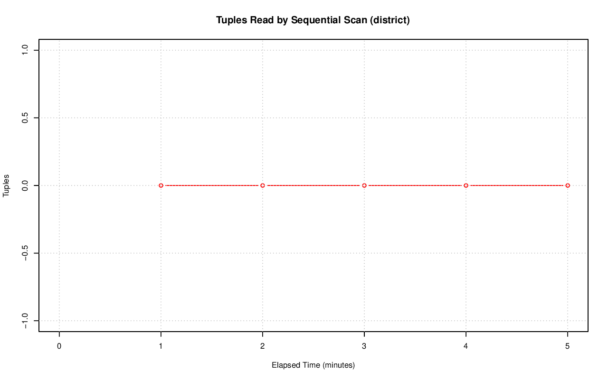
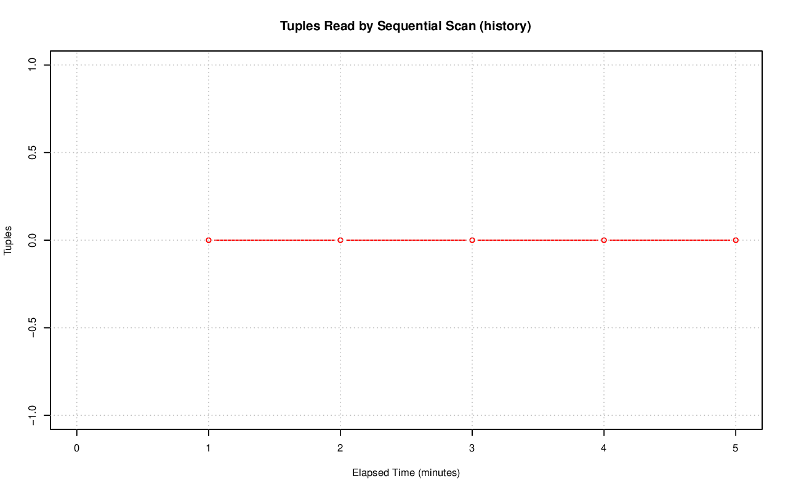
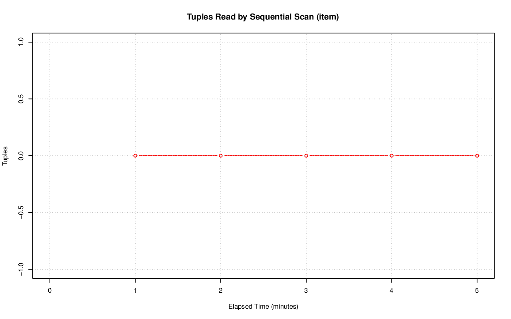
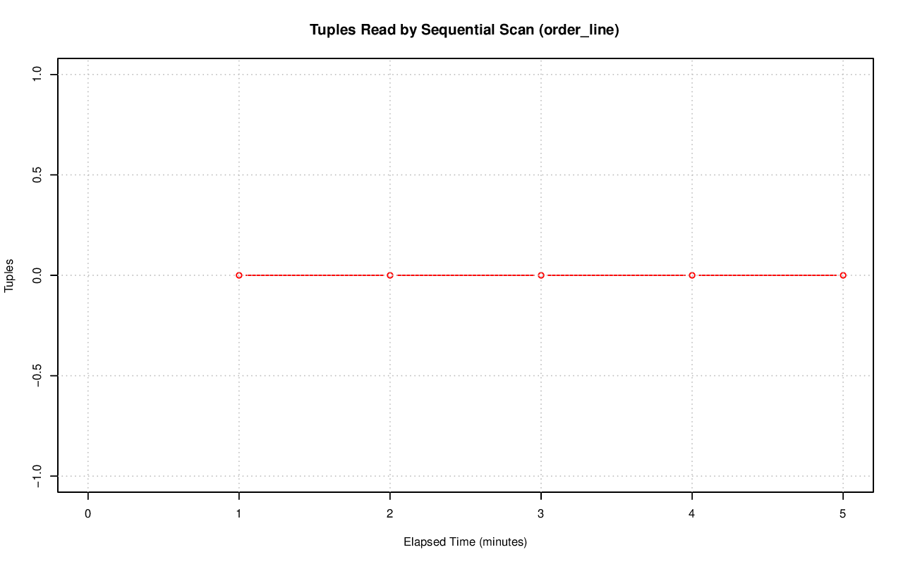
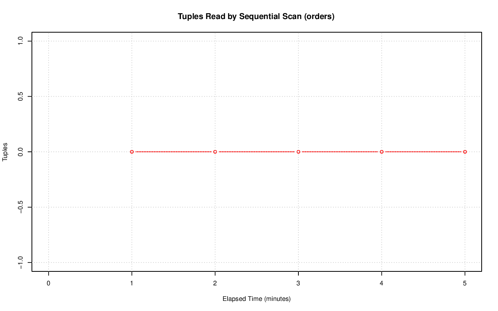
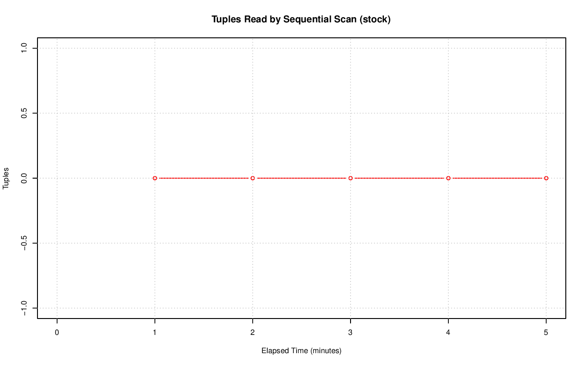

================================================================================
Database Test 2 Table seq_tup_read Charts
================================================================================

.. image:: ../table-stat-new_order-seq_tup_read.png
   :target: ../table-stat-new_order-seq_tup_read.png
   :width: 100%

.. image:: ../table-stat-warehouse-seq_tup_read.png
   :target: ../table-stat-warehouse-seq_tup_read.png
   :width: 100%
