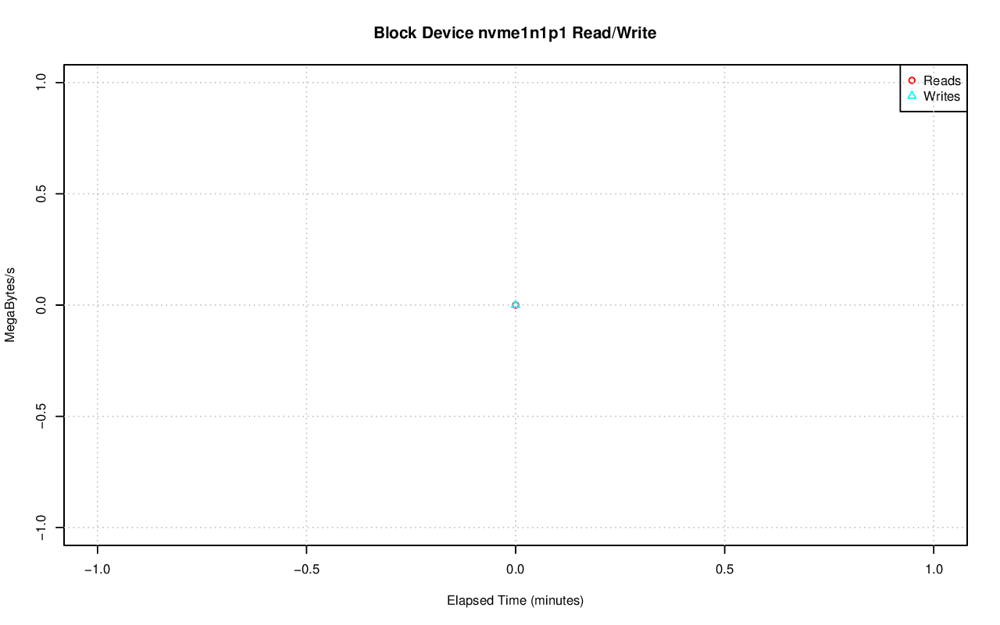
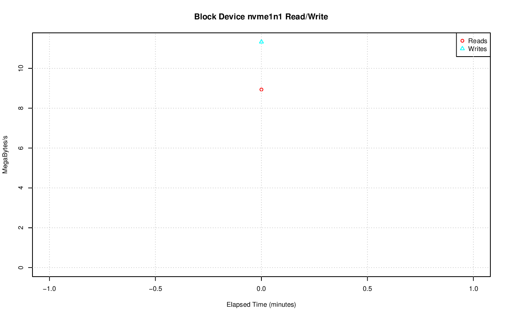
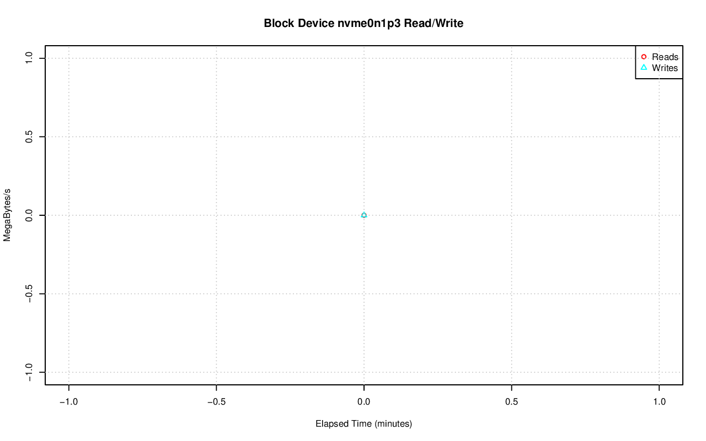
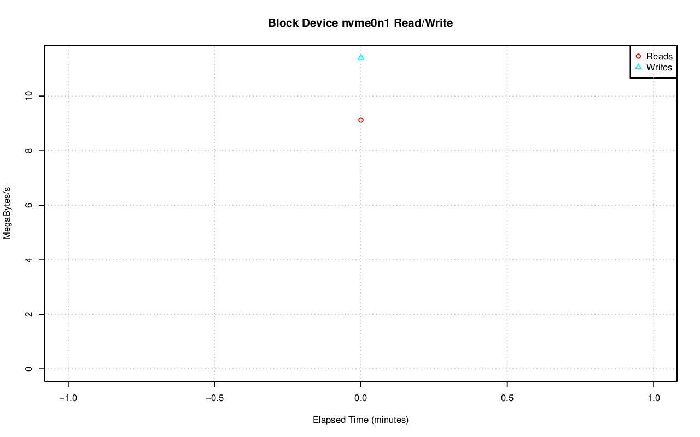
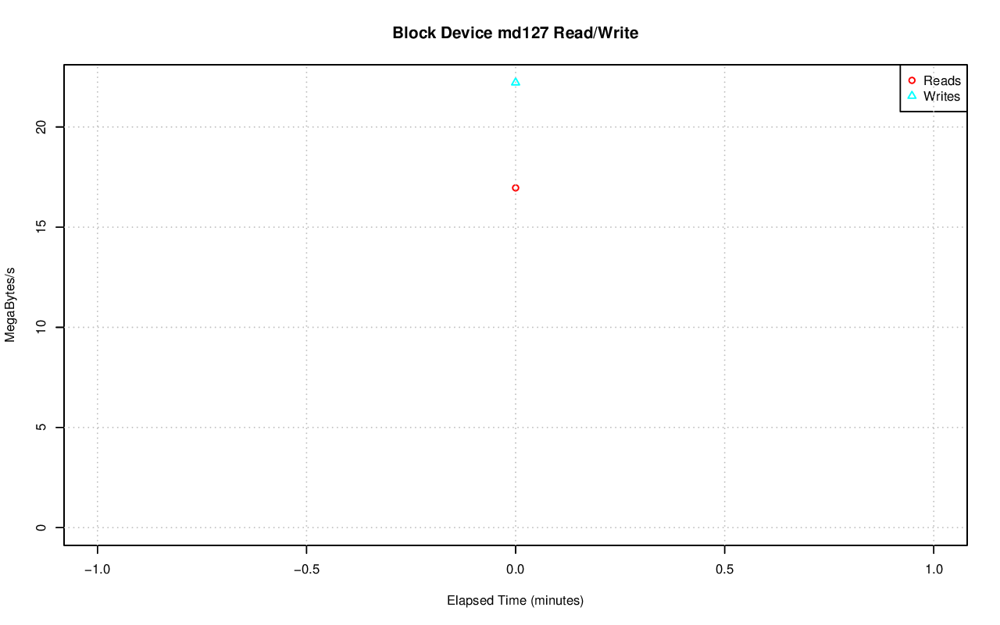
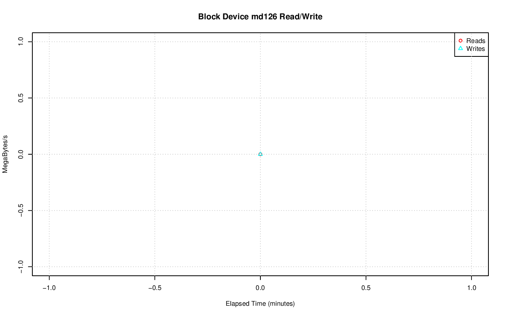
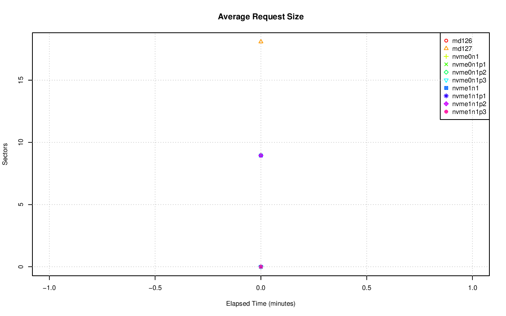
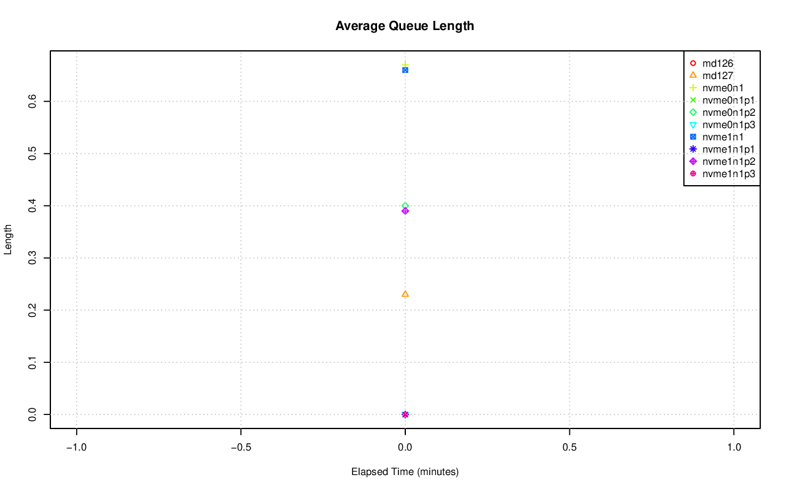
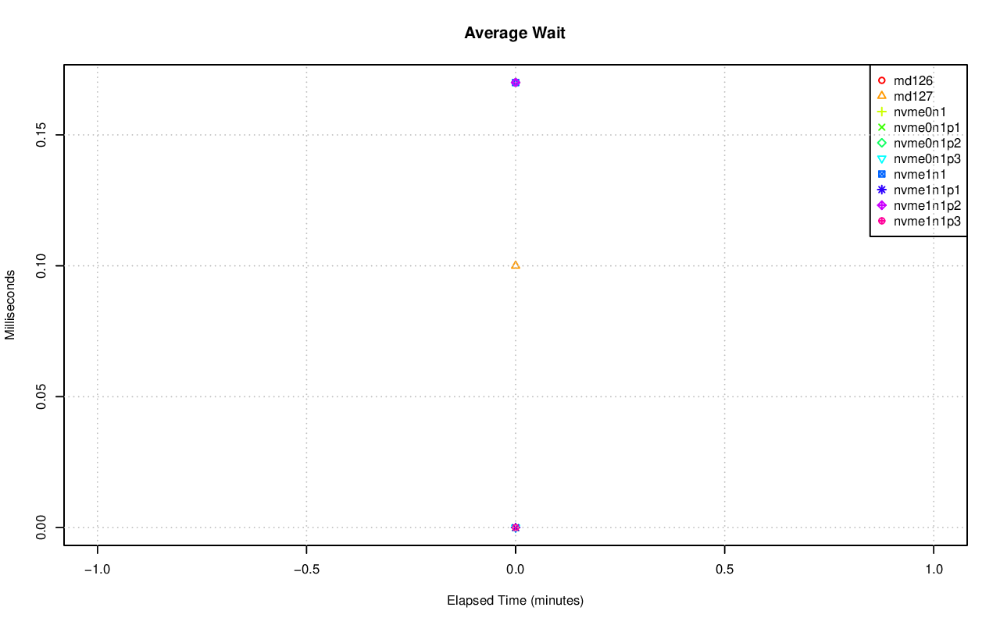
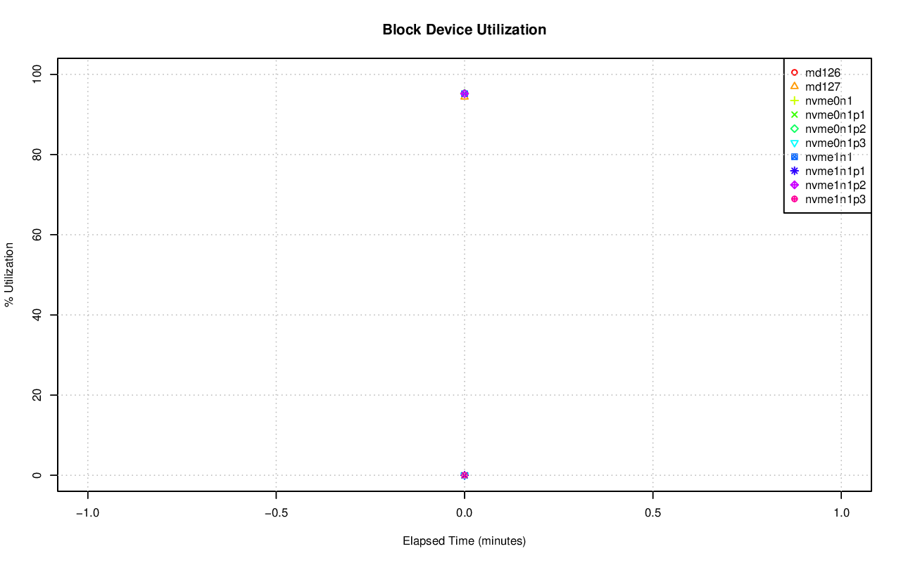

================================================================================
Database Test 2 driver blockdev Charts
================================================================================

.. image:: ../sar/sar-blockdev-tps.png
   :target: ../sar/sar-blockdev-tps.png
   :width: 100%

