================================================================================
Database Test 2 pidstat driver Charts
================================================================================

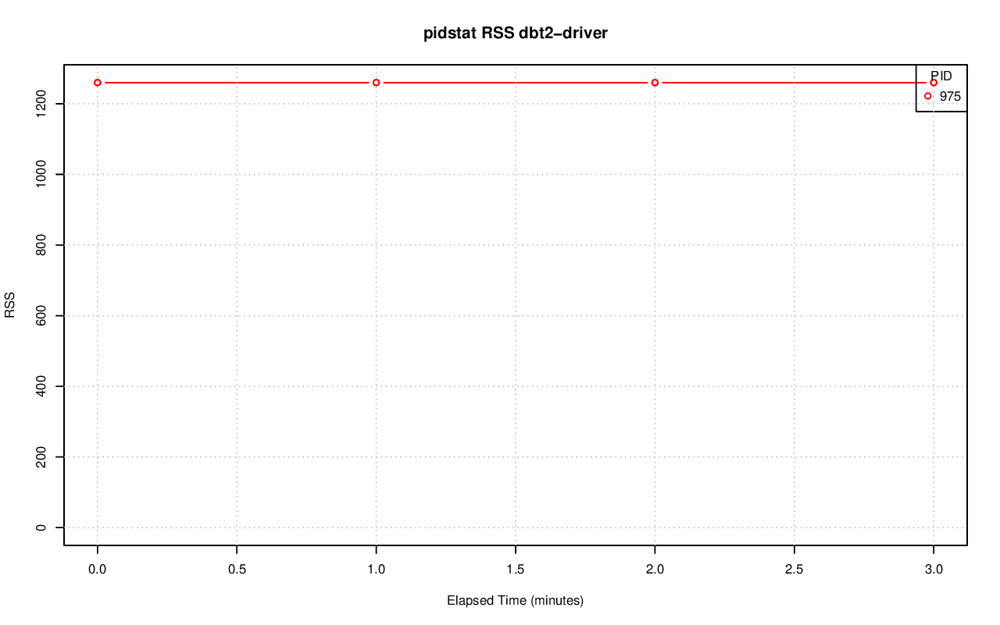

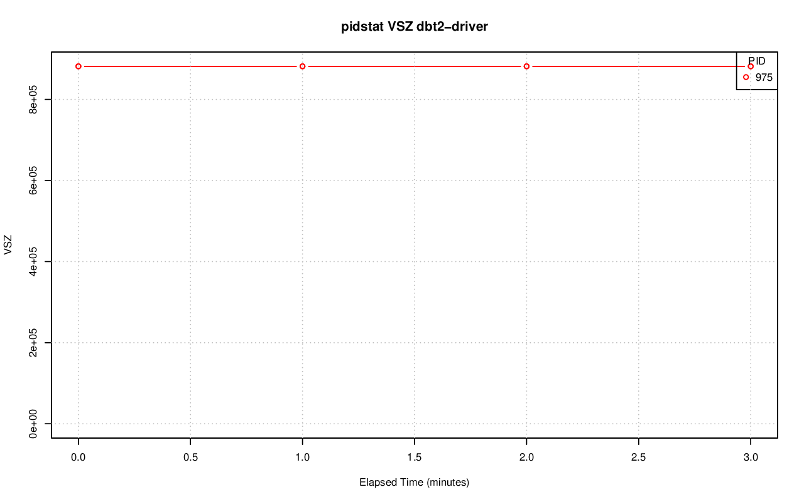

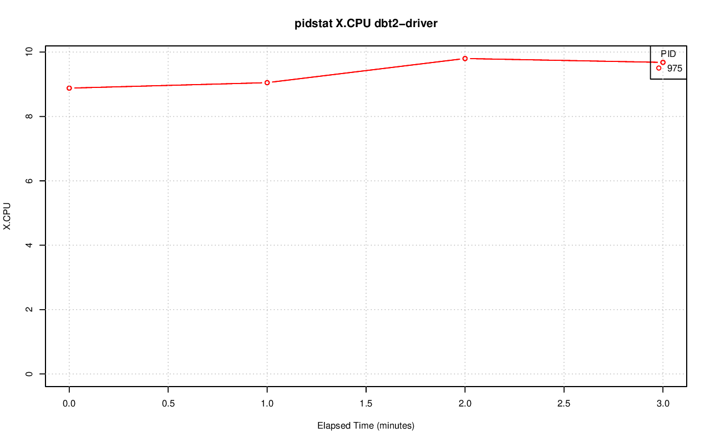

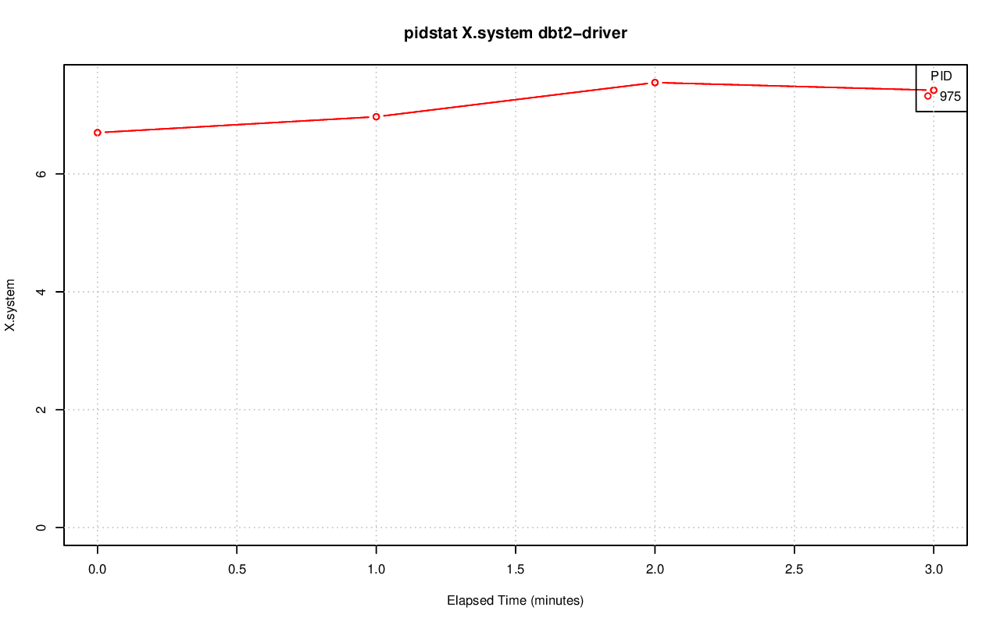

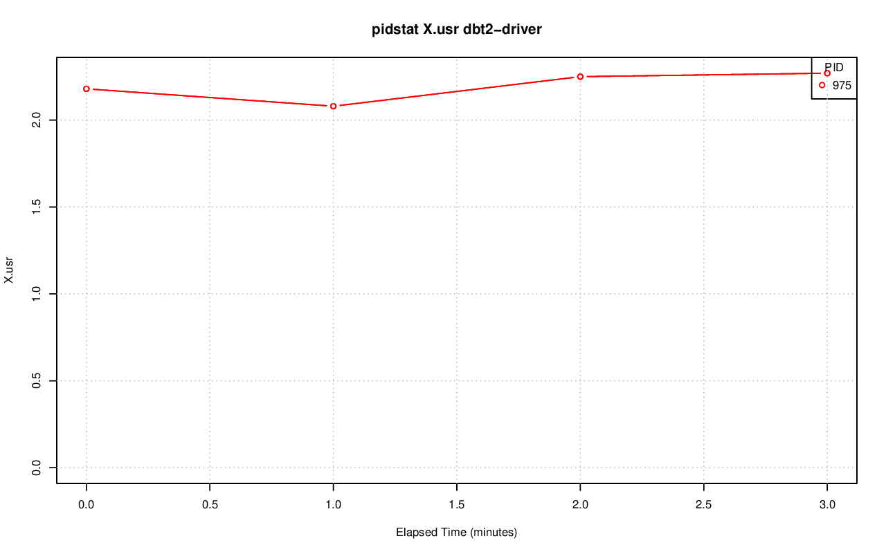

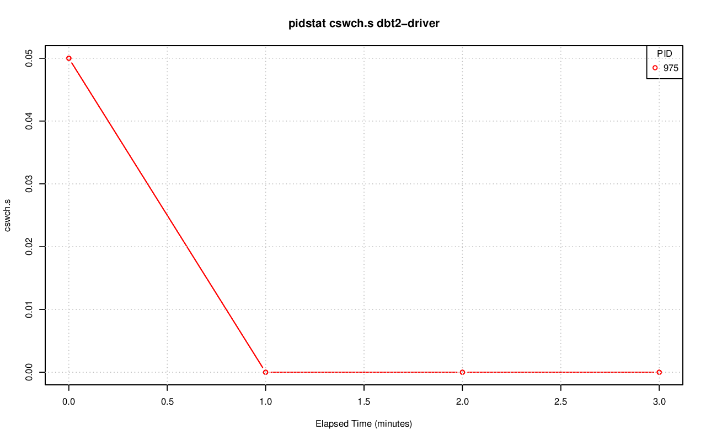

.. image:: pidstat-driver-fd.nr.png
   :target: pidstat-driver-fd.nr.png
   :width: 100%

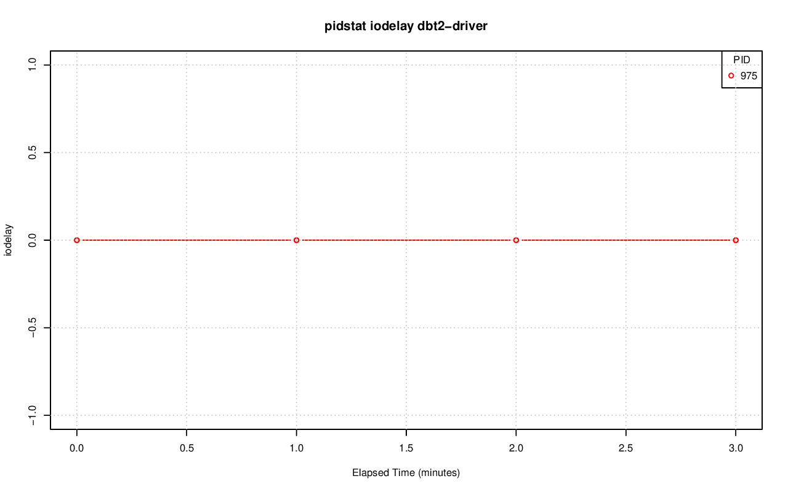

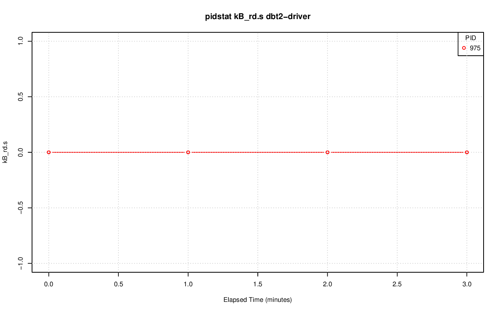

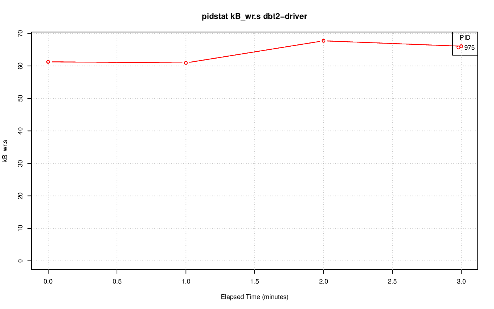

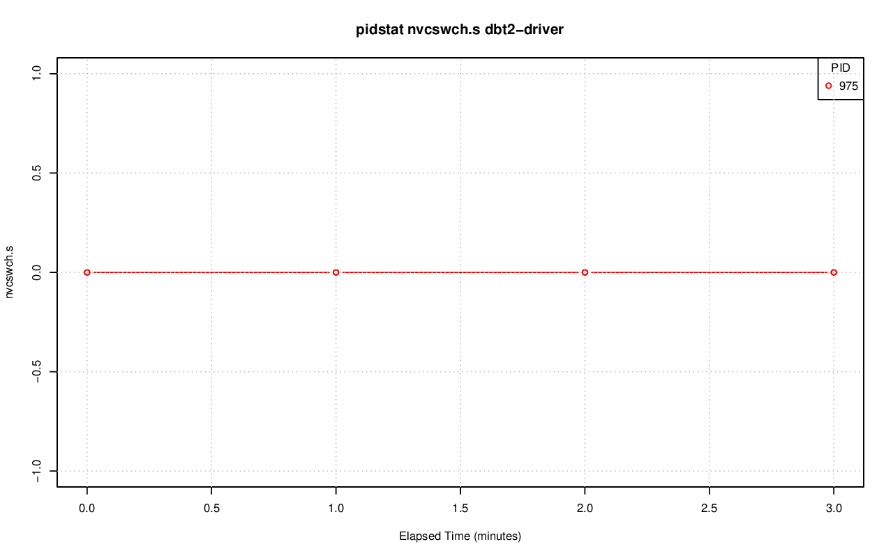

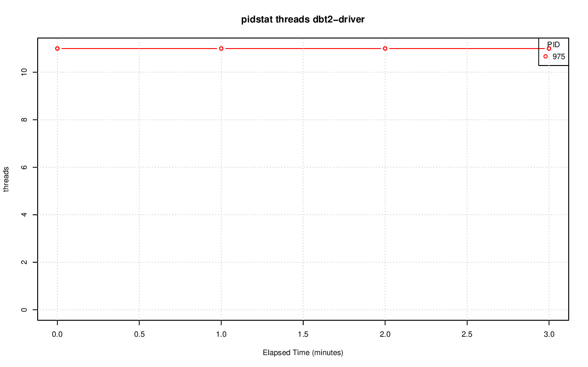
