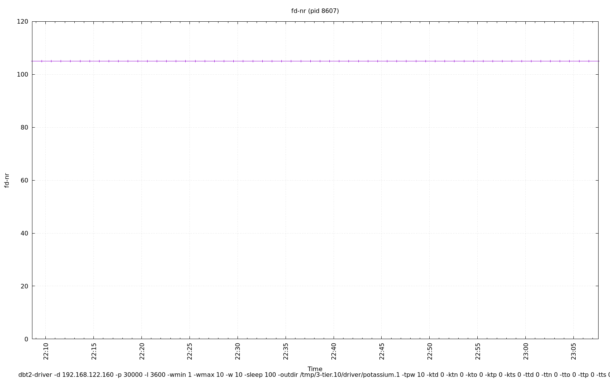

================================================================================
Database Test 2 pidstat driver Charts
================================================================================

.. image:: ../sysstat/pidstat/pidstat-8607-MEM.png
   :target: ../sysstat/pidstat/pidstat-8607-MEM.png
   :width: 100%

.. image:: ../sysstat/pidstat/pidstat-8607-StkRef.png
   :target: ../sysstat/pidstat/pidstat-8607-StkRef.png
   :width: 100%

