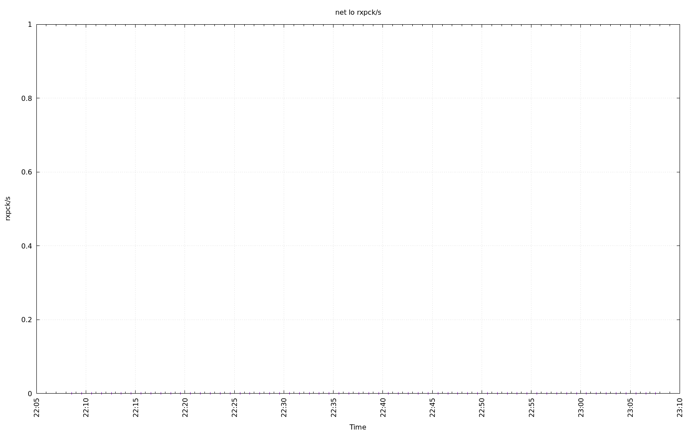
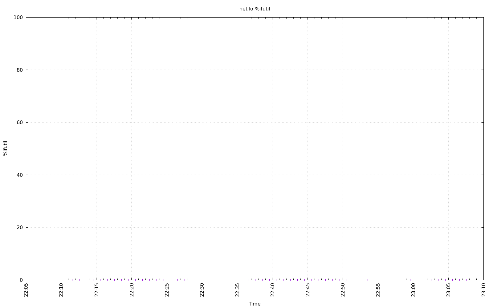
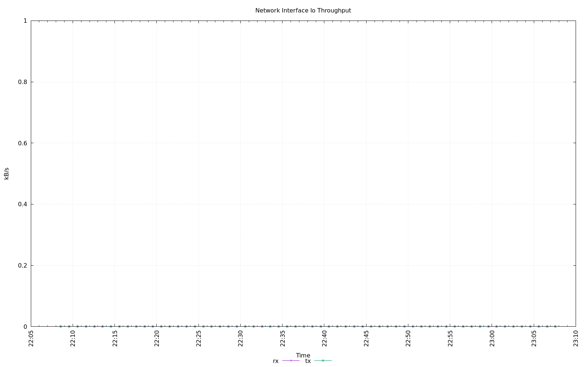
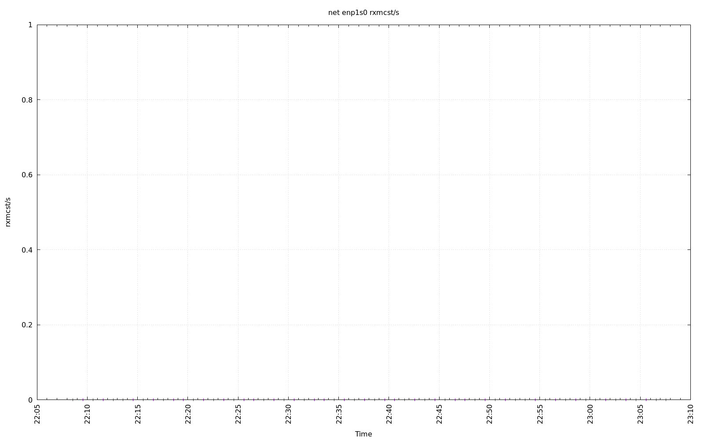
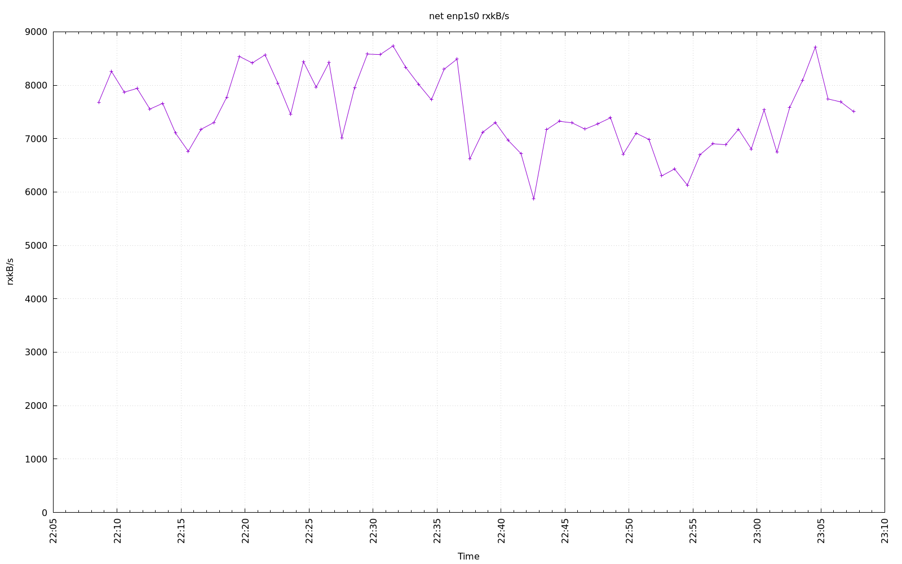
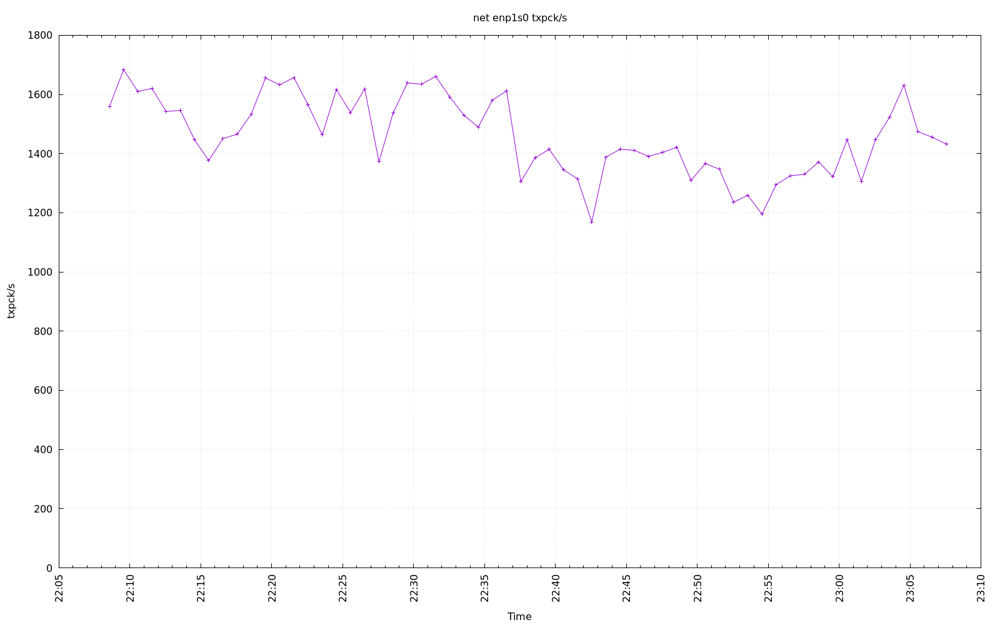
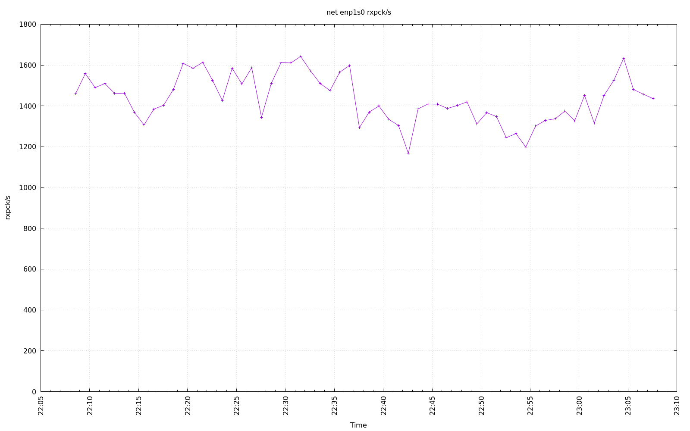
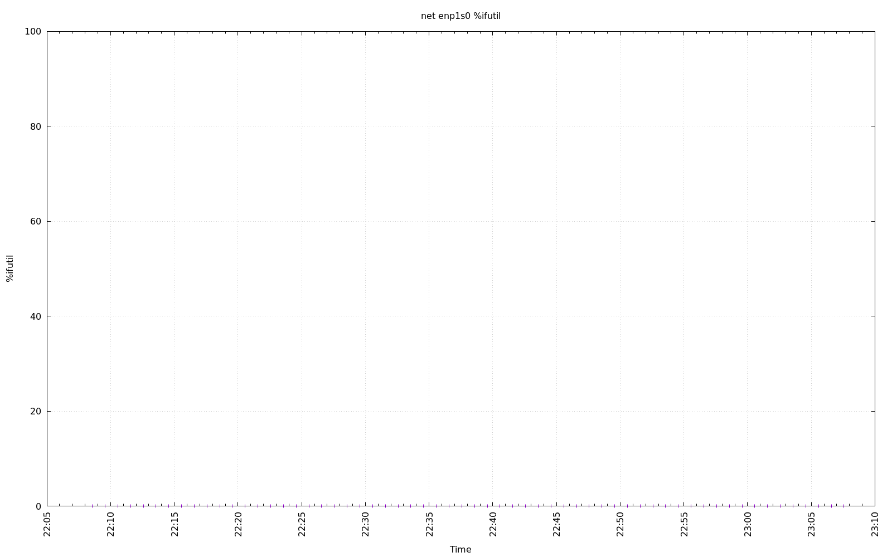
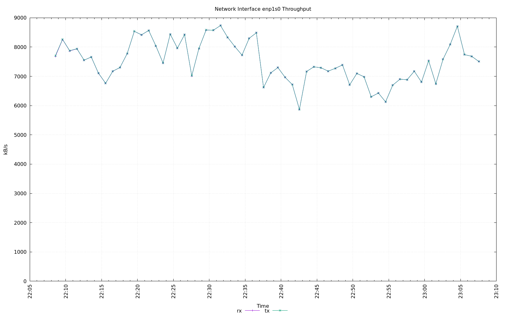

================================================================================
Database Test 2 driver net Charts
================================================================================

