================================================================================
Database Test 3 region Table Charts
================================================================================

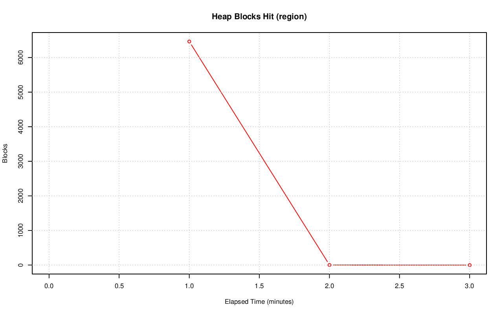

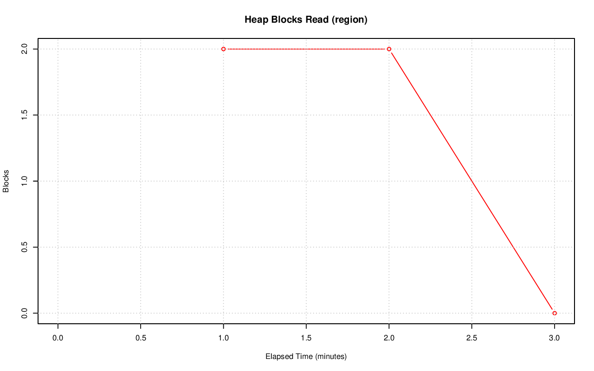

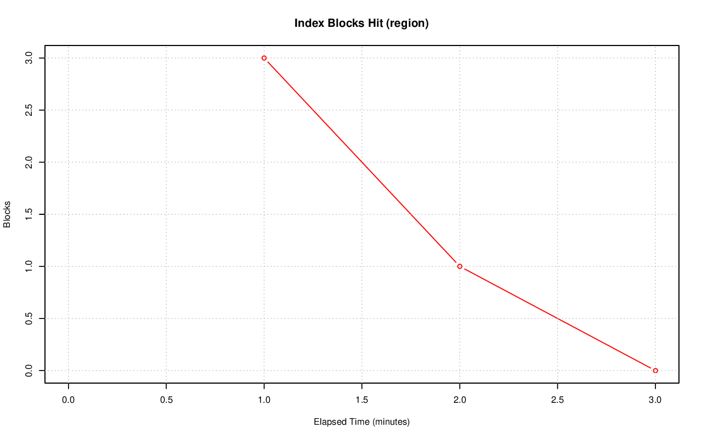

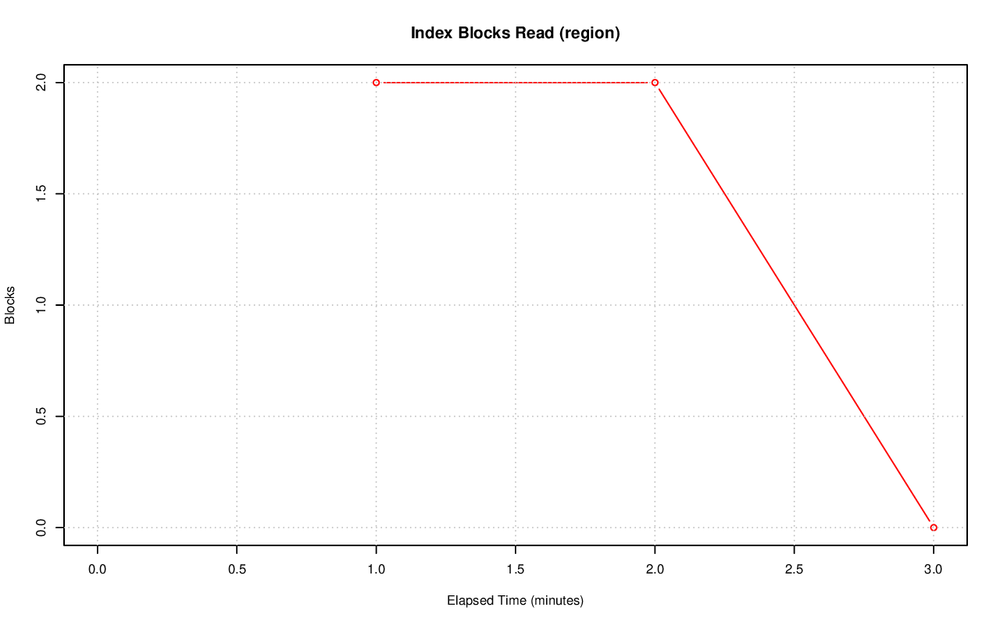

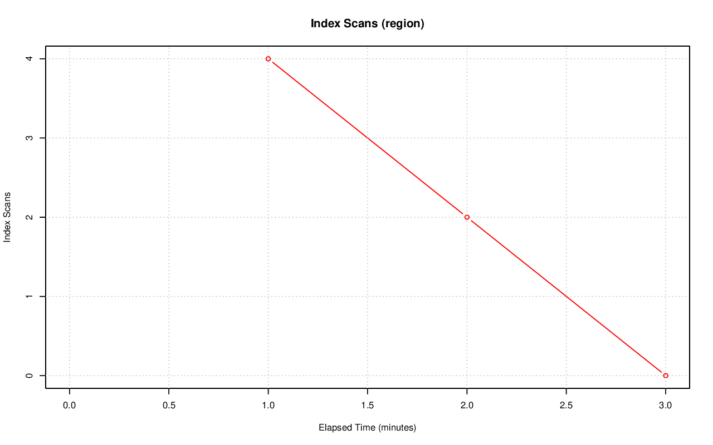

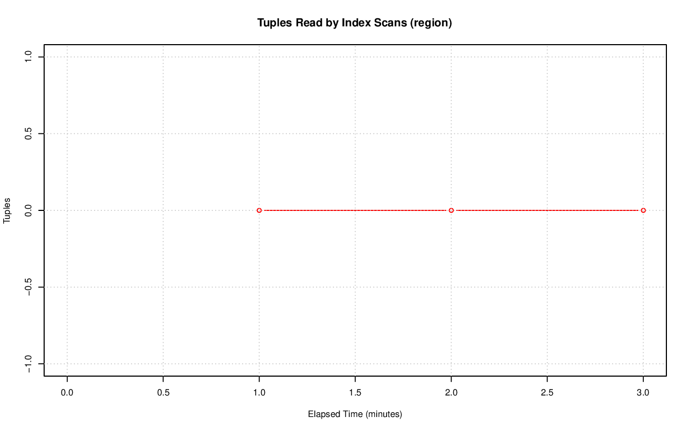

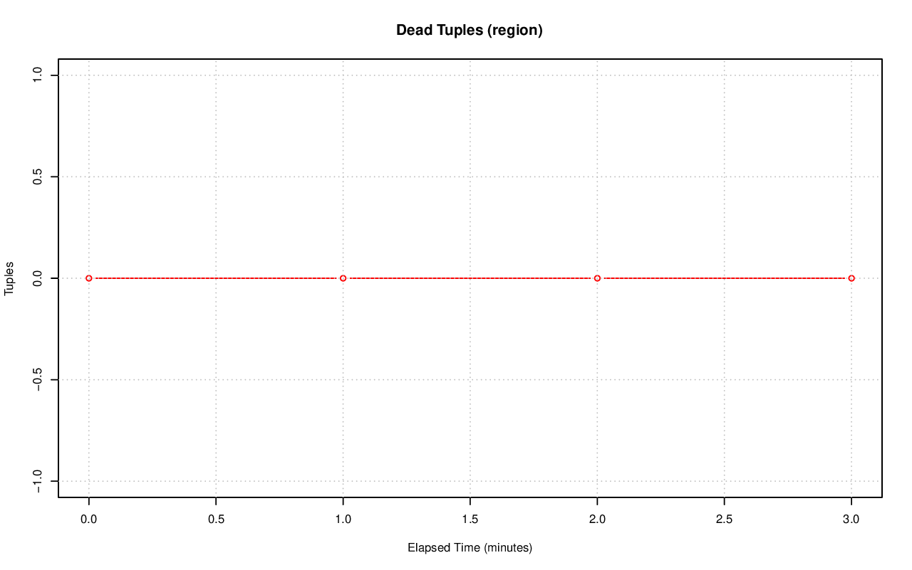

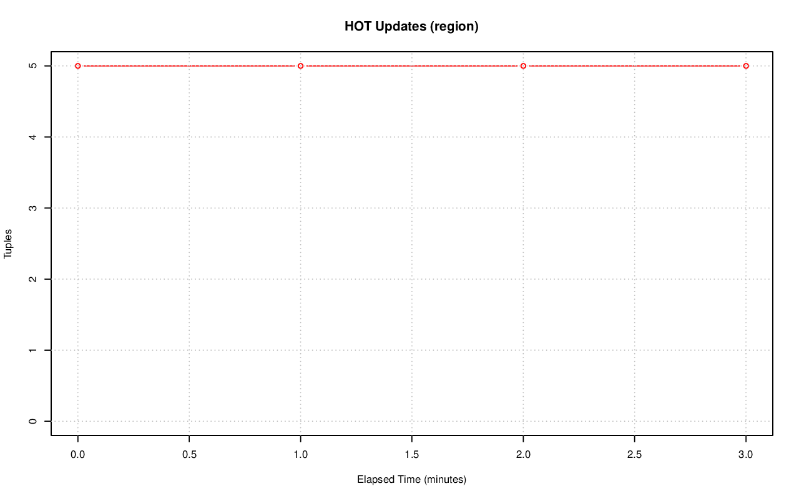

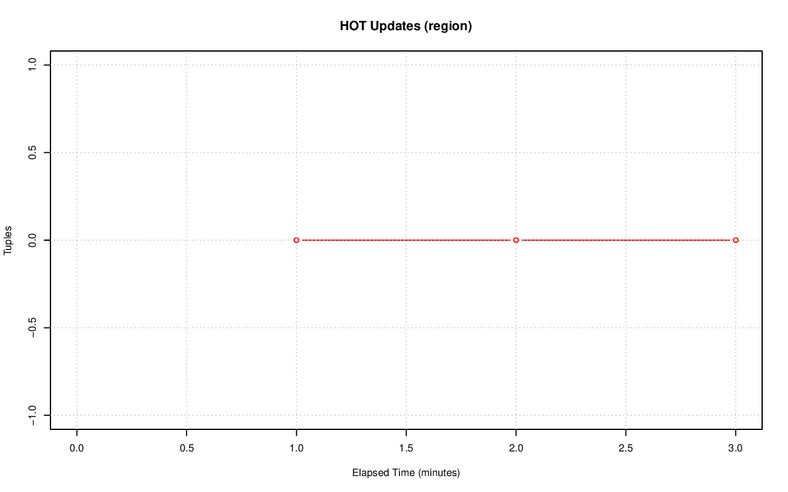

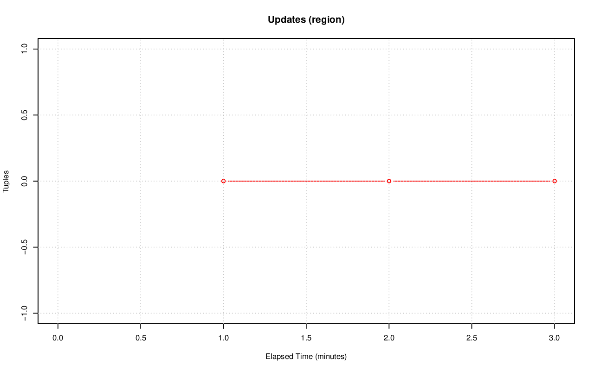

.. image:: ../table-stat-region-seq_scan.png
   :target: ../table-stat-region-seq_scan.png
   :width: 100%

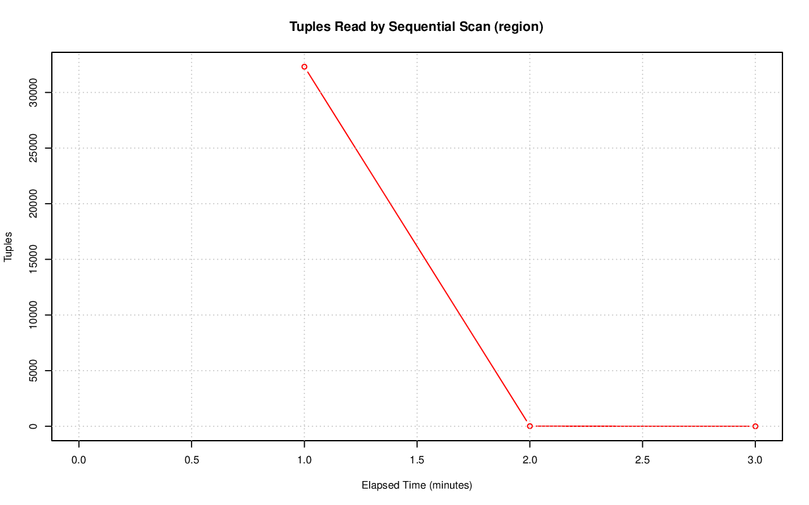

.. image:: ../table-stat-region-toast_blks_read.png
   :target: ../table-stat-region-toast_blks_read.png
   :width: 100%
