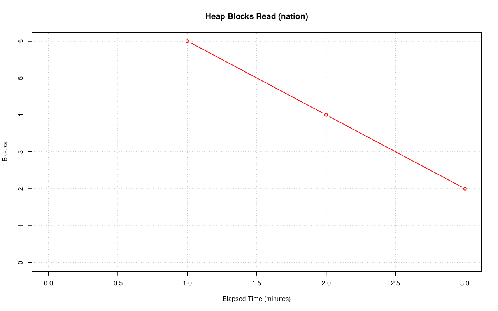
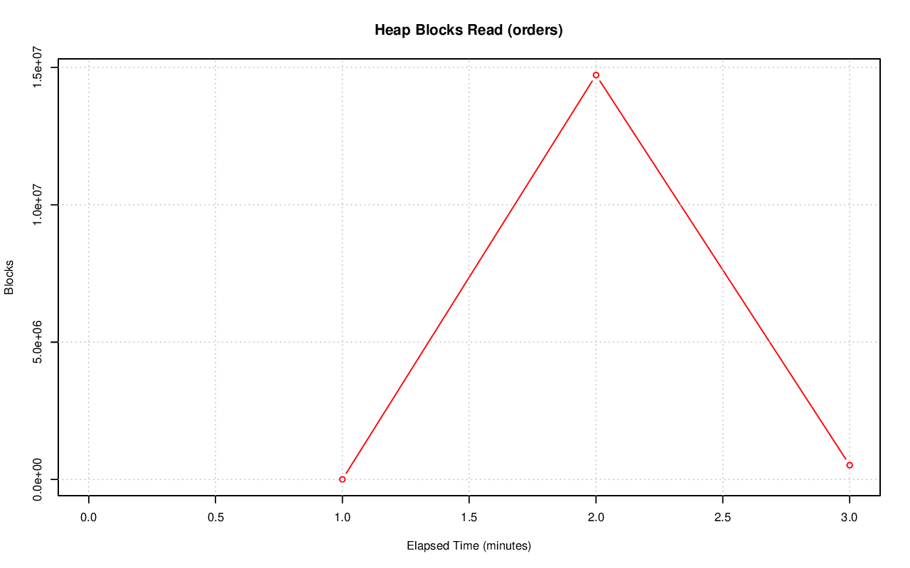
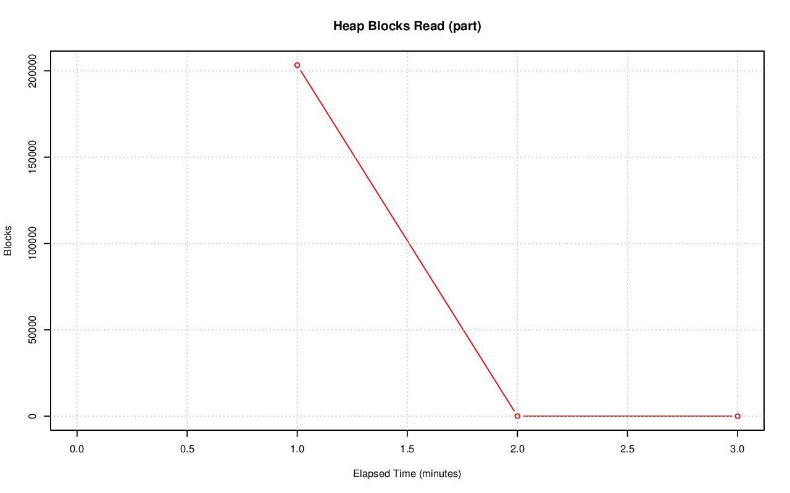
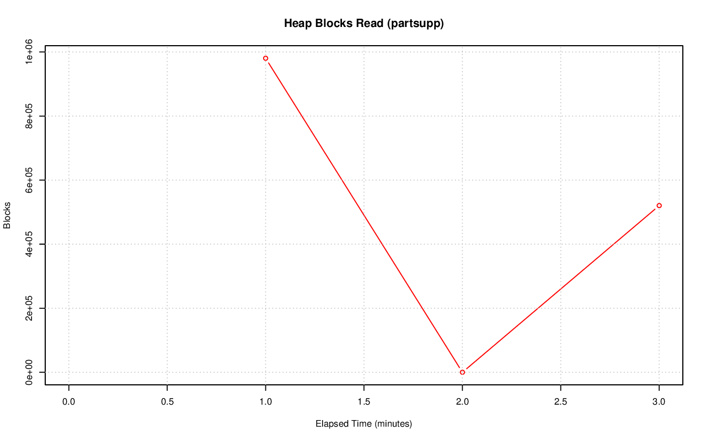
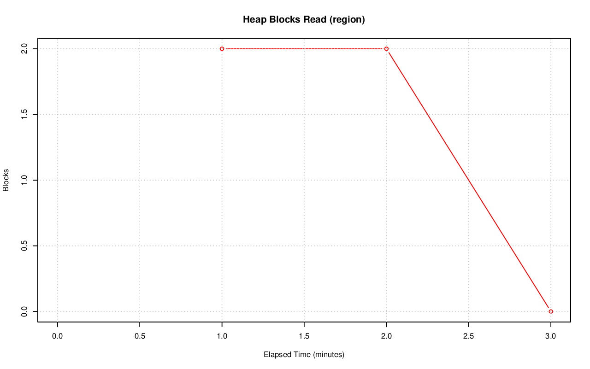
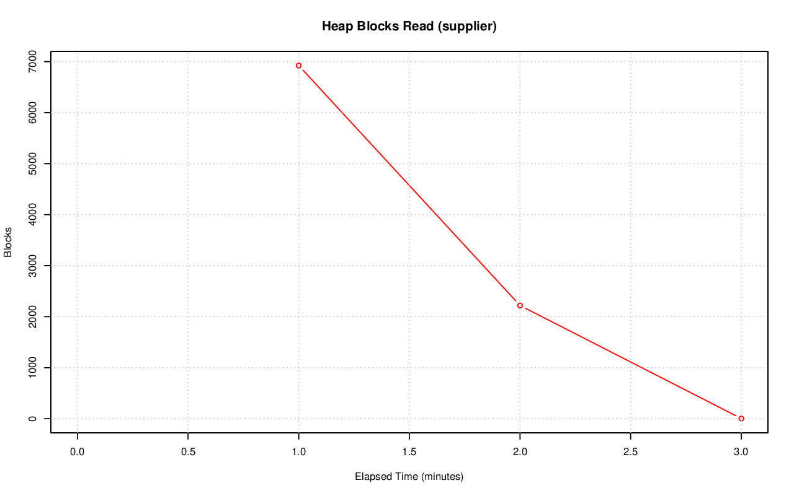

================================================================================
Database Test 3 Table heap_blks_read Charts
================================================================================

.. image:: ../table-stat-customer-heap_blks_read.png
   :target: ../table-stat-customer-heap_blks_read.png
   :width: 100%

.. image:: ../table-stat-lineitem-heap_blks_read.png
   :target: ../table-stat-lineitem-heap_blks_read.png
   :width: 100%

.. image:: ../table-stat-time_statistics-heap_blks_read.png
   :target: ../table-stat-time_statistics-heap_blks_read.png
   :width: 100%
