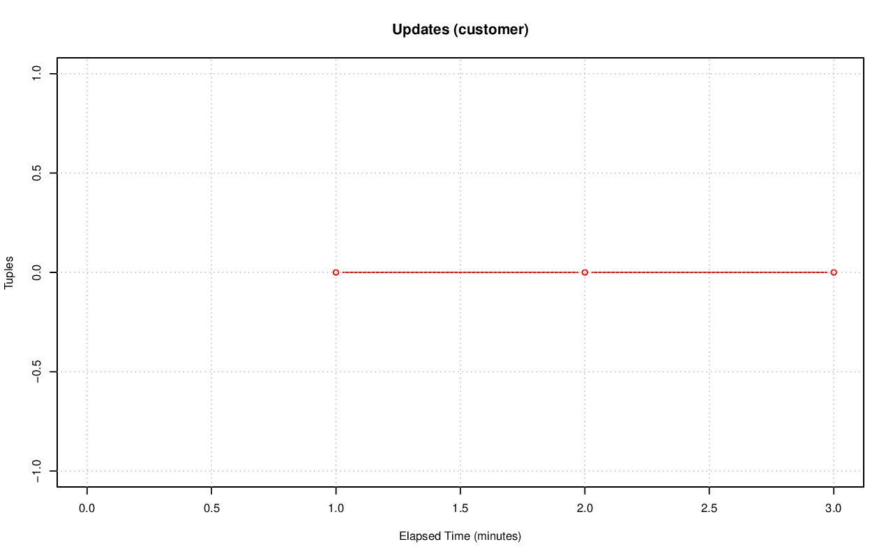
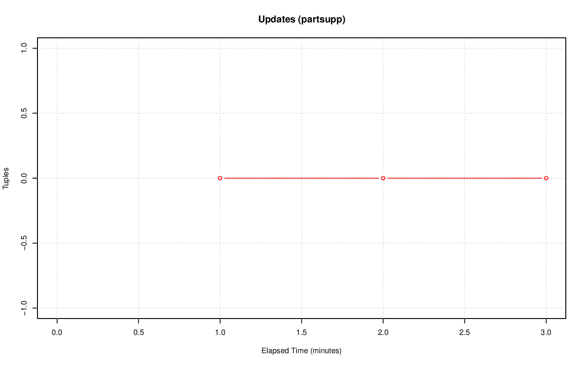

================================================================================
Database Test 3 Table n_tup_upd Charts
================================================================================

.. image:: ../table-stat-part-n_tup_upd.png
   :target: ../table-stat-part-n_tup_upd.png
   :width: 100%

.. image:: ../table-stat-region-n_tup_upd.png
   :target: ../table-stat-region-n_tup_upd.png
   :width: 100%

.. image:: ../table-stat-time_statistics-n_tup_upd.png
   :target: ../table-stat-time_statistics-n_tup_upd.png
   :width: 100%
