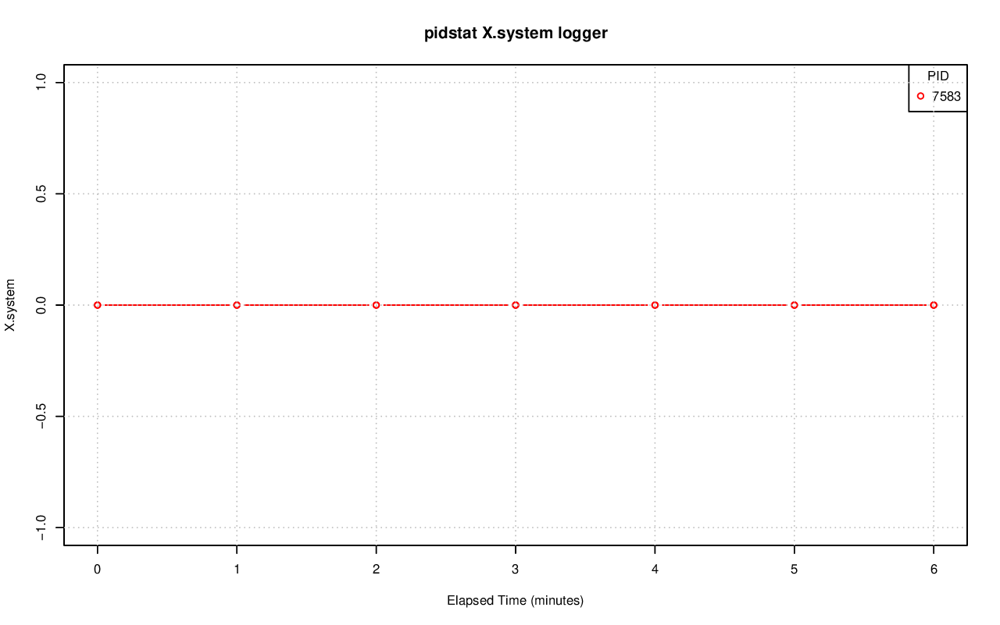
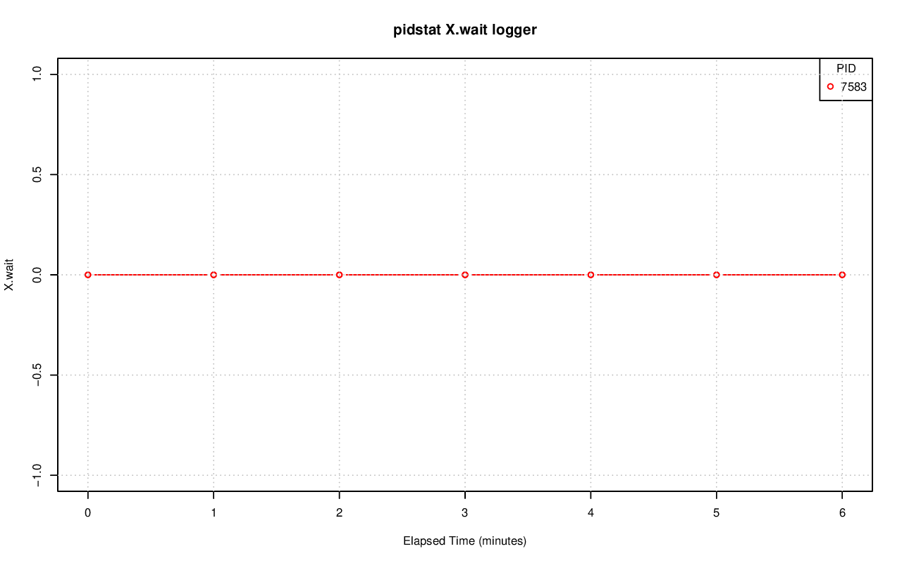
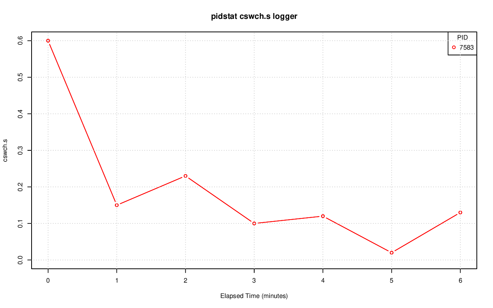

================================================================================
Database Test 3 pidstat logger Charts
================================================================================

.. image:: pidstat-logger-RSS.png
   :target: pidstat-logger-RSS.png
   :width: 100%

.. image:: pidstat-logger-VSZ.png
   :target: pidstat-logger-VSZ.png
   :width: 100%

.. image:: pidstat-logger-X.CPU.png
   :target: pidstat-logger-X.CPU.png
   :width: 100%

.. image:: pidstat-logger-X.MEM.png
   :target: pidstat-logger-X.MEM.png
   :width: 100%

.. image:: pidstat-logger-X.usr.png
   :target: pidstat-logger-X.usr.png
   :width: 100%

.. image:: pidstat-logger-iodelay.png
   :target: pidstat-logger-iodelay.png
   :width: 100%

.. image:: pidstat-logger-kB_rd.s.png
   :target: pidstat-logger-kB_rd.s.png
   :width: 100%

.. image:: pidstat-logger-kB_wr.s.png
   :target: pidstat-logger-kB_wr.s.png
   :width: 100%

.. image:: pidstat-logger-nvcswch.s.png
   :target: pidstat-logger-nvcswch.s.png
   :width: 100%
