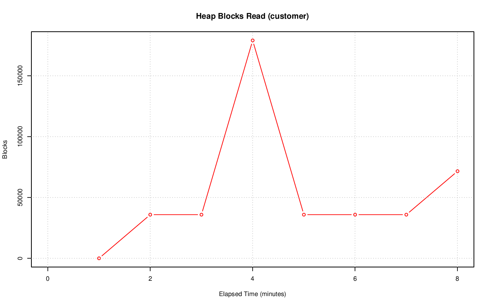
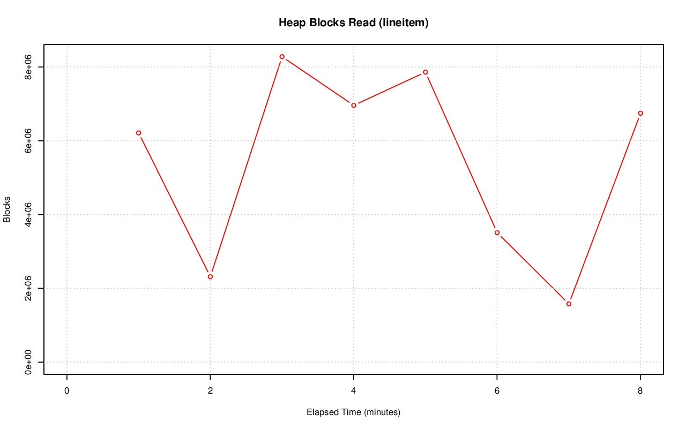
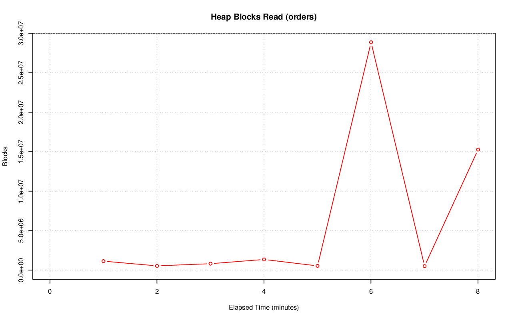

================================================================================
Database Test 3 Table heap_blks_read Charts
================================================================================

.. image:: ../table-stat-nation-heap_blks_read.png
   :target: ../table-stat-nation-heap_blks_read.png
   :width: 100%

.. image:: ../table-stat-part-heap_blks_read.png
   :target: ../table-stat-part-heap_blks_read.png
   :width: 100%

.. image:: ../table-stat-partsupp-heap_blks_read.png
   :target: ../table-stat-partsupp-heap_blks_read.png
   :width: 100%

.. image:: ../table-stat-region-heap_blks_read.png
   :target: ../table-stat-region-heap_blks_read.png
   :width: 100%

.. image:: ../table-stat-supplier-heap_blks_read.png
   :target: ../table-stat-supplier-heap_blks_read.png
   :width: 100%

.. image:: ../table-stat-time_statistics-heap_blks_read.png
   :target: ../table-stat-time_statistics-heap_blks_read.png
   :width: 100%
